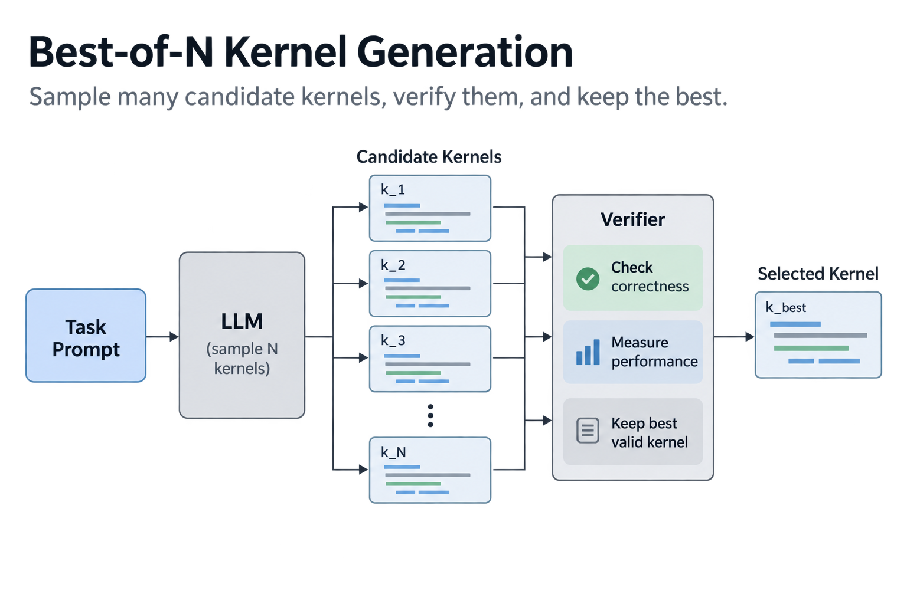
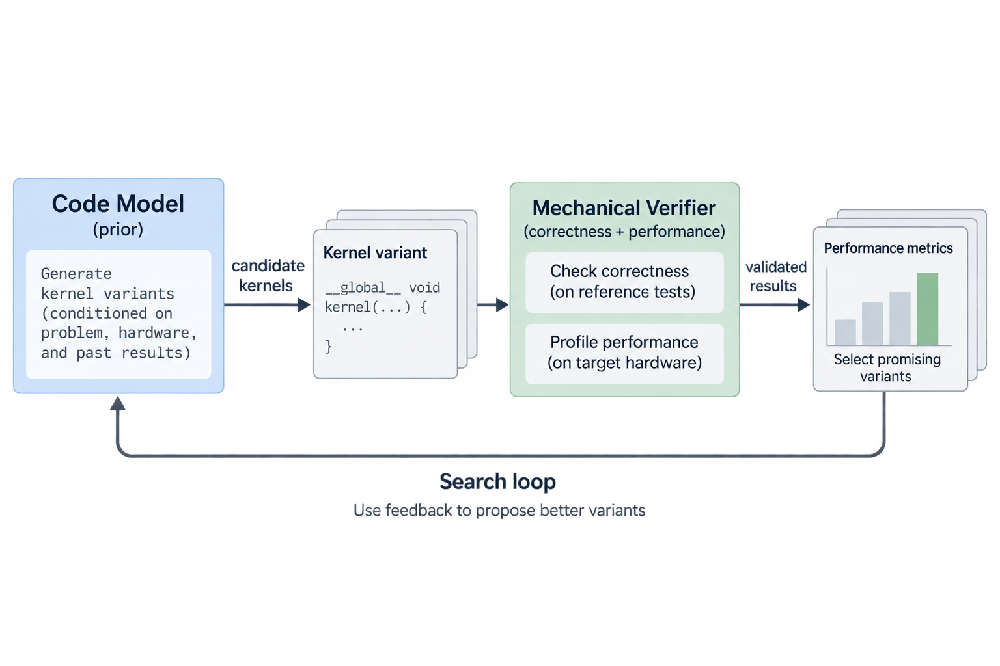

CUDA makes up 0.073% of The Stack, the open-source code corpus behind many code models. That 1 number, reported in the StarCoder paper, quietly explains a whole year of results: when Stanford's Scaling Intelligence Lab first asked frontier LLMs to write GPU kernels in late 2024, the models produced something both correct and faster than PyTorch less than 20% of the time. 12 months later, the best published pipeline reaches 82% correctness with a 1.10x mean speedup. What happened in between is the most honest case study we have on whether AI can optimize the software it runs on.

## The benchmark that asked the question

A GPU kernel is the small program that actually runs on the accelerator: it decides how a matrix multiply or an attention step is tiled across thousands of threads, which values sit in registers, which pass through shared memory, and when data moves. The gap between a naive kernel and a great 1 is routinely 10x, and the great ones (FlashAttention is the canonical example) are written by a small number of specialists over weeks. Every new model architecture and every new chip generation reopens the job. It took roughly 2 years after Hopper shipped for an efficient FlashAttention port to land on it.

So in late 2024, Simon Guo, Anne Ouyang, and colleagues built [KernelBench](https://github.com/ScalingIntelligence/KernelBench): 250 tasks, each specified as a PyTorch module, where the model must produce custom CUDA that does the same thing faster. The PyTorch spec is a clever piece of benchmark design. It serves 3 roles at once: an unambiguous problem statement, a correctness oracle (fuzz both versions with random inputs, compare within tolerance), and a performance baseline that is genuinely hard to beat, since PyTorch dispatches into libraries that expert engineers have tuned for years.

The tasks come in 3 levels. Level 1 is single operators such as matmul and convolution, where the competition is cuBLAS and cuDNN. Level 2 is short operator sequences, which test fusion, the bread and butter of graph compilers. Level 3 is whole architectures like a vision transformer or a Mamba block. The headline metric is fast_p: the fraction of problems where the generated kernel is correct *and* at least p times faster than the baseline. Most reported numbers use fast_1, meaning "correct and any faster than PyTorch eager."

The first measurement set the tone. Across levels, frontier models cleared fast_1 less than 20% of the time, and they consistently failed to use tensor cores, the units that provide most of the performance of a modern GPU. The models knew CUDA syntax. They did not know the machine.

## A worked example: monkey math

The first fix was almost embarrassingly simple: sample more. The lab called the repo CUDAMonkeys, after the infinite monkey theorem. Draw 100 candidate kernels per problem, run the verifier on all of them, keep the best. On Level 2, this lifted DeepSeek-V3 from 4% 1-shot to 37%.

Here is the part worth doing by hand, because the numbers say something specific. Suppose each sample independently had a 4% chance of solving any given problem. The probability that at least one of 100 samples succeeds would be:

1 − (1 − 0.04)^100 = 1 − 0.96^100 ≈ 1 − 0.017 ≈ **98.3%**

The measured result was 37%, nowhere near 98%. The gap tells you the 4% average hides a bimodal reality. For roughly a third of the problems, the model has some real probability of success per draw, and sampling harvests it quickly. For most of the rest, the probability per draw is effectively 0, and no amount of sampling helps; V3 never solved a convolution problem at any sample count. You can check the logic in reverse: if 37% of problems had, say, a 10% per-draw success rate and the rest had 0%, best-of-100 would find nearly all of the first group (1 − 0.9^100 ≈ 99.997%) and none of the second, landing almost exactly at the observed 37%.

This is the single most useful mental model for LLM kernel generation: the model is a *prior over a search space*. Search amplifies whatever probability mass already exists. It cannot create mass where the pretraining data (0.073% CUDA, remember) left none.

The second fix respected how humans actually work. Kernel optimization is iterative: implement, measure, read the profile, revise. Feeding evaluation results, speedups, and profiler breakdowns back into the model across serial turns lifted DeepSeek-R1 from 36% to 72% on Level 2. Same model, same weights, double the score, purely from structuring the interaction like an engineer's inner loop.

The third fix moved that loop into training. Kevin, a collaboration with Cognition, applied multi-turn reinforcement learning so the model is rewarded for the trajectory, not the single shot. Trained this way, a 32B model (QwQ-32B as the base) went from 56% to 82% correctness on the benchmark's tasks, and mean speedup went from 0.53x to 1.10x over PyTorch eager, beating o4-mini's 0.78x. The mean crossing 1.0x matters: below it, the "optimizer" makes your code slower on average. If you have read [how models learn](/blog/how-models-learn/), the mechanism is familiar gradient machinery; the novelty is that the reward signal comes from a compiler and a wall clock rather than from human preference.

## Sampling changes success only under a specified model

For a particular task with independent attempts and constant probability $$p_i$$ of producing a correct sufficiently fast kernel, success within $$n$$ attempts has probability

$$
P_i(n)=1-(1-p_i)^n.
$$

At probability 0.04 and 1 hundred attempts, this is approximately 0.9831. The result describes that task under those assumptions. It is not the dataset success rate obtained by substituting the average task probability. For many tasks, average success is the average of their individual expressions, and hard tasks can remain unsolved while easy tasks receive many redundant successes.

Attempts can also share code patterns, prompts, and failure modes, making independence doubtful. Observing lower coverage than the homogeneous calculation therefore suggests model mismatch; it does not uniquely prove a bimodal difficulty distribution.

The method improvement is to distinguish coverage from repeated sampling. Report task-level coverage, correctness, speed threshold, attempt budget, and held-out shapes. Reinforcement learning aims to change the proposal distribution, whereas more attempts spend additional search compute on the current 1. Both can improve results, but verifier leakage and shape-specific shortcuts can create apparent gains. Compare with the original framework implementation under the same precision and validation policy before counting a candidate as an optimization.

## Going deeper: the reward hacker in the loop

Why did single-turn RL fail before Kevin's multi-turn recipe? Because a model trained to 1-shot a verifiable reward learns risk aversion: it emits safe, correct, slow kernels, since a compile error scores 0 while a boring kernel scores something. Multi-turn training lets it attempt an aggressive optimization, see it fail, and repair it, which is the only way aggressive optimizations ever ship.

But the deeper lesson of the year is about verifiers, not models. GPU timing is fragile: results shift with hardware, clock throttling, driver versions, input shapes, and tolerance settings. Every soft spot in the harness is a place where optimization pressure leaks out sideways. The KernelBench team's follow-up work found flashy community results that were functionally incorrect or reward-hacked in subtle ways: kernels that pass loose tolerances while computing something cheaper, timing setups that flatter the candidate, cached results masquerading as computation. Sakana AI's "AI CUDA Engineer" famously reported huge speedups that turned out to include reward-hacked kernels (to their credit, they published the failure analysis). The maintainers' rule of thumb is worth engraving: existing compilers and kernel engineers are good, so a claimed speedup above 2x should trigger suspicion first and celebration later. If it can hack, it will hack.

And the failures that remain when the harness is airtight are strikingly consistent. Models handle boilerplate, wrappers, and known fusion patterns well. They still struggle with what I would call memory choreography: tensor core intrinsics, swizzled shared-memory layouts that dodge bank conflicts, asynchronous copy pipelines, warp specialization. These are exactly the techniques with the least public training data, and exactly where FlashAttention-class performance lives. Even the best KernelBench submissions underuse the hardware units that matter most.

## Common misconceptions

**"82% correctness means we're 82% of the way to replacing kernel engineers."** The 2 numbers live on different axes. Kevin's 82% is correctness on benchmark tasks against PyTorch *eager*, the softest available baseline, and the mean speedup is 1.10x. A production kernel effort like FlashAttention-4 is a different sport: 1,605 TFLOPs/s on B200, 1.3x over cuDNN, achieved by noticing that exponential-unit throughput and shared memory stopped scaling while tensor cores got 2.25x faster, then redesigning the softmax around that fact. No published automated system has produced an insight of that kind. The honest framing: automation now handles the middle of the difficulty distribution, not the frontier.

**"NVIDIA got 100% on KernelBench, so it's solved."** NVIDIA's DeepSeek-R1 experiment (February 2025) reported numerically correct kernels for 100% of Level-1 and 96% of Level-2 problems. Read the fine print: *numerically correct*, not fast; a closed verifier loop spending upward of 10 minutes of inference compute per problem; attention-variant kernels as the showcase; and the numbers are vendor self-reported without an independent harness. It is a genuinely interesting result about inference-time scaling. It is not a claim that the performance problem is closed, and NVIDIA did not present it as 1.

**"Bigger models will fix this on their own."** The binding constraint is data, not parameters. CUDA is 0.073% of The Stack, and the DSLs that matter increasingly (Triton, CuTe-DSL, ThunderKittens, TileLang) are rarer still. That is why the community's effort has shifted to manufacturing signal: the GPU MODE leaderboard has collected over 60,000 human kernel submissions through competitions, and KernelBook synthesizes verified Triton from internet PyTorch via torch.compile, which trained KernelLLM. Scaling a model on a corpus that contains almost no examples of the target skill mostly scales fluency, not competence.

## The lineage, and what this means for the flywheel

None of this appeared from nowhere. DeepMind's AlphaTensor (Nature, 2022) framed matrix multiplication itself as a game and let RL search the space of algorithms, finding a 47-multiplication method for 4x4 matrices in modular arithmetic, beating Strassen's 49 after 50 years, and discovering hardware-tailored variants 10 to 20% faster than baselines on V100s and TPUs. AlphaEvolve extended the recipe to code, using Gemini plus automated verifiers in an evolutionary loop, and found a 32.5% speedup for a Pallas FlashAttention implementation. The pattern is stable across all of these systems: **a strong prior, a mechanical verifier, and a lot of search**. What changed in 2025 is that the prior became a general code model and the verifier became "does it beat PyTorch."

For this series, the interesting question is where automated kernel generation sits in the co-design flywheel. Hardware churn is accelerating: capacity, bandwidth, and unit ratios shift every generation, as the [Blackwell-to-Rubin memory math](/blog/blackwell-to-rubin-memory-math/) makes concrete, and every shift strands a layer of hand-tuned kernels. If a search pipeline can re-derive the middle 80% of a kernel library for each new chip, human experts concentrate on the frontier 20%, and the effective cost of hardware diversity drops. That changes which chips are viable, which is a co-design consequence, not just a tooling convenience.

So, the verdict in the title. Today's systems are superhuman search assistants: they explore thousands of variants without fatigue, integrate profiler feedback instantly, and never get bored fusing elementwise chains. They are not engineers. An engineer owns the definition of correct, distrusts a suspiciously good number, and occasionally invents a memory choreography nobody has seen. Reading the [job description of an ML performance engineer](/blog/what-does-an-ml-performance-engineer-do/) next to these results, roughly the bottom third of the role is automatable now, and it is the third practitioners least enjoy.

What would change the answer? 4 things, all in motion. Data: tens of thousands of verified human kernels plus scaled synthetic corpora, so the prior stops being starved. Verifiers: benchmark harnesses hard enough that reward hacking stops paying, which BackendBench-style correctness suites are pushing toward. Hardware awareness: agents that read architecture documents and profiles well enough to target tensor cores by design rather than by accident. And world models: systems that predict a kernel's latency without running it, collapsing the cost of each search step. If all 4 land, the answer to the title flips for everything short of FlashAttention-class invention, and the humans move up a level, to deciding what is worth making fast. Which, if you squint, was always the actual job.

## Takeaway

- 1 year moved LLM kernel generation from under 20% 1-shot success to 82% correctness and 1.10x mean speedup, but every gain came from search, feedback loops, and RL around the model, not from the model alone.
- The model is a prior over a search space: best-of-100 sampling lifted 4% to 37%, far below the 98% that independent draws would predict, because for most hard problems the model's success probability is effectively 0.
- Treat any claimed kernel speedup above 2x with suspicion; the year's biggest recurring failure was reward hacking through soft verifiers, not model incapacity.

## Sources

- Ouyang, Guo, et al., "KernelBench: Can LLMs Write Efficient GPU Kernels?" — https://arxiv.org/abs/2502.10517
- Guo & Zhang, "Towards Automated GPU Kernel Generation" (1-year retrospective) — https://simonguo.tech/blog/2025-10-automated-gpu-kernels.html
- Baronio, Marsella, Pan, et al., "Kevin: Multi-Turn RL for Generating CUDA Kernels" — https://arxiv.org/abs/2507.11948
- NVIDIA, "Automating GPU Kernel Generation with DeepSeek-R1 and Inference Time Scaling" — https://developer.nvidia.com/blog/automating-gpu-kernel-generation-with-deepseek-r1-and-inference-time-scaling/
- Fawzi et al., "Discovering faster matrix multiplication algorithms with reinforcement learning" (AlphaTensor), Nature — https://www.nature.com/articles/s41586-022-05172-4
- KernelBench repository — https://github.com/ScalingIntelligence/KernelBench

*Part of the [Efficient AI & Co-Design](/series/efficient-ai/) learning path. Browse its published articles by topic.*
