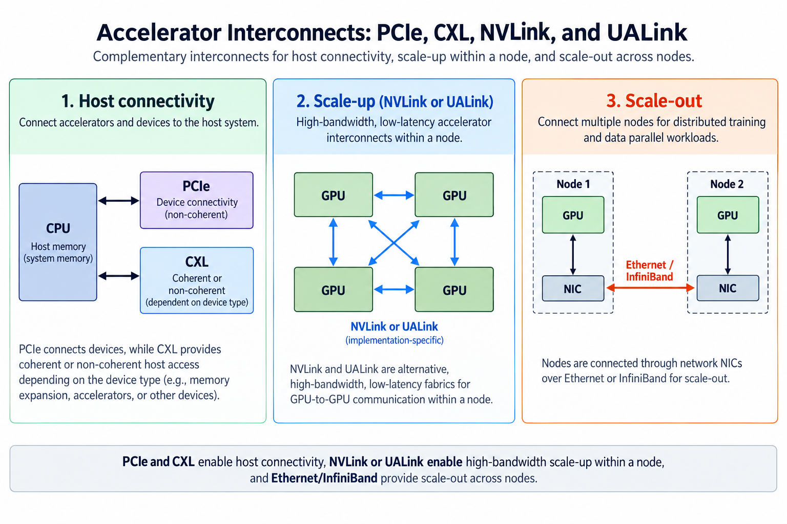
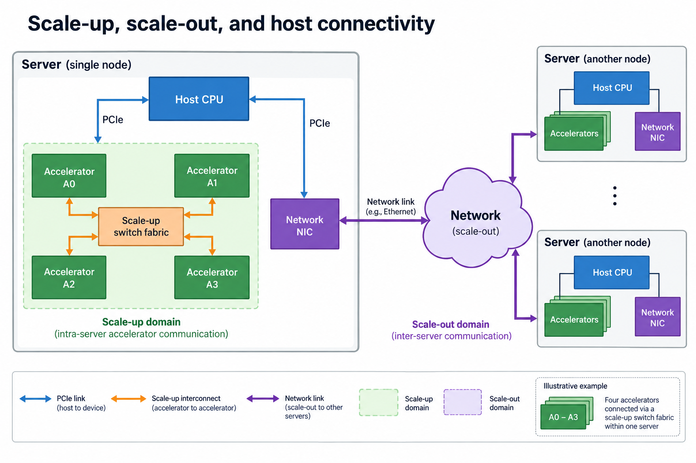
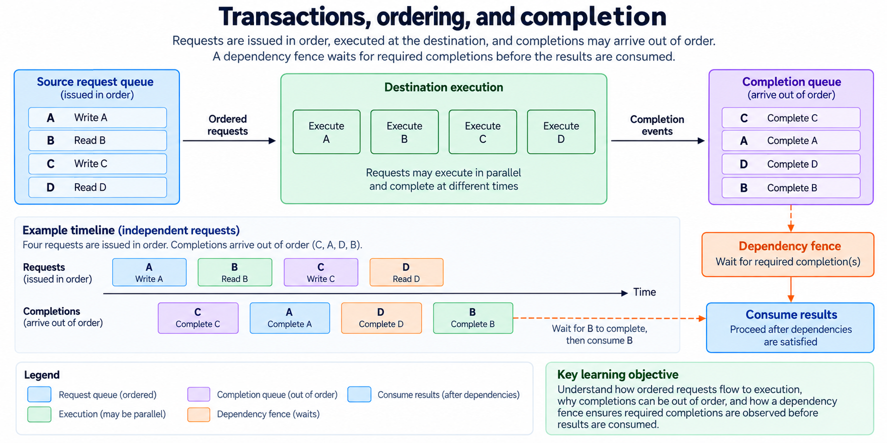
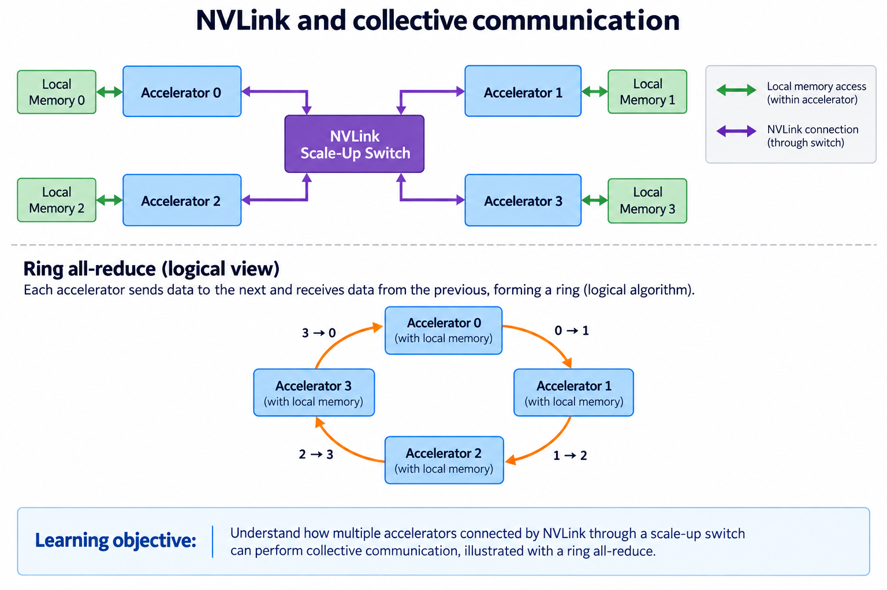
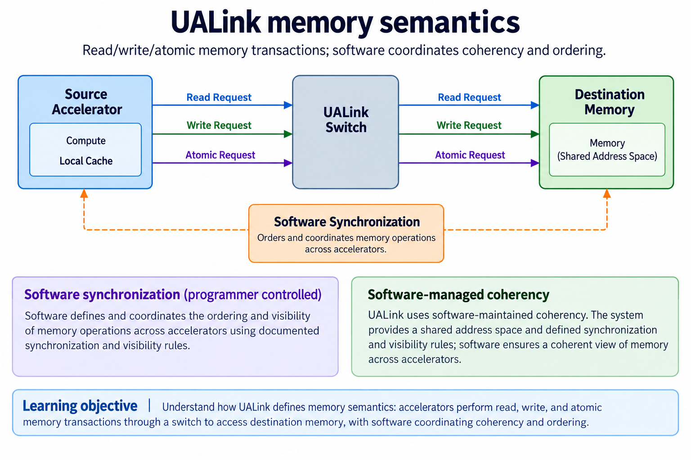
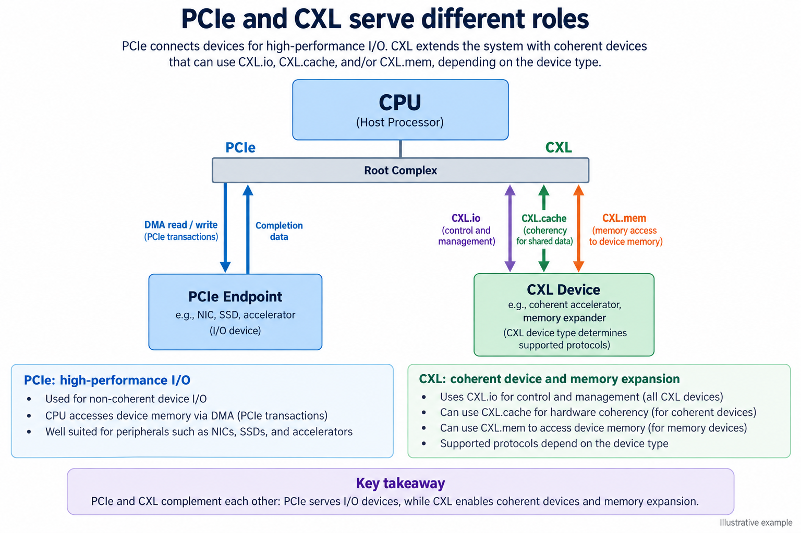
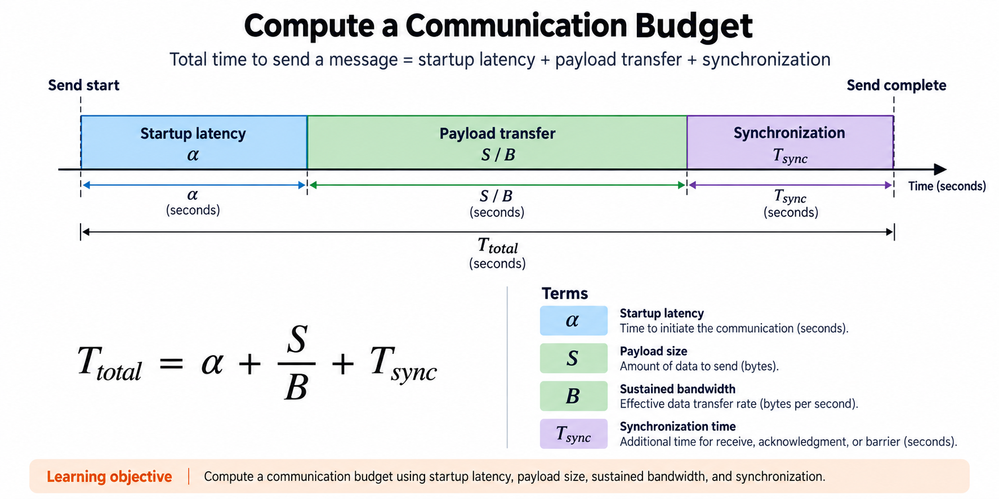

## Overview

An accelerator interconnect carries transactions and data between resources that do not share identical ownership or latency. The overview separates host connectivity, accelerator scale-up and network scale-out. A GPU may use all three during one model execution, but their endpoints, protocols and performance scopes differ.

The question is not which acronym has the largest advertised rate. It is what the operation needs: a DMA transfer, peer-memory transaction, collective reduction, coherent access or remote network message. Once you know the semantics, payload size, startup, topology and synchronization set the communication budget.

This article connects hardware links to [communication cost models](/blog/bandwidth-latency-communication-cost-model/) and uses independently calculated examples. The specification snapshot is checked on 2026-09-13. A published standard gives you a specification, not immediate deployment or identical capabilities in every device implementing an older revision.

## Deep dive

### Scale-up, scale-out, and host connectivity

The domain figure starts with the CPU's connection to an accelerator, then separates peer links within a larger compute system from a NIC's network connection. A host link carries commands and data under its supported transaction model. Scale-up connects a set of accelerators with a low-latency fabric. Scale-out connects systems through a network, often introducing additional protocol, topology and ownership boundaries.

A model can generate traffic in every domain. The host loads initial data, peers exchange partial results, and systems communicate shards or gradients. Counting one rate as if it covered all three gives an invalid budget. A scale-up fabric does not automatically increase host ingestion speed, and adding NICs does not turn remote memory into local HBM.

Suppose a hypothetical server contains 4 accelerators, each with 1 TB/s local memory bandwidth, and a host ingress path sustaining 50 GB/s. The sum of local rates is 4 TB/s, but new host data still crosses the 50-GB/s path. Reuse can reduce how often data crosses that boundary; summing memory rates cannot.

The software-visible topology matters as well. A logical collective can use several physical routes, and a physical switch can support different logical algorithms. Specify the resource group and actual traffic when saying a system “scales.”

### Transactions, ordering, and completion

The transaction figure separates request issue, destination execution and completion. Software cannot safely consume data just because a source placed a request in its local queue. It needs the operation's completion and memory-ordering contract. Reads, writes and atomics have different semantics, and fences or dependencies may be needed between them.

Ordered requests do not always mean ordered completions across all operations and endpoints. A later request may finish earlier if paths or destination work differ. The controller must track outstanding operations rather than assume that the next completion belongs to the oldest request unless the protocol guarantees it.

For a toy dependency, device A writes an operand to device B's memory, then B computes from it. The computation must follow the required write visibility and signaling sequence. A separate notification sent too early can make B read stale or incomplete data. The exact sequence depends on the supported API and memory model, not the illustration's arrows alone.

[UALink's 200G 1.0 overview](https://ualinkconsortium.org/blog/ualink-200g-1-0-specification-overview-802/) explicitly distinguishes ordered source/destination requests from unordered completions and describes software-maintained coherency. That is a specific contract, not a universal property of every link. The same engineering discipline appears in the FPGA command lesson: DONE must represent completed output visibility rather than merely issued stores.

### NVLink and collective communication

The NVLink figure draws 4 representative accelerators and a switch fabric, with a collective as a logical communication pattern. NVLink provides a product-specific peer communication path; software chooses an algorithm according to the operation and topology. A drawing of a ring reduction does not mean the physical hardware must be wired as one ring.

An all-reduce combines contributions and returns the reduced result to participating devices. A simple ring algorithm for $$P$$ participants and a payload of $$S$$ bytes moves approximately $$2(P-1)S/P$$ bytes per participant under its idealized standard accounting. For $$P=4$$ and $$S=16$$ MiB, that is 24 MiB per participant. Protocol overhead, topology, chunking and overlap determine actual timing.

[NVIDIA's Rubin architecture disclosure](https://developer.nvidia.com/blog/inside-nvidia-rubin-gpu-architecture-powering-the-era-of-agentic-ai/) describes NVLink 6 as the scale-up path, separately from NVLink-C2C and PCIe connectivity. Their rates belong to different links and scopes. Do not divide a bidirectional aggregate figure directly into a one-direction payload to claim a collective time.

Measure the collective with the intended participant count and message distribution. Small messages can be startup dominated; large ones can be bandwidth dominated; concurrent compute can contend for resources. A topology-aware result tells you more than treating the fabric's sum of peak links as one global pipe.

### UALink memory semantics

The UALink figure follows accelerator memory requests through a switch to destination memory. Its read, write and atomic transaction semantics differ from simply sending arbitrary Ethernet payloads. Software synchronization and memory ownership are still needed for a correct distributed operator.

The [UALink 200G 1.0 overview](https://ualinkconsortium.org/blog/ualink-200g-1-0-specification-overview-802/) describes software-maintained coherency. Do not relabel that as universal hardware cache coherence. An application must use the specified consistency and completion rules when sharing state.

The current [consortium specification page](https://ualinkconsortium.org/specification/) lists Common 2.0, 200G Data Link/Physical Layers 2.0, 128G Data Link/Physical Layers 1.0 and related chiplet/manageability specifications in addition to 200G 1.0. These are layered and related specifications, not one interchangeable version number. Naming only “UALink 1.0, latest” would omit current disclosures.

A published specification does not mean a particular accelerator, switch or server implements it. A deployment needs a compatible set of endpoints and switches, supported software and a documented topology. Teach the memory-transaction model first, then identify the exact implemented revision and capabilities when evaluating hardware.

### PCIe and CXL serve different roles

The host-link figure separates conventional device I/O from the additional cache/memory semantics CXL can support. PCIe provides discovery/configuration and transaction-based connectivity for devices, including supported DMA paths. CXL adds protocol roles whose availability depends on device type and implementation.

The consortium's [serial-attached memory explanation](https://computeexpresslink.org/blog/the-benefits-of-serial-attached-memory-with-compute-express-link-2349/) distinguishes CXL.io, CXL.cache and CXL.mem. CXL.io provides PCIe-like I/O; CXL.cache supports device access with coherent host-memory interactions; CXL.mem supports host access to device-attached memory under the relevant model. Not every device implements every optional role.

Coherence and locality are different properties. Coherent access can simplify correctness while still having a very different latency from local CPU cache or accelerator SRAM. Memory expansion changes capacity, but an application may lose performance if its hot state moves across a slower link. Pooling also introduces placement and ownership decisions.

The [current CXL specification page](https://computeexpresslink.org/cxl-specification/) presents CXL 4.0. The [PCI-SIG PCIe 6.0 page](https://pcisig.com/pci-express-6.0-specification) describes that generation's technology. Product evaluation still needs the implemented revision, link width, negotiated rate and software support. Do not equate a CPU's CXL memory access with an accelerator's scale-up collective path: their semantics and intended bottlenecks differ.

### Compute a communication budget

The budget figure models one transfer as startup plus serialization. With startup $$\alpha$$ seconds, payload $$S$$ bytes and sustained payload bandwidth $$B$$ bytes/s,

$$
T\approx\alpha+\frac{S}{B}.
$$

Add queueing, protocol processing, topology and required synchronization when they are not included in the measured parameters. This model is useful for comparing regimes, not a guarantee for every transaction.

For an illustrative $$\alpha=5$$ microseconds and $$B=50$$ GB/s, a 4-KiB message takes approximately $$5+0.08192=5.08192$$ microseconds before additional costs. A 16-MiB message takes approximately $$5+335.54432=340.54432$$ microseconds. The first is startup dominated; the second is mostly serialization under these assumptions.

The bandwidth must match the direction and payload convention. A bit-rate specification needs conversion and overhead accounting before becoming a sustained bytes/s parameter. A full-duplex sum does not let one direction use both halves. One flow can also miss out on aggregate link rates because of route choice and contention.

For a model, identify transfers on the critical path and those that can overlap with independent computation. Adding all communication time to all compute time can overestimate latency; assuming perfect overlap can underestimate it. The dependency graph decides which work can proceed concurrently. Count bytes first, then use measurements matching the topology and message sizes.

### Construct a communication experiment

Start with one dependency: a peer transfer followed by a consumer operation, or a collective required before the next matrix tile. Name the data size and synchronization event that makes the result usable. Record the participating devices and physical topology.

Sweep payload sizes instead of timing one message. Repeated small transfers expose startup and queue-management costs, while larger messages expose sustained payload rates. Include warmup, repetitions and concurrent traffic representative of the deployment. Keep raw timestamps and report variation rather than only a best run.

Then compare the isolated operation with the full graph. If communication overlaps with matrix work, keep the actual dependency edges and observed overlap. If one collective gates every layer, its startup may matter even when total bytes are modest. A model that changes its partition can also change both arithmetic and traffic, so keep a numerically equivalent baseline.

Finally record the API and completion semantics used in the test. A timing window ending at request issue measures something different from one ending at remote visibility. The result should support an engineering decision about one execution path, not a universal ranking of interconnect standards.

### A worked engineering decision

Suppose an application needs a collective across accelerators inside 1 server and another exchange between servers. These are different physical domains. A scale-up accelerator fabric may carry memory-oriented transactions or device communication inside the local system, while the scale-out exchange uses the network path available between servers. Naming UALink, NVLink, Ethernet and CXL in 1 list does not make their semantics interchangeable.

Start with a logical dependency graph. Name the operation that produces each buffer, its required visibility event and the consumer that may proceed. Request ordering and completion ordering need separate treatment: independent requests can complete in a different order, but a dependent consumer cannot use unfinished data. Software must follow the concrete protocol and platform's coherency and synchronization rules rather than assuming universal automatic cache coherence.

Next, map the graph onto the topology. A ring collective is an algorithm with directed logical edges; its messages may travel over a switched physical fabric. A switch drawing does not prove the algorithm is a ring, and a ring drawing does not prove dedicated physical neighbor links. Count message sizes, phases and synchronization at the actual implementation boundary.

For a small transfer, fixed startup and synchronization can dominate. For a larger stream, sustained effective bandwidth can matter more. Use a latency expression whose terms all refer to the same interval; if a synchronization tail is included in usable completion, include it explicitly. Measure effective bandwidth with stated message sizes and concurrency rather than replacing it with a raw lane or aggregate link rate.

A current-specification check shows what is published, what is optional and what a specific product implements. CXL capabilities depend on device type and integration. UALink's public overview describes software-maintained coherency. These distinctions turn a protocol comparison into a usable system explanation rather than a promise that any connected accelerator shares memory transparently.

## Conclusion

Interconnects calculate communication through transaction processing, routing and synchronization; their value to AI depends on the model's partition and data movement. Host links, scale-up fabrics, scale-out networks and coherent memory interfaces solve related but different problems.

Choose semantics before comparing rates. Name the implemented revision and performance scope, count payloads and dependencies, then measure the intended topology. That method explains when NVLink, UALink, PCIe or CXL matters without treating the acronyms as interchangeable bandwidth promises.

### Sources

- [UALink specifications](https://ualinkconsortium.org/specification/)
- [UALink 200G 1.0 overview](https://ualinkconsortium.org/blog/ualink-200g-1-0-specification-overview-802/)
- [Rubin architecture and connectivity](https://developer.nvidia.com/blog/inside-nvidia-rubin-gpu-architecture-powering-the-era-of-agentic-ai/)
- [CXL serial-attached memory overview](https://computeexpresslink.org/blog/the-benefits-of-serial-attached-memory-with-compute-express-link-2349/)
- [CXL specification page](https://computeexpresslink.org/cxl-specification/)
- [PCI-SIG PCIe 6.0](https://pcisig.com/pci-express-6.0-specification)
