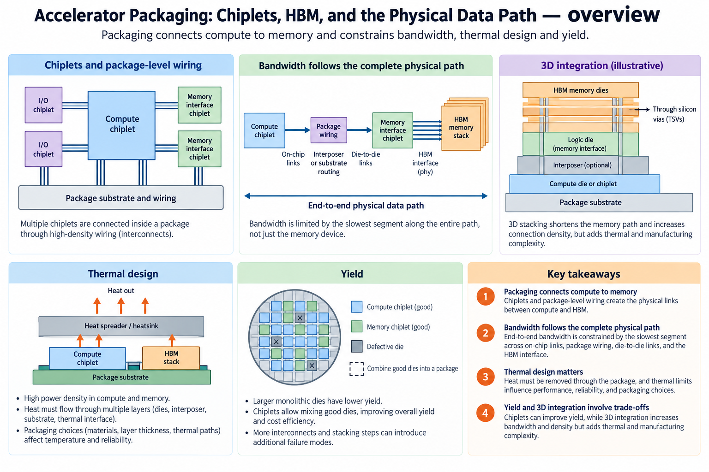
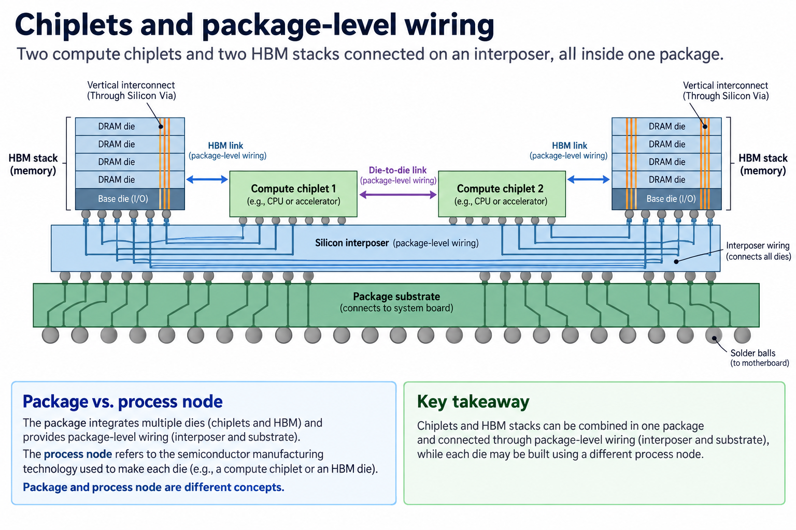
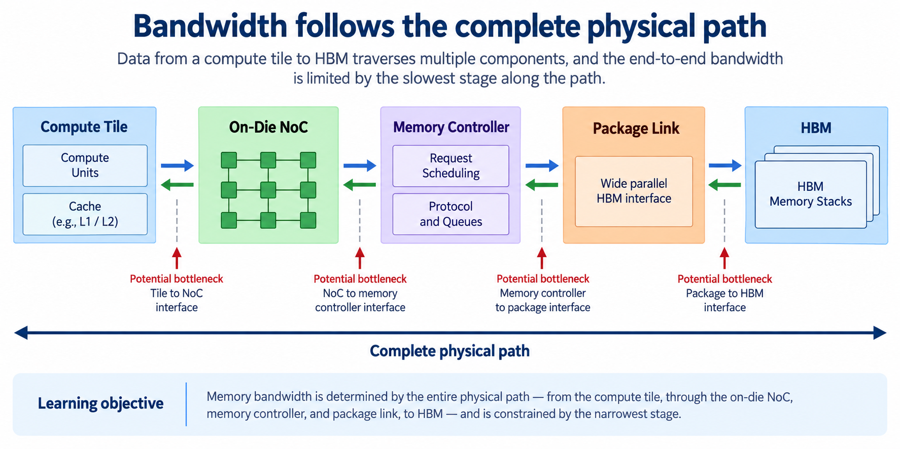
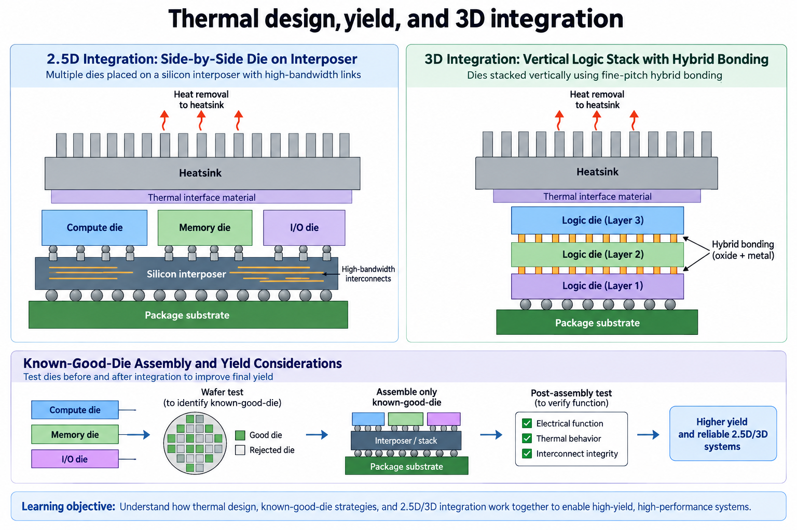

## Overview

An accelerator's useful computation depends on how its arithmetic units connect to memory and other dies. Packaging supplies part of that connection. The overview places compute chiplets, HBM stacks, an interposer and the package substrate at different physical levels. Those levels have different wiring densities, electrical limits and manufacturing tradeoffs.

Packaging does not itself change matrix multiplication into another algorithm. It changes the physical data path, capacity, power delivery and thermal envelope in which the algorithm executes. A large compute array can remain underfed if its memory path is too narrow; a dense package can lose sustained performance if heat cannot be removed.

This article builds on [DRAM to HBM](/blog/from-dram-to-hbm/) and the [RTL-to-GDSII overview](/blog/rtl-to-gdsii-in-plain-words/). It uses conceptual cross-sections, not proprietary floorplans. Product/process references are checked as of 2026-09-13, while numerical examples are illustrative calculations.

## Deep dive

### Chiplets and package-level wiring

The first figure distinguishes a die, a chiplet, an interposer and a package. A die contains fabricated circuitry. A chiplet is a die designed to function as a component of a larger assembled system. An interposer or related redistribution structure connects components at package scale. The substrate connects the assembly to the board and participates in signal and power delivery.

HBM stacks place multiple memory dies vertically and expose a wide interface to the logic device. The memory controller, package wiring and memory stack work together to deliver usable data. Placing a stack near compute enables a dense connection, but does not make its bytes local registers or guarantee that every compute unit can access the full rate simultaneously.

[TSMC's CoWoS description](https://3dfabric.tsmc.com/english/dedicatedFoundry/technology/cowos.htm) describes a family of chip-on-wafer-on-substrate integration approaches. Specific implementations differ in their interposer and redistribution organization. “2.5D” is a broad integration description, not a complete list of electrical or manufacturing rules.

Chiplets can partition compute, I/O or memory-controller responsibilities. A function split across dies needs a documented die-to-die interface with its own flow control and timing. Crossing that boundary can add latency and consume energy compared with a local on-die route. The split may still be worthwhile because it changes manufacturing, reuse or integration options.

A process node describes fabrication technology for a die; packaging describes how dies are assembled and connected. Combining chiplets from different technologies can assign expensive logic fabrication where it is useful and use another process for an I/O function. It does not automatically reduce the total system cost. Package yield, testing, substrate area and integration complexity remain part of the calculation.

When reading a product description, record the number and role of compute dies, the memory organization and the exposed interface scope. Do not infer the physical topology solely from the word “chip.” A package can contain several dies while software exposes one device, or software may expose more detailed boundaries.

### Bandwidth follows the complete physical path

The second figure follows one memory read through compute-side routing, a controller, package wiring and the HBM interface. The achievable rate is constrained by the complete path and the access pattern. A wide memory interface does not bypass an undersized internal network or a hot spot in the controller's schedule.

For a conceptual link with $$L$$ data lanes and rate $$r$$ bits/s per lane, raw one-direction bandwidth is $$Lr/8$$ bytes/s. Protocol overhead, coding, idle time and scheduling reduce payload throughput. If a source uses transfers per second rather than bits per second, the encoding and number of bits per transfer must also be accounted for. Do not silently double a one-direction figure to compare it with an aggregate bidirectional rate.

Suppose a hypothetical path has stages sustaining 8 TB/s, 6 TB/s and 7 TB/s for the same traffic. A streaming workload through all three cannot sustain more than the 6-TB/s bottleneck under this simplified model. Buffers can smooth short bursts but cannot fix that steady-state limit. A workload with cache reuse can reduce traffic crossing the bottleneck, changing useful operations per transferred byte.

For a 32×32×32 matrix tile, 2-byte input matrices and a 4-byte output require 8,192 external bytes if each input is loaded once and the output is stored once. Useful work is 65,536 operations under the MAC=2 convention. Better local reuse reduces package/HBM traffic per operation; additional partial-sum spills increase it. Packaging enables a physical rate, while the kernel determines the traffic it needs.

Latency and bandwidth remain separate. A wide path can move many bytes once transfers are underway but still have startup and scheduling delay. Random short reads may not realize the same rate as large contiguous transfers. Benchmark the intended sizes and access distributions.

Finally distinguish die-to-die fabric, HBM link and host interface. They have different endpoints and semantics. A package's high local memory rate does not imply that a CPU can stream data into the accelerator at that rate through PCIe. The diagram's boundary labels make those mismatches visible.

### Thermal design, yield, and 3D integration

The third figure contrasts side-by-side integration with vertical logic stacking and traces heat removal. In 2.5D integration, major dies sit alongside one another on a connecting structure. In 3D integration, dies can be vertically bonded, shortening selected vertical connections and increasing integration density. The exact bonding method and pitch depend on the process.

[TSMC's HPC integration description](https://www.tsmc.com/english/dedicatedFoundry/technology/platform_HPC_tech_WLSI) places advanced packaging and stacking in a wider technology ecosystem. A generic 3D diagram should not be treated as disclosure of a specific accelerator's internal stack. Use documented products to establish which integration actually exists.

Thermal design constrains sustained operation. Heat generated in one die must reach a cooling path, and a vertical stack can change thermal resistance and local temperatures. Placing high-power logic under another component is not equivalent to placing it beside that component. Power delivery and mechanical reliability also depend on the physical arrangement.

Yield is another system-level tradeoff. Smaller dies can change the probability of obtaining a usable component, but a multi-die assembly adds opportunities for integration failures. Known-good-die testing reduces the risk of assembling defective components; it does not guarantee final package yield. Memory testing, interconnect testing and final system validation still matter.

For an illustrative assembly model, suppose 4 independently screened components each have 99% probability of remaining good through assembly and the package integration succeeds with probability 98%. Multiplying gives $$0.99^4\times0.98\approx0.9414$$, or about 94.14%. Independence and the probabilities are invented assumptions, not foundry yield data. The example shows why component and assembly yield must both appear in a budget.

The innovation is a richer physical integration envelope: more memory connectivity, heterogeneous dies and shorter selected paths. The limitations include heat, power, manufacturing, test access and interface overhead. Evaluate those together with the operator's traffic. A diagram showing more stacked blocks is not enough to establish a faster or cheaper chip.

### Audit an accelerator's physical data budget

Start with the exact operator and stored types. Record input, weight, output and temporary tensor sizes. Identify which state remains in registers or on-chip SRAM and which must cross the package memory path. If an output is accumulated across several reduction tiles, ask whether partial sums stay local or spill. This determines whether the external byte count includes one final write or many intermediate reads and writes.

Next mark every physical interface. A compute chiplet may receive data through an on-die network, a die-to-die link and a controller before reaching HBM. Give each rate its direction and aggregation convention. If one specification is per stack and another is package aggregate, normalize the scope before comparison. Include protocol overhead only where its definition is known, rather than guessing a universal efficiency factor.

Check capacity independently. Enough bandwidth does not guarantee enough resident memory for weights, activations and buffers. Additional stacks can increase capacity and package complexity, but a workload may use only part of their aggregate bandwidth because of placement or access imbalance. Record both the mapped state and the traffic distribution.

Then read sustained operating conditions. Peak clocks or estimated power do not establish thermal equilibrium under a long workload. A short benchmark can hide a limit that appears after the package warms. Tool-estimated power, chip telemetry and wall-plug measurements have different boundaries. Keep them separate in the report.

Finally connect the budget to the proposed design change. If the operator is limited by repeated weight movement, retaining a tile locally may be more useful than changing the package. If the local compute consumes data faster than the memory path can provide it despite good reuse, a wider integration path may matter. If thermal limits reduce the sustained clock, more arithmetic units can worsen the imbalance.

This method turns packaging from a list of technology names into a traceable engineering decision. It also avoids mixed comparisons: one package's raw bidirectional fabric rate is not directly comparable with another's sustained one-direction HBM payload rate, and neither is an application throughput measurement.

### A worked engineering decision

Consider 2 accelerators with the same logical matrix engine but different memory packaging. If both repeatedly fetch a large working set, the implementation with a suitable wide memory interface may have more usable operand supply. If the complete working set is already reused on chip, the difference may be much smaller. Packaging changes a system constraint; it does not independently determine the workload's arithmetic intensity or reuse strategy.

Before choosing an interface, separate a die-to-die path from a memory channel. A short package connection between compute chiplets can use a protocol and electrical design different from a wide parallel HBM interface. The memory controller, physical interface, package routing and HBM stack each occupy a different part of the path. Treating them all as a generic SerDes link loses the mechanism that makes their design constraints different.

A capacity calculation should retain units and usable allocation assumptions. Memory advertised in GB, software allocations reported in GiB and reserved runtime storage are not identical quantities. Model weights, activations, temporary buffers and any replicated state share the actual available capacity. A configuration that fits weights alone can still fail during execution because its live intermediates exceed the remaining space.

For a chiplet partition, list what crosses the boundary and how frequently. Splitting a computation after every small stage may increase communication relative to keeping a complete reduction near its data. Replication can reduce repeated remote reads but uses more storage and requires a clear update policy. Physical integration also creates power, clock, thermal and test obligations beyond the logical block drawing.

The article describes why advanced packaging enables certain resource combinations. A product decision would additionally require verified interface specifications, reliability and thermal analysis, cost information and a reproducible application evaluation. No package rendering or aggregate bandwidth figure alone supplies that evidence.

## Conclusion

Packaging connects computation to a physical system. Chiplets partition functions, HBM supplies wide memory connectivity, and 2.5D/3D integration changes the wiring and thermal tradeoffs. The operator's traffic still determines how useful that connectivity becomes.

Follow a tensor from memory to arithmetic and name every boundary it crosses. Then check payload bandwidth, access latency, reuse, thermal limits and assembly/test assumptions separately. The FPGA-to-AI-chip path introduces these decisions at a small scale through memory wrappers, floorplanning and timing reports rather than assuming that correct RTL guarantees a complete physical chip.

### Sources

- [TSMC CoWoS technology](https://3dfabric.tsmc.com/english/dedicatedFoundry/technology/cowos.htm)
- [TSMC HPC integration platform](https://www.tsmc.com/english/dedicatedFoundry/technology/platform_HPC_tech_WLSI)
