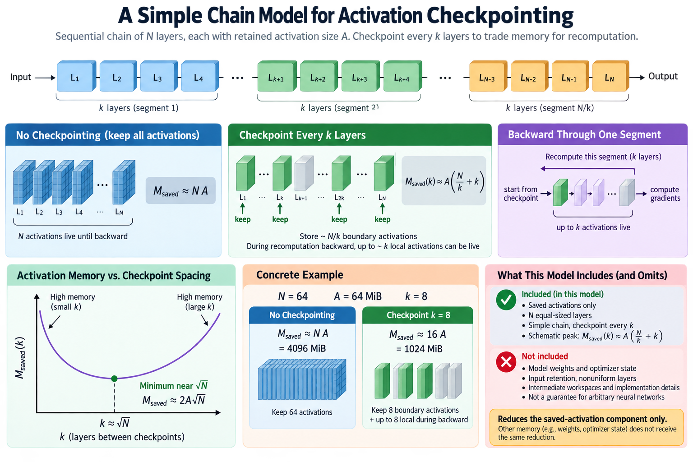
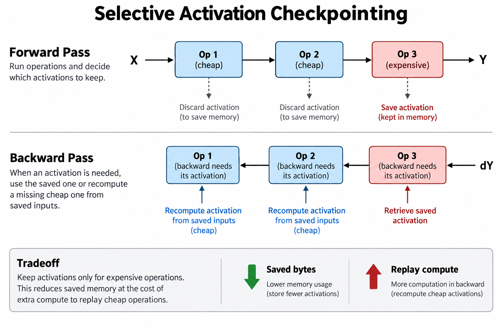
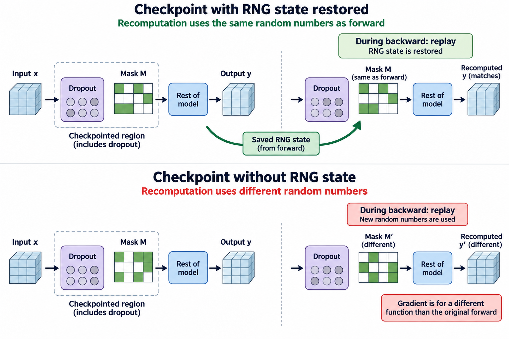

## Overview

During forward training, automatic differentiation saves the intermediate values that backward will need, and those saved activations can become the largest variable term in device memory, especially with long sequences and large microbatches: in the 64-layer chain modelled below, a simple estimate puts them at 4096 MiB before any recomputation. Activation checkpointing reduces that retained state by recomputing selected intermediate values when backward reaches them.

The mechanism exchanges storage for additional computation. It does not compress model weights, partition optimizer state, or make every temporary allocation disappear. The useful engineering question has 3 parts: which forward values are expensive to keep, which operations are affordable to replay, and whether the resulting schedule improves feasible training throughput.

We will derive a simple checkpoint-spacing model, connect it to selective checkpoint policies, and examine correctness requirements involving randomness and side effects. The memory and timing examples are illustrative: actual savings depend on 4 properties of the implementation, namely its backward rules, fused kernels, sharding schedule, and allocator behavior.

## Deep dive

### 1. Understand what backward needs

For a function y equal to f(x, w), its backward rule may need x, w, y, or other intermediate values to compute derivatives. A matrix multiplication needs both operands to form its 2 gradients, 1 with respect to the input and 1 with respect to the weights, while an activation function may need only its input or its output, and a fused operation can choose a different saved representation than the same arithmetic split across several separately executed operations.

So automatic differentiation saves a particular set of tensors, not a copy of every object visible in the Python program. Inspecting source-level layer outputs can miss the dominant saved values. Profilers and saved-tensor inspection provide stronger evidence about which allocations survive until backward.

Checkpointing a region keeps enough information to rerun that region and get its required backward values. Intermediate tensors inside the region do not need to stay live across the complete forward-to-backward interval. When backward reaches the region, recomputation builds a 2nd allocation peak, and you must count that peak too.

A memory-efficient attention kernel already avoids keeping a full attention-score matrix in high-bandwidth memory, so checkpointing that kernel can still save other state, but a capacity estimate that assumes a materialized quadratic score tensor will exaggerate the benefit. Match the saved-state model to the algorithm actually executing.

### 2. Derive a simple chain model

Consider a sequential chain of N layers, suppose each layer’s retained activation has size A bytes, and ignore 3 complications for now: unequal layer sizes, parameter state, and workspaces. Without recomputation, a simple saved-activation estimate is N times A.

Checkpoint boundaries every k layers retain roughly N divided by k boundary activations. During recomputation and backward for 1 segment, up to about k local activations can be live. A schematic peak model is

$$
M_{\mathrm{saved}}(k)\approx A\left(\frac{N}{k}+k\right).
$$

Treating k as continuous gives a minimum near the square root of N, where the schematic activation term is about 2A times the square root of N. This is a teaching model for a chain, not a guarantee for arbitrary neural networks: input retention, nonuniform layers, recomputation implementation, and intermediate workspaces can change both terms.

For N equal to 64 and A equal to 64 MiB, the uncheckpointed estimate is 4096 MiB, while choosing k equal to 8 gives about 16A, or 1024 MiB, under the simplified model. The estimated reduction applies only to the saved-activation component. A model with many additional gigabytes of weights and optimizer state does not get the same reduction in total memory.

### 3. Count the additional work

Let F be the baseline forward compute time and B the baseline backward compute time for a fixed microbatch. If checkpointing replays a fraction r of forward-like work, with r between 0 and 1, an elementary sequential timing approximation is

$$
T_{\mathrm{checkpointed}}\approx F+B+rF+T_{\mathrm{other}},
\qquad 0\le r\le1
$$

for a policy that reruns no more than 1 forward-equivalent pass in this simple setting. More complicated schedules can exceed that range, and timing also includes communication interactions, launch overhead, and changed kernel efficiency, so r is an accounting approximation rather than a measured universal constant.

If forward takes 20 milliseconds and backward takes 40 milliseconds, replaying half of forward adds an estimated 10 milliseconds. The nominal step grows from 60 to 70 milliseconds before other effects. That is a roughly 17% cost at the same microbatch, not a failure of checkpointing to work.

The memory saving can still allow a larger microbatch, a longer supported sequence, or a smaller sharding group, and those changes may improve useful throughput or make an otherwise impossible training configuration feasible, which is why that 17% figure is not the whole verdict. Compare complete feasible configurations rather than judging checkpointing only by the replay penalty at an artificially fixed capacity-unconstrained microbatch.

### 4. Select operations by saved bytes and replay cost

Uniform layer checkpointing is a useful baseline, but layers hold operations at 2 extremes of the compute-to-storage ratio: a large matrix multiplication can be expensive to replay, while a simple elementwise transformation keeps a large tensor and needs relatively little arithmetic to rebuild.

A first diagnostic ratio for operation i compares avoidable saved bytes m_i with replay cost c_i:

$$
R_i=\frac{m_i}{c_i}.
$$

The ratio can prioritize candidates, but it does not solve the complete policy: dependencies determine which values must be available to reconstruct others, avoiding 1 save can force expensive upstream replay, some values already share storage, and some operations have workspaces whose peak remains even if their outputs are not retained.

Selective activation checkpointing can preserve expensive intermediate results while recomputing cheaper ones. Match the policy to the implementation’s supported operation selection and saved-tensor behavior. A compiler can also choose recomputation within a graph, which interacts with an explicit region-level policy.

Measure actual avoided live bytes and actual replayed kernels. A theoretical list of tensor sizes is not enough when the allocator reuses storage or a fused kernel changes the saved state. The goal is to reduce the largest concurrent allocation while introducing the least harmful additional work.

### 5. Randomness must be part of the replay contract

A checkpointed region containing dropout uses random numbers during forward. Recomputing with unrelated random values changes the function whose gradient is being evaluated. Framework checkpointing mechanisms commonly preserve and restore random-number state to match the original forward behavior within their supported device scope.

Preserving state has overhead. Disabling preservation can be reasonable only when the resulting behavior is intended and understood, so treat it as a change in semantics rather than a purely mechanical performance toggle. Random-number handling across multiple device types or movement to a previously unseen device can create additional restrictions described by the framework.

PyTorch documents 2 checkpoint variants, reentrant and non-reentrant, and recommends explicitly selecting the appropriate one. Their behavior differs in graph recording, backward support, early stopping of recomputation, and handling of nested structures or detached tensors. Do not assume a code example written for 1 variant is correct for the other.

Correctness also involves side effects. A function that increments a counter, mutates a cache, performs logging with operational consequences, or updates state during forward can execute every one of those effects a 2nd time during replay. Design checkpointed regions around computations whose repeat execution is valid, or explicitly manage their stateful behavior.

### 6. Replay can interact with parameter sharding

A fully sharded model materializes parameters according to its execution schedule, and replaying forward-like work during backward may require those parameter values to be available again, so whether replay triggers a 2nd gather, reuses an existing materialization, or extends a lifetime depends on how checkpoint regions align with sharding units.

This creates a joint optimization problem. A region boundary that looks ideal for activation memory can produce a poor parameter-materialization schedule. Aggressive all-gather prefetch can hide communication while increasing the number of live full units. Combining the 2 features without a timeline can produce a peak neither independent estimate predicted.

Record checkpoint-region boundaries and sharding-unit boundaries together. Inspect the actual ordering of the 4 kernel families involved: gathers, recomputation, backward, and reduce-scatters. Evaluate whether replay adds exposed communication or just extra arithmetic on an already compute-bound critical path.

The same principle applies to pipeline schedules. A stage holding activations for several in-flight microbatches may gain more from checkpointing than a stage with only 1 live microbatch, so stage imbalance and replay placement can change the pipeline bubble. Treat activation savings as a property of the full schedule, not just of an individual layer.

### 7. Build a meaningful measurement interval

Initialize the optimizer, warm up compilation, and execute representative microbatches before recording memory. Reset peak statistics around 1 complete optimizer step or another explicitly defined interval. Include all accumulation microsteps if the production step uses accumulation.

Measure allocated and reserved memory separately where the framework supports them. Reserved caching-allocator memory can remain high after live activations fall, and that observation does not prove checkpointing failed, just as a lower allocation reading from 1 instant does not prove that the worst-case peak fits.

Capture a timeline to confirm that the expected operations are replayed. Compare kernel counts and durations, but report the complete step time as the primary performance result. Replay can change launch behavior, resource contention, and communication overlap, so summing replay kernels in isolation can miss its end-to-end effect.

Run 2 comparisons. The first uses a fixed supported workload; the second uses the larger feasible microbatch that the saving enables. Clearly label the difference between a method’s cost at fixed work and the throughput benefit of a changed feasible configuration, because both results are useful when their assumptions are visible.

### 8. Validate numerical and training behavior

Start with a small deterministic model and compare 3 things with and without checkpointing: outputs, gradients, and parameter updates. Include operations using randomness when the real model uses them. Use numerical tolerances appropriate to precision and changed execution order rather than requiring bitwise equality without justification.

Test the actual control-flow and device cases supported in production. A checkpointed region that behaves differently during replay can silently produce incorrect gradients. Dynamic branches, hidden global state, and device transfers deserve attention because the replay contract depends on reconstructing the same relevant computation.

After the local correctness check, evaluate a short representative training run. Compare loss trends and finite gradients, and check that 3 quantities stay unchanged: optimizer-step counts, effective global batch, and loss normalization. A memory optimization should not accidentally change accumulation or omit gradients when combined with other wrappers.

Checkpointing is not a substitute for a correct model implementation. It can change when a bug becomes visible, or mask a lifetime assumption that only fails under 1 replay variant. Use the smallest reproducer that includes the relevant operation and state behavior when diagnosing a discrepancy.

### 9. Choose a policy under an explicit constraint

A practical policy search starts with the capacity target, which is 4 numbers: maximum supported sequence length, microbatch, accumulation factor, and headroom. Identify the tensors contributing to the peak, then compare a small number of checkpoint regions or selective policies that target them.

For each candidate, record 4 results: peak memory, complete step time, valid training tokens per second, and correctness. Reject configurations that fail the supported worst-case workload before ranking performance. If a policy changes the feasible batch or sharding layout, include that fact in the comparison rather than presenting the result as a free speedup.

Prefer understandable region boundaries initially. A slightly less aggressive policy with a reproducible memory guarantee can be more useful than a fragile optimum that depends on 1 input shape. Refine selectively when traces show a dominant avoidable allocation and a clear affordable replay path.

Version the final policy with the model and training configuration. Compiler behavior, fused kernels, backward rules, and framework checkpoint semantics can change. A regression check on memory and step time helps preserve the benefit after changes to those underlying components.

## Conclusion

Activation checkpointing saves selected boundaries and rebuilds omitted intermediates during backward. Its benefit is a reduction in saved-activation lifetime; its cost is replayed computation and potentially changed communication scheduling.

Use the chain model to understand the tradeoff, then inspect real saved tensors and allocation peaks. Preserve replay correctness, tune region and sharding boundaries together, and compare feasible training configurations using useful throughput rather than memory savings alone.

### Sources

- [PyTorch checkpoint documentation](https://docs.pytorch.org/docs/stable/checkpoint.html): replay semantics, random-number state, and variant differences.
- [PyTorch activation checkpointing techniques](https://pytorch.org/blog/activation-checkpointing-techniques/): selective checkpointing and speed–memory tradeoffs.
- [Chen et al., Training Deep Nets with Sublinear Memory Cost](https://arxiv.org/abs/1604.06174): checkpointing and recomputation in network chains.
- [PyTorch FSDP documentation](https://docs.pytorch.org/docs/stable/fsdp.html): parameter materialization and prefetch interactions.
