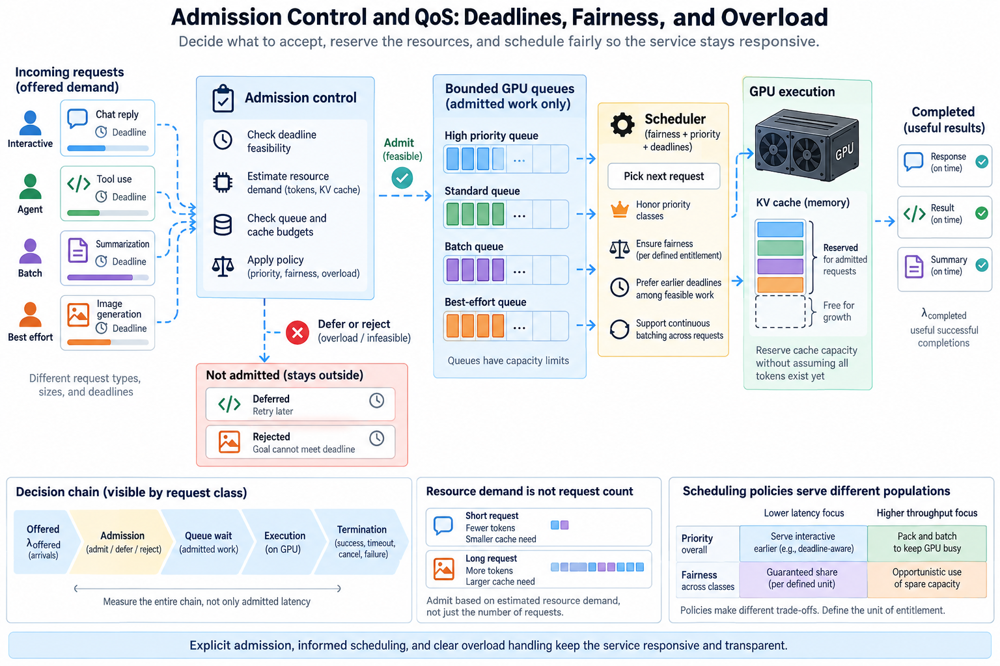
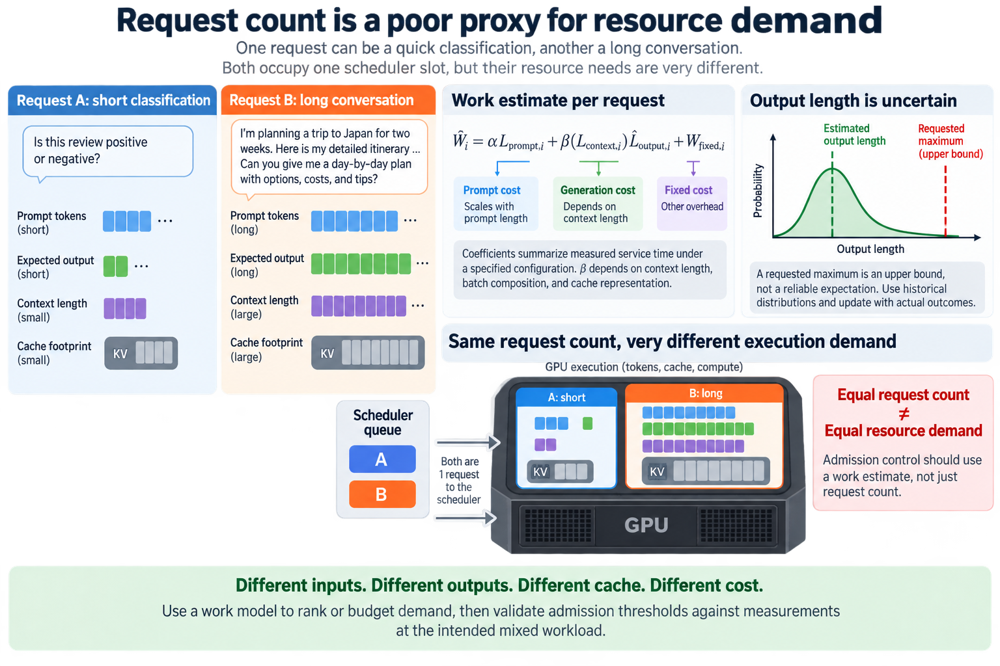

An inference service can remain responsive during overload only if it makes explicit decisions about which work to accept and when to execute it. Allowing every request into an unbounded queue turns insufficient capacity into increasingly stale promises. The GPU may remain busy while many clients receive timeouts instead of useful answers.

Admission control decides whether the service can accept a request under its current policy and resource budget. Scheduling decides how admitted requests share execution. Quality of service defines the outcomes and fairness the service promises to different populations. These mechanisms interact, but they should not be collapsed into a single concurrency limit.

We will derive a simplified workload and cache budget, connect deadlines to queue decisions, and examine fairness under continuous batching. The calculations are illustrative models. Engine-specific controls and cache behavior should be verified for the installed implementation rather than treated as universal scheduling semantics.

## 1. Separate offered demand from admitted work

*Overview of the article’s core mechanism. The following sections explain the objects, relationships, equations, assumptions, and worked examples shown here.*

Let lambda_offered be the rate at which requests reach the service and lambda_admitted the rate accepted for execution. Let lambda_completed count useful successful completions. Rejection, cancellation, and failure explain why these rates can differ, especially outside steady state.

A concurrency limiter can keep engine latency low by rejecting most arrivals. That may be an appropriate policy, but the outcome must remain visible. Reporting only admitted request latency can make a capacity shortage appear to have disappeared when it has actually moved to the rejection boundary.

Measure the entire decision chain by request class: offered arrivals, admission decisions, queue wait, execution, termination, and deadline outcome. Preserve a client-visible reason for rejection or timeout. Clients need enough information to avoid immediate synchronized retries that recreate the same overload.

Admission can occur at more than one boundary. A frontend may accept an HTTP request while an engine later rejects its resource reservation. Define which event starts the service objective and which event constitutes accepted work. Otherwise queue time and failures can fall between monitoring layers.

## 2. Request count is a poor proxy for resource demand

Requests differ in prompt length, expected output length, cache footprint, and phase behavior. A short classification request and a long conversation should not be assigned identical resource estimates simply because each occupies one scheduler slot.

For request i, a simple work estimate separates prompt and generation costs:

$$
\widehat W_i=\alpha L_{\mathrm{prompt},i}+\beta(L_{\mathrm{context},i})\widehat L_{\mathrm{output},i}+W_{\mathrm{fixed},i}.
$$

The coefficients summarize measured service time under a specified configuration. Decode cost can depend on context length, batch composition, and cache representation, so beta is shown as a function rather than a universal constant. The estimate is useful for decisions only while its calibration remains relevant.

Predicted output length is uncertain. A requested maximum is an upper bound under the protocol, not a reliable expectation. Historical distributions can support a statistical estimate, but requests whose generation behavior changes can invalidate it. Keep the estimate's uncertainty and update it using actual outcomes.

Do not interpret the sum of isolated request times as an exact batched execution time. Continuous batching creates shared work and interference. Use the model to rank or budget demand, then validate admission thresholds against measurements at the intended mixed workload.

## 3. Reserve cache capacity without pretending all tokens exist yet

For conventional cached attention, let n_i be reserved sequence positions, H_kv the key-value head count, d the head width, b bytes per element, and L_layers the layer count. A simplified per-request reservation is

$$
\widehat M_i=2n_iH_{\mathrm{kv}}dbL_{\mathrm{layers}}.
$$

The factor 2 accounts for keys and values. This estimate excludes allocation granularity, metadata, alternative cache structures, and shared prefixes. Hybrid or latent-cache architectures need their actual state model instead. A reservation is an admission accounting choice, not necessarily physical allocation of every future token immediately.

Consider n_i=4096, H_kv=8, d=128, b=2, and 32 layers. The logical reservation is 512 MiB. A 32 GiB usable cache budget would hold at most 64 such independent reservations under this simplified accounting, before safety margins and allocation effects.

Reserving each request's maximum output can protect against growth but waste capacity when outputs are usually short. Reserving only the current prefix improves occupancy but can lead to future exhaustion. Intermediate policies can reserve an initial budget and revise it as generation proceeds, with explicit preemption or rejection semantics when growth cannot be accommodated.

Shared-prefix blocks complicate attribution. Several requests can reference common physical state while maintaining separate future-growth obligations. Count physical occupancy and logical reservation separately so sharing benefits do not silently erase the budget needed for new tokens.

## 4. Use deadlines to bound waiting promises

For a request arriving at time a_i with deadline d_i, let t be the current time and R_hat_i the estimated remaining execution and delivery time. Its estimated slack is

$$
\widehat S_i=d_i-t-\widehat R_i.
$$

Negative estimated slack suggests the request is already unlikely to meet the deadline under the model. It does not prove failure, because estimates are imperfect and scheduling can change. The service can reject, downgrade, or proceed according to a documented policy rather than letting the request wait indefinitely without a decision.

A queue-time budget can reserve part of the deadline for execution. For an illustrative 2-second completion objective and estimated 1.2-second execution and delivery cost, only 0.8 seconds remain for waiting at arrival. As work estimates and queue conditions change, the feasibility assessment should change too.

Separate first-token and completion deadlines. A long answer may satisfy an initial responsiveness objective but miss the final completion target. A streaming service can also impose a maximum token-gap objective. Meeting one of these outcomes does not establish the others.

Cancellation must propagate through queued and active work promptly. A client that has abandoned a request should not continue consuming cache and compute merely because the frontend connection ended without informing the engine. Measure resource-release delay as part of the cancellation path.

## 5. Scheduling policies optimize different populations

First-come, first-served is easy to explain but can leave short requests behind long ones. A shortest-estimated-work policy can improve mean completion time while delaying long requests. Earliest-deadline-first uses urgency but still needs resource feasibility and protection against inaccurate estimates.

Continuous batching adds decisions at the token-work level. An engine chooses how much prompt processing and decode work to place in each iteration. A large prefill can affect active streams; smaller prompt chunks can improve sharing while introducing their own overhead and changing total prompt completion time.

Do not claim that a frontend queue discipline directly controls every GPU iteration. The frontend and engine may have different scheduling layers. A priority label is useful only if the downstream implementation preserves its intended meaning at the actual contention point.

Evaluate policies using response distributions by request size and class. A fleet mean can improve while one important class experiences starvation. Include maximum or high-percentile waiting, deadline success, useful throughput, and the work abandoned after cancellation.

## 6. Fairness needs a defined unit of entitlement

Equal request counts do not imply equal resource use. If one tenant sends long prompts and another sends short prompts, dividing scheduler slots equally can allocate very different GPU time and cache capacity. Define whether fairness concerns requests, tokens, measured service time, or a policy-specific resource estimate.

A simplified weighted entitlement for class k with weight w_k is

$$
f_k=w_k/\sum_j w_j.
$$

This expresses a target share when the relevant classes are contending. It does not require wasting capacity when one class has no work. A work-conserving scheduler can allow others to use spare capacity while maintaining accounting for the intended contention behavior.

Measured resource usage can support deficit or credit-based scheduling, but estimates and delayed feedback matter. Charging a class by predicted output length can overcharge short actual responses. Charging only after completion can permit an immediate burst to consume resources before the accounting catches up.

Add a starvation control such as bounded waiting or age-based promotion when the policy requires it. Priority should identify intentional service distinctions, not become an unrestricted bypass that every caller selects. Verify class assignment at the service boundary and test sustained contention among classes.

## 7. Overload policy should reduce wasted work

At overload, useful completed work can fall even as offered traffic rises. Queueing causes cancellations, retries add demand, and partial generations consume capacity without delivering successful responses. The target is useful completion under the objective rather than maximum admitted concurrency.

One outcome metric is

$$
G_{\mathrm{deadline}}=N_{\mathrm{accepted\ completions\ before\ deadline}}/\Delta t.
$$

Pair it with rejection rate and offered demand. Otherwise a controller could maximize the apparent success fraction by accepting almost nothing. Report both how much useful work completed and how much demand was declined.

Bound queues by work or time where practical, not only item count. Apply backpressure before expensive prompt processing when the request is clearly outside the capacity policy. Rejection after a large prefill wastes more work than an earlier decision, though a later resource estimate may sometimes be necessary.

Use retry guidance and client behavior that avoid synchronized bursts. Backoff and jitter can reduce repeated contention, but the server should still enforce its own budget. Relying on every caller to behave cooperatively is not a capacity control.

## 8. Test uncertainty and adversarial workload mixtures

A useful load experiment includes varied prompt lengths, output lengths, arrival bursts, deadlines, and cancellations. Constant-length requests at a steady rate test only a narrow operating point. Add sudden demand changes and sustained overload to see whether the queue stabilizes or grows.

Force prediction errors: outputs longer than expected, lower cache-sharing rates, and request classes whose service times shift. Observe whether reservation updates, admission decisions, and fairness accounting remain coherent. The model should degrade into explicit policy decisions rather than hidden resource exhaustion.

Measure useful completions during and after a burst. A controller may survive the burst but take a long time to clear stale queued work. Recovery time and abandoned work help distinguish a robust policy from one that merely postpones failure.

Check resource release after every termination reason. Queued timeout, active cancellation, completed output, engine error, and preemption can follow different paths. Leaked cache reservations or stale queue entries gradually reduce capacity even when individual requests appear to finish correctly.

## 9. Calibrate policy with service evidence

Choose thresholds using the target workload and objectives. Record admitted workload, queue estimates, actual phase timing, cache occupancy, and completion outcomes at each operating point. The relationship between a control value and useful capacity should be observed rather than assumed from a vendor headline throughput number.

Recalibrate after model, quantization, kernel, scheduler, or hardware changes. An optimization can change the bottleneck and invalidate a previously useful request-work estimate. Keep the policy configuration version beside performance data so comparisons identify which decisions produced the results.

Expose a compact decision record for diagnosis: request class, admission result, estimated resource budget, relevant queue state, and termination reason. This makes it possible to explain why a request waited or was rejected without requiring a full device profile for every event.

Admission control turns finite hardware capacity into explicit service promises. Good scheduling shares accepted work according to those promises, and observability verifies their outcomes. The best policy completes useful requests within the required objectives while bounding queue growth, preserving fairness, and releasing resources promptly when work ends.

## Sources

- [vLLM optimization and cache configuration guidance](https://docs.vllm.ai/en/latest/configuration/optimization/).
- [vLLM metrics documentation](https://docs.vllm.ai/en/latest/design/metrics/).
- [NVIDIA Triton rate limiter documentation](https://docs.nvidia.com/deeplearning/triton-inference-server/user-guide/docs/user_guide/rate_limiter.html).
