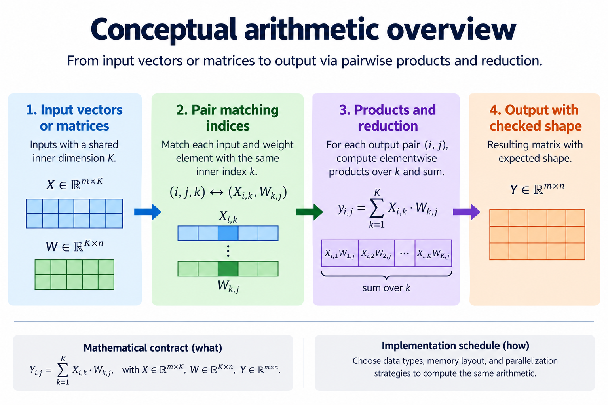
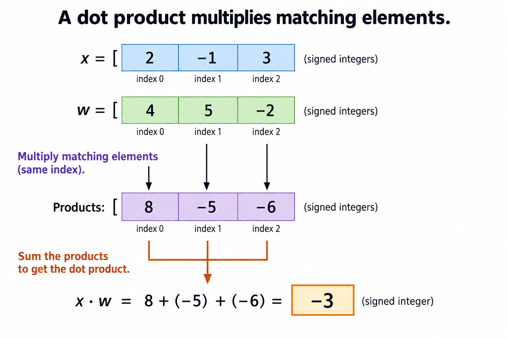
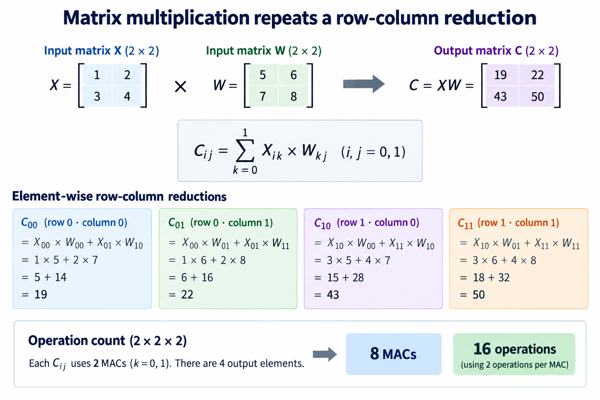
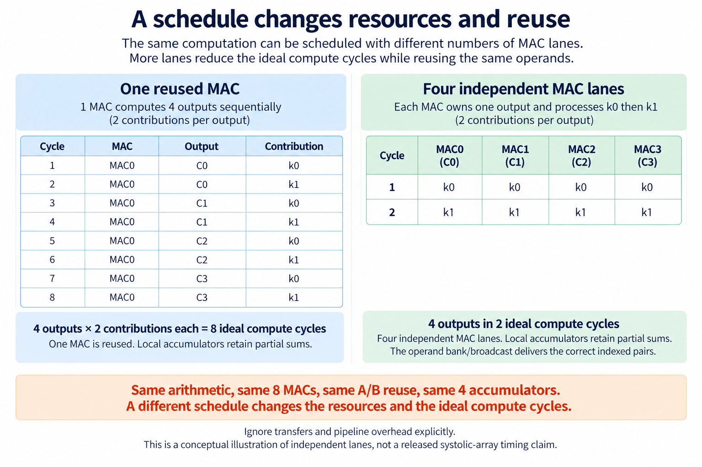

## Overview

AI arithmetic starts with an indexed calculation before it becomes an accelerator architecture. The overview follows input vectors or matrices through products, reductions, and an output. The representation and shape determine which elements belong together. A hardware schedule then decides where those products occur, where partial sums are retained, and how operands are delivered.

The earlier foundations lessons covered binary values, combinational functions, state, HDL, simulation, timing, and safe crossings. Here those ideas meet a small integer dot product and a two-by-two matrix multiplication. The examples deliberately avoid a large neural-network framework so every product and sum can be inspected by hand. They are mathematical and scheduling examples, rather than benchmark results for a GPU or FPGA.

The [foundations lab](/labs/fpga-fundamentals/foundations-lab.zip) independently calculates the outputs and verifies the stated operation counts. Its schedule comparison assumes ideal operand availability and excludes transfer and pipeline overhead. The separate accelerator project introduces an actual RTL arrangement and tests its real cycle behavior; the figures here do not replace that evidence.

This is the ninth lesson in the course. Continue afterward with the [INT8 arithmetic article](/blog/fpga-ai-number-1-int8-arithmetic/), now its tenth lesson, to derive signed product and accumulator bounds. The purpose here is first to establish the mathematical contract and shapes, then to identify which implementation questions must be answered before discussing speed.

## Deep dive

### A dot product multiplies matching elements

The dot-product figure aligns corresponding elements of two equal-length vectors. For x equal to [2, negative 1, 3] and w equal to [4, 5, negative 2], the element products are [8, negative 5, negative 6]. Their sum is negative 3. Each multiplication uses the same index from both vectors. Combining every element of x with every element of w would instead describe an outer-product-like collection, not this reduction.

The mathematical rule sums x at index k times w at index k across the declared length K. K is the number of paired elements, and k identifies the current pair. The [Dive into Deep Learning linear-algebra chapter](https://d2l.ai/chapter_preliminaries/linear-algebra.html) defines dot products and matrix operations. This article's small integer values are original checked examples, selected to make positive and negative contributions visible.

Shape compatibility is part of the contract. Two length-three vectors produce one scalar dot product. A mismatch in lengths should be rejected or handled by an explicitly different rule. Silently ignoring the extra elements changes the operation. Likewise, a layout that stores values in a different order must provide an index mapping before the corresponding elements can be paired correctly.

A reduction can be implemented in several ways. One multiplier-accumulator may reuse its arithmetic over K steps. Several multipliers may generate products concurrently, followed by an addition tree. A pipeline can divide that tree into stages. These arrangements compute the same ideal integer result only if widths and retention preserve all required intermediate values. Their resource use and timing differ.

Signed values make the width question concrete. Multiplying the maximum magnitude inputs can require more bits than either input, and summing many products can require further range. This foundations example uses unbounded Python integers for its reference calculation. A finite-width RTL implementation must derive its product and accumulator bounds, which the next INT8 lesson develops. Do not take a correct unbounded result as evidence that an arbitrary narrow hardware sum is safe.

The ordering of a reduction also matters when the representation is not exact. Integer arithmetic with sufficient width preserves the mathematical sum, but floating-point rounding or per-step saturation can make different reduction orders produce different results. Those policies belong in the numerical contract. This article does not claim that every parallel reduction is bit-identical under every arithmetic format.

To inspect the example, write three columns: k, the two operands, and their product. Sum the final column independently. Then check the lab's output. This makes an index alignment error distinguishable from an arithmetic error. A result of negative three is meaningful because the pairs, signed interpretation, and reduction rule are all stated, rather than because a diagram ends with a plausible scalar.

### Matrix multiplication repeats a row-column reduction

The matrix figure uses X equal to [[1, 2], [3, 4]] and W equal to [[5, 6], [7, 8]]. Both have two rows and two columns. The result C has the same two-by-two shape in this particular example, but its general shape follows the outer dimensions: an M-by-K matrix multiplied by a K-by-N matrix produces an M-by-N matrix. The shared K dimension identifies the reduction length.

For each output C at row i and column j, sum X at row i and reduction index k times W at reduction index k and column j. Here i and j each take two values, and k takes two values. Row zero of X with column zero of W gives one times five plus two times seven, or nineteen. Row zero with column one gives one times six plus two times eight, or twenty-two.

The second row produces three times five plus four times seven, or forty-three, and three times six plus four times eight, or fifty. The complete result is [[19, 22], [43, 50]]. A common mistake pairs an X row with a W row, effectively changing the transpose relationship. The figure draws row-to-column selection to make the intended indices visible. The [linear-algebra source](https://d2l.ai/chapter_preliminaries/linear-algebra.html) develops this row-column interpretation more generally.

The number of multiply-accumulate contributions is M times N times K. In this example, two times two times two gives eight contributions. If a reporting convention counts one multiplication and one addition as two operations for each contribution, it reports sixteen operations. State that convention near the number. A multiply-accumulate count and an operation count are not interchangeable without the stated factor.

Initialization needs a defined role. Each output accumulator starts from zero for this calculation. A design implementing C plus X times W would instead include a preexisting value, and bias or activation would add further operations. The count of eight here describes only the stated matrix product, not a complete neural-network layer or inference request.

Storage layout does not change the mathematical shape, but it changes how values are addressed and delivered. Row-major and column-major layouts require different address calculations. A flattened array must still map each index to the intended matrix element. The reference implementation uses nested indexing so the mathematical meaning can be inspected before a later hardware implementation introduces banking or tiled storage.

For a robust shape test, also try a non-square multiplication in the lab, such as a one-by-three matrix times a three-by-two matrix. Square examples can conceal an incorrectly swapped dimension because the lengths remain equal. Check both the output shape and every scalar result. Reject incompatible dimensions explicitly. Shape validation prevents a correct local multiplication from being assembled into the wrong overall tensor operation.

### A schedule changes resources and reuse

The schedule figure compares two conceptual resource arrangements for the same two-by-two product. One reused MAC performs one contribution per ideal compute cycle, so the eight contributions require eight such cycles. Four independent lanes can each work on one output, performing its two contributions over two ideal compute cycles. The arithmetic count is unchanged; the work is distributed across different resources.

These cycle counts assume one accepted contribution per lane per cycle, available operands, sufficient accumulator width, and no added startup, transfer, or pipeline overhead. They are analytical scheduling counts. They do not describe the cycle timing of the project's released systolic array, its integrated top, a GPU kernel, or a board benchmark. A real implementation must account for the additional interface and dependency behavior it actually uses.

For the four-lane illustration, initialize four local accumulators. On the first ideal step, supply X[0,0] and X[1,0] with W[0,0] and W[0,1] to the appropriate lanes. On the second, supply the elements with k equal to one. Each X value is useful to two output columns, and each W value is useful to two output rows. Broadcasting can express that reuse if the physical and interface arrangement supports it.

Reuse does not imply unlimited delivery. A memory with a small number of read ports may be unable to supply every operand requested by the lanes in one cycle. Registers, replicated storage, banks, broadcasts, or a different schedule can address the limitation. The choice needs resource and timing evidence. Drawing four multipliers without their operand paths would hide the bottleneck rather than explain the architecture.

Partial sums also need ownership. In the single-MAC schedule, the controller must determine which output accumulator receives each contribution, or it must complete one output before moving to the next. In the independent-lane schedule, each lane owns one retained output sum for the stated calculation. Mixing contributions from different output indices would produce an incorrect matrix even if every multiplication were correct.

The useful performance calculation connects work, resources, delivery, and completion. Count arithmetic contributions, specify the per-lane acceptance rate, identify storage access needs, and add the actual overhead from the chosen implementation. If stalls occur, record why and when. A theoretical two-cycle compute schedule is an upper-level model whose assumptions need to be met, not a promised speedup for an arbitrary physical design.

A schedule table can make the ideal assumption testable. Label each contribution with its output row, output column, and reduction index. In the reused-MAC arrangement, list eight entries and confirm that each output receives exactly two contributions. In the four-lane arrangement, list four simultaneous entries for each of two reduction steps. No contribution should disappear or be applied twice. The arithmetic reference still computes the same four sums independently.

An actual pipelined MAC can introduce a recurrence constraint if an accumulator update is unavailable when the next contribution arrives. It may need forwarding, interleaved outputs, or a different initiation interval. The one-contribution-per-cycle assumption here deliberately abstracts that implementation detail. Before applying the model to RTL, inspect when the retained sum becomes available and when the operator accepts its next operands. This is why a conceptual resource count must be followed by a state and timing contract. A lane diagram alone cannot prove that its own feedback dependency sustains the assumed rate.

The [accelerator project](/blog/fpga-ai-spec-1-define-the-ai-accelerator/) develops a concrete small matrix engine with verified RTL and host-load storage. Read its measured simulation cycle behavior on its own terms. This foundations comparison prepares you to ask the right questions about that design: which output each lane owns, how operands arrive, how state is reset, and which event indicates a complete result.

## Conclusion

A dot product pairs equal indices and reduces their products to one scalar. Matrix multiplication repeats that reduction for each row-column output pair, with compatible shared dimensions. The checked examples produce negative three for the vector calculation and [[19, 22], [43, 50]] for the two-by-two matrix product.

Resource schedules can change ideal compute cycles without changing the arithmetic count. The one-MAC and four-lane examples assume available operands and exclude overhead. Their limitations are part of the comparison, so they should not be reported as a measured accelerator speedup. A physical or integrated RTL design needs its own delivery, control, timing, and completion evidence.

Continue with [INT8 products and accumulator width](/blog/fpga-ai-number-1-int8-arithmetic/) to replace the unbounded reference integers with a justified finite representation. Then begin the separate accelerator project, where these mathematical contracts become actual modules, schedules, buffers, tests, and eventually implementation tasks.

### Sources

- [Dive into Deep Learning: linear algebra](https://d2l.ai/chapter_preliminaries/linear-algebra.html)
