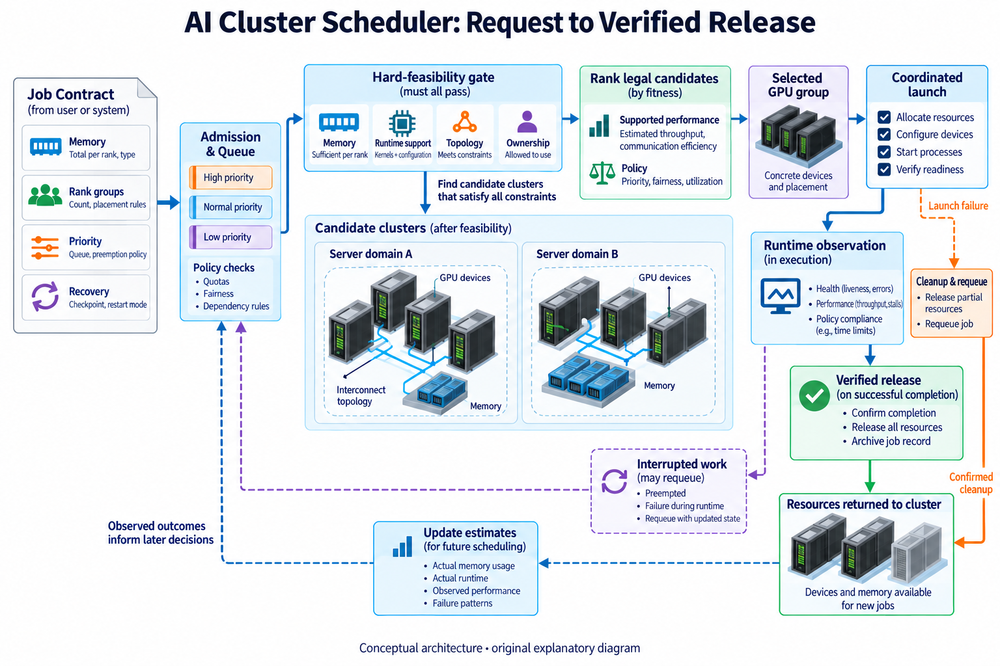
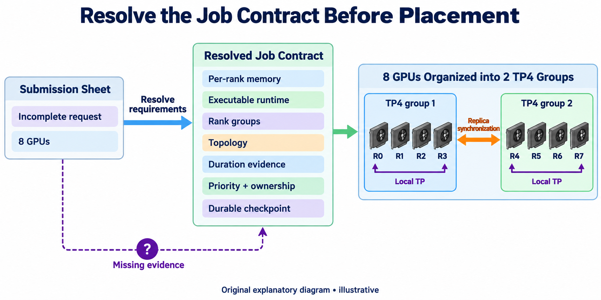
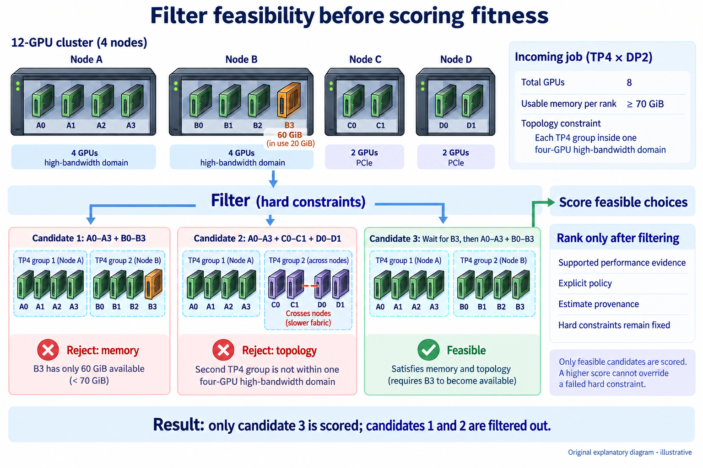
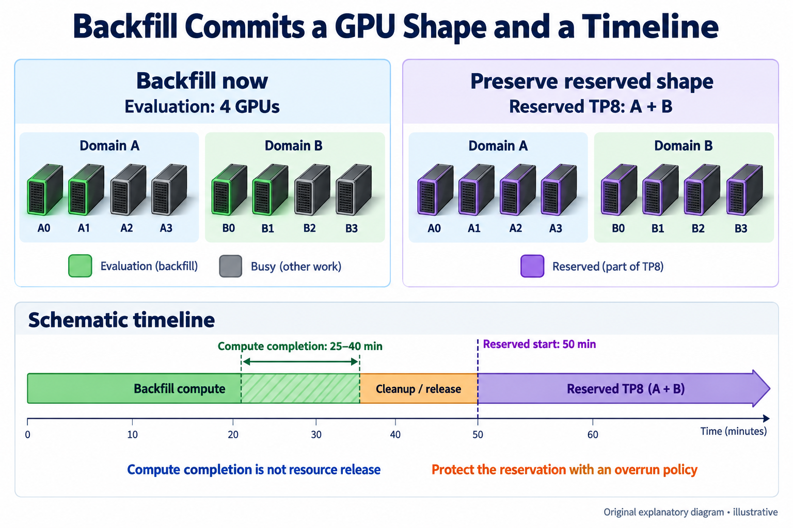
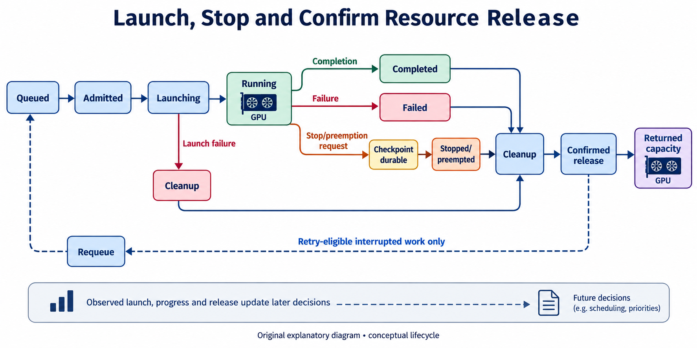

## Overview

A cluster scheduler answers 3 linked questions: can this job run, which available resources should it receive, and should it run now? The request may say “8 GPUs,” but the scheduler needs a much richer object. An 8-way tensor-parallel training job needs all 8 ranks on a communication path that can sustain its collectives. A pipeline-parallel job may tolerate a slower boundary between stages. A low-priority evaluation can wait or backfill, while a production service may carry a latency objective and a protected minimum.

Those differences explain why free-GPU count is only the beginning. The scheduler admits a request, holds it in a queue, filters infeasible placements, scores the survivors, launches the selected allocation, and watches what actually happens. Completion, failure, preemption, and measured runtime then change the evidence used for later decisions.

This article follows that loop for one illustrative distributed training job. It builds on [Kubernetes and Slurm: Topology-Aware Placement and Resource Guarantees](/blog/kubernetes-slurm-topology-resource-guarantees/), which explains resource enforcement, and [AI Cluster Topology](/blog/ai-cluster-topology-local-and-scale-out/), which explains the physical links beneath a placement. Here the subject is the decision itself.

## Deep dive

### Turn a submission into a schedulable object

Suppose a team submits a training job requesting 8 GPUs. The count tells the scheduler how many devices to reserve, yet it says nothing about whether the job fits or performs acceptably. A useful request also records the device capabilities, per-rank memory requirement, parallelism layout, communication groups, estimated duration, checkpoint state, priority, ownership, and any deadline or reservation constraint.

The layout changes the meaning of the count. Let the training configuration use tensor parallelism of 4 and data parallelism of 2, written TP4×DP2. Each TP group contains 4 ranks that exchange intermediate results within model layers; the 2 DP replicas synchronize gradients. The scheduler should therefore receive 2 tight four-GPU groups rather than 8 interchangeable slots. [Acme](https://arxiv.org/abs/2403.07648), a 6-month trace study of 4,704 A100 GPUs, describes LLM development as a mix of pretraining, fine-tuning, evaluation, and other jobs, with intricate parallelization and markedly different resource patterns. Its authors report that pretraining jobs represented 3.2% of jobs but 94.0% of GPU time in one studied cluster, while evaluation jobs dominated job count and waited longer because most resources were reserved for pretraining.

That trace does not define every cluster. It does show why the scheduler needs workload class and policy context in addition to device count. The same 8 free GPUs can be suitable for one job, slow for another, and unavailable to a third because a quota or reservation protects them.

A compact request object could contain

$$
J=(R,C,G,\widehat{T},P,Q,K),
$$

where $$R$$ is the resource vector, $$C$$ the capability constraints, $$G$$ the communication groups, $$\widehat{T}$$ a runtime interval, $$P$$ priority, $$Q$$ quota or ownership state, and $$K$$ checkpoint and recovery state. The tuple is a teaching model, not a proposed universal API. Its purpose is to make missing evidence visible before placement begins.

These fields also prevent 3 common category errors. Memory belongs in feasibility because a rank that cannot allocate its state will not run; estimated bandwidth belongs in fitness when several legal paths offer different performance; and checkpoint age changes the cost of preemption without changing whether the job can execute on a fresh allocation. When one scalar score mixes all 3, an excellent predicted runtime can accidentally outweigh an impossible memory requirement, or a cheap interruption can be inferred from a victim whose last durable checkpoint is hours old.

### Filter feasibility before scoring fitness

Kubernetes documents this split directly: filtering produces the nodes where a pod is feasible, then scoring ranks the remaining choices. If filtering returns no node, the pod remains unscheduled. An AI scheduler needs the same separation at a larger scope, because a distributed job may require a set of nodes and links rather than one node.

Consider an illustrative 12-GPU cluster. Node A contains GPUs A0–A3 in one high-bandwidth domain. Node B contains B0–B3 in a second. Nodes C and D each expose 2 GPUs over ordinary PCIe, giving C0–C1 and D0–D1. The incoming TP4×DP2 job needs 8 GPUs, at least 70 GiB of usable memory per rank, and each TP4 group must remain inside one four-GPU high-bandwidth domain.

Now add one concrete obstacle: B3 has only 60 GiB available because another allocation holds 20 GiB. Three candidate sets illustrate the filtering step.

1. **A0–A3 plus B0–B3** has the right topology but fails memory feasibility at B3.
2. **A0–A3 plus C0–C1 and D0–D1** has 8 devices, but the second TP4 group crosses 2 nodes over the slower fabric.
3. **Wait for B3, then use A0–A3 and B0–B3** satisfies both hard constraints.

Aggregate capacity says that choices 1 and 2 contain 8 GPUs. Only the third satisfies the full job object. A real scheduler may have additional feasible sets, but it should never let a favorable score compensate for a broken hard constraint.

Physical proximity alone is also an imperfect score. [BandPilot](https://arxiv.org/abs/2506.15595) defines effective collective bandwidth for a candidate GPU subset and observes that background traffic can reduce it below the subset’s idle measurement. The system uses sparse NCCL measurements and a surrogate because exhaustively benchmarking every subset under every traffic state is infeasible. Its paper also states a boundary that matters here: BandPilot selects a GPU subset for the current request and does not optimize unknown future arrivals or long-term fragmentation.

The scheduler can therefore use predicted bandwidth as one scored feature while retaining its provenance. A measured value, a supported interpolation, and an assumption should not appear equally certain on the decision record.

### Score the survivors and expose the tradeoff

Once filtering leaves feasible candidates, the scheduler needs an objective. A simple illustrative cost for placement $$S$$ is

$$
C(S)=w_t\widehat{T}(J,S)+w_fF(S)+w_pE(S)+w_rR(S),
$$

where $$\widehat{T}(J,S)$$ is predicted completion time in hours, $$F(S)$$ is a fragmentation penalty, $$E(S)$$ is expected energy in kilowatt-hours, and $$R(S)$$ is recovery exposure in GPU-hours. The weights convert different units into the operator’s chosen decision scale. Without documented weights or an equivalent ordered policy, “best placement” has no reproducible meaning.

Imagine that B3 becomes available and 2 feasible choices remain. Choice X places both TP4 groups on A and B. Choice Y places one group on A and another four-GPU domain elsewhere, but consumes the only intact domain needed by a queued TP8 job. If X has a predicted duration of 10.0 hours and leaves one intact eight-GPU island, while Y predicts 9.7 hours but breaks that island into unusable pieces, the 18-minute speedup has a queue cost. The scheduler must show that cost rather than hide it inside a single rank.

For an illustrative normalization, let the duration term be hours and let destroying the queued job’s only feasible island carry a 1.0-hour equivalent fragmentation penalty. With $$w_t=w_f=1$$ and other terms held equal, $$C(X)=10.0$$ while $$C(Y)=9.7+1.0=10.7$$. X wins despite its slower isolated runtime. Change the queue or the fragmentation weight and the answer can change. That sensitivity is useful information, especially when an operator reviews the decision.

### Queue state changes what “best” means

A placement consumes future options. The scheduler must therefore inspect running work, queued demand, reservations, and uncertain completion times before committing scarce topology. The Acme study supplies a concrete warning: reserving most resources for large pretraining jobs reduced their waits while short evaluation jobs experienced the longest queue delay. The allocation policy improved one class and imposed the cost on another.

Backfilling makes the time dimension explicit. Slurm’s documentation says its backfill scheduler may start a lower-priority job only when doing so does not delay the expected start of a higher-priority job. That condition depends on running-job completion estimates and requested time limits. A short job can use an otherwise idle gap; a job that overruns the gap can violate the reservation it was meant to preserve.

Return to the illustrative cluster. A four-GPU evaluation job can start immediately on a slice spanning Nodes A and B and finish in an estimated 25–40 minutes. A reserved TP8 job expects A and B in 50 minutes. Starting the evaluation is defensible only if the scheduler’s overrun policy and uncertainty margin protect that reservation. A point estimate of 30 minutes is not enough evidence when the observed interval reaches 40 and cleanup also takes time.

The later articles in this series separate these pieces. `sched-4` models duration across layouts, `sched-5` simulates queue-wait bands, and `sched-10` handles backfill and overruns. The first lesson is narrower: a device placement is also a commitment on a timeline.

### Treat launch and release as part of the decision loop

Scheduling does not end when the launcher starts processes. A job may fail its runtime capability check, hang during communicator setup, run more slowly than predicted, reach a durable checkpoint, or exit without releasing every reservation. Each outcome changes the cluster state and supplies evidence for future estimates.

The Acme trace records submission, start and end times, requested resources, final status, infrastructure measurements, runtime logs, and profiling data for selected jobs. That combination is more useful than a final utilization average because it links the scheduler’s choice to what the workload did. The study also found that many errors occurred near job startup, while infrastructure failures damaged long-running pretraining. A scheduler that records only successful completion time will train its estimates on a filtered history and understate launch and recovery costs.

Preemption adds another state transition. [Topology-aware Preemptive Scheduling for Co-located LLM Workloads](https://arxiv.org/abs/2411.11560) shows why freeing enough resources is insufficient: the victim set must release a topology that the incoming workload can actually use. In the paper’s simulation, the proposed method raised topology-affinity hits from 44.5% to 100% across 5,000 evaluated preemptions. That result belongs to the paper’s simulated workload and baseline, so it is evidence for the mechanism rather than a universal expected improvement.

Before executing a placement, the scheduler should retain a compact certificate:

- the request and cluster snapshot;
- every hard constraint and its result;
- the feasible candidates considered;
- score terms, units, weights, and estimate provenance;
- the selected allocation and rejected alternatives;
- the fallback used when an estimate lacked support.

After execution, the record gains observed start time, launch outcome, progress, checkpoints, completion or failure, and resource release. That history makes a later question answerable: did the scheduler choose badly, did an estimate drift, or did the cluster change after the decision?

The certificate also sets a boundary between prediction and authority. An estimator can say that choice X probably finishes sooner, along with the measurements and support region behind that estimate, while a deterministic policy decides whether the possible gain justifies fragmentation or recovery risk. If the estimate is unavailable, the policy can fall back to a documented baseline such as first feasible compact placement; the missing prediction is then visible, and the scheduler still has defined behavior.

## Conclusion

An AI cluster scheduler turns a workload description and a cluster snapshot into a timed resource commitment. It first rejects placements that violate memory, capability, topology, quota, or reservation constraints. It then ranks the feasible candidates using explicit objectives such as predicted completion time, fragmentation, energy, and recovery exposure.

The decision remains incomplete until the system observes launch, progress, failure, completion, and resource release. Those events update the queue and test the estimates that shaped the original choice. A high-quality record lets an operator reproduce both halves: why the placement was legal and why it was preferred.

The next article, **A GPU Count Is Not a Workload Model**, will define the request object in detail for training and serving. That distinction is the foundation for every later topic in the series, including duration prediction, heterogeneous allocation, backfill, preemption, quota, and elastic resizing.

### Sources

- [Characterization of Large Language Model Development in the Datacenter](https://arxiv.org/abs/2403.07648)
- [BandPilot: Toward Performance- and Contention-Aware GPU Dispatching in AI Clusters](https://arxiv.org/abs/2506.15595)
- [Topology-aware Preemptive Scheduling for Co-located LLM Workloads](https://arxiv.org/abs/2411.11560)
- [Kubernetes Scheduler](https://kubernetes.io/docs/concepts/scheduling-eviction/kube-scheduler/)
- [Slurm Scheduling Configuration Guide](https://slurm.schedmd.com/sched_config.html)
