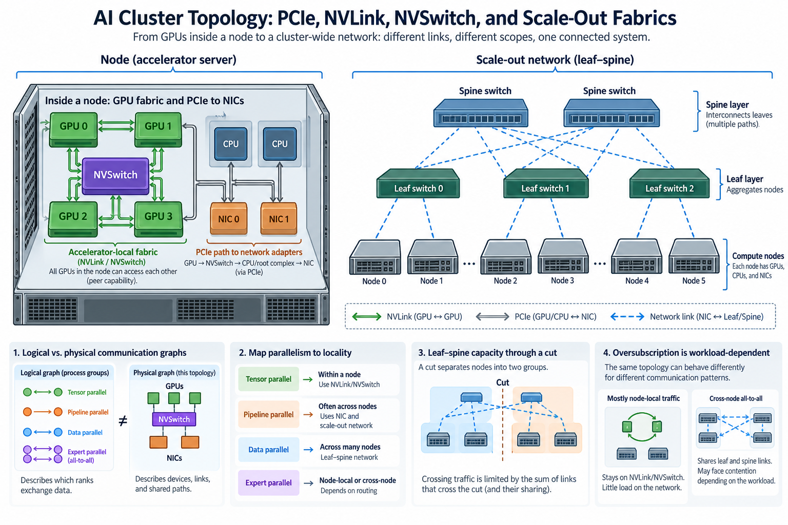
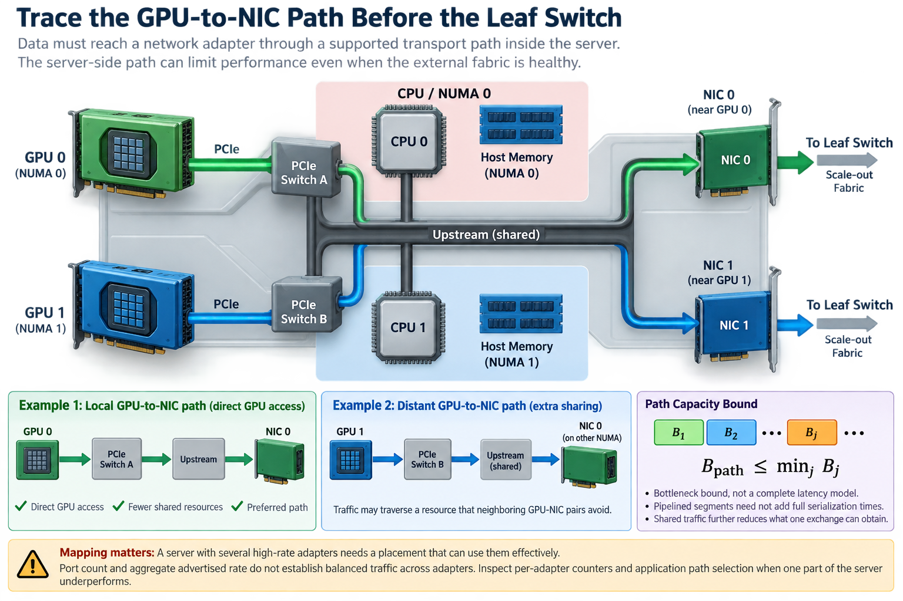
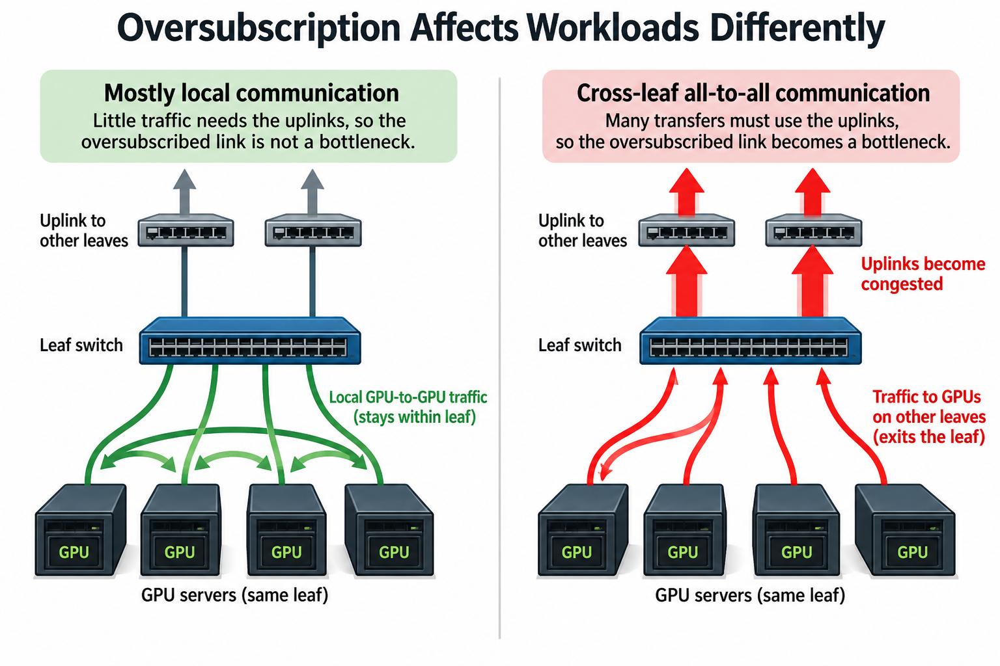
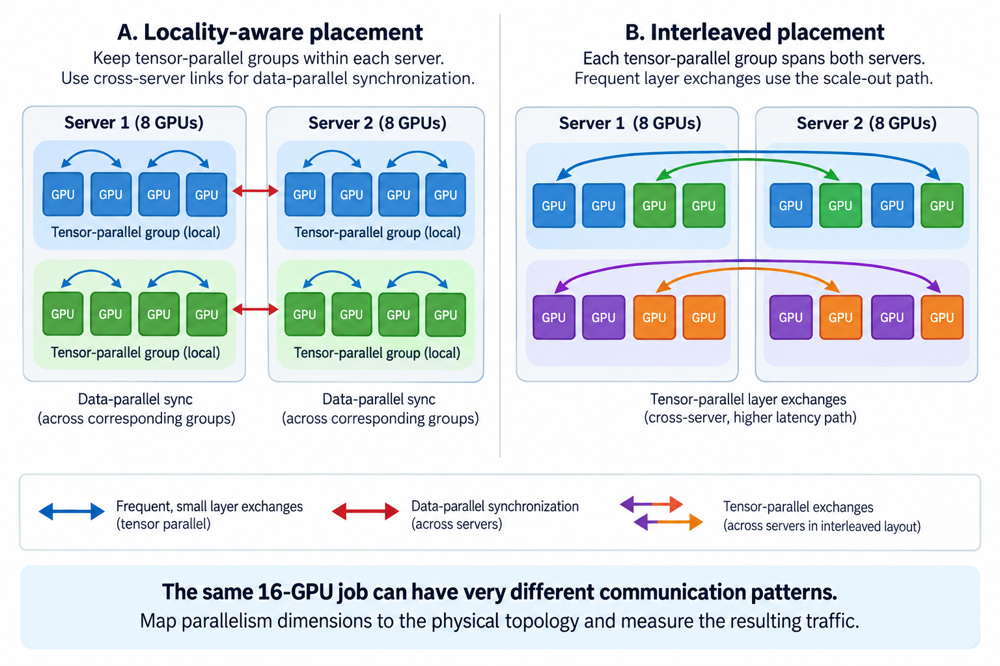

## Overview

A cluster topology is a map of communication opportunities and shared bottlenecks. Take 2 systems with the same accelerator count and network-adapter rate: they can deliver different distributed performance because their devices are connected differently. The job's process groups then determine which parts of that physical map carry the most traffic.

The useful engineering task is to connect a logical exchange to its actual path. A tensor-parallel all-reduce, pipeline boundary transfer, and expert all-to-all can stress different resources even when they run on the same devices. Topology-aware placement starts by identifying those 3 exchanges rather than treating every GPU pair as equivalent.

This article develops a method for drawing local and scale-out paths, deriving simple capacity bounds, and testing placement decisions. It avoids generation-specific link-rate claims: check product specifications and supported topologies for the actual platform. Numerical examples are illustrative traffic calculations.

## Deep dive

### 1. Separate the logical communication graph from physical links

The logical graph describes which ranks exchange data, how often, and how many bytes move, while the physical graph describes devices, switches, interface capacities, and shared paths, and the 2 maps do not line up by themselves, because rank numbering alone does not tell you where a process's GPU or network adapter is located.

For each important exchange, record its process group, tensor size, frequency, and readiness dependency, because tensor parallelism can require communication repeatedly inside a layer, pipeline parallelism sends intermediate representations across stage boundaries, data parallelism synchronizes gradients or sharded state, and expert parallelism redistributes tokens according to routing decisions, so those 4 dimensions do not stress the same resources.

A mapping function assigns each rank to a device and placement. The resulting physical traffic depends on both this assignment and the collective implementation. Different algorithms can route the same logical operation through different peers or use hierarchical phases.

Keep the 2 graphs visible during diagnosis. A topology diagram without a workload tells you where data could move, while a communication trace without placement tells you what moved logically. Their combination identifies which physical resources are likely to limit the job.

### 2. Draw the accelerator-local fabric first

Within a server or a supported accelerator domain, GPUs may communicate through dedicated accelerator links, a switching fabric, PCIe paths, or a combination. NVLink and NVSwitch describe NVIDIA accelerator interconnection technologies, but supported connectivity and bandwidth vary by platform and generation.

A fully connected-looking software view does not guarantee identical bandwidth for every pair, because traffic can cross different numbers of links or share switch resources, and a fabric can also provide strong aggregate capacity while a particular group uses only a subset of its available paths.

PCIe is another important local path. Devices can share downstream switches and upstream connections, and their relationship to CPU root complexes matters. A GPU and NIC located beneath the same switch can have a different path from devices connected through 2 separate CPU domains.

Discover the actual machine rather than guessing it from the GPU model name, and record GPU identifiers, PCI bus locations, NUMA relationships, and peer-access capabilities, because the same accelerator product can appear in systems with very different host and interconnect layouts.

### 3. Peer accessibility is a capability, not a benchmark result

A programming interface can report whether 1 device can access another device's memory under supported conditions. That capability does not tell you the achieved transfer bandwidth or guarantee that every application operation uses the intended direct path.

CUDA peer-access queries and related topology information are useful checks at this layer, where peer access, unified addressing, and allocation behavior have specific programming semantics, and an application still needs the appropriate setup and supported operations to use the capability.

Test representative transfers between relevant pairs and record the direction. A peer-access matrix says which relationships are supported; a bandwidth and latency matrix says how those relationships perform under a defined benchmark. The 2 matrices answer different questions.

Do not substitute a host-memory copy test for a device-to-device path test. Buffer location, transfer API, synchronization boundary, and process model affect what the experiment measures. Check those 4 details before blaming a surprising result on the physical interconnect.

### 4. Trace the GPU-to-NIC path before the leaf switch

Scale-out communication begins inside the source server, where data must reach a network adapter through a supported transport path, which may use direct GPU memory access or staging through host memory, so the server-side path can limit performance even when the external fabric is healthy.

Draw the GPU, its relevant PCIe or accelerator connections, the NIC, and the host NUMA domains. Include shared upstream links. If a GPU's preferred NIC is physically distant, traffic may cross a resource that neighboring GPU-NIC pairs avoid.

For a simplified path with required segments of available bandwidth B_j, a basic capacity bound is

$$
B_{\mathrm{path}}\le\min_j B_j.
$$

This is a bottleneck bound, not a complete latency model. Pipelined segments need not add their full serialization times, but no required bottleneck can sustain more traffic than its available capacity. Shared traffic further reduces what 1 exchange can obtain.

A server with several high-rate adapters therefore needs a mapping that can use them effectively, since port count and aggregate advertised rate do not guarantee balanced traffic across adapters, so inspect per-adapter counters and application path selection when 1 part of the server underperforms.

### 5. Model leaf-spine capacity through relevant cuts

A scale-out fabric commonly connects servers to leaf switches and leaves to a spine layer, but actual designs can include multiple planes, rails, tiers, and oversubscription. Identify the path and capacity available to the job rather than treating the fabric as 1 unlimited network cloud.

Let D_cut be the bytes that the chosen communication schedule must move across a particular cut of the topology. If that cut provides usable aggregate directional bandwidth B_cut, then

$$
t\ge D_{\mathrm{cut}}/B_{\mathrm{cut}}.
$$

For an illustrative cut requiring 64 GB of traffic with 400 GB/s available capacity, transfer time cannot be less than 0.16 seconds under that accounting. The calculation excludes startup and other delays, so it is a lower bound. If competing traffic consumes half the capacity, the corresponding bound becomes 0.32 seconds.

The cut must match the required direction and paths. Adding unrelated links elsewhere in the rack does not increase this cut's capacity. Likewise, a bidirectional total cannot be assigned entirely to traffic traveling 1 way. This method shows why an impressive aggregate fabric specification can coexist with a bottleneck for a particular placement.

### 6. Oversubscription is a workload-dependent constraint

A fabric is oversubscribed when its upstream capacity is smaller than the potential simultaneous demand from downstream connections. That ratio describes a capacity relationship, but the performance impact depends on which traffic actually crosses the constrained boundary.

For a simplified leaf with downstream capacity B_down and upstream capacity B_up, define

$$
\rho=B_{\mathrm{down}}/B_{\mathrm{up}}.
$$

A ratio greater than 1 indicates potential oversubscription under this definition. It does not mean every transfer slows by that factor. Communication staying within the leaf may avoid the uplinks, while cross-leaf all-to-all can stress them heavily.

Use the application's traffic matrix to estimate how much work remains local and how much crosses the boundary. Hierarchical algorithms and placement can reduce traffic over expensive cuts, but they may add other communication phases. Judge the net critical-path effect rather than tune 1 traffic count in isolation.

Measure under realistic multi-job conditions when the cluster shares fabric capacity. A single job's isolated benchmark can miss contention patterns created by neighboring jobs. Record placement and background-load conditions in reports so later comparisons remain meaningful.

### 7. Map parallelism dimensions onto locality deliberately

High-frequency communication is a strong candidate for the fastest local domain. Tensor parallelism often benefits from strong accelerator-local connectivity because exchanges can occur repeatedly inside each layer. Pipeline boundaries may carry larger activation messages less frequently, while data-parallel traffic depends on synchronization and sharding schedules, which is the comparison the 16-GPU example at the end of this section makes concrete.

These are starting hypotheses, not fixed placement rules, because a model with unusual layer sizes, limited local memory, or expert routing can change the best assignment, and memory capacity and pipeline balance can require crossing a boundary that communication locality alone would prefer to avoid.

For each candidate process mesh, count which exchanges cross which physical cuts. Compare expected traffic and frequency with measured link behavior. A mesh that minimizes 1 dimension's traffic can increase another's or leave compute stages imbalanced.

Record rank-to-device and rank-to-NIC mappings as part of the experiment. Keep the mapping available alongside every measured run. A process launcher or scheduler can change placement between run 1 and run 2 without changing application code. Without the mapping, a topology-sensitive regression can look nondeterministic and be hard to reproduce.

Consider a simplified 16-GPU job split across 2 servers with 8 GPUs each. A tensor-parallel group of 4 can remain within one server, while a data-parallel group can connect corresponding local groups across servers. An alternative interleaving places every tensor-parallel group across both servers and makes its frequent layer exchanges use the scale-out path. This example does not prove the first layout best, but it identifies a specific traffic difference to measure. Compare layer communication, synchronization tails, and memory feasibility before selecting the mapping.

### 8. Verify with a hierarchy of experiments

The hierarchy has 4 levels: start with topology discovery and capability checks, then measure representative device pairs and GPU-NIC paths, next run the relevant collective across the intended rank group, and finally measure the application timeline, because good isolated paths do not guarantee effective overlap or balanced readiness.

At each level, preserve message sizes, buffer location, directions, process count, and timing boundaries. Include both latency and large-message bandwidth where the workload needs them. A pair test with 1 large transfer cannot explain a collective dominated by many small rounds.

Inspect the slowest ranks and paths rather than reporting only the fleet average. A collective can wait for the last participant, so 1 degraded path can influence the entire group. Correlate per-rank completion with adapter counters and placement information.

Change placement while holding the logical workload fixed to test a topology hypothesis. If moving a group onto a stronger local domain improves the expected communication phase, the result supports the path explanation. Also inspect computation time so a placement benefit is not confused with a different CPU or memory bottleneck.

### 9. Maintain a topology record that operators can use

A useful record contains 6 things: physical device relationships, supported peer access, representative pair measurements, adapter mapping, relevant switch cuts, and the process meshes used by important jobs. Keep hardware and software versions beside the record, because drivers and communication libraries can change path behavior.

Annotate diagrams with usable measured capacities and assumptions rather than only product labels. State whether a number is per direction, per device, per link, or aggregate. Distinguish an observed result from a theoretical capacity bound and a vendor specification.

Recheck after hardware maintenance, scheduler changes, adapter configuration changes, and communication-library upgrades. A stale topology document can cause placement policies to preserve a locality assumption that the current cluster no longer satisfies.

## Conclusion

The essential method is to follow data from the producing GPU to its consumer and identify the resources it must share, since dedicated accelerator fabrics, PCIe locality, GPU-NIC paths, and scale-out cuts all 4 contribute, and topology-aware placement succeeds when the logical communication schedule fits the physical paths that the job actually receives.

### Sources

- [CUDA programming guide](https://docs.nvidia.com/cuda/cuda-c-programming-guide/index.html).
- [NVIDIA system topology commands](https://docs.nvidia.com/deploy/nvidia-smi/index.html).
- [NCCL troubleshooting: GPU direct and networking](https://docs.nvidia.com/deeplearning/nccl/user-guide/docs/troubleshooting.html).
