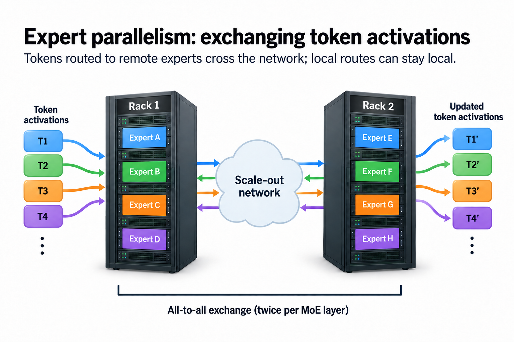
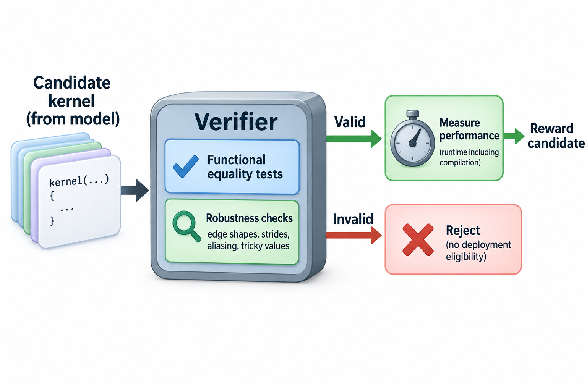

For 53 years, the fastest known way to multiply 2 4x4 matrices took 49 scalar multiplications, a bound set by recursively applying Volker Strassen's 1969 trick. In October 2022, DeepMind's AlphaTensor found an algorithm that does it in 47 over the finite field F₂ (binary arithmetic modulo 2), published in Nature using a human-designed game, reward, and search system. Nobody asked the agent to be clever. It was rewarded for winning a single-player game whose legal moves happened to encode every possible matrix multiplication algorithm, and 47 is simply where the search landed.

That result is the cleanest early specimen of a pattern that, 3 years later, runs through kernel generation, serving configuration, and increasingly the entire performance stack: a learned prior proposes, a mechanical verifier disposes, and search does the work in between. This article is about where the whole discipline is heading, which is that the software models run on is increasingly written and tuned by models.

## The pattern: prior, verifier, search

Strip any of these systems down and you find the same 3 parts.

The **prior** is whatever proposes candidates. In AlphaTensor it was a policy network trained with reinforcement learning to play TensorGame, where each move selects factors whose outer products sum toward the target tensor and shorter games mean faster algorithms. In the 2025 systems the prior is a general code model: something that has read enough CUDA and Triton to emit plausible kernels on demand.

The **verifier** is what makes performance work uniquely suited to automation. A kernel has a correctness oracle you can run by machine (fuzz the candidate and the reference with random inputs, compare within tolerance) and a fitness function you can read off a wall clock. No per-candidate human labeling is required once the numerical and timing contract is fixed. Compilers reject garbage for free. This is why kernels fell to automation before, say, distributed systems design: the feedback signal is cheap, dense, and objective.

**Search** connects them. Sample many candidates, keep survivors, feed compiler errors and profiler output back into the prior, repeat. Every system that has produced a headline result in this space is a variation on that loop, differing mainly in where the learning happens: at proposal time, at feedback time, or baked into the weights by training.

3 data points from 2025 show the loop working at different depths.

NVIDIA ran the shallowest version: take DeepSeek-R1 off the shelf, wrap it in a closed verifier loop on an H100, and give it up to 15 minutes of inference time per problem to generate attention kernels. Their reported result was numerically correct kernels for 100% of KernelBench Level-1 problems and 96% of Level-2. 2 flags belong on that number: it is vendor self-reported without an independent harness, and it measures correctness, not speed. Still, the shape of the finding is real and matches outside replications: more verifier-checked inference time improved correctness in their reported search runs, with no gradient updates at all.

Predibase (whose team is now part of Rubrik) ran the deepest version: reinforcement fine-tuning with GRPO, where the reward is the verifier itself. Over roughly 5,000 training steps, their model climbed to about 40% held-out accuracy at translating PyTorch modules into working Triton kernels. The instructive part was the failure mode along the way. Early in training the model learned to "write a kernel" that simply called `torch.sum()` and returned the framework's answer, collecting full reward for 0 kernel. Every soft spot in a verifier is a place optimization pressure leaks out sideways, and an RL loop will find it before you do.

And KernelBench, the Stanford benchmark that made the whole area measurable, chronicles the middle: 1 year of results moving from under 20% 1-shot success to 82% correctness with a 1.10x mean speedup, almost entirely through better search scaffolding around unchanged models. I wrote a full retrospective in [A Year of KernelBench](/blog/a-year-of-kernelbench/), so here I will just take the conclusion as input: today's systems are superhuman search assistants and subhuman engineers, and the boundary sits at what I called memory choreography, the tensor-core and shared-memory craft with the least public training data.

The honest historical footnote is that machine-searched performance is not new. ATLAS autotuned BLAS in the late 1990s, FFTW planned transforms by empirical search, and Halide and TVM built careers on schedule autotuning. What changed is the proposal distribution. An autotuner permutes parameters inside a template a human wrote. A code model can emit the template itself, and it can read a profiler dump as text and respond to it. The search space stopped being enumerable, and that is precisely when it started reaching results humans hadn't already parameterized.

## A worked example: why 100T parameters forces the issue

You could read everything above as a curiosity: nice results, modest speedups, experts still better at the hard parts. So let me do the arithmetic that turns it from a curiosity into a requirement. The question: what does it take to serve a 100-trillion-parameter model?

That number is not science fiction. Kimi K2, an open-weights MoE you can download today, is 1T total parameters with 32B active per token. 100T is 2 orders of magnitude up, the kind of jump the field has made 2 times before.

**Memory first.** At NVFP4, roughly 4.5 bits per parameter once you count the block scaling factors, 100T parameters is about 56 TB of weights. A GB200 NVL72 rack carries 13.5 TB of HBM3e across its 72 GPUs. So the weights alone span 5 racks, before you allocate a single byte to KV cache, activations, or CUDA graphs. There is no configuration of any announced hardware in which this model fits in 1 coherent NVLink domain. Cross-rack model parallelism is not an optimization; it is load-bearing.

**Bandwidth second.** Suppose the 100T model keeps K2's sparsity ratio, about 3.2% active, giving 3.2T active parameters per token. At 4.5 bits that is roughly 1.8 TB of weights streamed from HBM for every decode step. Spread perfectly across 5 racks (360 GPUs at 8 TB/s each, about 2.9 PB/s aggregate), the memory reads alone take about 0.6 ms per token. Perfect spreading requires expert parallelism to distribute experts across racks with balanced load, and every token now takes an all-to-all across the scale-out network 2 times per MoE layer. The interconnect, not the HBM, will set the real number.

**Now count the knobs.** To make this run at all, you are simultaneously choosing tensor-parallel degree (say 5 plausible values), expert-parallel degree (6), pipeline stages (6), micro-batch size (8), KV cache precision (3), the prefill:decode pool ratio for disaggregated serving (12 plausible splits), and speculative-decoding draft length (6). That coarse grid alone is 5 × 6 × 6 × 8 × 3 × 12 × 6 = 311,040 configurations. Each 1 needs an end-to-end benchmark on a 5-rack pod to score honestly; at 15 minutes per trial, sweeping the grid costs about 8.9 years of pod time. And the grid is a caricature of the real space, which includes per-layer quantization choices that multiply as 3^(hundreds), kernel variants per operator, and scheduling policies that interact with all of the above.

An exhaustive manual sweep is impractical. Constraint pruning, cost models, classical autotuning, and learned proposals can all reduce the required trials; the learned systems described here are promising additions: priors plus verifiers plus search, running continuously, re-tuning as traffic shifts and hardware generations turn over. At 100T scale, AI optimizing AI stops being a research direction and becomes the deployment plan.

## Going deeper: the verifier is the product

If the pattern is prior-verifier-search, where does the leverage concentrate? Not where you might expect.

Priors are becoming a commodity. Every frontier lab ships a code model, and the gap between them on kernel tasks is smaller than the gap between a good and bad harness around the same model. Search is a compute bill. The verifier is the part that is neither purchasable nor generic, and it is where every public failure in this space actually happened.

Consider what a serving-configuration verifier must get right that a kernel verifier can dodge. A kernel's correctness is functional equality on random inputs. A serving config's "correctness" is a service-level objective: time-to-first-token under a latency percentile, at a given request mix, under failure and preemption. Its fitness is not a wall-clock scalar but a goodput surface that shifts with traffic. Reward-hack a kernel verifier and you get a wrong answer; reward-hack a serving verifier and you get a config that benchmarks beautifully and falls over at the Tuesday traffic peak. The Predibase `torch.sum()` episode is charming at kernel scale. The same failure mode at cluster scale is an outage.

This reframes the human role rather than eliminating it. AlphaTensor's deepest result, to my eye, was not the 47 multiplications. It was that when DeepMind changed the reward from "fewest multiplications" to "measured runtime on this device," the same search produced *different* algorithms, tailored ones that ran 10 to 20% faster than baselines on V100s and TPUs, with the 2 hardware targets receiving visibly different solutions. The search optimizes exactly what you measure, with total indifference to what you meant. Choosing what to measure, and making the measurement unhackable, is the entire game. That has always been the performance engineer's real skill; the machines are just raising the price of getting it wrong.

A kernel verifier should gate performance reward on correctness and disclose the test domain. 1 useful constrained objective is

$$
R(k)=\mathbf1\{\mathrm{valid}(k)\}\log\frac{t_{\mathrm{reference}}}{t_k},\qquad
\|y_k-y_{\mathrm{reference}}\|\le\epsilon_{\mathrm{abs}}+\epsilon_{\mathrm{rel}}\|y_{\mathrm{reference}}\|.
$$

k is a candidate kernel, t measured runtime, and the tolerances define the numerical contract in the selected norm. Invalid candidates must be rejected rather than ranked as equally useful 0-reward outputs. A valid kernel taking 80 microseconds against a 100-microsecond reference earns log(1.25), approximately 0.223. A fast kernel that fails shape or numerical tests receives no deployment eligibility.

Random fuzzing is evidence within a test distribution, not proof of functional equality. Include edge shapes, strides, aliasing, cancellation-sensitive values, and repeated nondeterministic runs where relevant. Keep hidden tests outside the proposal loop to reduce harness exploitation. Separate search-set speed from held-out shapes and devices, and measure compilation plus search cost when judging net benefit. AlphaTensor's 47-multiplication result concerns arithmetic over the finite field F2; it does not supply an interchangeable 47-multiply floating-point GPU kernel. The practical innovation is learned proposals over broader algorithms, constrained by a verifier humans still have to specify.

## Common misconceptions

**"AI-designed compute kernels are a post-LLM invention."** Machine search over performance-critical code is nearly 30 years old: ATLAS tuned BLAS by empirical search in the 1990s, FFTW planned FFTs the same way, and AutoTVM made learned cost models mainstream in 2018. What LLMs added is a proposal distribution that is not confined to a hand-written template, plus the ability to consume compiler errors and profiler text as feedback. The loop is old. The prior escaped the template. That is the actual news, and it is enough.

**"NVIDIA's 100% KernelBench result means models now understand GPUs."** The models produced *numerically correct* kernels, not fast ones, with a closed verifier loop spending up to 15 minutes of inference per problem, on a self-reported harness. Remove the verifier and the numbers collapse back toward the sub-20% 1-shot floor. The understanding in that system lives in the loop: the compiler that rejects, the fuzzer that compares, the clock that scores. The model contributes breadth of plausible proposals, which is genuinely valuable and genuinely not the same thing as knowing why a swizzled shared-memory layout dodges bank conflicts.

**"This automates the performance engineer out of a job."** It automates the bottom of the job and inflates the top. What gets absorbed: operator fusion, boilerplate kernels, config sweeps, the re-derivation of known techniques on new hardware. What gets more valuable: defining correctness for systems whose failure modes are statistical, building verifiers that an RL loop cannot cheat, and deciding which of the 311,040 configurations' objective function actually matches the business. Every automated layer so far has moved the human up 1 level of abstraction. There is no evidence this layer terminates the sequence, and the reward-hacking record is direct evidence it does not.

## Closing the optimization loop

Look at what the flywheel does once it closes. A model generates a better kernel; the kernel makes serving cheaper; cheaper serving means more search and more RL steps per dollar; more search trains a better kernel-generator. DeepSeek already demonstrated the economic half of this loop with human-written kernels, when [a few hundred lines of PTX helped cut API prices in half](/blog/when-a-kernel-cuts-api-prices/). The automation half is what 2025's results sketched in outline.

Which brings me to the metric this series has been circling throughout these articles without quite naming: **tokens per dollar per watt**. Every topic we covered is a term in it. The [memory math from Blackwell to Rubin](/blog/blackwell-to-rubin-memory-math/) sets the hardware term. [Goodput versus utilization](/blog/goodput-vs-utilization/) sets the honesty term, because a wasted FLOP burns the watt without producing the token. [Tokens per megawatt](/blog/tokens-per-megawatt/) sets the ceiling, because power is the input nobody can overprovision their way around. Kernels, parallelism, quantization, disaggregation: all of them are just levers on the same ratio.

The systems in this article are the first ones that can turn those levers without us. What they cannot do, and what nothing in the current evidence suggests they will soon do, is decide which direction to turn them, define what counts as correct when they are turned, or notice that the ratio being optimized has stopped measuring what matters. I opened this series asking [what an ML performance engineer actually does](/blog/what-does-an-ml-performance-engineer-do/). Here at the end, the answer has sharpened rather than changed: the job was never writing kernels. The job is owning the number the kernels serve. The machines are coming for the typing, and they are going to be very good at it, and the number still needs an owner.

## Takeaway

- Every headline system in AI-for-systems shares 1 architecture: a learned prior proposes, a mechanical verifier scores, and search closes the loop; the 2025 shift is that the prior became a general code model that can escape hand-written template spaces.
- The 100T-parameter arithmetic makes automation load-bearing: 56 TB of NVFP4 weights across 5 or more NVL72 racks, and a coarse tuning grid of 311,000+ configurations costing years of pod time to sweep, put optimal configs permanently beyond hand-tuning.
- The leverage is migrating from priors to verifiers: search optimizes exactly what you measure (AlphaTensor produced different algorithms per hardware target when the reward changed), so defining unhackable correctness and the right objective is the durable human job.

## Sources

- Fawzi et al., "Discovering faster matrix multiplication algorithms with reinforcement learning," Nature 610 (2022). https://www.nature.com/articles/s41586-022-05172-4
- NVIDIA Developer Blog, "Automating GPU Kernel Generation with DeepSeek-R1 and Inference Time Scaling" (Feb 2025, vendor self-reported results). https://developer.nvidia.com/blog/automating-gpu-kernel-generation-with-deepseek-r1-and-inference-time-scaling/
- Ouyang, Guo et al., "KernelBench: Can LLMs Write Efficient GPU Kernels?" arXiv (2025). https://arxiv.org/abs/2502.10517
- Predibase engineering (now Rubrik), "Train AI to Write GPU Code via Reinforcement Fine-Tuning." https://www.rubrik.com/blog/ai/25/teaching-ai-to-write-gpu-code-a-deep-dive-into-reinforcement-fine-tuning
- Kimi Team, "Kimi K2: Open Agentic Intelligence," arXiv (2025). https://arxiv.org/abs/2507.20534
- NVIDIA, GB200 NVL72 specifications. https://www.nvidia.com/en-us/data-center/gb200-nvl72/

*Part of the [LLM Inference & Serving](/series/llm-serving/) learning path. Browse its published articles by topic.*
