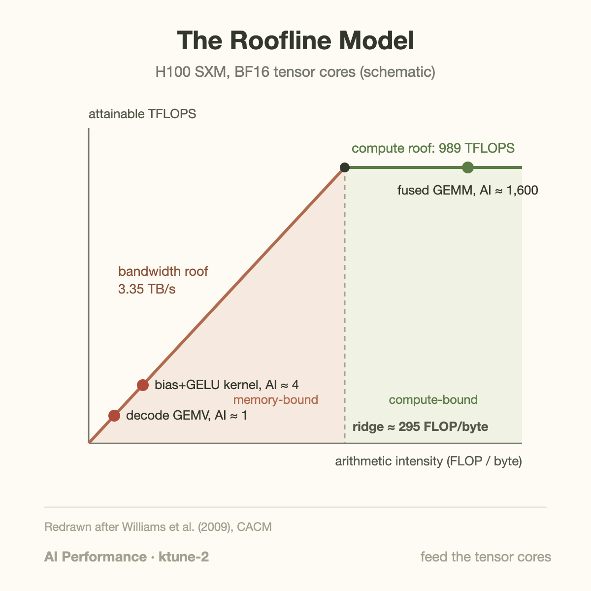
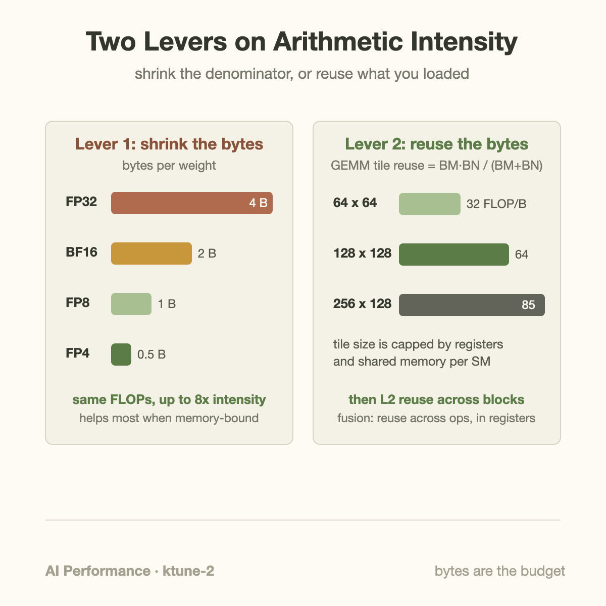
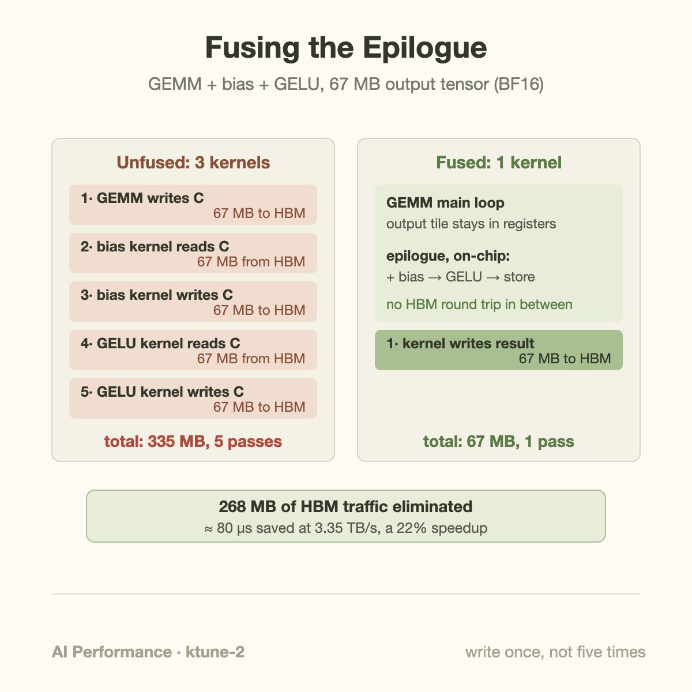

An H100 SXM can execute 989 trillion dense BF16 tensor-core operations per second, but its HBM3 can deliver only 3.35 terabytes in that same second. Divide the two and you get the single number that governs almost every kernel you will ever profile: about 295. A kernel that performs fewer than roughly 295 floating-point operations per byte it moves to or from HBM *cannot* be compute-bound on this GPU. No amount of instruction-level cleverness changes that; the memory system simply cannot feed the math units fast enough.

That ratio has a name: **arithmetic intensity** (AI), measured in FLOPs per byte. Every kernel has one, and comparing it against the hardware's ratio tells you which resource you'll run out of first. The comparison is usually drawn as the **roofline model**, introduced by Williams, Waterman, and Patterson in 2009: attainable throughput plotted against arithmetic intensity. On the left, a diagonal roof whose slope is memory bandwidth — double your intensity, double your throughput. On the right, a flat roof at peak FLOPS. The corner where they meet is the **ridge point**, and on an H100 running BF16 it sits near 295 FLOP/byte. For FP8, peak doubles to 1,979 TFLOPS while bandwidth stays put, so the ridge moves out to about 590. Faster math makes it *harder* to be compute-bound, not easier.

## Where LLM kernels actually sit

The uncomfortable truth about transformer inference is how much of it lives far left of the ridge.

**Big prefill GEMMs are fine.** Multiply an 8192×4096 activation matrix by a 4096×4096 weight matrix in BF16. That's 2·8192·4096·4096 ≈ 275 GFLOP against a compulsory 168 MB of traffic (both inputs read once, output written once), an intensity around 1,600 FLOP/byte. Comfortably right of the ridge; the tensor cores are the bottleneck, exactly where you want it.

**Elementwise kernels are hopeless.** A standalone GELU kernel does maybe 15 FLOPs per element while reading 2 bytes and writing 2 bytes. Intensity: under 4 FLOP/byte. Sitting on the bandwidth roof, its attainable throughput is 3.35 TB/s × 3.75 ≈ 12.6 TFLOPS. That's 1.3% of peak, and no optimization *inside* the kernel will improve it, because the kernel is already doing everything HBM allows.

**Batch-1 decode is the worst case.** A GEMV touches every weight once and does 2 FLOPs per 2-byte weight: intensity ≈ 1. Attainable throughput: 3.35 TFLOPS, or 0.3% of the machine you paid for. This is the arithmetic behind the [memory wall](/blog/the-memory-wall-latency-numbers/) as it applies to decoding, and it's why [tokens-per-second numbers hide so much](/blog/tokens-per-second-what-it-hides/): decode speed is a bandwidth measurement wearing a compute costume.

Given a kernel stuck on the bandwidth roof, you have exactly two levers, and both operate on the denominator:

1. **Shrink the bytes.** Quantize. FP32 → BF16 halves weight traffic; FP8 halves it again; FP4 once more. An 8× reduction in bytes is an 8× increase in intensity for the same math.
2. **Reuse the bytes.** Once data is on-chip — in registers, shared memory, or L2 — do more work with it before letting go. Fusion and tiling are both this lever in different clothes.

## A worked example: fusing bias + GELU into a GEMM

Take the GEMM above (M=8192 tokens, K=N=4096, BF16) followed by a bias add and a GELU, the standard first half of an MLP block. The output tensor C is 8192×4096 elements × 2 bytes = 67 MB. Run it naively as three kernels and count the HBM round trips on that tensor:

| Pass | Operation | HBM traffic |
|---|---|---|
| 1 | GEMM writes C | 67 MB write |
| 2 | bias kernel reads C | 67 MB read |
| 3 | bias kernel writes C | 67 MB write |
| 4 | GELU kernel reads C | 67 MB read |
| 5 | GELU kernel writes C | 67 MB write |

Five passes, 335 MB of traffic, on a tensor that only needed to be written once. (The 8 KB bias vector is a rounding error.)

Now fuse. Every modern GEMM library supports an **epilogue**: after the main K-loop finishes, each output tile is still sitting in registers, and you apply the bias and the activation right there before storing. The fused kernel writes C exactly once: 67 MB. Four HBM passes — 268 MB — vanish.

Put times on it. The GEMM's math takes 275 GFLOP ÷ 989 TFLOPS ≈ 278 µs at peak. The two elementwise kernels each move 134 MB at 3.35 TB/s, about 40 µs apiece, so the unfused pipeline runs ≈ 358 µs. The fused version runs ≈ 278 µs, because the epilogue math is measured in microseconds against operands already in registers. That's a 22% end-to-end speedup from deleting memory traffic, without making any individual kernel faster. You also drop two kernel launches, which matters more than you'd think at decode batch sizes.

This is the same move FlashAttention makes at larger scale: instead of materializing the S = QK^T attention matrix to HBM and reading it back for the softmax and the V multiply, it tiles the whole computation so the intermediate never leaves SRAM. Dao et al. report the exact-attention kernel runs up to 3× faster on GPT-2 not by reducing FLOPs (it actually recomputes some) but by cutting HBM traffic. Trading spare FLOPs for scarce bytes is the canonical intensity play.

## Going deeper: tiling, CUTLASS, and a PTX trick

Fusion removes redundant traffic *between* kernels. Tiling removes it *inside* one, and the math is worth doing once by hand.

A GEMM thread block computing a BM×BN output tile loops over K, loading a BM×BK slab of A and a BK×BN slab of B into shared memory each iteration. Per iteration it moves 2·(BM+BN)·BK bytes and computes 2·BM·BN·BK FLOPs, so the shared-memory-level intensity is BM·BN/(BM+BN) FLOP/byte. The formula rewards fat tiles: 64×64 gives 32, 128×128 gives 64, 256×128 gives 85. This is precisely why GEMM kernels fight so hard for registers and shared memory — tile size *is* arithmetic intensity, and the ceiling is on-chip storage.

Notice, though, that even 85 is below the 295 ridge. Grid-level traffic tells you why the kernel still hits peak: with 128×128 tiles, every A tile is re-fetched by N/BN = 32 column blocks and every B tile by M/BM = 64 row blocks, so naive HBM traffic would be about 4.3 GB, not 168 MB. The L2 cache absorbs the difference. Our entire 34 MB B matrix fits in H100's 50 MB L2, and block-scheduling tricks (CUTLASS calls its version threadblock rasterization/swizzling) order tiles so neighboring blocks hit the same cached slabs. The reuse hierarchy stacks: registers reuse within a fragment, shared memory within a block, L2 across blocks, and only the leftovers touch HBM.

You don't hand-write this machinery anymore. NVIDIA's CUTLASS templates expose tile shapes, epilogues, and scheduling as compile-time parameters and routinely land within a few percent of cuBLAS. But the frontier still has room for hand tuning: DeepSeek's DeepGEMM, the FP8 GEMM library behind their V3/R1 serving stack, uses an inline-PTX load — `ld.global.nc.L1::no_allocate.L2::256B` — that reads through the non-coherent path *without allocating in L1*. Streamed GEMM operands are used once per pass and would only pollute L1, whose capacity is shared with the shared-memory budget the tiles depend on; skipping the allocation buys measurable extra sustained bandwidth. (The repo flags the instruction as behaving correctly on tested Hopper parts but not architecturally guaranteed, which tells you something about how far serious teams will go for bytes.) That one trick, plus careful tiling, is part of how a [kernel-level effort ended up cutting API prices](/blog/when-a-kernel-cuts-api-prices/).

The precision lever compounds with all of this. Moving weights from BF16 to FP8 doubles the intensity of every weight-bound kernel before you touch a line of scheduling code, which is the systems argument underneath the [4-bit format war](/blog/nvfp4-vs-mxfp4-the-4bit-format-war/): FP4 isn't primarily about faster multipliers, it's about a 4× denominator cut on kernels that live left of the ridge.

## Common misconceptions

**"My kernel is memory-bound, so I need a GPU with more bandwidth."** Sometimes. But first check whether the *traffic itself* is necessary. The unfused pipeline above was memory-bound at 335 MB; the fused one was compute-bound at 67 MB. Nsight Compute will happily report the elementwise kernels at 95%+ of DRAM bandwidth, i.e., perfectly "optimized," while the correct fix is for them not to exist. The roofline bounds a kernel *given its traffic*; changing the traffic changes the roofline you're under.

**"Tensor core utilization is 5%, so the kernel is badly written."** A decode GEMV at intensity ≈ 1 has an *attainable* ceiling of 0.3% of peak FLOPS. If it's achieving that, it is a perfect kernel, and the 5% number is telling you about the workload, not the code. Judge kernels against their roofline position, not against peak. This is the same reasoning error, one level down, as [judging clusters by utilization instead of goodput](/blog/goodput-vs-utilization/).

**"Quantization helps because low-precision math is faster."** For memory-bound kernels the FLOPS rate is nearly irrelevant; the win is that the bytes shrink. Weight-only quantization schemes exploit this directly: store weights in INT4 or FP4, dequantize on-chip, and run the actual multiply in BF16. The math got *slower* per element and the kernel got 3-4× faster, because decode-time GEMVs are billed in bytes, not FLOPs.

## The bigger picture

Arithmetic intensity is the quantitative core of the discipline. The [memory wall](/blog/the-memory-wall-latency-numbers/) says compute has outrun memory for thirty years; the roofline turns that history into a per-kernel verdict, and the FLOPs-to-bandwidth ratio keeps drifting the wrong way with each generation ([Blackwell to Rubin included](/blog/blackwell-to-rubin-memory-math/)). Nearly every technique in this series is one of the two levers in disguise. KV caching, paged attention, prefill/decode disaggregation: reuse or reorganize bytes. FP8 training, FP4 inference, weight-only quantization: shrink bytes. Batching is the lever applied to weights: serve 64 requests per weight load and decode intensity rises 64×. Before profiling any kernel, compute its intensity on a napkin and place it on the roofline. Thirty seconds of division tells you whether to reach for fusion and tiling or to accept the bandwidth bound and shrink the bytes instead.

## Takeaway

- Arithmetic intensity (FLOPs per HBM byte) versus the hardware ridge point (~295 FLOP/byte for H100 BF16, ~590 for FP8) determines a kernel's speed limit before you write a line of code; elementwise ops (~4) and batch-1 GEMVs (~1) can never be compute-bound.
- Only two levers exist: shrink bytes (BF16→FP8→FP4 cuts weight traffic 2-8×) or reuse bytes (fusion keeps intermediates in registers, tiling gives BM·BN/(BM+BN) reuse, L2 catches the rest). The bias+GELU fusion deleted 268 MB of traffic and 22% of runtime without speeding up any math.
- Judge kernels by distance to *their* roofline, not by utilization of peak; a "perfectly optimized" kernel may be one that shouldn't exist, and a 0.3%-of-peak GEMV may be unimprovable.

When calculating intensity, write down which memory boundary you are measuring. Bytes moving between registers and shared memory are different from bytes crossing the HBM interface. A tile may have high reuse inside a block while neighboring blocks still load overlapping data from HBM. Cache behavior can change the observed traffic without changing the source code operation count. Compare an analytical byte estimate with profiler counters before drawing a conclusion. If they disagree, investigate reuse, write allocation, precision conversions, and intermediate tensors. The useful diagnosis identifies the boundary that limits the measured workload, together with the assumptions behind the estimate.

## Sources

- Williams, Waterman, Patterson, "Roofline: An Insightful Visual Performance Model for Multicore Architectures," CACM 2009. https://doi.org/10.1145/1498765.1498785
- NVIDIA H100 Tensor Core GPU specifications (989 TFLOPS dense BF16, 3.35 TB/s HBM3, 50 MB L2 for SXM). https://www.nvidia.com/en-us/data-center/h100/
- NVIDIA Deep Learning Performance Guide, "Matrix Multiplication Background." https://docs.nvidia.com/deeplearning/performance/dl-performance-matrix-multiplication/index.html
- NVIDIA CUTLASS (tile shapes, epilogue fusion, threadblock rasterization). https://github.com/NVIDIA/cutlass
- DeepSeek DeepGEMM, FP8 GEMM library with the `ld.global.nc.L1::no_allocate.L2::256B` load path. https://github.com/deepseek-ai/DeepGEMM
- Dao et al., "FlashAttention: Fast and Memory-Efficient Exact Attention with IO-Awareness," 2022. https://arxiv.org/abs/2205.14135

*Part of the **AI Performance Engineering** series. Previously: [A Year of KernelBench](/blog/a-year-of-kernelbench/) on whether LLMs can write these kernels themselves; next: reading warp stalls in Nsight Compute to find out which roof you're actually under.*
