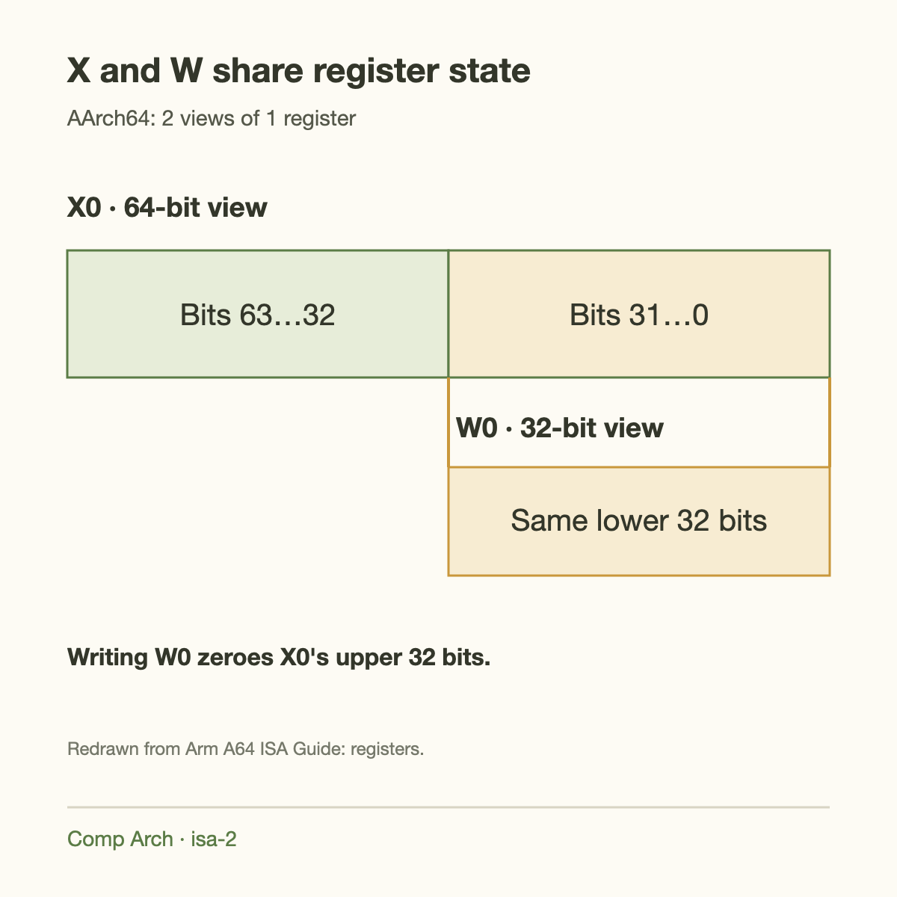
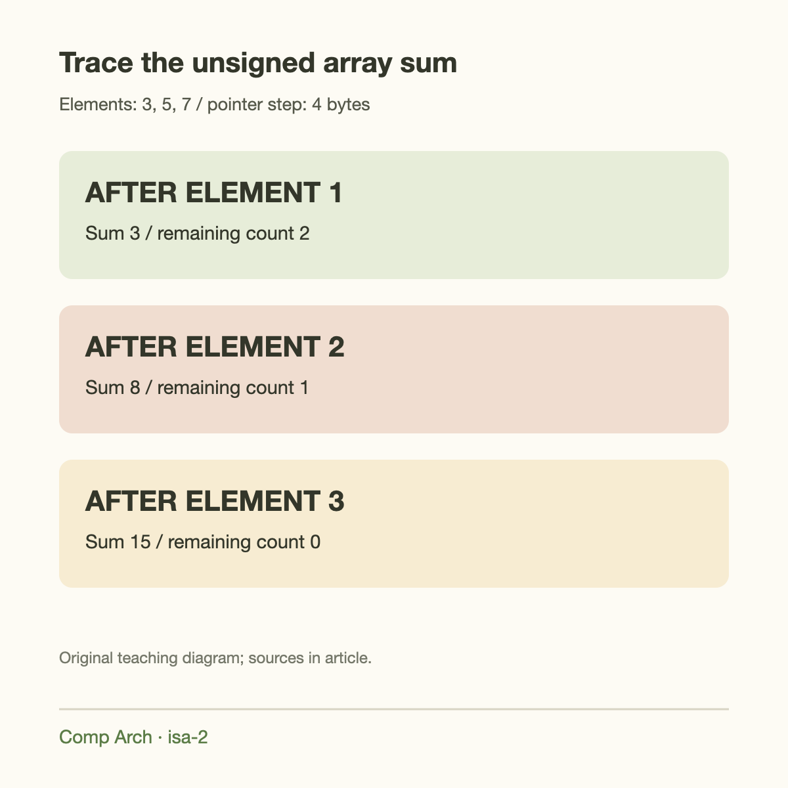
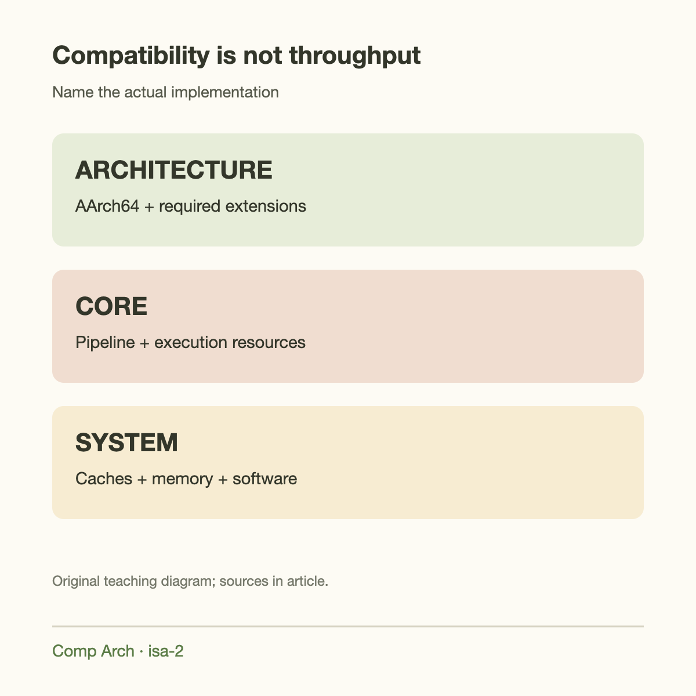

31 general-purpose integer registers form the visible working set of AArch64 assembly. Their names are familiar enough to read a short function: `x0` through `x30` for 64-bit operands, with corresponding `w` names for 32-bit operands. The processor ecosystem built around that model ranges from compact devices to servers, but the register names do not tell you how fast a particular core will run.

This article introduces Arm through the AArch64 programmer's model rather than through product rankings. We will read a small array-sum function, trace its state, and explain how Arm architecture, implementation, and software conventions fit together.

Read [the ISA contract article](../instruction-sets-software-hardware-contract/) first. Its architecture-versus-microarchitecture distinction is essential here: AArch64 specifies software-visible behavior, while a particular CPU core supplies the pipeline and execution machinery.

## Arm, AArch64, and A64 name different things

Arm is the organization and architecture ecosystem. AArch64 is the 64-bit execution state introduced in the Armv8 architecture family. A64 is the instruction set used in that execution state. The terms often appear together, but they are not interchangeable with a specific processor model.

AArch32 names a different execution state with 32-bit architectural registers and its associated instruction sets. Older Arm software and some embedded targets use different instruction-set details from the A64 examples here. Do not assume an instruction tutorial for 1 state applies unchanged to another.

Architecture revisions and optional features also matter. Supporting AArch64 does not mean a processor implements every later extension. A program using scalable vector instructions, cryptographic instructions, or specialized matrix features needs the corresponding hardware and software support.

For a deployment, name the relevant architecture features and the actual CPU implementation. “Arm server” alone omits core count, clock behavior, caches, memory channels, and vector capabilities—the details that determine many workload outcomes.



*Redrawn from [Arm A64 ISA Guide, register model](https://documentation-service.arm.com/static/674d8b61c7fc0d1f211dc776).*

## X and W are views of the same register

`x0` and `w0` refer to the same architectural register, with different operand widths. `x0` names its full 64-bit value. `w0` names the lower 32 bits. They are not 2 independently stored software values.

Writing a W register sets the corresponding X register's upper 32 bits to 0. For example, suppose `x0` initially contains hexadecimal `ffffffff00000001`. Executing a 32-bit operation that writes the value 7 to `w0` leaves `x0` equal to `0000000000000007`.

This rule is useful when translating unsigned 32-bit computations or loading narrow values. It also creates mistakes when someone expects a W-register write to preserve the upper half. Width is part of the instruction's semantics and must be read alongside its mnemonic.

Signed extension requires an operation that supplies it. A 32-bit value representing minus 1 has lower bits `ffffffff`; simply zero-extending that bit pattern to 64 bits gives 4,294,967,295. Sign extension instead gives the full 64-bit 2's-complement pattern for minus 1.

## SP and the 0 register need context

The stack pointer, `sp`, is architectural state with restricted instruction uses. The 0 register reads as 0 and discards written results. Its 64-bit assembly name is `xzr`; its 32-bit name is `wzr`.

Encoding space is reused: register field 31 can mean SP or the 0 register depending on the instruction and operand position. That does not create an ordinary general-purpose `x31` holding arbitrary values. Read the assembly operand and the instruction's allowed forms.

The 0 register makes some operations convenient without requiring a stored constant. An instruction can compare a value by discarding a subtraction result, or construct a value using 0 as an operand. Assembly aliases can hide these underlying forms.

The program counter is not another freely interchangeable X register. Branches control instruction flow through their defined operations. The link register convention uses `x30` to hold a return address for ordinary function calls, but architectural control flow and ABI conventions still deserve separate explanations.

## Loads and stores make memory access explicit

A64 is commonly described as a load/store instruction set because ordinary integer arithmetic operates on registers while dedicated instructions move data to and from memory. For example:

```asm
ldr w3, [x0]       // load 4 bytes into a 32-bit operand
add x2, x2, x3     // add the zero-extended loaded value
str x2, [x4]      // store 8 bytes
```

The base address is held in a 64-bit register even when the loaded value is 32 bits. The brackets indicate an address calculation, not a pointer dereference performed by the assembler. The CPU computes the address during execution and checks the relevant memory rules.

Addressing modes can include offsets or update a base pointer. We will use explicit pointer addition in the worked loop so each state change is easy to trace. Optimized compilers may choose shorter forms, vectorize, or transform the loop entirely.

A load does not state where the bytes physically reside. They may come from a cache, system memory, or a permitted device mapping. The same instruction can therefore have very different latency depending on the address and memory hierarchy.

## A complete small array-sum function

Consider summing `n` unsigned 32-bit integers into an unsigned 64-bit result. Under the ordinary AAPCS64 integer/pointer convention, our function receives the array pointer in `x0` and count in `x1`, and returns its result in `x0`.

```asm
sum_u32:
    mov x2, #0
    cbz x1, done
loop:
    ldr w3, [x0]
    add x2, x2, x3
    add x0, x0, #4
    sub x1, x1, #1
    cbnz x1, loop
done:
    mov x0, x2
    ret
```

Assume the pointer addresses a valid readable array of `n` elements and the environment follows the selected ABI. The function uses caller-saved registers only and does not call another function, so it need not save a return address or establish a stack frame for this example.

`mov` is an assembly alias with instruction-specific encodings; it is a convenient human representation. `cbz` branches when its register is 0, while `cbnz` branches when nonzero. `ret` uses the ordinary return-address role of `x30` unless another operand is specified.

The function is pedagogical rather than performance-tuned. Its scalar dependency chain and branch per element make it a useful foundation for later discussions of SIMD, branch prediction, and loop transformations.



## Trace 3 elements by hand

Suppose memory at `0x1000` contains the little-endian 32-bit values 3, 5, and 7. Entry state is `x0 = 0x1000`, `x1 = 3`, and `x30` contains the caller's return address.

After initialization, `x2 = 0`. The first iteration loads 3 into `w3`, which makes `x3 = 3`. It adds that value to `x2`, advances `x0` to `0x1004`, and decreases `x1` to 2. The nonzero count sends execution back to the loop.

The second iteration produces `x2 = 8`, pointer `0x1008`, and count 1. The third produces `x2 = 15`, pointer `0x100c`, and count 0. Execution falls through to `done`, copies 15 into `x0`, and returns.

For `n = 0`, the branch skips all loads and returns 0. That detail matters: a 0-length input should not force a memory access through a pointer that the function never needed to dereference. The trace also explains why pointer increments use 4 bytes even though the accumulator uses a 64-bit register.


The loop has a useful invariant that verifies more than the final answer. Let $$p$$ be the initial byte address, $$n$$ the initial element count, and $$a_i$$ the unsigned 32-bit element at address $$p+4i$$. After $$k$$ completed iterations,

$$
x_0=p+4k,\qquad x_1=n-k,\qquad
x_2=\left(\sum_{i=0}^{k-1}a_i\right)\bmod 2^{64}.
$$

Assume valid readable memory for all elements, no concurrent modifications, and pointer arithmetic within the mapped address range. The empty sum is 0. For values 3, 5, and 7 after 2 iterations, the pointer has advanced 8 bytes, the count is 1, and the accumulator is 8. Loading the final element produces 15 and terminates. Unsigned modular addition explains behavior when a much larger sum exceeds the 64-bit range; it is not an arbitrary-precision result.

The method is to verify initialization, preservation across the load/add/pointer/count sequence, and termination at 0. Post-indexed addressing can combine memory access and pointer update in another encoding, reducing architectural instruction count, but that does not establish a cycle saving on every implementation. The core may decompose that instruction into internal operations, and the accumulated sum retains a true dependency. This separates an ISA-level correctness improvement in expression from a microarchitecture-dependent performance claim. Benchmark both versions with equal alignment, memory residency, and calling convention before choosing 1.


## Count instructions without confusing count and speed

On the nonzero path, this source has 2 setup instructions, 5 loop instructions per element, and 2 completion instructions. For 3 elements, that is 19 dynamically executed assembly instructions, assuming each shown line maps to 1 instruction in the assembled example.

A64 instructions have fixed 32-bit encodings, so those 9 static instruction lines occupy 36 bytes of instruction payload before alignment or surrounding object-file data. Dynamic instruction count and static code size are different quantities: looping reuses the same code bytes.

Neither quantity directly gives execution time. Loads may miss cache, branches may be predicted, and several instructions may overlap in a pipeline. Dependencies limit which operations can run simultaneously. A modern implementation can internally execute differently while preserving the trace's architectural result.

The next original CPU-basics articles explain [branch prediction](../branch-prediction-the-cpu-gambler/) and [out-of-order execution](../out-of-order-execution/). This loop gives those mechanisms concrete instructions to operate on.

## Going deeper: the calling convention

Arm's AAPCS64 assigns ordinary parameter and result roles to `x0` through `x7`, with detailed rules for types and register allocation. It also defines callee-saved registers, stack alignment, and SIMD/floating-point argument behavior. An actual compiler follows those rules rather than choosing arbitrary registers independently for every function.

Our function can overwrite `x0` through `x3` because those roles do not require preserving their incoming values for the caller. If we used callee-saved registers for temporary state, we would need to preserve and restore them according to the ABI.

The stack must satisfy the required alignment rules when used. A function calling another function generally needs to protect its own return path because a new call updates the link register. Leaf functions can often be simpler, but optimization and platform requirements influence generated frames.

Operating systems can impose additional conventions, and the platform register role of `x18` deserves attention in portable handwritten assembly. Avoid treating every general-purpose register as universally free merely because arithmetic instructions accept it.

## SIMD and scalable features are additional capabilities

AArch64 also has SIMD/floating-point registers, used by the relevant instruction sets and calling-convention rules. Vector operations can process several array elements per instruction, allowing a sum loop to perform more useful work than its scalar version.

Scalable Vector Extension provides a different vector programming model from fixed-width SIMD. Software can be written to adapt to an implementation's vector length, but it still needs the extension and an appropriate operating-system context-management path. Matrix-oriented features add further capabilities with their own state and instruction rules.

Do not assume every AArch64 processor has identical vector throughput. Instruction availability, execution-unit count, data width, frequency, and memory bandwidth all affect performance. A vectorized loop can still be limited by data movement rather than arithmetic.

For this introductory sequence, learn the scalar register and memory model first. Then [SIMD](../simd-one-instruction-many-numbers/) becomes a natural extension: 1 instruction performs related operations on multiple values while preserving a defined architectural contract.

## The ecosystem includes multiple implementation paths

Arm provides architectures and also CPU core designs that other organizations can integrate under applicable arrangements. Organizations can build systems around licensed cores, while some develop their own compatible CPU implementations under the relevant architecture rights.

That distinction explains why an Arm-based system is not necessarily built around the same pipeline as another. Cache hierarchy, interconnect, memory channels, and accelerator integration are system decisions. Architecture compatibility enables a software ecosystem across those variations.

Licensing terms and particular products change over time, so the useful foundation here is the structural distinction rather than a catalog of current agreements. For engineering comparisons, name the processor and system instead of using Arm as a synonym for 1 vendor's laptop or server.

## This matters for AI systems

An AArch64 CPU can run the host side of an inference service: networking, tokenization, scheduling, memory management, and accelerator launches. Those tasks have their own instruction and memory behavior and can become bottlenecks even when the GPU is underused.

CPU-only inference relies more directly on vector and arithmetic capabilities. The relevant question is whether libraries generate effective kernels for the processor's available extensions and memory system. ISA support is 1 input, not a complete performance prediction.

When moving an application from x86-64 to AArch64, check native dependencies and binary artifacts. Source can often be recompiled, while existing machine-code libraries require compatible builds. Accelerator software adds another compatibility layer. Keep the host architecture and device execution model explicit in deployment records.

## Common misconceptions

**AArch64 means every instruction processes 64 bits.** W operands perform 32-bit operations, and memory accesses have specified widths. The execution state does not force every source value to be 64 bits.

**X and W registers are independent.** They are views of the same architectural state. A W write zeroes the upper half of the corresponding X register.

**All Arm CPUs use the same core design.** Architecture and implementation are separate. Compatible systems can differ greatly in caches, pipelines, and memory bandwidth.

**RISC guarantees 1-cycle execution.** Instruction encoding and register-oriented design do not make a DRAM load complete in 1 cycle. Measure the implementation and workload.



## Takeaway

Read the register width, memory access width, and branch condition before reasoning about an AArch64 function. Then apply the ABI to understand how that function cooperates with its caller.

The scalar array sum provides a concrete bridge from fetch/decode/execute to the rest of the architecture course. Continue with [RISC-V's base ISA and extensions](../riscv-small-base-extensible-system/), then compare the families using the same useful-work model.

## Sources

- [Arm A64 Instruction Set Architecture Guide](https://documentation-service.arm.com/static/674d8b61c7fc0d1f211dc776): A64 instruction encodings, register widths, and load/store forms.
- [Arm AAPCS64 specification](https://github.com/ARM-software/abi-aa/blob/main/aapcs64/aapcs64.rst): architectural registers, argument roles, preservation, and stack rules.
- [Arm architecture overview](https://www.arm.com/architecture): architecture and implementation ecosystem.
