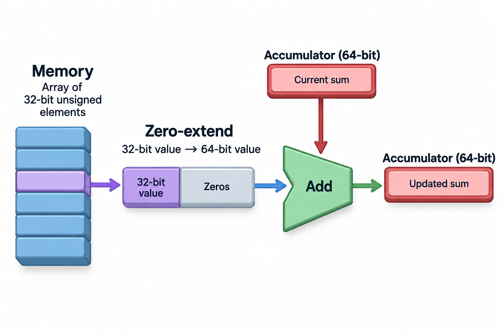
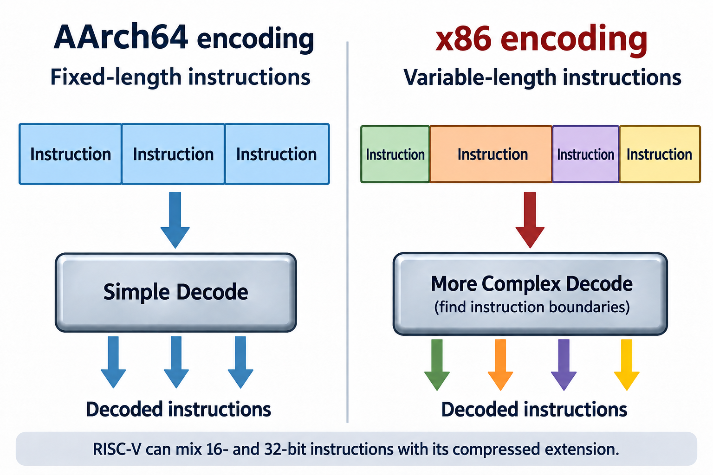

The same unsigned array sum can be written with 19 dynamically executed instructions in the teaching examples used across this subtopic. That coincidence does not make the processors equally fast. Instruction count describes 1 part of a translation; execution time depends on instruction meaning, dependencies, the memory hierarchy, and the actual implementation.

Comparisons between Arm, RISC-V, and x86-64 often collapse those separate ideas into a slogan. “RISC is efficient,” “CISC does more per instruction,” or “an open ISA wins” can each hide the workload and system being compared. A useful comparison names the specific software target and processor, then measures the same useful task under the same constraints.

This article closes the ISA foundation with a worked cross-architecture example and a performance model. Read [the ISA contract](../instruction-sets-software-hardware-contract/), [AArch64](../arm-aarch64-registers-and-ecosystem/), and [RISC-V](../riscv-small-base-extensible-system/) first; they establish the instruction and ABI details needed here.

## Family labels are not benchmark configurations

AArch64 is a software execution state using the A64 instruction set. RISC-V includes different base register widths and extension combinations. x86-64 is the 64-bit form of the x86 architecture with its own instruction and system rules. Each family contains many implementation possibilities.

A benchmark therefore needs more than those labels. Name the processor model, active core count, clock and power policy, memory configuration, compiler, target features, and operating system. Specify the program and dataset as well. A comparison can change when the workload moves from cache-resident arithmetic to streaming memory access.

Compatibility is another dimension. Instruction availability, ABI, executable format, and libraries determine whether a binary can run. Performance tuning begins only after the software targets the correct environment.

These requirements are ordinary experimental control, not a demand for an exhaustive product catalog. State the variables that could explain the result. If the report says only “Arm beat x86,” it leaves too many competing explanations open.


## A shared computation gives us common ground

The worked task is to sum `n` unsigned 32-bit elements into an unsigned 64-bit result. The AArch64 and RV64I articles showed scalar leaf functions with a pointer, remaining count, accumulator, and temporary loaded value.

Both functions load 1 4-byte element per iteration, extend it correctly to the 64-bit accumulator, advance the pointer, decrease the count, and branch if work remains. The architectural result is the same despite different mnemonics and register conventions.

For x86-64, choose the System V AMD64 function convention used by the intended teaching environment: the pointer enters in `rdi`, count in `rsi`, and the result returns in `rax`. Other x86-64 environments can use different ABIs, so these register roles are a platform choice rather than a universal ISA rule.

The following uses Intel-style assembly syntax and assumes valid readable normal memory for the array. It is intentionally scalar and simple, not a claim about the best compiler output.

```asm
sum_u32:
    xor eax, eax
    test rsi, rsi
    jz done
loop:
    mov ecx, DWORD PTR [rdi]
    add rax, rcx
    add rdi, 4
    sub rsi, 1
    jnz loop
done:
    ret
```

Writing `ecx` produces a zero-extended value in `rcx` in 64-bit mode. This is why the unsigned 32-bit array element can be added correctly to the 64-bit accumulator. `xor eax, eax` clears the accumulator using the corresponding 32-bit-write behavior.




## Trace the same 3 values

For elements 3, 5, and 7, entry state has `rdi = 0x1000` and `rsi = 3`. The accumulator begins at 0. Successive iterations produce sums 3, 8, and 15 while advancing the pointer through `0x1004`, `0x1008`, and `0x100c`.

`sub rsi, 1` sets condition flags, and `jnz` uses the 0 flag to decide whether to repeat. The AArch64 example instead used a compare-and-branch instruction on the count register. The RISC-V example compared count and 0 directly in its branch.

For 0 elements, the initial test and branch skip the memory access and return 0. For an element with bits `ffffffff`, the 32-bit load gives the unsigned value 4,294,967,295 in `rcx`. That is the same intended value as AArch64's W-register load and RV64I's `lwu`.

Each example expresses the same useful computation. The instruction organizations differ, but architectural correctness can be checked with the same input cases. That shared reference behavior is a better foundation for comparison than a list of fashionable architecture adjectives.

## Dynamic count, static size, and internal work differ

For a nonzero 3-element input, the x86 example executes 3 setup instructions, 15 loop instructions, and 1 return: 19 dynamic instructions. Its 9 static instruction lines match the static count of our AArch64 and RV64I examples.

A64 uses fixed 32-bit instruction encodings, so its 9 instructions occupy 36 bytes of instruction payload. The uncompressed base RISC-V example also uses 36 bytes. x86 instructions have variable lengths; determine its size from actual assembled bytes, including selected encodings, rather than from line count.

RISC-V compressed forms can reduce some encodings to 16 bits when the target and operand patterns permit. AArch64 can use an addressing mode that combines pointer update with a load. x86 can encode arithmetic with a memory operand in other computations. Different translations can therefore change counts and sizes without changing the useful task.

Internal micro-operations add another layer. A processor may decode an architectural instruction into simpler internal work, fuse selected operations, or schedule stages separately. Micro-operation count is implementation-specific and is not interchangeable with source assembly count.


## A performance equation organizes the comparison

A familiar first-order CPU model is

$$
T=\frac{N_{\mathrm{instructions}}\times\mathrm{CPI}}{f},
$$

where $$f$$ is clock frequency and CPI is average cycles per retired instruction over the measured workload. It is an accounting model: instruction count and CPI must use the same measurement interval and definition.

For an illustrative million-instruction workload at average CPI 1 and frequency 2 GHz, time is 0.5 ms. If another translation uses 800,000 instructions but averages CPI 1.5 at the same frequency, its time is 0.6 ms. Fewer instructions do not guarantee lower time.

Modern superscalar cores can retire multiple instructions per cycle, so average CPI can be below 1. Conversely, memory stalls and dependency chains can raise it substantially. CPI is workload- and implementation-dependent, not a constant belonging to an ISA family.

Frequency also changes under power and thermal policies. A comparison using nominal clock labels can misinterpret the actual run. Measure elapsed time and, when useful, effective frequency and hardware counters rather than multiplying advertised specifications blindly.

## Going deeper: dependencies limit the loop

The sum has a loop-carried dependency: each iteration's accumulator depends on the previous sum. Independent loads may overlap on an advanced core, but the additions still form a chain. Unrolling with several accumulators can reduce that chain's effect, followed by a final reduction.

Pointer updates and branch conditions also create dependencies. A compiler can transform the loop to compare an end pointer, combine address updates, or choose a different branch pattern. Those choices interact with instruction forms and the implementation's execution resources.

A vectorized sum performs several element operations per instruction and uses vector accumulators. It then reduces them to a scalar result. The exact code depends on available extensions, vector widths, and compiler cost models. Comparing a scalar implementation on 1 target with a tuned vector implementation on another mostly measures software preparation.

The correct comparison can include both portable baseline and tuned performance, but label them. The baseline answers how readily general software performs; the tuned case answers what the chosen implementation can achieve with suitable optimization.

## Memory can dominate all 3

A sum over a large array reads at least 4 input bytes per element. If the working set exceeds caches, memory bandwidth can become the main constraint. Increasing arithmetic throughput then has little effect once data cannot arrive faster.

An ideal bandwidth-only element rate is approximately $$\beta/4$$ for useful input bytes, ignoring extra traffic. Real memory behavior includes cache lines, prefetching, page mappings, and other system activity. The corresponding arithmetic work is small relative to data movement.

A cache-resident small array can produce a different ranking because it tests execution and cache behavior more directly. Specify dataset size and whether it is warmed. Repeatedly summing the same small array is not a proxy for streaming through a large fresh dataset.

This connection leads directly to [the memory hierarchy articles](../the-memory-wall-latency-numbers/). The ISA controls how loads are expressed; the system's memory path largely controls how fast a long stream can be delivered.

## RISC and CISC describe design traditions

RISC traditions emphasize relatively regular instruction structures and register-oriented arithmetic. CISC traditions include richer instruction forms and, in x86, variable-length encodings. These are useful historical distinctions, but they are not complete descriptions of modern implementations.

A regular instruction set can simplify some front-end tasks. Dense encoding can reduce instruction-fetch demand. Rich forms can express useful work compactly. Each choice creates tradeoffs in decoding, compiler selection, and execution rather than guaranteeing 1 outcome.

Modern cores in multiple families use sophisticated prediction, speculation, and out-of-order scheduling. A simple ISA does not require a simple pipeline, and a complex ISA does not mean every instruction executes through slow microcode. Inspect the particular instruction and processor.

For a teaching comparison, describe the visible difference you can point to: fixed versus variable encoding, branch operands versus flags, or available addressing forms. Then explain the potential implication and measure it instead of converting it into a universal ranking.


Equal functionality also permits a finite-work energy comparison. Let $$P$$ be average measured power during an execution interval and $$T$$ its duration; for approximately steady power, energy is

$$
E\approx PT,\qquad e_{\mathrm{task}}=E/n_{\mathrm{completed}}.
$$

For 1 completed task, a hypothetical 20 W system taking 0.5 seconds uses 10 joules. Another drawing 12 W for 1 second uses 12 joules. Lower instantaneous power is therefore not necessarily lower energy per result. Include the same components in both power measurements: package-only readings cannot directly be compared with whole-server wall readings. Variable power requires integrating over the interval rather than multiplying unrelated peak and timing numbers.

This improves the ISA-label baseline by evaluating a complete implementation running equivalent useful work. Hold compiler options, numerical semantics, working set, and output correctness constant before attributing a result to an instruction-set difference. Where a system finishes earlier and enters a lower-power state, include idle energy over an equal service interval if that is the operational question. If a larger batch improves energy per task while worsening response time, report both metrics under the latency objective. An ISA constrains visible behavior; energy depends on circuit design, memory, software, operating point, and what work was actually completed.




## Energy efficiency needs a system boundary

Energy per useful task is power integrated over execution time. A lower-power processor can consume more energy if it takes sufficiently longer; a higher-power processor can finish sooner. Idle power and the chosen measurement boundary matter as well.

Process technology, cache sizes, voltage/frequency settings, memory, and packaging all influence energy. Assigning an observed laptop-versus-server difference entirely to the ISA ignores those variables. Compare equivalent performance requirements and state which components are included.

For an inference service, useful output under latency requirements is often a better denominator than a synthetic instruction rate. Host CPU, accelerator, memory, and networking can all consume energy while producing the final response. The CPU family is 1 system choice among several.

## Openness and ecosystem are separate dimensions

RISC-V's openly specified architecture supports implementation freedom. Arm and x86 have different ownership and licensing structures. Those distinctions affect design strategy and business constraints, but do not directly supply a benchmark result.

Software ecosystem maturity matters independently: compilers, debugging tools, libraries, operating systems, and optimized kernels determine how easily useful applications run. A capable instruction can remain unused if software support is absent or immature for the target.

Treat performance, compatibility, implementation rights, and ecosystem readiness as separate questions. A design can be attractive for customization while requiring extra software work. Another can offer readily available binaries while providing less freedom for a new processor implementation.

## This matters for AI chips

An AI system may use 1 ISA for its host CPU, another for an embedded controller, and a specialized accelerator execution model for matrix operations. Asking which family “runs the AI” can therefore be underspecified.

For CPU inference, compare the actual vector or matrix extensions and optimized kernels, then inspect memory bandwidth and precision support. For GPU inference, host-side performance matters when tokenization, launch scheduling, or network handling limits the device's useful work.

Custom instructions can accelerate a targeted operation, but their value depends on frequency of use and the remaining bottlenecks. Apply Amdahl's reasoning: improving a small fraction of total time cannot transform the whole application. This connects ISA design to the later domain-specific architecture and ASIC articles.

## Common misconceptions

**RISC is always faster or lower-power.** Performance and energy depend on the implementation, software, and system boundary. The design tradition alone does not determine them.

**CISC instructions do more useful work automatically.** Rich forms can help, but the compiler must select them and the processor must execute them efficiently. Count the actual task.

**Equal instruction count means equal time.** Our examples have equal teaching counts yet different instruction semantics and implementation opportunities. CPI, memory, and frequency still matter.

**An open ISA eliminates ecosystem work.** It supports a different implementation model; compilers, libraries, verification, and operating systems still require engineering.


## Takeaway

Compare the same useful task on named systems with matched software preparation and explicit constraints. Use instruction count and code size to explain a result, not as substitutes for elapsed time or energy.

The next course step is [branch prediction](../branch-prediction-the-cpu-gambler/) and [out-of-order execution](../out-of-order-execution/). With the ISA boundary established, those implementation mechanisms can be understood without confusing them with a family label.

## Sources

- [Arm A64 Instruction Set Architecture Guide](https://documentation-service.arm.com/static/674d8b61c7fc0d1f211dc776): A64 forms, widths, and encoding.
- [RISC-V unprivileged specifications](https://docs.riscv.org/reference/isa/unpriv/): base and extension semantics.
- [Microsoft x64 architecture documentation](https://learn.microsoft.com/en-us/windows-hardware/drivers/debugger/x64-architecture): independently verified 32-bit register-write behavior.
- [Intel software developer manuals](https://www.intel.com/content/www/us/en/developer/articles/technical/intel-sdm.html): x86-64 instructions and system architecture.
- [System V AMD64 ABI project](https://gitlab.com/x86-psABIs/x86-64-ABI): the selected x86-64 function convention.
- [RISC-V ELF psABI](https://riscv-non-isa.github.io/riscv-elf-psabi-doc/): target binary conventions.
