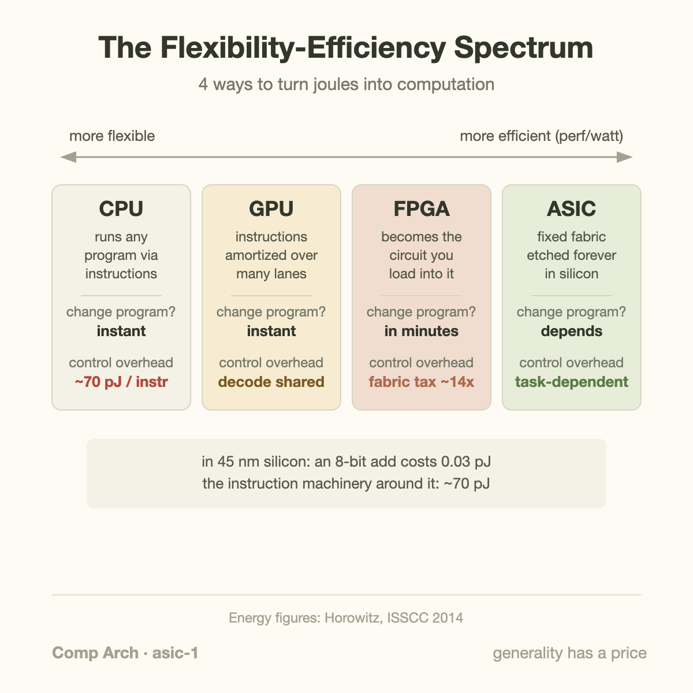
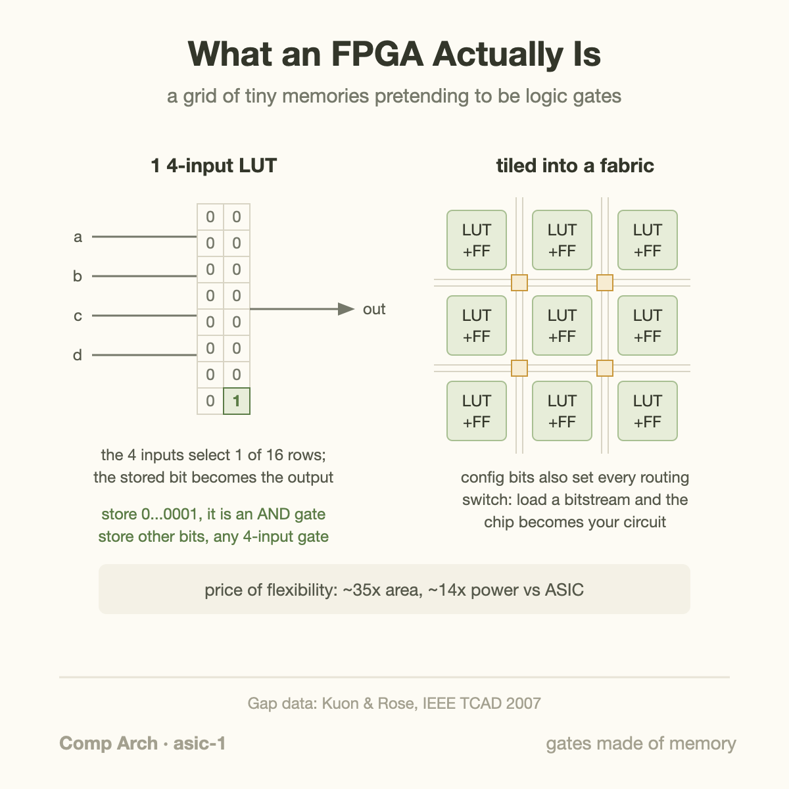
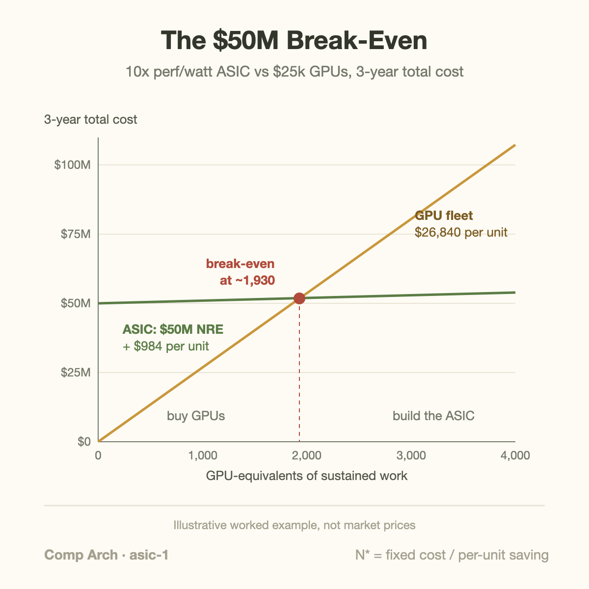

When Google published the details of its first Tensor Processing Unit in 2017, the headline number was 30 to 80 times better performance per watt than the contemporary CPUs and GPUs it was benchmarked against. Those are Google's own measurements, on Google's own workloads, against 2015-era competition, so apply the usual discount for vendor-reported numbers. But even a discounted version of that gap explains why every large cloud company now designs its own chips, and why "we should build an ASIC" comes up in every serious conversation about AI infrastructure cost.

This article is about what that sentence actually means. What is an ASIC, physically? What is an FPGA, and why does it sit between a GPU and an ASIC? And when does spending tens of millions of dollars on a chip that can only do 1 thing beat buying chips that can do anything?

## The flexibility-efficiency spectrum

Line up the 4 big compute substrates and you get a spectrum. At 1 end, maximum flexibility. At the other, maximum efficiency for 1 fixed job.

**CPU.** A general-purpose instruction-following machine. It fetches an instruction from memory, decodes it, executes it, and repeats, with an enormous amount of supporting machinery (branch predictors, out-of-order schedulers, deep cache hierarchies) devoted to making that loop fast for *arbitrary* programs. If you have read [what a CPU actually does](/blog/what-a-cpu-actually-does/), you know most of a modern CPU's die area is not arithmetic. It is machinery for deciding what to compute next.

**GPU.** Still a programmable instruction-following machine, but restructured for throughput: thousands of simple arithmetic units, wide SIMD execution, and a memory system built for streaming. A GPU keeps the instruction machinery but amortizes it, 1 decoded instruction drives 32 lanes of math instead of 1.

**FPGA.** A field-programmable gate array. Here a circuit-oriented implementation can operate without an ordinary instruction stream; an FPGA can also contain soft or hardened processors. You configure logic and routing to implement that circuit until the fabric is reprogrammed. Data flows through wired-up logic every clock cycle with no fetch, no decode, no scheduler.

**ASIC.** An application-specific integrated circuit. The circuit is not configured into a flexible fabric; it is etched permanently into silicon. Its fabricated hardware structure is fixed, but it can include programmable processors, instruction streams, and configurable dataflow; application-specific does not mean 1 immutable computation.

Why does moving right on this spectrum buy efficiency? Because generality has a measurable energy price. Mark Horowitz's widely cited ISSCC 2014 numbers make it concrete: in 45 nm silicon, an 8-bit integer addition costs about 0.03 picojoules. The overhead of *being a processor* (fetching the instruction, decoding it, reading the register file, managing the pipeline) costs on the order of 70 pJ per instruction. The useful work is a rounding error, less than a thousandth of the energy spent deciding to do it. Specialized hardware wins not by doing arithmetic faster but by deleting the overhead around the arithmetic.

## What an FPGA actually is

"Reconfigurable hardware" sounds like magic, but the core trick is almost embarrassingly simple: a lookup table, or LUT.

Any logic function of 4 inputs can be described by its truth table, which has 2^4 = 16 rows. Store those 16 output bits in a tiny 16-bit memory, use the 4 inputs as the address, and the memory *is* the gate. Want an AND gate? Write `0000000000000001`. Want XOR-of-4? Write different bits. 1 physical structure, any 4-input function, chosen by what you load into it.

An FPGA is a huge grid of these LUTs (modern ones use 6-input LUTs, 64 bits each), each paired with a flip-flop to hold state between clock cycles, plus a programmable routing fabric: a mesh of wire segments and switch matrices whose connections are also controlled by memory bits. At power-on, the chip loads a *bitstream* (millions to hundreds of millions of configuration bits) that sets every truth table and every routing switch. From that moment it behaves like the circuit you described. Because pure LUT fabric is inefficient at common heavy operations, real FPGAs also embed hardened blocks: DSP slices (real multipliers in real silicon), block RAM, and often full CPU cores.

The price of this trick is well quantified. Kuon and Rose's classic measurement study found that a circuit implemented in FPGA LUT fabric is roughly 35 times larger in area, 3 to 4 times slower, and about 14 times hungrier in dynamic power than the same circuit as a standard-cell ASIC in the same process. Hardened DSP and RAM blocks narrow the area gap to roughly 18x for arithmetic-heavy designs. Every "gate" is really an SRAM read, and every "wire" passes through pass-transistor switches; you pay for flexibility on every signal, every cycle.

So the FPGA occupies a genuine middle point: it eliminates the instruction-machinery tax (no 70 pJ fetch-decode overhead) but pays a fabric tax an ASIC does not.

## Where the money goes: NRE

The efficiency ordering would make ASICs the answer to everything if chips were free to design. They are not, and the cost structure has a name: **NRE**, non-recurring engineering. It is everything you pay once, before the first sellable chip exists: the design team's salaries, EDA tool licenses (commercial digital-design tooling runs hundreds of thousands of dollars per seat per year), licensed IP blocks (memory controllers, SerDes, PCIe), verification (typically the single largest engineering line item, often more than half the effort), and finally the mask set, the quartz photolithography plates that pattern each layer, which costs a few million to roughly $20M at advanced nodes.

The scary numbers you see in the press (IBS's often-quoted estimate of around $540M for a full 5 nm chip design, and SemiAnalysis's breakdowns pointing the same direction) describe flagship SoCs including software, and they are estimates, not invoices. A focused accelerator on a mature node is orders of magnitude cheaper: a competent 28 nm ASIC can be done for $5–15M, and at the extreme low end, Tiny Tapeout will put your hobby design on a shared 130 nm shuttle wafer for a few 100 dollars. NRE is not 1 number. It scales with node, complexity, and ambition. But for a leading-edge AI accelerator with the software to make it usable, $50M is a polite lower bound, which makes it a good round number for the exercise that actually decides these projects.

## A worked example: when 10x efficiency justifies $50M

Say you run a stable inference workload and you need the equivalent of **N** GPUs' worth of sustained compute for 3 years. 2 options:

- **GPU:** $25,000 per card, 700 W each. No NRE, buy them tomorrow.
- **Custom ASIC:** 10x the performance per watt at the same 700 W per chip, so each ASIC replaces 10 GPUs. Manufacturing cost $8,000 per chip at volume. NRE: $50M and roughly 2 years before first silicon serves traffic.

Work the per-unit costs by hand. Electricity plus cooling at an all-in $0.10/kWh: 1 700 W device over 3 years burns 0.7 kW x 26,280 h = 18,400 kWh, about **$1,840**.

**1 GPU-equivalent of work, on GPUs:** $25,000 + $1,840 = **$26,840**.
**1 GPU-equivalent of work, on the ASIC:** 1-tenth of a chip, so $800 of silicon + $184 of energy = **$984**.

Per-unit saving: $26,840 − $984 = **$25,856**. The break-even volume is simply:

**N\* = NRE / per-unit saving = $50,000,000 / $25,856 ≈ 1,930 GPU-equivalents.**

Now plug in 2 company sizes.

- **N = 1,000** (a large startup): GPUs cost $26.8M total. The ASIC path costs $50M + 100 chips x $8k + energy ≈ $51M. The ASIC loses by almost 2x, before counting 2 years of schedule risk. Buy the GPUs.
- **N = 10,000** (a hyperscaler service): GPUs cost $268M. The ASIC path costs $50M + 1,000 x $8k + $1.84M ≈ **$60M**. The ASIC wins by more than 4x, saving roughly $200M, and the fleet draws 0.7 MW instead of 7 MW, which at today's grid constraints may matter more than the money.

The formula also exposes the second axis, the 1 people forget: **stability**. That $200M saving assumes the workload still looks the same when silicon arrives in year 2 and through year 5. If the models your ASIC was pointed at get replaced by an architecture it handles badly, the per-unit saving collapses and you own $50M of sand. Bitcoin mining ASICs are the cheerful version of this story (the workload is frozen by protocol, so ASICs annihilated GPUs); more than 1 AI accelerator startup is the sad version. Volume times stability is the whole game: high volume and stable workload means ASIC, low volume or shifting workload means stay programmable, and the middle is where FPGAs and long arguments live.

The break-even equation needs a shared unit of delivered work. Let $$F$$ be 1-time development cost, $$c_G$$ the GPU lifetime cost per work unit, and $$c_A$$ the ASIC lifetime cost per equivalent unit. For volume $$N$$,

$$
C_G=Nc_G,\qquad C_A=F+Nc_A,\qquad
N_* = \frac{F}{c_G-c_A},\quad c_G>c_A.
$$

Using the hypothetical values above gives $$N_*\approx50{,}000{,}000/25{,}856\approx1{,}934$$ GPU-equivalents. If the savings term becomes 0 or negative, no positive volume recovers the development cost under this model.

What changes relative to buying GPUs is both the marginal work cost and who owns workload risk. The assumed 10-to-1 replacement must be established on complete supported models, including memory stalls and software overhead—not inferred from peak MAC density. Test a workload portfolio against a GPU baseline and include the cost of bridging the development interval. A programmable ASIC can retain operator and scheduling flexibility, while fixing arithmetic formats and memory interfaces. The right design freezes stable expensive mechanisms and keeps likely-changing decisions programmable; it does not need to freeze 1 entire model forever.

## Going deeper: what specialization actually deletes

"10x performance per watt" is not 1 trick. It is the sum of several deletions, each traceable to machinery a general-purpose chip carries and a specialized one does not.

**Instruction overhead goes to 0.** In an ASIC datapath there is nothing to fetch or decode; control is a small state machine amortized over thousands of arithmetic units. The TPU makes this vivid: its 256x256 systolic array holds 65,536 multiply-accumulate units driven by a single instruction stream feeding the whole matrix.

**Data stops commuting.** In a CPU or GPU, every operand round-trips through a register file, and often a cache. In a systolic array, each result is handed directly to the physically adjacent unit that needs it next; operands move tens of micrometers instead of millimeters. Since wire energy scales with distance, dataflow-matched layout is a first-order win.

**Precision is exact, not rounded up.** A general chip provides 32-bit datapaths because someone might need them. The first TPU committed to 8-bit integer math; an 8-bit multiplier is roughly an order of magnitude smaller and cheaper in energy than a 32-bit floating-point 1, so the same silicon and watts hold far more of them.

**Memory becomes bespoke.** Caches with tags, coherence, and replacement policies get replaced by software-managed scratchpads sized exactly to the tiles of the 1 algorithm the chip runs. No tag lookups, no misses on behalf of generality.

A GPU, note, has been sprinting along this same path: tensor cores, FP8 and FP4 datapaths, and transformer-specific units are specialization *inside* a programmable envelope. The line between "GPU" and "AI ASIC" is blurrier every generation, which is precisely why the decision framework is economic rather than religious.

## Common misconceptions

**"An ASIC is always faster than a GPU."** Raw speed is not the reliable win; efficiency and unit cost are. A modern GPU is itself a highly specialized chip fabbed on the best available node, and its matrix units are ASIC-grade at matrix math. A first-generation custom ASIC on a trailing node, with an immature compiler, can easily deliver fewer useful FLOPs than a well-tuned GPU kernel. Potential ASIC advantages are performance per watt and per dollar at sufficient volume on supported workloads; they must be demonstrated rather than assumed.

**"FPGAs are just for prototyping ASICs."** Prototyping is 1 use, but FPGAs are a production endpoint in their own right wherever volume is low, standards are moving, or deterministic latency matters: cellular base stations, high-frequency trading, defense radios, network switches. Microsoft deployed FPGAs at cloud scale in its Catapult and Brainwave projects for exactly the middle-of-the-spectrum reason: more efficient than CPUs, still reprogrammable when the algorithms changed. If your break-even math says "not quite ASIC volume," the FPGA column deserves a serious look.

**"NRE is mostly the mask cost."** Masks are the famous line item, but even at an advanced node they are single-digit to low-double-digit millions, a fraction of a serious budget. The bulk goes to people: design, and above all verification, because a bug that ships in silicon cannot be patched, plus the software stack (compilers, kernels, frameworks) without which an accelerator is a very expensive heater. This is also why NRE is not a fixed toll: choose a mature node, reuse IP, ride a shuttle run, and the entry price drops by orders of magnitude.

## The bigger picture

The spectrum exists because the free ride ended. When Dennard scaling delivered faster, cooler transistors every 2 years, general-purpose CPUs absorbed every workload and specialization rarely paid. With that engine sputtering, specialization is the main lever left, what Hennessy and Patterson's Turing lecture called the new golden age for computer architecture. The consequences are visible across this series: the GPU itself was the first mainstream act of specialization ([latency machines vs throughput machines](/blog/cpu-vs-gpu-latency-vs-throughput-machines/)), and the machinery an ASIC deletes is exactly the machinery we spent the early articles admiring ([fetch, decode, execute and the pipeline](/blog/what-a-cpu-actually-does/)).

2 caveats keep the story honest. First, specialization does not repeal the memory wall: an accelerator with idle math units is just a smaller waste, and for LLM inference the binding constraint is often HBM bandwidth, not arithmetic, as the [Blackwell-to-Rubin memory math](/blog/blackwell-to-rubin-memory-math/) shows. Second, peak efficiency on paper is not delivered efficiency; a custom chip with a weak software stack posts beautiful specs and ugly [goodput](/blog/goodput-vs-utilization/). The chips that justify their NRE are the ones whose designers understood the workload, the memory system, and the software before the first line of RTL.

Next in this series: what "designing a chip" actually involves, the RTL-to-GDSII flow that turns Verilog into a file a fab can manufacture.

## Takeaway

- CPU, GPU, FPGA, ASIC form a spectrum where each step to the right deletes decision-making machinery (fetch, decode, schedule, route) and converts the saved energy into useful work; control and data movement can cost substantially more than narrow arithmetic, with ratios dependent on the implementation and measurement boundary.
- An FPGA is a grid of tiny truth-table memories plus programmable routing: no instruction overhead, but roughly 35x area and 14x dynamic power versus the same circuit as an ASIC, the quantified price of staying reconfigurable.
- The ASIC decision is arithmetic, not ideology: break-even volume ≈ NRE / per-unit saving (about 1,930 GPU-equivalents in our $50M, 10x example), and the answer only holds if the workload stays stable for the chip's whole life.

## Sources

- N. Jouppi et al., "In-Datacenter Performance Analysis of a Tensor Processing Unit," ISCA 2017 — https://arxiv.org/abs/1704.04760
- I. Kuon and J. Rose, "Measuring the Gap Between FPGAs and ASICs," IEEE Transactions on Computer-Aided Design, 2007.
- M. Horowitz, "Computing's Energy Problem (and what we can do about it)," ISSCC 2014.
- J. Hennessy and D. Patterson, "A New Golden Age for Computer Architecture," Turing Lecture, Communications of the ACM, 2019.
- The OpenROAD Project (open-source RTL-to-GDSII flow) — https://theopenroadproject.org/
- Tiny Tapeout (low-cost shared shuttle tapeouts) — https://tinytapeout.com/

*Part of the **Computer Architecture & ASIC** series. Previous: [CPU vs GPU: Latency Machines and Throughput Machines](/blog/cpu-vs-gpu-latency-vs-throughput-machines/). Next: the ASIC design flow — how Verilog becomes a photomask.*
