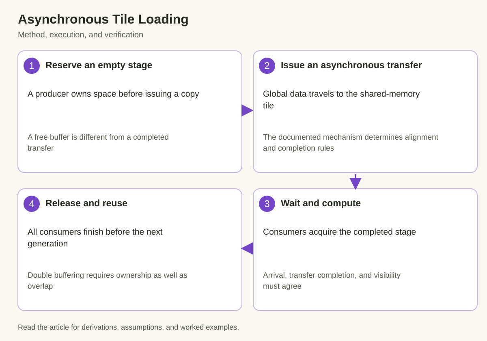

A matrix kernel often needs the next tile before its current arithmetic finishes. Synchronous loading can place memory latency directly on the critical path. Asynchronous loading offers a different schedule: initiate movement, compute with an earlier tile, and wait only when the next tile becomes necessary. The difficult part is proving that a buffer is ready to read and safe to overwrite.

This article develops that proof before discussing performance. CUDA exposes multiple asynchronous mechanisms, including element-wise global-to-shared transfers and Tensor Memory Accelerator bulk transfers. Their capabilities and required synchronization differ. Consult the current programming guide for the target architecture instead of treating every asynchronous-copy interface as interchangeable.

## 1. Separate the three events

*The diagram connects the mechanism to its execution and verification. The derivation below defines the quantities and assumptions.*

Issuing a transfer means that the operation has been requested. Completing a transfer means that its data movement has finished according to the mechanism's contract. Finishing consumption means that every reader has stopped accessing the destination. These events create two distinct handoffs: producer to consumer, then consumer back to producer.

A thread returning from an asynchronous issue call has not automatically established the first handoff. A consumer finishing its own computation has not automatically established the second for other consumers. Correctness depends on the participating group and the documented completion primitive.

Represent a stage as empty, filling, ready, or reading. Only the owner of an empty stage may start filling it. Only consumers that have observed readiness may read it. The stage becomes empty again after the last required consumer finishes. This state model is useful even when an implementation encodes the states through barrier phases rather than explicit flags.

## 2. Derive the pipeline's ideal schedule

Let there be N equally sized tiles. A transfer requires time C and the associated computation requires time K. A purely serial implementation takes approximately N times the sum of those durations. An ideal two-stage pipeline has a startup copy, overlapped interior work, and a final computation:

$$
T_{\mathrm{serial}}=N(C+K),\qquad
T_{\mathrm{pipeline}}\approx C+(N-1)\max(C,K)+K.
$$

The approximation assumes independent copy and compute resources, adequate buffering, and no hidden contention. For illustrative values of eight tiles, a three-unit copy and five-unit computation produce sixty-four units serially and forty-three units in the ideal pipeline. This is a schedule calculation, not a measured GPU result.

The speedup approaches the sum of copy and compute time divided by their maximum for a long stream. It cannot eliminate both costs. If transfers and computation compete for the same limiting memory path, their overlapped durations may increase. Measure the overlap rather than inferring it from the presence of asynchronous instructions.

## 3. Determine the number of stages

A useful first approximation compares the latency of an issued transfer with the interval between tile consumptions. Let L be the latency to make a tile ready and I the interval at which consumers need another tile. Enough lookahead requires a stage count on the order of the latency divided by that interval, with an additional allowance for the actively consumed stage depending on the chosen convention.

$$
q_{\mathrm{lookahead}}\gtrsim\left\lceil\frac{L}{I}\right\rceil,
\qquad S_{\mathrm{block}}=qS_{\mathrm{tile}}+S_{\mathrm{aux}}.
$$

Here q in the memory equation counts all allocated stages, tile storage is the bytes per stage, and auxiliary storage includes barriers and other shared data. Distinguish these definitions when translating the estimate into code; an off-by-one stage convention should not become an out-of-bounds buffer access.

More stages consume shared memory and may reduce resident blocks. They can also increase work issued ahead of actual demand. Test a small set of stage counts while recording allocated shared memory, occupancy constraints, elapsed time, and correctness. Maximum buffering is not a general objective.

## 4. Understand element-wise copies and TMA

The current CUDA guide distinguishes LDGSTS-style global-to-shared copies from TMA bulk operations. Element-wise interfaces have alignment and supported-size requirements. The compiler can select different paths when their prerequisites are not established. An aligned-size assertion is a promise that the caller must actually satisfy, including offsets and tail sizes.

TMA supports bulk movement described by the documented operation and, for multidimensional transfers, a tensor map. The map describes memory layout rather than discovering it from an arbitrary pointer. Its construction, alignment, bounds, and supported types are part of the contract. A valid descriptor for one shape or stride pattern is not automatically valid after a tensor changes.

TMA's benefit is not simply a larger instruction. It can move tile-addressing and transfer work away from a conventional sequence of per-thread loads, subject to architecture support and transfer details. Evaluate whether that change helps the actual kernel. Small or irregular tiles can have different setup and utilization tradeoffs from large regular matrix tiles.

## 5. Match completion to the operation

A barrier can track participating-thread arrivals and, for supported asynchronous operations, transfer completion. These are separate obligations. When a mechanism uses expected transaction bytes, the expected amount must correspond to the operations associated with the phase. Incorrect accounting can cause an early handoff or a wait that never finishes.

A phase or generation distinguishes successive uses of the same barrier. Waiting on the wrong generation can observe an earlier completion while a newer transfer is still in flight. Keep stage index and barrier generation explicit in the design, even if a pipeline abstraction hides some details in implementation.

The operation's documentation determines which memory-ordering and proxy synchronization steps are required. A plain block barrier is not a universal substitute for asynchronous completion. Conversely, copy completion alone does not necessarily synchronize every consumer's later reuse of a stage. Use the documented primitive for each edge in the ownership graph.

## 6. Prove double-buffer reuse

Assign tile t to stage t modulo q. Before tile t plus q writes that stage, all reads of tile t must have finished. The producer therefore waits for a free-stage handoff in addition to the consumer's ready-stage wait. These two conditions establish a cyclic buffer without overlapping incompatible generations.

$$
\mathrm{copyComplete}(t)\prec\mathrm{readStart}(t),
\qquad
\mathrm{readEndAll}(t)\prec\mathrm{writeStart}(t+q).
$$

The ordering symbol denotes a required happens-before relation, not merely an observed timestamp in one run. The first relation protects against reading incomplete data. The second protects against overwriting data still being consumed. Both must hold for every stage, including startup and drain.

A useful proof labels each shared-memory element by the tile generation that owns it. At a consumer read, show that the generation matches the requested tile. At a producer write, show that no reader retains the previous generation. This catches bugs that ordinary random numerical tests may miss because adjacent tiles contain similar values.

## 7. Handle startup, tails, and drain

The first few iterations have fewer ready tiles than the steady-state loop assumes. Issue only valid transfers and initialize the synchronization state consistently. A consumer must not wait for a tile that was never scheduled. Likewise, the final iterations must consume the already issued tiles without launching nonexistent future work.

Tail tiles require explicit bounds or a documented out-of-bounds behavior for the selected transfer mechanism. Do not assume that a mask from a conventional load translates directly into a tensor-map transfer. If using padding, define which values fill the padded region and how the arithmetic excludes them from the logical result.

For a matrix product, padded reduction elements may be zero, whereas an unrelated operation can require another neutral value. The neutral value is a mathematical property of the computation. Copying uninitialized bytes into a tail and hoping they cancel is not a valid substitute.

## 8. Keep participation consistent

A barrier's expected participants must match the threads that actually arrive. A branch that skips an arrival can prevent progress. A branch that admits an extra arrival can complete the wrong phase. Tail handling is particularly dangerous when it changes participation rather than only changing which elements a participating thread moves or computes.

Warp specialization assigns some warps to producing and others to consuming. That assignment can reduce redundant issuing work, but it makes the handoff protocol more explicit. Identify which group initializes the barriers, which group issues each operation, and which group releases the stage. A producer cannot infer that all consumers are done from one warp's local progress.

A block may also participate in wider synchronization or distributed shared-memory mechanisms on supported hardware. Those features introduce their own scope and lifetime conditions. Start with the simplest correct block-local pipeline before extending ownership across a cluster.

## 9. Measure the resource tradeoff

Compare a synchronous baseline, an asynchronous implementation with the same tile geometry, and a small stage-count sweep. Keep useful work, precision, layout, and output tolerance fixed. Otherwise a changed tile or precision can obscure whether asynchronous scheduling explains the improvement.

Measure kernel time with the documented device timing boundary, warm up compilation and initialization, and report multiple samples. Inspect achieved overlap and stalls using the profiler's relevant counters. A transfer issued early can still finish late because of bandwidth contention or insufficient lookahead.

Record shared memory, registers, resident-block constraints, and numerical differences. If another stage improves copy readiness but reduces concurrency enough to slow the kernel, the report should connect both effects. The minimum time among valid configurations is more informative than a single occupancy percentage.

## 10. Validate ownership adversarially

Use dimensions producing partial tiles, different stage counts, and both short and long tile streams. Short streams stress startup and drain; long streams exercise repeated barrier generations. Fill input tiles with distinct patterns so accidental generation reuse produces visible errors.

Check supported strides, alignment, descriptor lifetime, and host-side construction errors. Compute Sanitizer can help within the documented scope of its tools, but a clean run is not a complete proof of the higher-level pipeline. Preserve an ordinary synchronous reference and compare the same logical operation.

The examples here describe scheduling and ownership; they have not been executed on a CUDA GPU in this editing environment. A production implementation needs compilation and target-device tests. The transferable method is to establish both handoffs, budget stages, and then measure the overlap under the actual resource constraints.

## 11. Work through a three-tile ownership trace

Consider two buffers and three logical tiles labeled A, B, and C. Initially both buffers are empty. The producer reserves buffer zero for A and buffer one for B. Issuing both copies changes their state to filling; it does not permit either consumer to read yet. Once A's completion handoff is observed, the consumer may read buffer zero while B continues transferring.

After all A consumers release buffer zero, the producer may reserve that buffer for C. Notice that B's completion does not make buffer zero reusable. Reuse depends on A's readers, while readiness of buffer one depends on B's transfer. These independent conditions are precisely why a single global ready flag cannot adequately describe a multi-stage pipeline.

When the consumer advances to B, it waits on B's generation and reads buffer one. It then advances to C and waits on the new generation of buffer zero. Reading the completion token associated with A would be an error even though the physical buffer address is identical. Generation identity connects the abstract tile sequence to the reusable storage.

At the drain, the producer has no fourth tile to issue. The consumer still must finish C and release its stage if the surrounding abstraction requires it. The control flow must avoid waiting for a nonexistent future copy. This trace can be encoded in a small host-side state-machine test without claiming it exercises GPU memory ordering; the device tests remain responsible for validating the concrete synchronization implementation.

## Sources

- [CUDA asynchronous copies, including LDGSTS and TMA](https://docs.nvidia.com/cuda/cuda-programming-guide/04-special-topics/async-copies.html).
- [CUDA asynchronous barriers](https://docs.nvidia.com/cuda/cuda-programming-guide/04-special-topics/async-barriers.html).
- [CUDA advanced kernel programming](https://docs.nvidia.com/cuda/cuda-programming-guide/03-advanced/advanced-kernel-programming.html).
