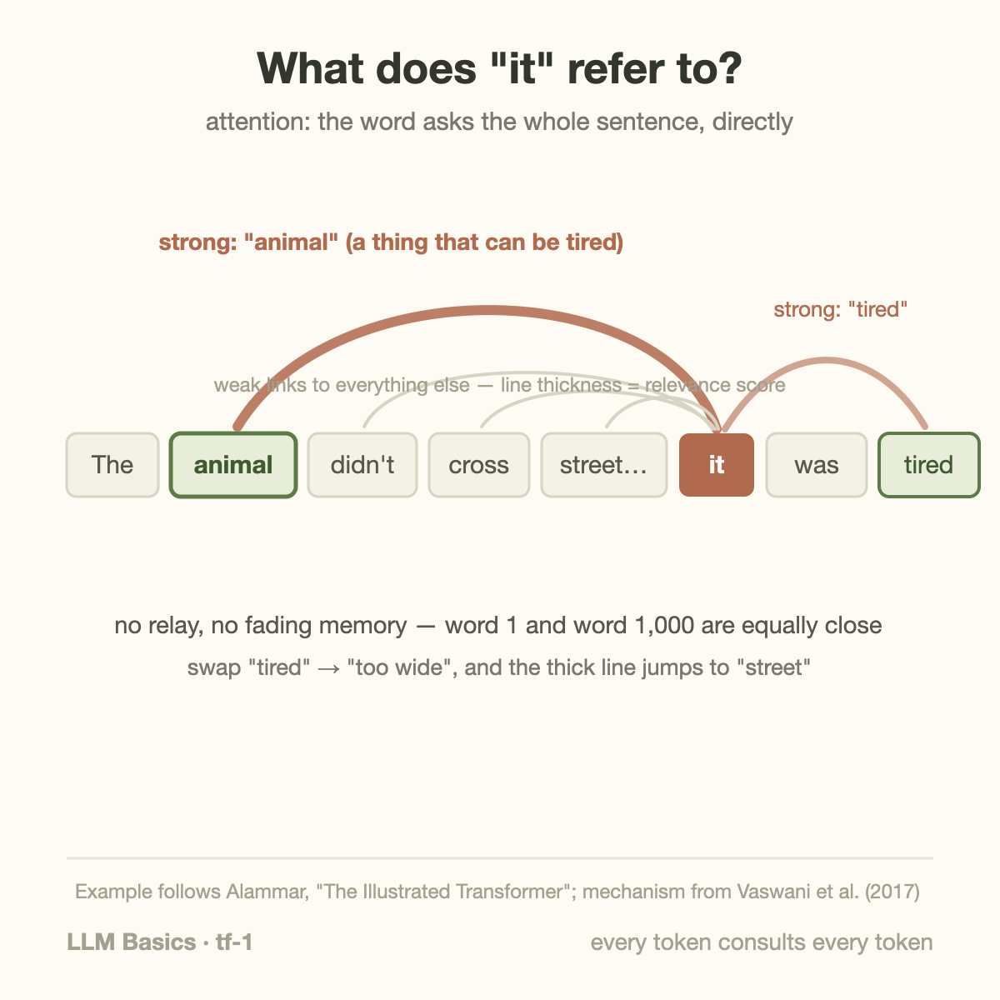
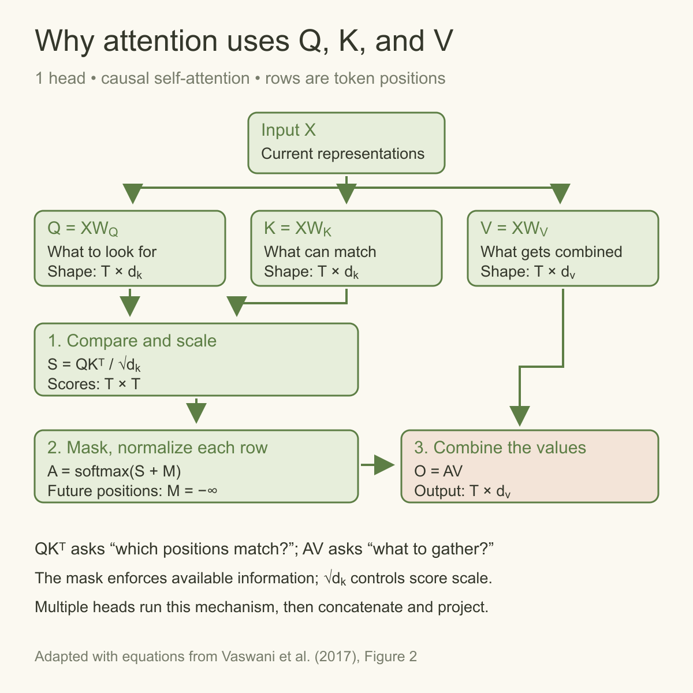
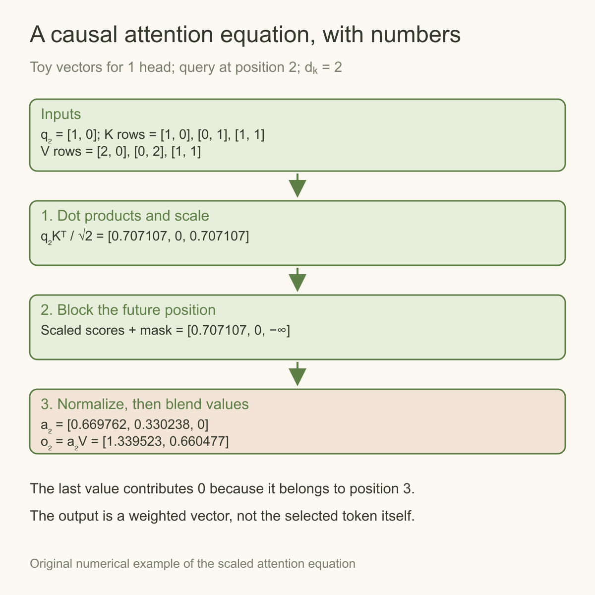

"The animal didn't cross the street because **it** was too tired." What does *it* refer to?

You resolved that instantly — *it* means the animal, because "tired" fits animals, not streets. Swap "tired" for "too wide" and *it* flips to the street. Whatever machinery lets a model make that call is the heart of language understanding, and since 2017 that machinery has 1 name: **attention**. This article builds the intuition, then checks the mechanism with equations.

## The problem attention solves

[Last article](/blog/rnn-lstm-and-the-wall/) ended with recurrent networks dying of 2 flaws: information faded as it was relayed word-by-word, and the relay forbade parallelism. The wish list for a successor was explicit — let every word connect to every other word *directly*, and let all of it happen *at once*.

Attention is exactly that: a direct, all-pairs connection.

## The mechanism: a soft lookup

Here is the whole idea in 1 metaphor. For each word, the model computes 3 things — think of them as 3 roles the word can play:

- a **query**: what am I looking for? (*it* is looking for: a thing that could be tired)
- a **key**: what do I offer as a match? (*animal* offers: I'm a living thing)
- a **value**: what information do I carry if you pick me? (the actual meaning-content of *animal*)

Each word's query is compared against every word's key, producing a **relevance score** for every pair. The scores are normalized into weights that sum to 1, and each word's new representation is the **weighted average of all the values** — mostly *animal*'s content with a dash of everything else, in our example.

Read the diagram as 2 matrix multiplications with different jobs. Q multiplied by transposed K produces a score for each permitted query–key pairing. After scaling, masking, and normalization, those scores become weights. Multiplying the weight matrix by V produces the gathered vector. The key dimension controls the score scale; the value dimension controls the gathered vector’s width. These dimensions need not be equal in every implementation.

The numerical figure is a separate toy calculation, not measured attention from a trained model. Its final key has a matching dot product but belongs to a future position. The mask excludes it before softmax, so its value contributes 0. This shows why masking is an information rule rather than a judgment about semantic relevance. The remaining values form a weighted vector; attention does not directly select the next output token.

That's it. Attention is a lookup table where, instead of retrieving 1 entry, you retrieve *all* entries blended in proportion to relevance. 3 details worth appending:

- **All the queries, keys, and values are produced by weights** — learned by [the same gradient descent as ever](/blog/how-models-learn/). Nobody tells the model that "tired" relates to "animal"; that emerges from predicting text.
- **It runs several times in parallel** ("multi-head" attention): 1 head might track pronoun reference, another syntax, another nearby words. Each head is the same mechanism with its own learned weights.
- **Direct connectivity replaces a relay.** Allowed distant tokens can exchange information without passing through every intervening hidden state; positional encoding and training still affect long-range behavior.

## A worked example you can follow by hand

Abstract mechanisms stick better with numbers, so let's run a miniature attention step. Take the 3-word input "cat sat down" and pretend each word's query and key are just 2-number vectors:

| word | key vector | value (informal) |
|---|---|---|
| cat | (1.0, 0.2) | "furry agent" |
| sat | (0.1, 0.9) | "past action" |
| down | (0.2, 0.8) | "direction" |

Suppose *sat* is computing its new representation, and its **query** is (0.3, 1.0) — informally, "I'm a verb; who's my subject, and what modifies me?" Score each word by the dot product (multiply matching positions, add up):

- vs *cat*: 0.3×1.0 + 1.0×0.2 = **0.50**
- vs *sat*: 0.3×0.1 + 1.0×0.9 = **0.93**
- vs *down*: 0.3×0.2 + 1.0×0.8 = **0.86**

Normalize those into weights that sum to 1 (the real model uses softmax, whose concentration depends on the score scale) — approximately 0.274 / 0.372 / 0.354 for scaled, unmasked softmax. *Sat*'s updated representation becomes 0.274×(cat's value) + 0.372×(its own) + 0.354×(down's): still mostly "a past action," now measurably flavored with *who* did it and *which way*. Every word in the sentence does this simultaneously; that's 1 attention layer. Real models do it with 128-number vectors and dozens of heads, but the arithmetic you just did is the whole mechanism.

The engineering aside worth planting now: notice each word needed its key and value available for everyone else's lookup. During generation, models **cache** those keys and values instead of recomputing them per token — that's the KV cache whose memory appetite drives half the serving economics in [the performance series](/blog/goodput-vs-utilization/).

## Multi-head: several lenses at once

A single attention pattern is 1 "lens" on the sentence. Real blocks run 8–128 heads in parallel, each with its own learned query/key/value weights, each free to specialize. Interpretability work on real models has found heads that track subject-verb agreement, heads that link closing brackets to opening ones, heads that follow coreference chains like our *it*→*animal* example, and many that defy tidy description. The outputs of all heads are concatenated and mixed — so each token's update draws on many relationship types simultaneously.

Why not 1 big head with more capacity? Because 10 cheap specialists beat 1 expensive generalist here: different linguistic relationships want *differently shaped* similarity comparisons, and separate heads let each comparison be learned independently. It's the same "give the architecture the right structure" lesson as [CNN filters](/blog/cnn-how-machines-learned-to-see/) — many small pattern-matchers, reused everywhere.

## Common misconceptions

**"Attention is what the model 'focuses on,' like human attention."** The name invites the analogy, but resist it: attention weights are just learned similarity scores that route information. High weight on a word doesn't mean the model "cares about" it in any human sense, and researchers have shown attention maps can be misleading as explanations of *why* a model answered as it did.

**"Each word attends to a few relevant words."** In dense attention, each query scores every allowed key; causal and other masks restrict allowed pairs. The weights are merely concentrated on a few. The compute cost is paid for all pairs regardless of how peaked the distribution is; that's exactly why the quadratic cost is unavoidable in vanilla attention.

**"Attention replaced neural networks."** Attention layers are *made of* the [same weighted sums](/blog/what-is-a-neural-network/) as everything else — the queries, keys, and values are produced by ordinary learned matrices, and attention alternates with plain feed-forward layers in the full architecture ([next article](/blog/transformer-architecture-in-one-picture/)). It's a new wiring diagram, not new physics.

## Why this won: it fits the hardware

Notice what the mechanism *doesn't* have: any dependence between positions during the computation. Every word's lookup can happen **simultaneously** — the whole thing is a few large matrix multiplications, which is precisely the operation GPUs are built to do in bulk.

This is the architecture-meets-hardware moment this series keeps circling. [CNNs](/blog/cnn-how-machines-learned-to-see/) encoded "images are local and repetitive." Attention encodes "any word may relate to any word" — and, crucially, does so in a *parallel-friendly* form. The 2017 paper that proposed building models from attention alone was titled, with earned confidence, ["Attention Is All You Need"](https://arxiv.org/abs/1706.03762).

1 honest cost, which becomes a running theme in the performance series: all-pairs comparison means the work grows with the *square* of the sequence length. Double the document, quadruple the attention compute. Much of modern LLM engineering — from FlashAttention to sparse attention — is the industry negotiating with that square. ([The KV cache](/blog/goodput-vs-utilization/), a serving-side consequence, gets its own article later.)

## The square, priced in numbers

"Grows with the square" deserves a table, because the practical consequences are wild:

| context length | attention pairs | relative cost |
|---|---|---|
| 1,000 tokens | 1 million | 1× |
| 10,000 tokens | 100 million | 100× |
| 100,000 tokens | 10 billion | 10,000× |
| 1M tokens (today's frontier claims) | 1 trillion | 1,000,000× |

A 100× longer document costs 10,000× the attention compute — and the keys and values that must sit in GPU memory for the lookup grow linearly too, which is the [KV cache's memory bill](/blog/goodput-vs-utilization/). This single table explains an enormous amount of the modern landscape: why long-context pricing is premium, why papers on linear attention and state-space hybrids keep coming, why [DeepSeek's sparse attention triggered an API price cut](/blog/blackwell-to-rubin-memory-math/), and why "context window" is a marketing number with a very real cost function behind it. When you meet those topics later in this blog, this is the table they're all negotiating with.

## The equation fixes the normalization

Scaled dot-product attention is

$$
\operatorname{Attention}(Q,K,V)=\operatorname{softmax}\left(\frac{QK^\top}{\sqrt{d_k}}+M\right)V.
$$

Q contains query vectors, K key vectors, V value vectors, and $$d_k$$ is key-vector width. The mask M contains 0 for allowed pairs and negative infinity for forbidden pairs. Softmax acts across keys for each query. The result is a weighted combination of numerical value vectors, not a blend of literal English labels.

In our toy example, raw dot products were 0.50, 0.93, and 0.86. Dividing by the square root of 2 gives approximately 0.354, 0.658, and 0.608. Applying softmax produces weights approximately 0.274, 0.372, and 0.354. These are the correct scaled, unmasked weights for the stated numbers; they are not the earlier informal normalization.

The scale factor matters because dot-product magnitudes tend to grow with vector width under typical initialization assumptions. Large logits can make softmax extremely concentrated and affect gradients. Scaling helps control that behavior. It does not make every attention head equally interpretable or every learned relationship useful.

For autoregressive prediction, the mask disallows future positions. The query at “sat” cannot use the later “down” token in a causal decoder. Its probabilities would instead be renormalized over the allowed prefix. Full bidirectional attention is appropriate for some encoder tasks, while causal attention is required when the training target must not leak into its own prediction.

The mask changes the numerical result, not just the diagram. For the query at “sat” in a causal decoder, only “cat” and “sat” are allowed. Their scaled logits are approximately 0.3536 and 0.6576; removing “down” and applying softmax gives weights about 0.4246 and 0.5754. If their numerical value vectors are (1,0) and (0,2), the attention output is (0.4246,1.1508). The earlier unmasked result describes a bidirectional toy lookup instead.

For each allowed key j, the weighting rule is

$$
a_j=\frac{\exp(s_j)}{\sum_{r\in\mathcal A}\exp(s_r)},\qquad
s_j=\frac{q^\top k_j}{\sqrt{d_k}},\qquad o=\sum_{j\in\mathcal A}a_jv_j.
$$

A is the permitted-key set, q the query, k_j and v_j the key and value, and o the head output. Compared with recurrent relaying, this method exposes parallel all-pairs work during training. Its tradeoff is growing pair work and historical state. Tiled exact attention changes memory traffic without changing these weights; sparse attention changes A and therefore the model computation. Keep that distinction when interpreting a faster attention implementation.

## Training parallelism is not generation parallelism

Given a complete observed training sequence, a causal model can compute representations for all positions together with a triangular mask. It uses the actual earlier tokens from the dataset. The mask enforces the probability factorization even though the implementation processes positions in parallel.

During ordinary autoregressive generation, the next token has not been selected yet. The model computes its distribution, selects a token, and then uses that selected token in the next step. Parallel training positions therefore do not imply that an unknown answer can be generated all at once.

The quadratic pair-count table describes dense attention over a complete sequence, holding head width and other dimensions fixed. With cached keys and values, 1 decode step compares 1 new query with the current prefix, so that step's attention work grows roughly linearly with prefix length. Prefill and full-sequence training have a different cost shape.

Sparse patterns can reduce the number of evaluated pairs, and FlashAttention can reduce memory traffic without changing exact dense-attention semantics. Positional encoding, finite context, and training data still influence long-range behavior. A direct connection removes a recurrent relay but does not make distance irrelevant to learned predictions.

## Takeaway

- Attention = every token directly scores its relevance to every other token, then takes a weighted average of their content. A lookup, softly blurred.
- Query/key/value are all learned; multiple heads run the mechanism in parallel with different learned specialties. Direct connectivity helps long-range information flow; positions, masks, and learned behavior still matter.
- It won because it fits both the data ("anything can relate to anything") and the hardware (all positions compute at once). The price: compute grows with the square of sequence length.

Attention visualizations require careful interpretation. A large weight shows that a value contributes strongly to that particular head and query under the current projections. It does not prove that the corresponding word caused the final answer, or that a human would assign it the same meaning. Later layers can transform or cancel the contribution, and multiple heads can represent different relationships. Use the visualization to inspect the mechanism and generate debugging questions. To test a claim about model behavior, change the input, control the comparison, and observe the resulting predictions rather than relying on a single attractive heatmap.

## Sources

- Vaswani et al. (2017). ["Attention Is All You Need"](https://arxiv.org/abs/1706.03762)
- Alammar — ["The Illustrated Transformer"](https://jalammar.github.io/illustrated-transformer/) (the canonical visual walkthrough; the "it" example follows its presentation)
- Olah & Carter (2016). ["Attention and Augmented Recurrent Neural Networks"](https://distill.pub/2016/augmented-rnns/), *Distill*

---

*Part of the **Fundamental of LLM** series. Previous: [RNN and LSTM](/blog/rnn-lstm-and-the-wall/). Next: the full Transformer architecture in one picture.*
