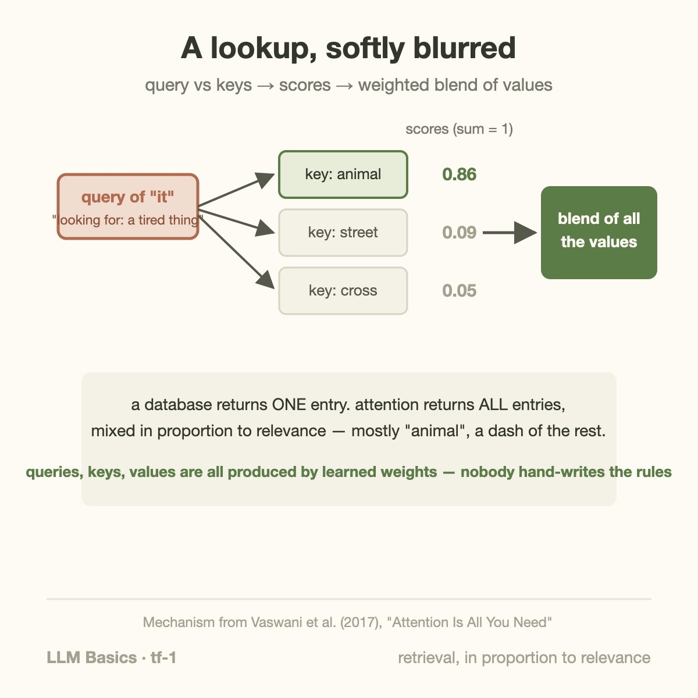

"The animal didn't cross the street because **it** was too tired." What does *it* refer to?

You resolved that instantly — *it* means the animal, because "tired" fits animals, not streets. Swap "tired" for "too wide" and *it* flips to the street. Whatever machinery lets a model make that call is the heart of language understanding, and since 2017 that machinery has one name: **attention**. This article explains it with no equations.

## The problem attention solves

[Last article](/blog/rnn-lstm-and-the-wall/) ended with recurrent networks dying of two flaws: information faded as it was relayed word-by-word, and the relay forbade parallelism. The wish list for a successor was explicit — let every word connect to every other word *directly*, and let all of it happen *at once*.

Attention is exactly that: a direct, all-pairs connection.

## The mechanism: a soft lookup

Here is the whole idea in one metaphor. For each word, the model computes three things — think of them as three roles the word can play:

- a **query**: what am I looking for? (*it* is looking for: a thing that could be tired)
- a **key**: what do I offer as a match? (*animal* offers: I'm a living thing)
- a **value**: what information do I carry if you pick me? (the actual meaning-content of *animal*)

Each word's query is compared against every word's key, producing a **relevance score** for every pair. The scores are normalized into weights that sum to 1, and each word's new representation is the **weighted average of all the values** — mostly *animal*'s content with a dash of everything else, in our example.

That's it. Attention is a lookup table where, instead of retrieving one entry, you retrieve *all* entries blended in proportion to relevance. Three details worth appending:

- **All the queries, keys, and values are produced by weights** — learned by [the same gradient descent as ever](/blog/how-models-learn/). Nobody tells the model that "tired" relates to "animal"; that emerges from predicting text.
- **It runs several times in parallel** ("multi-head" attention): one head might track pronoun reference, another syntax, another nearby words. Each head is the same mechanism with its own learned weights.
- **Distance doesn't exist.** Word 1 attends to word 1,000 exactly as easily as to word 2. The fading-relay problem is simply gone — which is why long documents became feasible.

## Why this won: it fits the hardware

Notice what the mechanism *doesn't* have: any dependence between positions during the computation. Every word's lookup can happen **simultaneously** — the whole thing is a few large matrix multiplications, which is precisely the operation GPUs are built to do in bulk.

This is the architecture-meets-hardware moment this series keeps circling. [CNNs](/blog/cnn-how-machines-learned-to-see/) encoded "images are local and repetitive." Attention encodes "any word may relate to any word" — and, crucially, does so in a *parallel-friendly* form. The 2017 paper that proposed building models from attention alone was titled, with earned confidence, ["Attention Is All You Need"](https://arxiv.org/abs/1706.03762).

One honest cost, which becomes a running theme in the performance series: all-pairs comparison means the work grows with the *square* of the sequence length. Double the document, quadruple the attention compute. Much of modern LLM engineering — from FlashAttention to sparse attention — is the industry negotiating with that square. ([The KV cache](/blog/goodput-vs-utilization/), a serving-side consequence, gets its own article later.)

## Takeaway

- Attention = every token directly scores its relevance to every other token, then takes a weighted average of their content. A lookup, softly blurred.
- Query/key/value are all learned; multiple heads run the mechanism in parallel with different learned specialties. Distance costs nothing — long-range understanding stops being special.
- It won because it fits both the data ("anything can relate to anything") and the hardware (all positions compute at once). The price: compute grows with the square of sequence length.

## Sources

- Vaswani et al. (2017). ["Attention Is All You Need"](https://arxiv.org/abs/1706.03762)
- Alammar — ["The Illustrated Transformer"](https://jalammar.github.io/illustrated-transformer/) (the canonical visual walkthrough; the "it" example follows its presentation)
- Olah & Carter (2016). ["Attention and Augmented Recurrent Neural Networks"](https://distill.pub/2016/augmented-rnns/), *Distill*

---

*Part of the **Fundamental of LLM** series. Previous: [RNN and LSTM](/blog/rnn-lstm-and-the-wall/). Next: the full Transformer architecture in one picture.*
