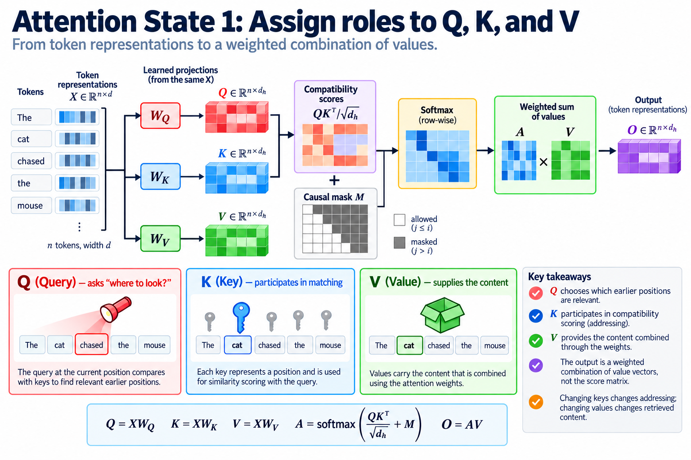

Attention is often introduced as one compact equation. Infrastructure work requires unpacking its tensors, its causal schedule, and the state retained between generated tokens. Multi-head attention, multi-query attention, and grouped-query attention differ in how queries share key-value representations. That difference can materially change decode memory requirements without changing the number of query heads.

The original GQA paper studies grouped-query attention as a compromise between multi-head and multi-query attention and describes converting pretrained multi-head models through additional training. Its results do not establish that reducing key-value heads is a free post hoc serving transformation. Sharing changes the model computation; the weights and training procedure must support it.

## 1. Assign roles to Q, K, and V

*Overview of the article’s core mechanism. The following sections explain the objects, relationships, equations, assumptions, and worked examples shown here.*

Let X contain n token representations of width d. Learned projections produce query, key, and value tensors. A query determines which earlier positions are relevant to the current position. A key participates in compatibility scoring. A value supplies the content combined through the resulting weights.

$$
Q=XW_Q,\qquad K=XW_K,\qquad V=XW_V,
\qquad A=\operatorname{softmax}\left(\frac{QK^\top}{\sqrt{d_h}}+M\right)V.
$$

This single-head notation uses head width d_h and additive mask M. The output is not the score matrix: it is a weighted combination of value vectors. Changing keys changes addressing; changing values changes retrieved content. The projections can therefore have different dimensions or sharing patterns even though they start from the same token representation.

The square-root scale controls score magnitude under an idealized variance argument. If independent query and key coordinates have unit variance, their dot product has variance proportional to head width. Dividing by its square root keeps that variance roughly stable. Learned representations need not satisfy those assumptions exactly.

## 2. Make causality explicit

In a causal language model, position i may attend only to permitted earlier positions and itself. The mask assigns disallowed scores negative infinity in the mathematical description so their softmax weights become zero. Numerical kernels implement a stable equivalent under their supported precision.

$$
M_{ij}=\begin{cases}0,&j\le i,\\-\infty,&j>i.\end{cases}
$$

The same causal contract applies during prompt processing and token generation, but the tensor shapes differ. Prefill can process many query positions together. A decode step commonly has one new query position per active sequence and a growing history of keys and values.

Padding and packed sequences add other constraints. Position numbers alone do not identify sequence membership in a packed batch. A correct implementation must prevent attention from crossing unrelated sequences, and its mask or metadata must describe the actual logical layout.

## 3. Expand multi-head attention

Multi-head attention uses several query-key-value sets. Each query head can learn a distinct addressing and content subspace. Their outputs are combined and passed through an output projection. The implementation can package projections into larger matrices, but the logical head mapping still matters.

Let H_Q denote query heads and H_KV denote key-value heads. Conventional MHA has equal counts, with query head h using key-value head h. Assume equal key and value head widths in the storage examples here; architectures with unequal widths require a separate calculation.

Increasing heads while reducing per-head width can preserve projection width. Consequently, head count alone is not enough to calculate weights, arithmetic, or cache size. Read the configuration's widths and grouping rules, including positional-encoding dimensions, before translating a model name into a resource estimate.

## 4. Explain multi-query attention

MQA retains multiple query heads but shares a single key head and value head among them. The heads still produce different scores because their queries differ. Shared keys do not imply identical attention weights, and shared values do not imply identical weighted outputs.

The cached history becomes much smaller when it stores 1 key-value head instead of many. Query projections and query-side arithmetic still exist. The attention kernel must reuse the shared history effectively to realize a bandwidth benefit; a logical reduction in stored bytes does not guarantee identical reduction in measured memory transactions.

MQA changes representational capacity and the trained parameterization. A serving engine cannot generally replace independent MHA keys and values with their mean and claim equivalent output. Such a transformation needs its own model conversion and quality evaluation.

## 5. Derive grouped-query attention

GQA assigns several query heads to each key-value head. For an evenly grouped design with H_Q divisible by H_KV, the group size is their ratio. A conventional contiguous mapping assigns query h to the key-value group determined by integer division by that size.

$$
g=\frac{H_Q}{H_{KV}},\qquad
\kappa(h)=\left\lfloor\frac{h}{g}\right\rfloor,\qquad
A_h=\operatorname{softmax}\left(\frac{Q_hK_{\kappa(h)}^\top}{\sqrt{d_h}}+M\right)V_{\kappa(h)}.
$$

MHA and MQA are endpoints of this family: one query per key-value head, or all queries sharing one. A model may use another explicit grouping arrangement, so confirm the implementation instead of assuming contiguous groups solely from the counts.

The innovation is controlled sharing. It preserves more key-value subspaces than MQA while reducing retained history relative to MHA. Whether that balance is appropriate depends on training, quality, context requirements, and the execution system.

## 6. Calculate cache bytes

For B sequences, L attention layers, context length n, H_KV key-value heads, head width d_h, and s bytes per stored element, a simple uncompressed cache estimate is:

$$
M_{KV}=2BLnH_{KV}d_hs.
$$

The factor two counts keys and values. This formula excludes block padding, allocator metadata, positional side state, quantization scales, and any architecture-specific sharing across layers. It assumes every listed layer stores a separate history with the same dimensions.

For illustrative values B equal to one, L equal to 32, n equal to eight thousand, width 128, and two-byte elements, 8 key-value heads require about 1 gigabyte in decimal units. 32 heads require four times that amount, while 1 head requires 1/8. These are arithmetic examples rather than a claim about a particular model configuration.

## 7. Separate stored bytes from read traffic

Each new decode query attends to permitted cached positions. The key-value history therefore participates repeatedly as generation proceeds. Reducing H_KV can lower the logical bytes needed for these reads, especially when cache traffic limits execution.

Actual device traffic depends on tiling, reuse among query heads, cache hierarchy, batching, and kernel implementation. An inefficient kernel can reload shared values repeatedly. Conversely, a well-tiled kernel can reuse portions of history. Report measured traffic and timing alongside the logical storage formula.

Prefill has a different balance because many query positions can reuse operands within a tiled computation. GQA's decode bandwidth rationale should not be translated directly into a universal prefill speedup. Measure the two phases separately for representative sequence lengths and batches.

## 8. Keep arithmetic accounting honest

For a fixed number of query heads and a fixed head width, every query head still evaluates compatibility with the relevant positions. Sharing keys and values does not simply divide the entire attention arithmetic by the sharing ratio. It more directly changes projection dimensions, stored state, and opportunities for operand reuse.

The score and weighted-value computations remain proportional to query count and history length in a conventional dense implementation. Kernel fusion can avoid materializing a full score matrix, but that is a separate execution technique. FlashAttention and GQA address different aspects of the system and can be used together.

A resource report should distinguish projection work, attention work, cache capacity, and cache traffic. Combining them into one “attention reduction” percentage obscures what the architecture actually changes.

## 9. Preserve positional information

Rotary positional embeddings or other positional mechanisms affect how keys and queries encode location. Cache entries may store already transformed keys or other representations depending on the implementation. Reusing a cached key requires the same positional convention under which it was produced.

Prefix caching across requests needs compatible tokenization, model weights, positional policy, and relevant execution semantics. Equal text strings do not automatically establish interchangeable cache bytes if another configuration changes positions or representations.

Sliding-window attention further changes which positions are retained or eligible. A model can combine GQA with a local window, but head sharing and window restriction are independent choices. Compute state from both rather than attributing every reduction to grouping.

## 10. Evaluate the training conversion

The GQA paper describes initializing grouped key-value projections from an existing multi-head model and then performing additional training. The important point is that model quality is evaluated after adapting to the new sharing structure. Weight manipulation alone is not equivalent to the complete conversion procedure.

When comparing trained architectures, hold evaluation tasks and inference policies consistent. A result affected by different data, parameter budget, or post-training cannot isolate the impact of key-value grouping. Use the paper's experiments within their stated setup rather than generalizing to all modern models.

For a production conversion, validate quality on the relevant workload and verify the exported configuration matches the actual tensors. A head-count metadata mismatch can produce either load errors or incorrect head mapping.

## 11. Test a small mapping example

Take 8 query heads and 2 key-value heads. With contiguous equal groups, queries zero through three use the first key-value head, and queries four through seven use the second. Give the 2 value heads deliberately different content so an incorrect mapping becomes visible.

Compare an explicit reference that repeats shared keys and values logically with the grouped kernel. Physical repetition is acceptable for a tiny test but defeats the serving memory benefit at scale. Test causal masking, padding, and a one-token decode extension against a full-prefix reference.

The extension test is particularly useful: prefill a prefix, append 1 token using its cache, and compare the new output with recomputing the entire sequence. It exercises cache append, position handling, and grouping together.

## 12. Translate the method into an infrastructure decision

Choose capacity estimates from the exact configuration and the actual stored dtype. Add allocator and quantization overhead separately. Benchmark prompt processing and generation with the intended batch and context distribution. Include quality evidence from the trained model rather than assuming all sharing ratios are interchangeable.

The figures and calculations here explain the architecture; they are not device benchmarks. Their practical purpose is to make Q, K, and V roles visible and connect head sharing to retained state. That connection supports better capacity planning and more precise explanations of decode performance.

## 13. Explain what the weights normalize

Softmax normalizes scores across eligible key positions for each query independently. It does not normalize across query heads. Two queries sharing a key-value head can therefore assign very different distributions over the same history. The grouping relation shares the basis on which they address and retrieve content, while leaving their query-dependent selection distinct.

For a two-position illustration, one query can produce scores of zero and two, giving more weight to the second value. Another query can produce two and zero and favor the first. Both retrieve from the same pair of value vectors. This simple example is enough to reject the mistaken interpretation that MQA forces all heads to attend identically.

A stable implementation subtracts the maximum eligible score before exponentiation. Subtracting the same constant from every score in a row preserves the normalized distribution, because the common exponential factor cancels between numerator and denominator. The subtraction reduces overflow risk. Rows with no eligible keys require an explicit supported behavior; applying ordinary softmax to an entirely masked row is not automatically meaningful.

These details belong in correctness tests as well as explanations. Construct scores with large magnitudes, verify the intended mask, and compare shared-head mappings without relying on random inputs to expose every failure. A numerically stable implementation and a correctly grouped implementation satisfy different obligations, so test both.

## Sources

- [GQA: Training Generalized Multi-Query Transformer Models from Multi-Head Checkpoints](https://arxiv.org/abs/2305.13245).
- [Attention Is All You Need](https://arxiv.org/abs/1706.03762).
