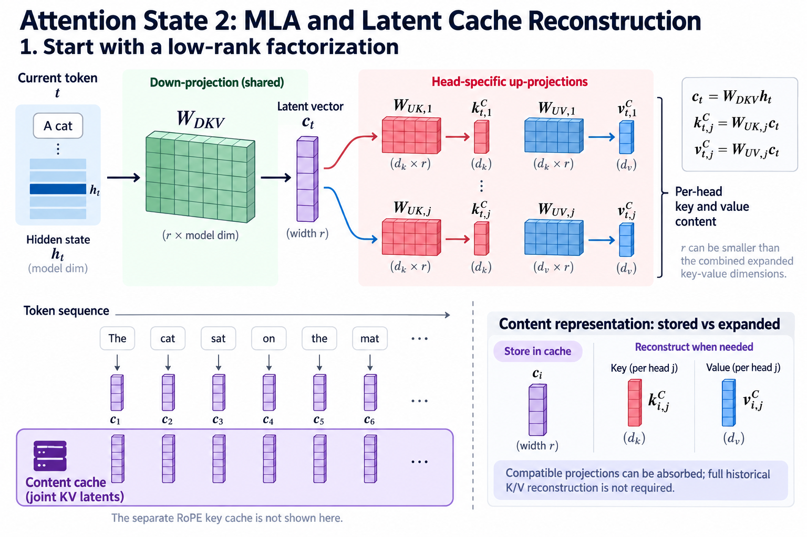

Grouped-query attention reduces cached head count through sharing. Multi-head latent attention takes another route: it learns a compact latent representation from which head-specific key and value content can be reconstructed. The cache retains the latent representation and necessary side state rather than every expanded key and value tensor.

DeepSeek-V2's primary paper introduces MLA and explains decoupled rotary positional information. The useful infrastructure insight is an algebraic change in what must remain stored. It is not a general claim that arbitrary trained attention can be losslessly compressed into a small vector after training. The projections and training define the representation.

## 1. Start with a low-rank factorization

*Overview of the article’s core mechanism. The following sections explain the objects, relationships, equations, assumptions, and worked examples shown here.*

Let h_t be the current token's hidden representation. A learned down-projection produces latent vector c_t of width r. Head-specific up-projections map that vector into key and value content. The rank r can be smaller than the combined expanded key-value dimensions.

$$
c_t=W_{DKV}h_t,\qquad
k_{t,j}^{C}=W_{UK,j}c_t,\qquad
v_{t,j}^{C}=W_{UV,j}c_t.
$$

The superscript C labels content components, and j labels a head. This notation isolates the main factorization. The actual architecture includes other projections and positional terms. A smaller rank restricts the family of expanded representations relative to unconstrained independent projections.

The model learns under that constraint. Calling the reconstructed keys “approximate” can be misleading when they are the exact keys defined by the architecture; approximation arises when comparing this learned family with a different unconstrained model, not necessarily in runtime reconstruction.

## 2. Derive query-side absorption

Consider a content score between query q and reconstructed key W_UK c. Associativity of the dot product allows moving the key up-projection to the query side. The transformed query can address cached latent vectors directly.

$$
q_{t,j}^{\top}W_{UK,j}c_i
=\left(W_{UK,j}^{\top}q_{t,j}\right)^{\top}c_i.
$$

This operation avoids reconstructing and retaining a large key history solely for scoring. The transformed query has latent width r. Computing it is additional query-side work, but it occurs for the new query rather than expanding every historical key for that use.

Absorption requires compatible linear operations. A nonlinear function applied between the projection and score generally cannot be moved through the dot product in the same way. Read the model's actual normalization and positional placement before using this identity as an implementation recipe.

## 3. Defer value expansion

Attention output combines values with query-dependent weights. If the same linear value map applies to every historical latent vector for a head, it can be moved outside the weighted sum:

$$
\sum_i a_{t,i,j}W_{UV,j}c_i
=W_{UV,j}\left(\sum_i a_{t,i,j}c_i\right).
$$

The kernel can accumulate a latent-space weighted sum and expand it afterward. This is an algebraic opportunity, not a promise that every backend uses exactly that schedule. Tiling, fusion, and numerical precision determine the practical implementation.

The weights still depend on the query and all eligible positions in dense attention. MLA changes retained representation and projection placement; it does not automatically make history lookup sparse or independent of context length.

## 4. Explain the positional obstacle

Rotary positional embeddings apply position-dependent transformations to query and key components. If a key up-projection interacts with a different rotation for every historical position, the simple position-independent absorption no longer follows directly.

DeepSeek-V2 addresses this through decoupled positional components. Content uses the latent factorization, while a separate rotary component supplies positional scoring. A representative score adds a content term and a positional term before the softmax:

$$
s_{t,i,j}=\frac{\widetilde q_{t,j}^{\top}c_i+
(q_{t,j}^{R})^{\top}k_i^{R}}{\sqrt{d_{\mathrm{score}}}}.
$$

This notation illustrates the decomposition; the paper specifies dimensions and scaling. The cached rotary key component is side state that must be included in capacity accounting. Treating the cache as only c_i omits a necessary part of the model.

## 5. Calculate retained bytes

For B sequences, L independent MLA layers, n retained tokens, latent width r, positional key width d_R, and s bytes per element, a simplified cache estimate is:

$$
M_{\mathrm{MLA}}\approx BLn(r+d_R)s.
$$

Compare this with the expanded key-value formula using the actual head widths. The absence of a leading factor two here reflects a shared latent used for both key and value content; positional storage is counted separately. Extra implementation state or layer sharing changes the formula.

For illustrative dimensions r equal to 512 and positional width 64 with two-byte elements, each layer retains 1,152 bytes per token. Expanded history with 32 heads, key and value width 128, and the same precision would retain 16,384 bytes per layer per token. These hypothetical dimensions demonstrate accounting and are not a current model benchmark.

## 6. Separate architecture and cache quantization

MLA defines what representation is retained. Quantization defines how its elements are stored. A latent cache can use a lower-precision representation, but scales, packing, and error then become part of the execution design.

Quantizing latent vectors can affect both reconstructed keys and values because they share that source. Error is transformed by the up-projections and can influence attention scores and weighted content. A byte reduction alone does not establish acceptable model quality.

Do not assume a quantization policy suitable for expanded keys is equally suitable for the latent representation. Evaluate output behavior, long-context tasks, and the actual numerical reconstruction path. The dedicated FP4 case study examines a different reported cache design and keeps representation changes distinct from storage precision.

## 7. Distinguish prefill and decode implementations

During prefill, many queries can be processed together. An implementation may choose an expanded or otherwise optimized computation when matrix utilization and workspace tradeoffs favor it. During decode, retaining compact history is especially attractive because that state grows and is repeatedly addressed.

The architectural equations can admit several equivalent real-number schedules. One schedule may materialize expanded values temporarily; another accumulates directly in latent space. Neither choice changes what the model defines, but they can change workspace, traffic, and floating-point order.

State the actual path used in a benchmark. “MLA cache size” does not describe every temporary allocation during prefill, and a decode-focused formula should not be presented as the whole application peak-memory estimate.

## 8. Examine head-specific behavior

Sharing a latent source does not force identical head outputs. Each head has its own compatible query and up-projection structure, and attention weights can differ by head. The latent representation is a common basis from which head-specific behavior is constructed.

This resembles sharing in GQA only at a broad conceptual level. GQA shares explicit key-value heads among query groups. MLA uses a factorized representation and can absorb linear maps. Their parameter constraints, cache formulas, and kernel opportunities differ.

A comparison should specify head counts, latent rank, positional dimensions, and projection structure. Describing both simply as “compressed attention” obscures the mechanism that explains their distinct resource behavior.

## 9. Test algebraic equivalence on a small case

Build a tiny reference that expands keys and values from cached latents, computes the intended scores, applies the mask, and combines values. Compare it with a latent-space path using query-side absorption and deferred value expansion.

Use random projections with distinct heads and nontrivial positional components. A test using identity maps or zero rotary terms can miss the very transformations being validated. Exercise prefill, a cached one-token extension, padding, and supported sequence boundaries.

Compare both output and relevant intermediate scores at a suitable precision. The real-number identities justify equivalence, while floating-point association can cause small differences. Large structured errors suggest transposition, head mapping, scaling, mask, or positional mistakes.

## 10. Analyze error propagation

Let stored latent error be delta c. The key-content error for head j is its up-projection applied to that error, and the corresponding content-score error is the query's dot product with the result.

$$
\Delta k_j=W_{UK,j}\Delta c,\qquad
\Delta s_j=q_j^{\top}W_{UK,j}\Delta c.
$$

A simple norm bound multiplies the query norm, projection operator norm, and latent-error norm. It is a diagnostic bound rather than a prediction of final quality. Softmax sensitivity, value errors, and subsequent layers complicate the complete effect.

This analysis explains why element-wise latent error statistics are not enough. Two projection directions can amplify errors differently. Evaluate the model outputs under the actual storage and reconstruction policy, especially across long contexts and score distributions.

## 11. Avoid misleading complexity claims

Compact cache can reduce capacity and operand traffic relative to expanded history. It does not remove all query work, projection work, or attention arithmetic. Dense scoring still considers the eligible historical positions.

Sparse indexing, sliding windows, and cross-layer state sharing are separate choices that can be combined with other attention representations. The newer DeepSeek case studies discuss those mechanisms independently. Do not transfer a reported reduction from one model generation to another solely because both mention latent or compressed state.

Likewise, a theoretical byte ratio does not establish a latency ratio. Weight bandwidth, expert dispatch, batching, and kernel efficiency can dominate. Report phase-specific measured results with exact configurations when making performance claims.

## 12. Read a model card critically

Identify the latent dimensions, positional side state, number of independently cached layers, stored precision, and any sharing policy. If the card omits one of these, state the missing disclosure instead of completing the formula from an assumed family resemblance.

Use the original paper for the mathematical method and the actual release configuration for a current implementation. Later architectures can revise projections or cache structure. A source revision and release name make the comparison reproducible.

Provider-reported memory statements should retain their scope. Persistent cache, global cache, peak application memory, and temporary prefill workspace are different quantities. A meaningful architecture review keeps those labels attached to the numbers.

## 13. Connect the derivation to serving

Capacity planning starts with retained latent and positional bytes, then adds allocator overhead and execution workspace. Performance planning asks how the backend scores cached latents, combines values, and handles prefill versus decode. Quality planning examines the trained representation and any cache quantization.

These are complementary questions. The algebra establishes what can move across a linear operation. The implementation determines whether that movement is efficient. Evaluation establishes whether the trained model and numerical storage satisfy the workload.

No GPU measurements were performed for this explanation. The practical method is to derive the factorization, preserve the positional component, and verify the actual execution path. That gives MLA a concrete infrastructure meaning beyond a headline about a smaller cache.

## 14. Check the dimensional interfaces

A common implementation mistake is to confuse hidden width, query content width, latent width, and positional width. The absorbed query must have the same dimension as the cached content latent. The rotary query component must match the rotary key component. The concatenated or additive score construction must use the model's actual scale rather than a familiar scale copied from ordinary attention.

Write the shape beside every map before implementing the equation. If a key up-projection maps a latent vector into a head's content key, its transpose maps a compatible content query back into latent coordinates. Reversing that transpose can sometimes produce a shape error, but square matrices can hide the mistake. A test with deliberately unequal dimensions is stronger than one using square identity projections.

The value path has its own interface. The weighted latent accumulation has latent width, while the head output after expansion has value width. A surrounding output projection expects the actual collection of head outputs. Tracking those shapes makes the absorption derivation operational and prevents a correct symbolic identity from being connected to the wrong tensor axes.

Tracking each interface width makes the derivation testable against actual exported tensors.

## Sources

- [DeepSeek-V2: A Strong, Economical, and Efficient Mixture-of-Experts Language Model](https://arxiv.org/abs/2405.04434).
- [Official DeepSeek-V2 model repository](https://huggingface.co/deepseek-ai/DeepSeek-V2).
