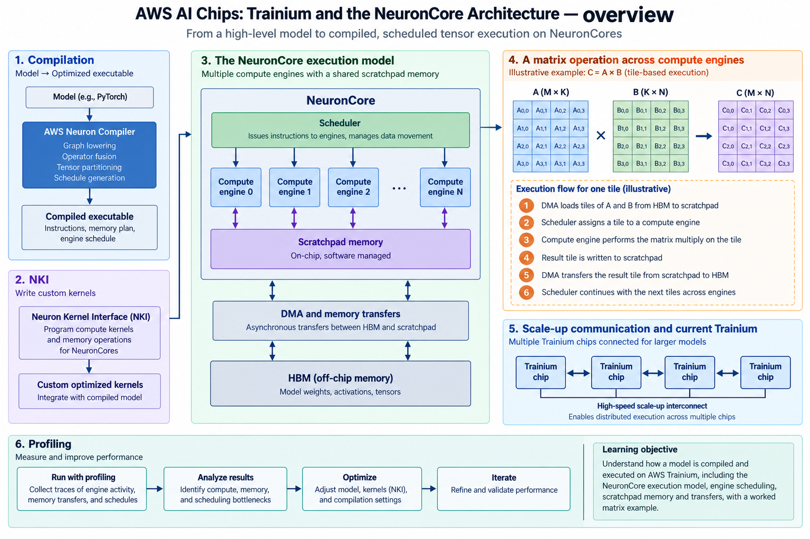
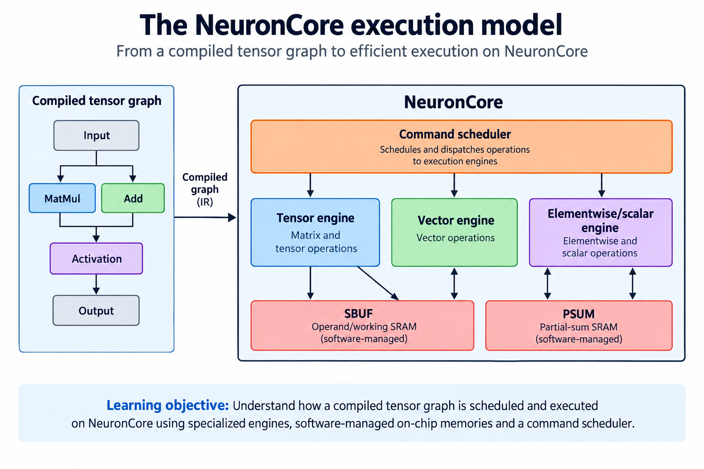
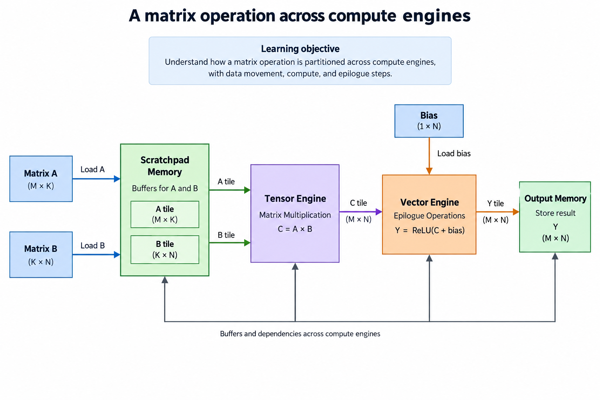
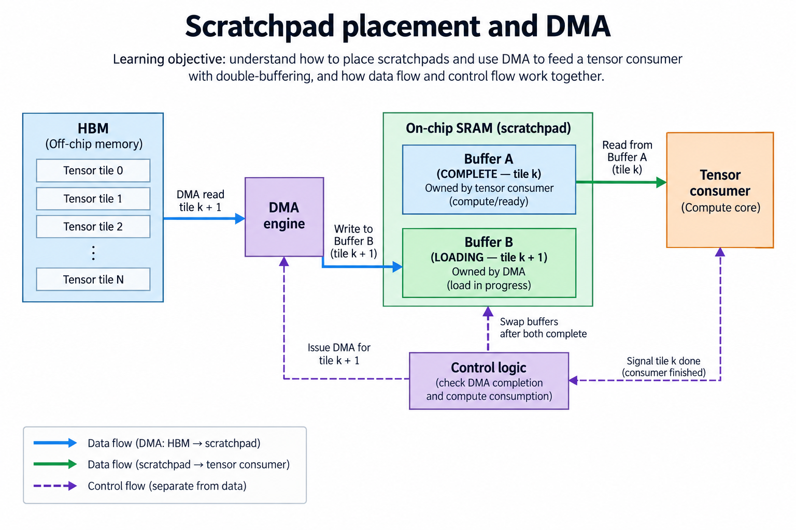
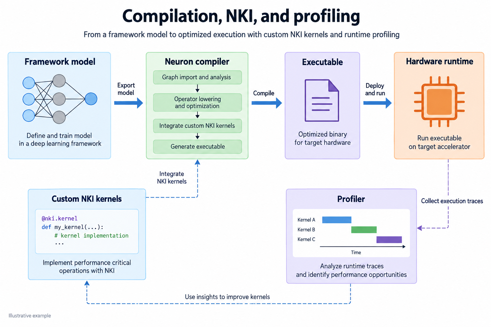
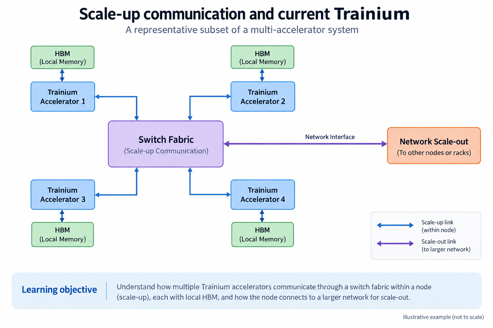

## Overview

AWS Trainium is an AI accelerator whose software-visible architecture centers on NeuronCores, specialized execution engines, on-chip storage and explicit data movement, and the overview below follows a model from compilation to hardware rather than describing Trainium as a GPU with a different label. Trainium and GPUs both do tensor work, but their instruction contracts, memory management and programming tools differ.

The dated snapshot is 2026-09-13, when current AWS documentation describes Trainium3 and NeuronCore-v4, so this article explains the durable engine-and-buffer model first and identifies generation-specific details separately, and you should check the architecture guide that matches your device, because a kernel written around an earlier memory limit is not automatically best on a later generation.

Small matrix and timing examples below are illustrative. They connect the mathematical operator to engine scheduling and communication; they do not predict application throughput from a vendor peak.

## Deep dive

### The NeuronCore execution model

The execution figure splits a NeuronCore's compiled work among engines and buffers. A tensor engine handles supported tensor operations. Vector and scalar engines handle the surrounding arithmetic they support, and general-purpose SIMD and synchronization units add more capability. DMA moves data between external memory and on-chip resources. Because engines specialize, a graph's non-matrix work still counts toward its execution cost.

The [Trainium3 NKI architecture guide](https://awsdocs-neuron.readthedocs-hosted.com/en/latest/nki/guides/architecture/trainium3_arch.html) documents two on-chip SRAM resources, SBUF and PSUM, and reports NeuronCore-v4 capacities of 32 MiB and 2 MiB respectively, but those names and capacities are generation-specific, SBUF is not an interchangeable substitute for every PSUM operation, and an operand's allowed placement follows the instruction contract.

A compiler converts tensor expressions into operations with legal shapes and layouts. A custom kernel can take more explicit control, but it must still respect the hardware's addressing, memory and dependency rules. Assigning work to the tensor engine does not by itself mean the input DMA has finished.

The system calculates by issuing legal operations on tensors whose placement and readiness are known, and an optimization that keeps the tensor engine occupied by extending a buffer's lifetime can create pressure elsewhere, so follow the complete graph through loads, engine work, synchronization and stores before changing a kernel. The important architectural distinction is software-managed locality with several specialized consumers, not the product's aggregate arithmetic number.

### A matrix operation across compute engines

The operator figure decomposes $$Y=\operatorname{ReLU}(AB+b)$$ into operand loading, matrix work, an epilogue and storage. A tile of $$A$$ and a tile of $$B$$ become available in legal buffers; matrix computation produces partial sums; later operations apply bias and activation; the result is stored in its required type and layout.

For a checked 2×2 example, $$A=[[1,2],[3,4]]$$ and $$B=[[5,6],[7,8]]$$ produce $$C=[[19,22],[43,50]]$$. With column bias $$[-20,1]$$, the biased result is $$[[-1,23],[23,51]]$$. ReLU yields $$[[0,23],[23,51]]$$. This arithmetic specifies what an implementation must preserve even if the compiler fuses or rearranges execution internally within permitted numerical rules.

An accumulation type can differ from the stored intermediate type, and Trainium3's architecture guide describes FP32 accumulation within the matrix operation and conversion when writing supported BF16 PSUM results, a distinction that matters because intermediate downcasting can introduce error even when the final stored type is unchanged. Record rounding and conversion points when comparing a custom kernel to a framework reference.

Output boundaries need masks or an equivalent legal padding policy. Applying an epilogue after every reduction chunk can change the answer: $$\operatorname{ReLU}(C_0)+\operatorname{ReLU}(C_1)$$ is generally not $$\operatorname{ReLU}(C_0+C_1)$$. Keep partial sums live until the specified reduction completes, then apply the final operator sequence.

### Scratchpad placement and DMA

The scratchpad figure treats a tile as an allocation with a lifetime. DMA produces it, compute consumes it, and its storage becomes reusable only after the consumer finishes. Double buffering can overlap the next load with current arithmetic, provided distinct storage and synchronization prevent premature overwrite.

For an illustrative 64×64 matrix tile with reduction chunk 128, 2-byte $$A$$ and $$B$$ payloads each require 16,384 bytes. A 4-byte 64×64 accumulator requires another 16,384. The resulting 49,152-byte working set excludes layout constraints, temporary vectors and scale metadata. Adding another input pair increases the example to 81,920 bytes. These calculations do not prove a particular NKI tile is legal; you must also check its partition dimensions and instruction limits.

A legal allocation can still perform poorly if DMA and compute cannot overlap or if another engine needs the same resource, so the code should make dependencies explicit: wait for inputs, do the arithmetic, finish any epilogue and store, then release the allocation, and remember that a load–compute pipeline also needs startup and drain handling.

Measure external traffic separately from on-chip transfers. Repeated tensor-engine access to 1 resident tile does not mean repeated HBM payload traffic, and conversely, keeping one tensor resident does not remove output writes or transfers of other operands, so a traffic ledger with named boundaries explains why an apparently faster arithmetic path can stay memory constrained.

### Compilation, NKI, and profiling

The software figure separates the framework, compiler, custom-kernel interface and Neuron runtime: a framework expresses the graph, compilation selects legal operations and scheduling, the runtime launches the executable on the selected devices, and profiling supplies evidence about where the actual execution waits or spends time.

AWS's [Neuron description](https://aws.amazon.com/ai/machine-learning/neuron/) presents NKI as a custom-kernel interface and Neuron tooling as the compilation/runtime ecosystem. Write a custom kernel for a measured limitation, not just because low-level control exists. A custom kernel makes you responsible for shapes, memory placement, masking and numerical behavior.

A useful experiment starts with 1 fixed-shape operator whose output you can check. Record cold compilation separately from warm execution. Inspect the timeline for DMA, tensor operations, vector work and synchronization. If an epilogue dominates, increasing matrix throughput may not improve the operator. If DMA blocks the next tile, revisit buffering and layout rather than rewriting the arithmetic first.

Keep compiler and runtime versions with the result, because a newer compiler can change code generation or support, while a different device generation changes physical limits, and a graph that compiles successfully may still have a poor schedule. Connect the observed wait to the proposed optimization, then verify the numbers still match under the accepted tolerance.

### Scale-up communication and current Trainium

The communication figure shows local HBM, a scale-up fabric and a separate scale-out network. A model spanning chips needs to communicate according to its partitioning strategy. Tensor-parallel reductions, replicated gradients and expert dispatch generate different traffic patterns; they do not consume one generic “interconnect bandwidth” in the same way.

Suppose a reduction dimension is divided across 2 devices: each computes a partial output, the final matrix is their sum, a 64×64 FP32 partial output contains 16,384 bytes, and sending that payload at a hypothetical sustained 50 GB/s takes 0.328 microseconds of serialization alone, though startup and synchronization can dominate such a small message. The calculation is illustrative and does not predict NeuronLink latency.

The [current Trainium page](https://aws.amazon.com/ai/machine-learning/trainium/) describes Trainium3, local HBM3e and NeuronSwitch-based systems. A device's local memory bandwidth, switch-fabric rate and system aggregate networking rate are different scopes. Summing rates across chips does not create a single shared memory pool with identical access cost.

Software must place shards and select collectives that match the topology and model dependencies. Scale-up can reduce communication costs within one system, while scale-out adds another domain. A complete benchmark names the chip count, model partition, collective algorithms, precision and actual sustained traffic. This makes the architecture comparison meaningful without mixing rack-level vendor claims with per-core arithmetic.

### Turn an architecture diagram into a kernel plan

Write down every tensor at the operator boundary and every temporary needed inside it. For each, record shape, element type, location, producer, consumer and last use. That table shows whether an optimization increases live storage or creates a new transfer. Mark which dimensions are distributed and which remain local.

Next define a legal tile under the target instruction set, where mathematical fit is not enough, because partition axes, memory layout and supported engine operations constrain a kernel, so treat the architecture guide as the source of those rules and keep the toy storage calculations separate from legality checks. An output boundary should have a test case even if production shapes are usually aligned.

Create a sequential load–compute–epilogue–store version first. Compare its output with the framework reference using a defined tolerance or exact integer equality where appropriate. Then add one overlap at a time and repeat the same comparisons. A speedup that changes the output or drops a tile is a correctness bug, not an optimization.

Finally sweep a few representative shapes, including small and irregular operators. Save both complete operator time and individual stage information. A custom schedule that helps one large matrix can hurt short reductions or increase compilation complexity. The evidence should state the workload envelope where the optimization helps, not claim a universal Trainium performance advantage.

### A worked engineering decision

To reason about a Neuron kernel, begin with 1 output tile and list its complete live state. Inputs staged into SBUF, partial sums in PSUM and values needed for the epilogue compete for different resources, you cannot add capacity in 1 storage domain to capacity in another and treat the sum as one interchangeable cache, and a valid tile must satisfy its partition/layout restrictions as well as byte counts.

Suppose a programmer enlarges the K chunk to reduce loading overhead. That can increase reuse, but it also increases the live operand working set and may complicate scheduling between engines. Record when each object becomes resident and when its final consumer releases it. The double-buffering diagram is an ownership schedule: the next load may overlap the current computation only if it targets a free buffer, and the consumer must wait for completion before reading it.

Next, distinguish scalar arithmetic from instruction and address control. An engine named Scalar can perform elementwise numerical work; its name does not mean it is the device's general scheduling controller. Assign operations according to the documented architecture and compiler APIs. Likewise, describe the matrix accumulation behavior and the stored partial-sum representation separately when their formats differ.

A practical comparison retains the same logical matrix and epilogue, validates raw outputs and records the generated schedule, changing tile size or buffering alone, then measures complete execution with transfers and synchronization under stated conditions before isolating stages to explain the result. The current vendor documentation supplies architecture facts; this article supplies illustrative reasoning rather than a Trainium benchmark. A useful implementation report would also pin the instance, device generation, Neuron/NKI version and precision conventions.

## Conclusion

Trainium calculates through a compiled schedule of tensor operations on its NeuronCores, surrounding engine work and explicit memory movement. SBUF/PSUM placement and operation dependencies are as important as the matrix engine itself; distributed execution adds another layer of ownership and communication.

Begin with a numerically checked operator, draw the live buffers and identify the engine or transfer limiting progress. Optimize that measured mechanism and retain device/compiler versions. The FPGA project teaches the same discipline with smaller, visible state machines and buffers, while commercial Neuron instructions provide a different execution contract.

### Sources

- [Trainium3 NKI architecture guide](https://awsdocs-neuron.readthedocs-hosted.com/en/latest/nki/guides/architecture/trainium3_arch.html)
- [AWS Trainium](https://aws.amazon.com/ai/machine-learning/trainium/)
- [AWS Neuron](https://aws.amazon.com/ai/machine-learning/neuron/)
