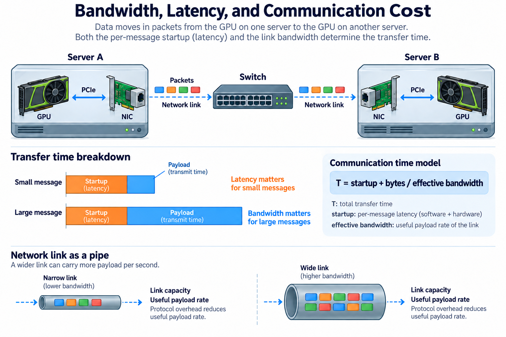
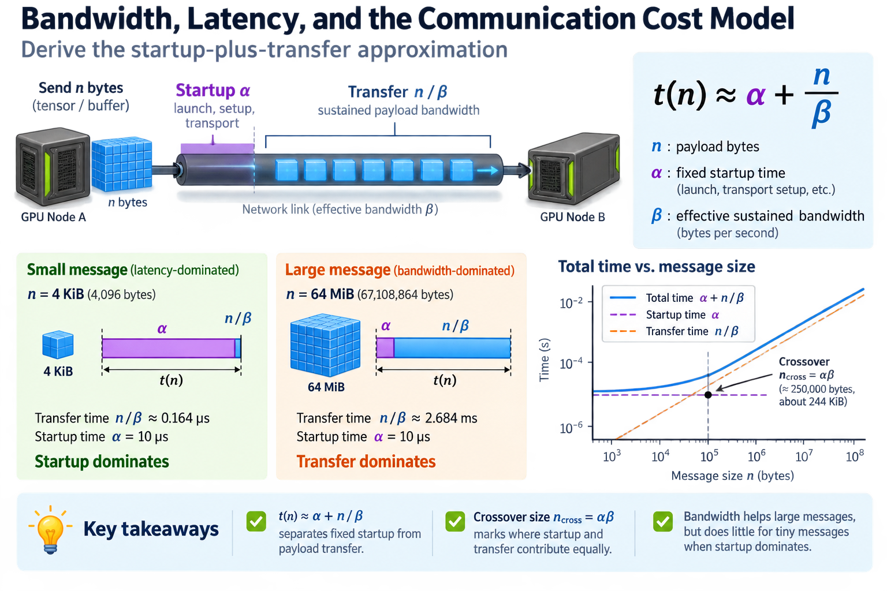
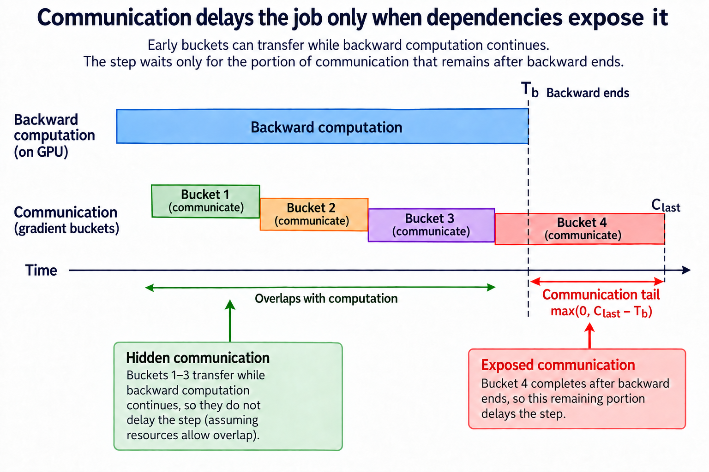

A network advertised in gigabits per second does not tell you how quickly a distributed training step will finish. The step may exchange many small messages, use a path with an unexpected bottleneck, or begin communication only after most of the useful computation is already complete. Link capacity is one input to a communication model, not the model's final answer.

A useful first approximation separates fixed startup from payload transfer. It explains why bandwidth matters differently across message sizes and why reducing bytes can have little effect on a latency-dominated exchange. From there, we can add rounds, topology, and computation dependencies without pretending that an entire collective is a single wire transfer.

The examples below are arithmetic illustrations rather than measured results. Effective parameters should be calibrated on the actual devices, transport, message population, and concurrency pattern that the job will use.

## 1. Convert the units before doing any performance arithmetic

*Overview of the article’s core mechanism. The following sections explain the objects, relationships, equations, assumptions, and worked examples shown here.*

Networking commonly states rates in bits per second, while tensors and buffers are sized in bytes. Divide by 8 to convert a bit rate to a byte rate. A nominal 400 Gb/s link corresponds to 50 GB/s before protocol overhead and implementation limits, using decimal units.

Memory sizes often use binary units. One GiB is 1073741824 bytes, while one GB is 1000000000 bytes. The distinction changes a transfer estimate by about 7.4% for the same printed number. Write the units alongside every quantity rather than switching conventions midway through the calculation.

A 1 GiB payload at an ideal 50 GB/s takes about 21.47 milliseconds for serialization alone. That is a lower-bound component, not an end-to-end promise. Packet overhead, transport behavior, device interfaces, and competing traffic can reduce useful payload throughput or add delay.

Distinguish a single directional link rate from aggregate bidirectional capacity. An exchange sending and receiving simultaneously can exploit different directions, but summing them does not make one outgoing payload travel twice as fast. Multiple ports also provide aggregate capacity only if the communication schedule and physical paths can use them effectively.

## 2. Derive the startup-plus-transfer approximation

Let n be payload bytes, alpha a fixed startup time, and beta an effective sustained payload bandwidth in bytes per second. An isolated transfer can be approximated by

$$
t(n)\approx\alpha+n/\beta.
$$

Alpha can summarize launch, transport setup, and other fixed costs within the chosen measurement boundary. Beta describes the large-message slope under the tested conditions. Neither parameter is necessarily constant across protocols, message-size ranges, or concurrent exchanges.

The crossover size at which startup and payload terms are equal is

$$
n_{\mathrm{cross}}=\alpha\beta.
$$

For illustrative alpha=10 microseconds and beta=25 GB/s, the crossover is 250000 bytes, about 244 KiB. A 4 KiB payload has approximately 0.164 microseconds of transfer time, so startup dominates. A 64 MiB payload has about 2.684 milliseconds of transfer time, making the fixed 10 microseconds comparatively small.

This simple calculation prevents a common mistaken expectation: doubling link bandwidth barely improves a tiny message when its dominant cost is startup. Conversely, reducing launch overhead does little for a transfer whose sustained byte movement already lasts several milliseconds.

## 3. Calibrate the parameters with a message-size sweep

Measure a sequence of payload sizes over the intended path. Small messages reveal the latency region, and sufficiently large messages reveal a transfer-dominated region. Plot time against bytes or examine the slope numerically; one convenient model can then be fitted within a clearly defined range.

For two large-message observations, a rough effective bandwidth estimate is

$$
\widehat\beta=(n_2-n_1)/(t_2-t_1),\qquad\widehat\alpha=t_1-n_1/\widehat\beta.
$$

The calculation assumes the same approximately linear regime for both points. If the observations cross a protocol transition or suffer different contention, the fitted intercept can be misleading or even negative. A negative intercept should trigger investigation, not be interpreted as a physically negative startup cost.

Repeat runs and report variation. Warmup, registration caches, allocation behavior, and process placement can affect the result. Define whether timing includes buffer preparation and synchronization. A device-local transport benchmark and an application-level exchange can measure different alpha values while both are internally correct.

Use multiple observations rather than relying on a two-point fit for final reporting. Residuals can reveal size-dependent behavior that one line hides. Preserve the raw size-time data so later changes can be compared without assuming the same protocol regime remains valid.

## 4. A collective adds rounds and rank-dependent traffic

An all-reduce combines contributions from many ranks and returns the reduced result to every rank. Its implementation determines how many communication rounds occur and how much data each rank sends. A collective model must count those operations rather than insert the tensor size into the point-to-point equation once.

For a simplified ring all-reduce with p ranks and n bytes per rank, a common model is

$$
t_{\mathrm{ring}}\approx2(p-1)\alpha+\frac{2(p-1)}{p}\frac{n}{\beta}.
$$

The model represents reduce-scatter and all-gather phases with evenly divided chunks and effective neighbor bandwidth. It omits detailed pipelining, reduction arithmetic, algorithm selection, and topology effects. It is an explanatory approximation, not a guaranteed NCCL schedule.

With p=8, alpha=10 microseconds, beta=25 GB/s, and n=64 MiB, the startup term is 140 microseconds and the payload term about 4.698 milliseconds. At n=4 KiB, payload time is only about 0.287 microseconds while startup remains 140 microseconds in this model.

Tree and hierarchical algorithms can change round counts and path use. The purpose of the ring equation is to connect rank count and message size to the schedule, not to declare a ring optimal for every exchange. Measure the actual algorithm and topology when diagnosing a real collective.

## 5. Read algorithm bandwidth and bus bandwidth carefully

A collective benchmark can report logical tensor throughput, often called algorithm bandwidth, as payload size divided by elapsed time. That number describes how quickly the collective processes its logical input. It is not automatically the physical rate of one network link.

NCCL tests also define bus-bandwidth conversions that account for the communication volume associated with particular collective operations. For all-reduce, the documented factor depends on rank count. Use the benchmark's exact definition rather than inferring it from a column name.

The ring example makes the distinction visible. A rank can send approximately twice its logical payload for large p, so logical throughput and estimated per-rank transferred-byte throughput differ. Other collectives have different factors and traffic patterns. Comparing their algorithm-bandwidth columns as though they were identical link measurements can produce incorrect conclusions.

Record the collective, participating ranks, message size, benchmark version, and bandwidth definition. A result from one process controlling many devices can differ from many processes with different CPU placement. A reported number becomes useful evidence only when its execution conditions and denominator are clear.

## 6. Topology changes the meaning of effective bandwidth

Communication follows physical interfaces and shared resources. Within a server, a path can traverse accelerator links or PCIe switches. Across servers, it also involves the GPU-to-NIC connection, network adapter, switches, and remote device path. The narrowest relevant resource can bound sustained traffic.

For a simplified series path carrying the same payload, effective bandwidth cannot exceed the lowest available capacity among its required segments. But real paths may pipeline traffic, share links, and use multiple routes. Summing segment transfer times blindly can overestimate an overlapped path, while ignoring a shared bottleneck can underestimate contention.

A topology cut provides another useful lower bound. If aggregate traffic D_cut must cross a cut with available capacity B_cut, then

$$
t\ge D_{\mathrm{cut}}/B_{\mathrm{cut}}.
$$

The bound depends on the traffic actually required by the algorithm and the cut's usable direction-specific capacity. It does not assume every link in the cluster contributes to this one exchange. A large aggregate fabric number can coexist with a much smaller capacity across the cut relevant to the job's placement.

## 7. Concurrent communication changes the calibration

An isolated benchmark can obtain bandwidth unavailable when multiple ranks or jobs compete for the same resource. Shared NIC ports, PCIe links, switch uplinks, and memory paths can introduce contention. Effective beta should therefore be measured under the relevant concurrency pattern when predicting job time.

Concurrency can also improve utilization by supplying enough work to keep the transport busy. More exchanges are not always worse; the effect depends on whether the isolated case lacked parallelism or the concurrent case exceeds a shared capacity. Look at both aggregate throughput and per-exchange latency.

Burst alignment matters. Many ranks becoming ready simultaneously can create traffic patterns different from staggered transfers with the same total bytes. Collectives synchronize participation in ways that ordinary independent network requests do not, so application timing can expose congestion that a smooth traffic generator misses.

Measure tail behavior as well as means. One slow rank or path can delay a collective whose completion is required by all participants. A modest average transfer time is insufficient evidence that the distributed critical path is stable.

## 8. Communication delays the job only when dependencies expose it

If a gradient bucket becomes ready while backward computation continues, part of its communication can overlap with that computation. The step waits only for the portion that remains on the critical path, subject to resource contention and the framework's dependency ordering.

For bucket j with readiness r_j, transfer duration c_j, and serialized communication completion C_j, a simplified recurrence is

$$
C_j=\max(r_j,C_{j-1})+c_j.
$$

If backward ends at time T_b, the communication tail is max(0, C_last minus T_b). This model explains why reducing an early hidden transfer may not shorten the step, whereas reducing the last exposed bucket can. Actual transports can overlap multiple operations, so the recurrence must match the execution being analyzed.

Overlap still consumes resources. Communication can compete with computation for device memory bandwidth or interface capacity. A transfer hidden in the timeline can slow neighboring kernels. Compare both communication completion and computation duration before declaring that communication is free.

A compact diagnostic record can contain the expected path, observed large-message slope, small-message intercept, participating rank count, and application communication tail. For example, a healthy slope with a much larger intercept suggests a different investigation from a healthy intercept with reduced sustained bandwidth. Add rank-by-rank observations when only one placement degrades. Preserve the same timing boundaries during comparisons, because adding a synchronization or allocation to one measurement can imitate a transport regression. This record turns the model into a repeatable troubleshooting method rather than a collection of disconnected benchmark numbers.

## 9. Use the model to choose the next experiment

If small messages dominate, investigate startup count, batching, and readiness rather than expecting a link-rate upgrade to solve the problem. If large-message slope is poor, verify the physical path, protocol, placement, and contention. If isolated bandwidth is healthy but job time is poor, inspect collective timing and the slowest participants.

Keep calculations and measurements separate. Label assumed alpha and beta values, list omitted costs, and test the predictions against a message-size sweep and an application trace. A model is useful when its errors guide investigation, not when its equation is treated as an authoritative substitute for evidence.

The central method is to count bytes, rounds, and dependencies in compatible units. Bandwidth determines a transfer slope; latency determines startup; topology limits available paths; overlap determines exposed time. Together they connect a network specification to the distributed workload it is supposed to accelerate.

## Sources

- [NCCL tests performance and bandwidth definitions](https://github.com/NVIDIA/nccl-tests/blob/master/doc/PERFORMANCE.md).
- [NCCL collective operations documentation](https://docs.nvidia.com/deeplearning/nccl/user-guide/docs/usage/collectives.html).
- [NCCL troubleshooting documentation](https://docs.nvidia.com/deeplearning/nccl/user-guide/docs/troubleshooting.html).
