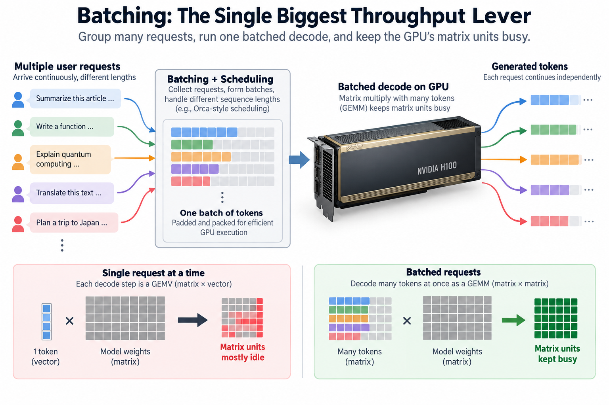
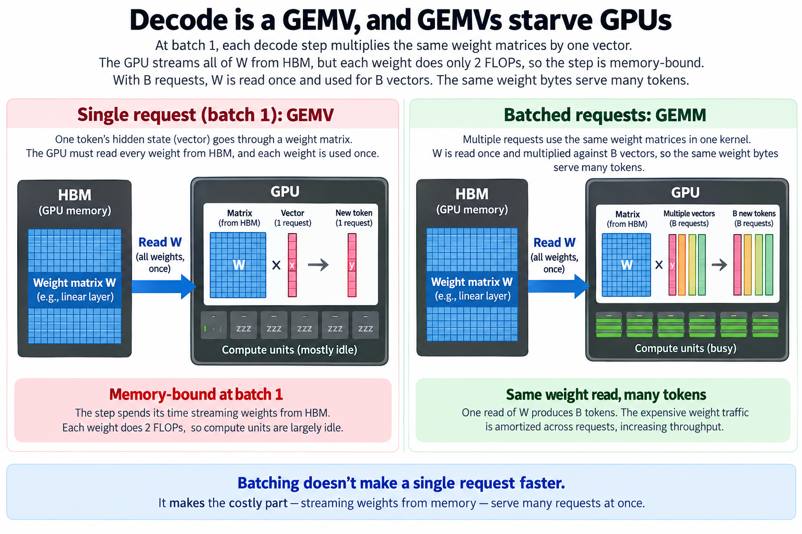
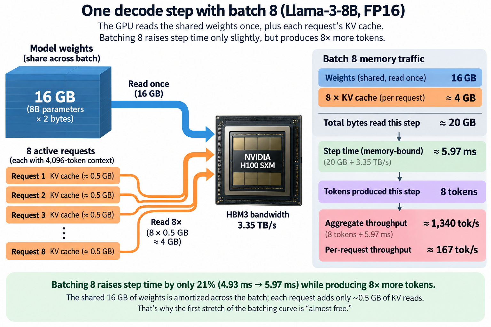
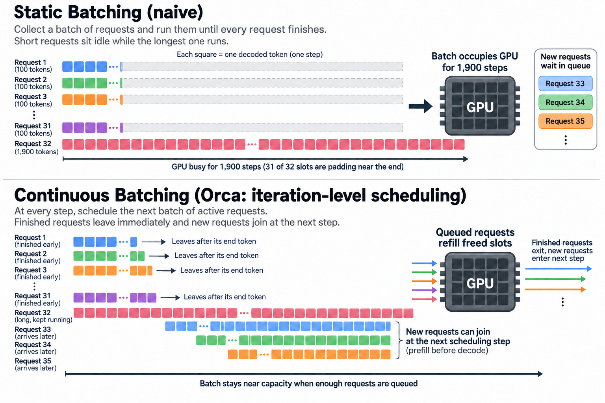

## Overview

Serve Llama-3-8B on an H100 1 request at a time and the GPU's matrix units run at about 0.33% of their rated speed. That is not a typo: 3.2 TFLOPS delivered out of 989 TFLOPS available, on hardware that costs roughly $30,000. This comparison concerns peak tensor arithmetic, not the fraction of physical silicon that is idle, and the fix requires no new kernels, no quantization, no exotic hardware. You just stop serving 1 request at a time.

Batching is the first optimization every inference stack applies, and by a wide margin the largest. Before speculative decoding, before FP8, before any kernel fusion, batching alone can multiply throughput by 10 to 20x on the same GPU. This article works through exactly why, with numbers you can check by hand, and then looks at the scheduling insight (from the Orca paper) that made batching practical for real traffic.

If you want the gentle version of the throughput-versus-latency trade first, start with [Latency vs. Throughput](/blog/latency-vs-throughput/); this article assumes that vocabulary and goes to the machine level.

## Deep dive

### Decode is a GEMV, and GEMVs starve GPUs

Recall the 2 phases of generation from [How an LLM Generates Text](/blog/how-an-llm-generates-text/): prefill processes the whole prompt in one pass, decode produces 1 token per step. During decode, the model's input at each step is a single activation vector, 1 token's hidden state. Every weight matrix multiplication in the model is therefore a matrix-vector product, a GEMV: a big matrix W times 1 skinny vector x.

Here is the problem with a GEMV on modern hardware. To compute Wx, the GPU must read every element of W from HBM exactly once, and each element it reads participates in exactly 2 floating-point operations (1 multiply, 1 add). 2 FLOPs per 2-byte weight is an arithmetic intensity of about 1 FLOP per byte. An H100 SXM can do 989 TFLOPS of dense BF16 math but only move 3.35 TB/s from memory, a machine balance near 295 FLOPs per byte. A workload delivering 1 FLOP per byte uses the memory system fully and the compute units at a fraction of a percent. Decode at batch 1 is a pure bandwidth workload; the chip spends the entire step streaming 16 GB of weights past arithmetic units that are essentially asleep. This is the memory wall applied to inference, the same wall we measured in [The Memory Wall](/blog/the-memory-wall-latency-numbers/).

Now put a second request on the GPU. Its decode step needs the same weight matrices. If both requests run in the same kernel, W is read from HBM once and multiplied against 2 vectors: a matrix-matrix product, a GEMM with a request dimension of 2. The weight bytes, which dominate the traffic, are amortized across both requests. With B requests, 1 read of W produces B tokens.

That is the entire trick. Batching does not make any single request faster. It makes the expensive part, streaming weights, serve many requests at once. Throughput scales almost linearly with batch size, and it keeps scaling until you hit one of 2 walls: the compute units finally saturate, or the KV cache runs out of room. For decode-heavy workloads on modern GPUs, the KV wall almost always arrives first, as the worked example will show.

### A worked example you can check by hand

Take Llama-3-8B in FP16 on a single H100 SXM. The relevant numbers:

- Weights: 8B parameters x 2 bytes = about **16 GB**.
- HBM3 bandwidth: **3.35 TB/s** (NVIDIA's spec; sustained real-world is more like 80-90% of that, but the ratios below survive).
- KV cache per token: the model has 32 layers, 8 KV heads (GQA), head dimension 128, so 2 x 32 x 8 x 128 x 2 bytes = **128 KiB per token**.
- Assume each request sits at a context of 4,096 tokens: KV per request = 4,096 x 128 KiB = **512 MiB, approximately 0.537 decimal GB**.

Each decode step must read the weights once, plus every active request's KV cache. Bytes per step at batch B: 16 GB + B x 0.5 GB. Step time is bytes divided by 3.35 TB/s. Aggregate throughput is B tokens per step time.

| Batch B | Bytes/step | Step time | Aggregate tok/s | Per-request tok/s |
|---:|---:|---:|---:|---:|
| 1 | 16.5 GB | 4.93 ms | 203 | 203 |
| 8 | 20 GB | 5.97 ms | 1,340 | 167 |
| 32 | 32 GB | 9.55 ms | 3,351 | 105 |
| 64 | 48 GB | 14.3 ms | 4,468 | 70 |

Read the batch-8 row carefully, because it is the punchline of this whole article. Batching 8 requests raised the step time by only 21% (4.93 ms to 5.97 ms) while multiplying token output by 8. Throughput went up 6.6x; each user paid 1 extra millisecond per token. That is why people call the first stretch of the batching curve "almost free."

By batch 32 the trade is no longer free but still excellent: 16.5x the throughput for 1.9x the per-token latency. By batch 64 the KV traffic (32 GB) is twice the weight traffic (16 GB), and each doubling of the batch buys less. The curve bends because the amortized part (weights) is fixed while the unamortized part (each request's private KV reads) grows linearly with B. Long contexts bend it sooner: at 32K context, KV per request is 4 GiB, so by batch 4 the KV reads already match the weight reads and past that they dominate.

2 sanity checks worth doing. Compute: at batch 32 the step performs 32 x 16 GFLOP = 512 GFLOP, which the H100 could finish in 0.52 ms, against a 9.55 ms memory time. Still 95% memory-bound, so the "batch until compute-bound" ceiling is far away for this model; capacity binds first. Capacity: 80 GB of HBM minus 16 GB of weights leaves 64 GB, enough for about 119 concurrent 4K-context requests before accounting for activations and fragmentation. That fragmentation problem is exactly what vLLM's PagedAttention was built to fix, which is why vLLM's headline speedups came from fitting bigger batches, not from faster math.

Write both ceilings before choosing a batch. Let $$W$$ be shared weight bytes per step, $$K$$ private KV bytes read per request, $$\beta$$ sustained bandwidth, $$F_t$$ useful arithmetic per generated token, and $$C$$ its compute throughput. A simplified step-time floor and aggregate rate ceiling are

$$
T_B\ge\max\left(\frac{W+BK}{\beta},\frac{BF_t}{C}\right),\qquad
r_B\le\frac{B}{T_B}.
$$

The table uses rounded decimal budgets $$W=16$$ GB and $$K=0.5$$ GB. Exact Llama geometry gives 131072 bytes, or 128 KiB, per cached token; at 4096 tokens that is 536870912 bytes, approximately 0.5369 decimal GB. With this exact private term, batch 8 streams 20.295 GB and has a 6.058 ms bandwidth floor, producing approximately 1320.5 aggregate tokens/s at the assumed peak. Differences from the rounded table are unit choices, not measured engine behavior.

The scheduling innovation keeps useful requests occupying those amortization opportunities, while admission protects the separate capacity bound. Larger batches can increase aggregate output while slowing each stream. At long context, private cache reads dominate and the bandwidth-model rate approaches $$\beta/K$$ instead of growing without limit. An engine may reuse cache data differently or pay additional collective and launch costs, so validate actual bytes and latency. Continuous batching removes empty cohort slots; it does not guarantee that every incoming request can join immediately when prefill or KV capacity is unavailable.

### Going deeper: the scheduling problem Orca solved

The bandwidth math above assumes you can actually keep B requests decoding together. Real traffic makes that hard, and the way serving systems handled it changed in 2022.

The naive approach is **static batching**: collect B requests, run them as a group until every one has finished generating, then admit the next group. The flaw is that generation lengths vary wildly. If 31 requests finish after 100 tokens and 1 runs to 1,900, the batch occupies the GPU for 1,900 steps while, near the end, 31 of its 32 slots compute padding. Meanwhile new requests queue outside. Measured utilization stays high; useful work collapses, the gap we called out in [Goodput vs. Utilization](/blog/goodput-vs-utilization/).

The Orca paper (Yu et al., OSDI 2022) reframed the problem with 1 observation: because decode produces exactly 1 token per request per step, the natural scheduling unit is the *iteration*, not the request. At every step, the scheduler asks which requests should be in this step's batch. A request that just emitted its end-of-sequence token leaves immediately; a newly arrived request joins at the very next step, its prefill slotted in alongside everyone else's decode. The batch becomes a rolling population rather than a fixed cohort.

This is **continuous batching** (Orca called it iteration-level scheduling), and it is now the default in every serious serving engine: vLLM, SGLang, TensorRT-LLM, Hugging Face TGI. Anyscale's benchmark writeup measured up to 23x throughput over static batching on bursty request streams, and while that headline number is vendor-reported and workload-dependent, the mechanism is not controversial: continuous batching keeps the *effective* batch size near the maximum the KV capacity allows, at every step, regardless of arrival patterns and length variance.

Note what continuous batching does not do: it does not change the per-step arithmetic at all. A step with 32 active requests costs the same 9.55 ms whether the scheduler is static or continuous. What it changes is how often you actually have 32 requests in flight instead of 9 live ones plus 23 zombies. It is a scheduling fix, and it is worth more than most kernel fixes.

The remaining tension is prefill. A joining request's prompt must be processed, and a 4,000-token prefill injected into a decode step makes that step compute-heavy and slow, which every other user feels as a latency spike in their [TPOT](/blog/ttft-and-tpot/). Engines mitigate this with chunked prefill (split the prompt across several steps) or by moving prefill to separate hardware entirely, the disaggregation story covered in [The Prefill/Decode Disaggregation Story](/blog/the-prefill-decode-disaggregation-story/).

### Common misconceptions

**"Batching helps prefill the same way it helps decode."** No. Prefill is already a GEMM: a 2,000-token prompt gives the weight-streaming loop 2,000 vectors to multiply, and arithmetic intensity is high enough to be compute-bound on its own. Batching prefills mostly just queues them behind each other and inflates time-to-first-token. The near-free amortization is specific to decode, where each request contributes only 1 vector. This asymmetry is the entire reason prefill and decode are increasingly scheduled, and even built, differently.

**"Doubling the batch doubles the throughput."** Only at small batches, and only for short contexts. The weight traffic is shared; the KV traffic is private. In the worked example, going from batch 32 to 64 raised throughput 33%, not 100%, because each added request drags 512 MB of its own KV reads into every step. At long contexts the batching curve flattens early, and KV capacity, not bandwidth, caps how far you can push B at all. Whoever quotes you a tokens-per-second figure without stating batch size and context length is quoting weather without a location.

**"Continuous batching makes each token faster."** It does not touch per-step time; a full batch costs the same milliseconds under any scheduler. What it eliminates is dead slots: iterations where the GPU runs a half-empty batch because finished requests are stuck waiting for their cohort. The speedup is entirely occupancy. This distinction matters when you profile: if your steps are slow, look at kernels and KV layout; if your steps are fast but throughput is low, look at your scheduler's effective batch size over time.

### Why this is the hinge of inference economics

Every per-token API price you have ever seen is a bet on batch size. The provider's cost per token is roughly (GPU-seconds per step x GPU price) / (tokens per step), and the denominator is the batch. At batch 1 our H100 produces 203 tok/s; at batch 64, 4,468. That is a 22x difference in cost per token on identical hardware, which is why serving economics conversations are really batching conversations wearing a suit.

It also explains the shape of the whole optimization stack that follows in this series. Quantization shrinks the weight bytes (the shared term) and the KV bytes (the private term), moving both walls. KV cache tricks (GQA, paging, compression) exist almost entirely to let B grow. Speculative decoding attacks the case batching cannot help, the latency of a single stream. Each of those is a future article; all of them are downstream of the GEMV-to-GEMM observation you just worked through.

## Conclusion

- Decode at batch 1 is a GEMV that reads all 16 GB of weights to make 1 token, using well under 1% of an H100's compute; batching B requests reuses those same weight bytes B times, so early batching multiplies throughput at almost no latency cost (6.6x throughput for 21% more step latency in the rounded worked example).
- The curve bends where private KV traffic overtakes shared weight traffic, and it stops where KV capacity runs out; batch size and context length are the 2 numbers that any throughput claim must state to mean anything.
- Continuous batching (Orca's iteration-level scheduling, now standard in vLLM and SGLang) doesn't speed up any step; it keeps every step's batch full under real traffic, which is where the 10-20x over naive serving actually comes from.

### Sources

- Yu et al., "Orca: A Distributed Serving System for Transformer-Based Generative Models," OSDI 2022. https://www.usenix.org/conference/osdi22/presentation/yu
- Kwon et al., "Efficient Memory Management for Large Language Model Serving with PagedAttention" (vLLM), SOSP 2023. https://arxiv.org/abs/2309.06180
- NVIDIA H100 Tensor Core GPU specifications. https://www.nvidia.com/en-us/data-center/h100/
- vLLM project repository. https://github.com/vllm-project/vllm
- SGLang project repository. https://github.com/sgl-project/sglang
- Anyscale engineering blog, "How continuous batching enables 23x throughput in LLM inference" (vendor-reported benchmark)

*Part of the [LLM Inference & Serving](/series/llm-serving/) learning path. Browse its published articles by topic.*
