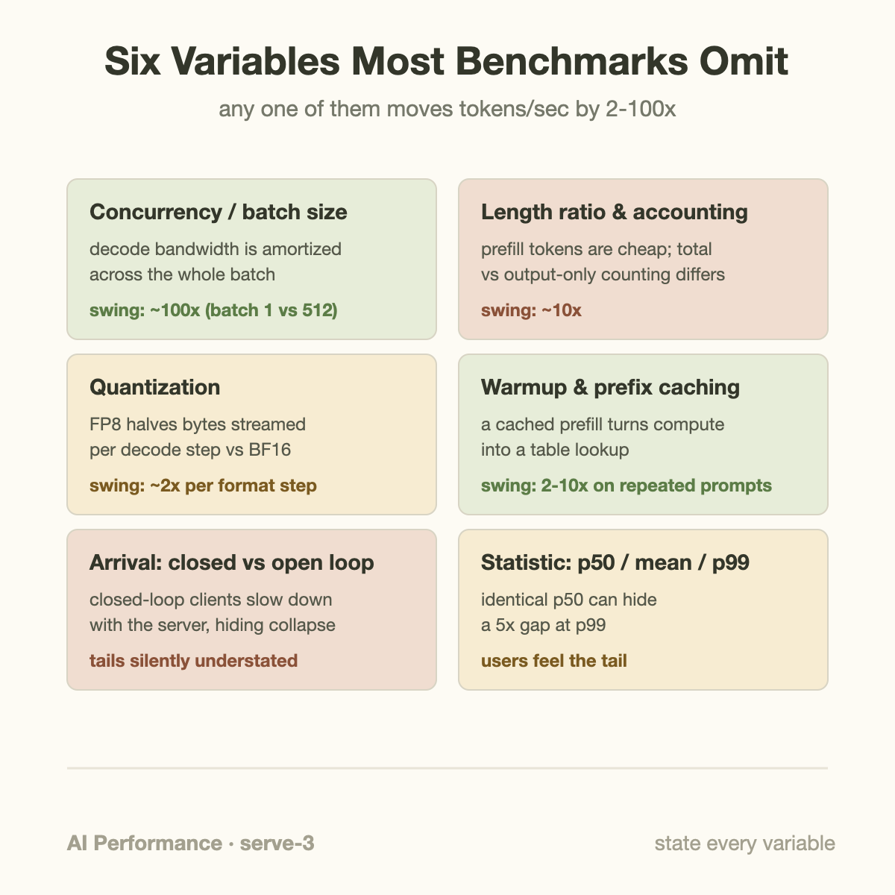
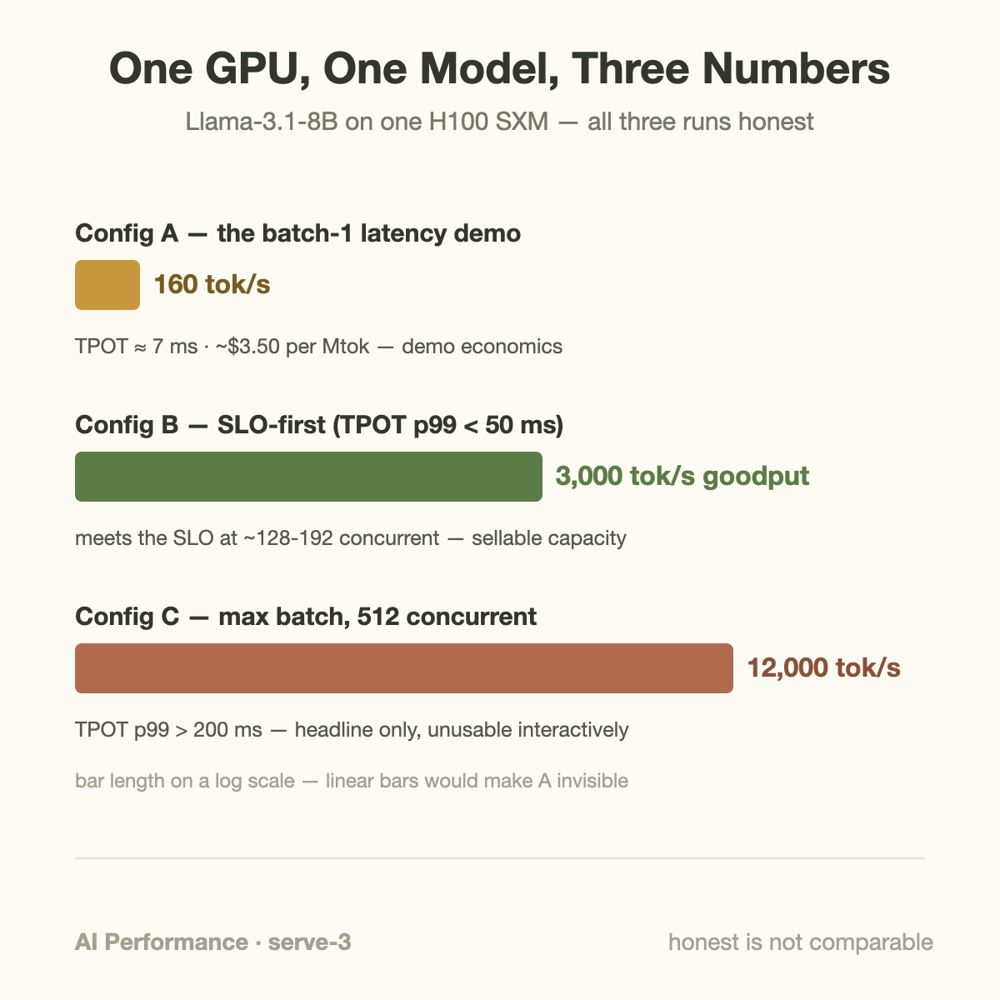
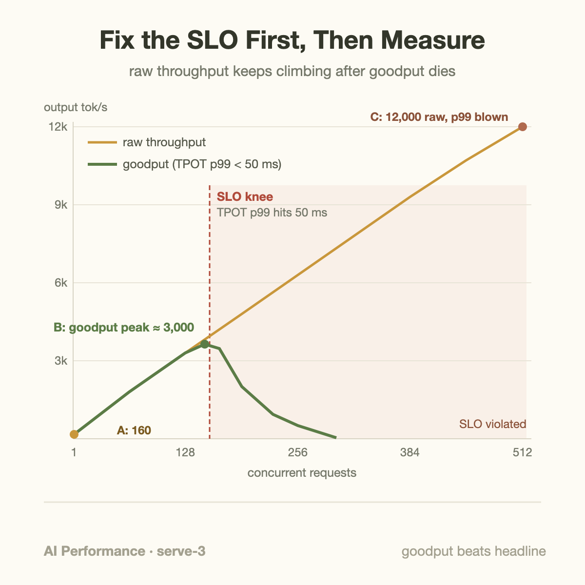

Take one H100, one Llama-3.1-8B checkpoint, and three perfectly honest benchmark runs, and you can publish 160 tokens/sec, 3,000 tokens/sec, or 12,000 tokens/sec. That is a 75x spread with zero fabrication, zero cherry-picked hardware, and zero bugs. Every one of those numbers is reproducible, and every one of them will mislead a reader who does not know which knobs were turned.

This is the uncomfortable truth about LLM serving benchmarks: the headline number is almost never wrong, but it is almost always incomplete. The interesting information lives in the configuration, and the configuration is exactly what press releases, launch blogs, and half of the engineering posts on your feed leave out. This article is about the missing variables, how they move the number, and the one-sentence discipline that makes a benchmark fair: fix the service-level objective first, then measure.

If you want the gentler version of "tokens/sec is not one number," start with [Tokens per Second: What It Hides](/blog/tokens-per-second-what-it-hides/). Here we go further: we will produce the misleading numbers ourselves, by hand, so you can recognize them in the wild.

## The variables nobody states

A serving benchmark is a function with at least six inputs. Publish the output without the inputs and you have published noise.

**Batch size / concurrency.** Decode is memory-bandwidth bound at low batch: every generated token requires streaming the full weight matrix from HBM. Batching amortizes that read across many requests, so aggregate throughput climbs almost linearly with concurrency until compute or KV-cache bandwidth takes over. A number without a concurrency figure can sit anywhere on a curve that spans two orders of magnitude.

**Prompt/output length ratio.** Prefill processes input tokens in parallel and is compute-bound; decode emits output tokens serially and is bandwidth-bound. A workload with 2,000-token prompts and 50-token answers (summarization, RAG) stresses a completely different resource than 100-token prompts with 1,000-token answers (chat, code generation). Worse: some reports count *total* tokens (input + output), others count only output. A prefill-heavy run measured in total tokens/sec can look 10x faster than the same hardware doing chat, because prefill tokens are cheap.

**Quantization.** FP8 halves the weight bytes streamed per decode step relative to BF16, which roughly doubles bandwidth-bound throughput before any other change. INT4/NVFP4 does it again. Comparing an FP8 number against a BF16 number is comparing formats, not systems.

**Warmup and caching.** The first requests hit CUDA graph capture, JIT compilation, and cold allocator paths. Skip warmup and you understate performance; benchmark with a repeated prompt against a server with prefix caching enabled and you overstate it wildly, because "prefill" becomes a cache lookup. vLLM's own benchmark harness disables prefix caching by default for exactly this reason.

**Concurrency model.** Closed-loop (a fixed pool of clients, each sending its next request only after the previous one finishes) versus open-loop (requests arrive on a Poisson clock regardless of whether the server keeps up). This one is subtle and severe enough to get its own section below.

**The statistic.** Mean, median, p99. Latency distributions in queued systems are heavy-tailed, so the mean is dragged around by outliers while p50 hides them entirely. Two services with identical p50 TPOT can differ 5x at p99, and your angriest users live at p99.

## A worked example: three honest numbers from one GPU

Setup: Llama-3.1-8B, BF16 weights (about 16 GB), one H100 SXM with 3.35 TB/s of HBM3 bandwidth and roughly 990 dense BF16 TFLOPS (NVIDIA's official spec; sparsity numbers are double that and are not what you get on real LLM inference). All figures below are back-of-envelope ceilings plus realistic derating, the kind of arithmetic you can redo on a napkin.

**Configuration A: the latency demo.** Batch size 1, short prompt. Every decode step streams all 16 GB of weights, so the bandwidth ceiling is 3,350 / 16 ≈ 209 tokens/sec. Real kernels also read KV cache and pay launch overheads, so you observe something like **160 tokens/sec, TPOT around 6 ms**. This is a spectacular interactive experience and a terrible business: at a $2/hour GPU rate, 160 tok/s works out to about $3.50 per million output tokens for an 8B model, an order of magnitude above competitive API pricing for this size class.

**Configuration C: the throughput headline.** Now run 512 concurrent requests. The 16 GB weight read is amortized across 512 tokens per step, so weights stop being the bottleneck. What takes over is KV cache: with grouped-query attention, this model stores about 131 KB of KV per token (2 bytes x 32 layers x 8 KV heads x 128 head dim x 2 for K and V). At an average context of 1,000 tokens, each decode step reads 512 x 1,000 x 131 KB ≈ 67 GB of KV, which at 3.35 TB/s costs about 20 ms per step as a hard floor. Add prefill work chunked into the same iterations and you land near **12,000 output tokens/sec aggregate — but each individual request now decodes at 20-25 tokens/sec, TPOT p50 of 40-50 ms, with p99 spiking past 200 ms** whenever a fat prompt's prefill chunk lands in the batch. Honest number, real configuration, unusable for an interactive product.

**Configuration B: the SLO-honest number.** Decide the product requirement first: TPOT p99 under 50 ms and TTFT p99 under one second, the point where streaming text stops feeling laggy (see [TTFT and TPOT](/blog/ttft-and-tpot/) for where those thresholds come from). Now sweep concurrency and find the highest load where p99 still clears the bar. On this setup that lands somewhere near 128-192 concurrent requests and roughly **3,000 output tokens/sec of goodput** — throughput that actually meets the SLO.

Same silicon, same weights, same software. 160 vs 3,000 vs 12,000. The spread between the two *marketing* numbers, A and C, is 75x, and neither of them describes what you can sell. Only B does, and B is the number nobody puts in a launch tweet because it requires admitting an SLO.

## Going deeper: closed loops, open loops, and coordinated omission

The concurrency model deserves the extra level of mechanism, because it corrupts the *tail* statistics that the SLO-first method depends on.

A closed-loop benchmark (the default in many harnesses: N worker threads, each in a send-wait-send loop) has a built-in safety valve. When the server slows down, the clients slow down with it, because each client is politely waiting for its previous response. Offered load automatically sags to whatever the server can absorb. You will never observe queueing collapse in a closed-loop test, because the load generator is incapable of producing it. Real traffic has no such courtesy: users arrive when they arrive.

An open-loop benchmark fires requests on an independent schedule, typically Poisson arrivals at a target rate. If the server falls behind, requests pile up in the queue and latency explodes, which is exactly what happens in production at 6 PM. The knee where an open-loop latency curve goes vertical is your true capacity. A closed-loop curve near saturation is a smooth, comforting lie.

The measurement-side twin of this problem is what Gil Tene named *coordinated omission*. Suppose the server stalls for two seconds (a long prefill monopolizes the GPU, a CUDA allocator hiccup, a preemption storm). A closed-loop client sitting in that stall records *one* slow request. But had traffic been arriving at the real rate, twenty requests would have experienced that stall. Your recorded p99 silently omits nineteen of its worst data points, coordinated by the very stall it should be measuring. Open-loop generation with timestamps taken from the *intended* send time, not the actual one, is the fix, and it is why MLPerf Inference defines its Server scenario as Poisson arrivals with a hard per-percentile latency bound rather than "run N clients flat out."

MLPerf's structure is worth internalizing even if you never submit: fixed model, fixed dataset and sequence-length distribution, fixed accuracy target, fixed latency constraint, then and only then report throughput. Every rule exists because someone once exploited its absence.

## Common misconceptions

**"Higher tokens/sec means cheaper per token."** Only under the same SLO and the same token accounting. Configuration C above beats configuration B by 4x on raw throughput and produces tokens that no latency-sensitive customer will accept; its effective cost per *sellable* token is infinite for that market. And if C's report counts input tokens while B's counts output only, the printed gap inflates further without any hardware difference at all. $/Mtok comparisons are meaningless until both sides pin down the SLO, the token definition, and the ISL:OSL mix.

**"p50 is representative; p99 is paranoia."** In a queued system p50 and p99 are shaped by different mechanisms: p50 reflects steady-state decode speed, p99 reflects interference events like prefill bursts, preemptions, and cache evictions. A user session of 50 requests has a 40 percent chance of hitting at least one p99-tail request (1 − 0.99⁵⁰), so the tail is not a rare event for a *user*, it is a near-certainty per session. Products feel like their tails.

**"Two published benchmarks of the same model are comparable."** Almost never. vLLM vs TensorRT-LLM comparisons routinely differ in quantization (FP8 vs BF16), in workload shape (ShareGPT-derived traces vs fixed 1024/1024), in prefix-caching settings, in warmup handling, and in closed vs open-loop generation. Each of those alone can move the number 2x; unstated, they compound. The only trustworthy comparison is one you ran yourself with both engines under one harness, one trace, and one SLO. This is why serious engine teams publish their exact reproduction commands, and why you should distrust any vendor bar chart, self-reported by definition, that doesn't.

## The bigger picture: benchmarks are contracts, not scores

The reason this matters beyond hygiene is that serving architecture decisions hang on these numbers. Whether prefill/decode disaggregation pays off, whether a scheduler change helps, whether FP8 is worth the accuracy audit: every one of those questions is answered by "goodput under the SLO," and answered wrongly by raw throughput. The DistServe authors made this explicit by optimizing *goodput per GPU* (requests served within TTFT and TPOT bounds) rather than tokens/sec, and reported up to 7.4x more requests served under SLO from the same hardware, a gain that a throughput-only benchmark would partially hide and a batch-1 latency benchmark would miss entirely. The same goodput lens, applied cluster-wide, is the subject of [Goodput: Your "100% Utilized" Cluster Is Mostly Wasted](/blog/goodput-vs-utilization/), and the prefill/decode split it motivated is traced in [The Prefill/Decode Disaggregation Story](/blog/the-prefill-decode-disaggregation-story/).

So the discipline, in one sentence: *write the SLO down before you run anything, generate load open-loop at realistic ISL:OSL, report p99 alongside p50, state every one of the six variables, and publish goodput, not the biggest number the GPU can emit.* A benchmark is a contract with a future reader. Most published numbers break that contract not by lying but by omitting the terms.

## Takeaway

- A tokens/sec figure is meaningless without six stated inputs: concurrency, ISL:OSL ratio and token accounting, quantization, warmup/caching policy, arrival model, and the percentile reported. Any one of them can move the number 2-10x.
- The same GPU and model honestly produce 160, 3,000, or 12,000 tok/s depending on configuration; only the SLO-constrained number (fix TPOT/TTFT p99 first, then maximize throughput under it) describes deliverable capacity.
- Benchmark open-loop with Poisson arrivals and intended-send-time latency measurement; closed-loop harnesses structurally cannot show queueing collapse and their tails suffer coordinated omission.

## Sources

- Reddi et al., "MLPerf Inference Benchmark" — [arXiv:1911.02549](https://arxiv.org/abs/1911.02549)
- Zhong et al., "DistServe: Disaggregating Prefill and Decoding for Goodput-optimized Large Language Model Serving" — [arXiv:2401.09670](https://arxiv.org/abs/2401.09670)
- Kwon et al., "Efficient Memory Management for Large Language Model Serving with PagedAttention" (vLLM) — [arXiv:2309.06180](https://arxiv.org/abs/2309.06180)
- vLLM project, serving benchmark harness — [github.com/vllm-project/vllm](https://github.com/vllm-project/vllm)
- NVIDIA H100 Tensor Core GPU specifications — [nvidia.com/en-us/data-center/h100](https://www.nvidia.com/en-us/data-center/h100/)
- Gil Tene, "How NOT to Measure Latency," talk on coordinated omission (Strange Loop / QCon)

*Part of the **AI Performance Engineering** series. Previous: [The Prefill/Decode Disaggregation Story](/blog/the-prefill-decode-disaggregation-story/). Related basics: [Tokens per Second: What It Hides](/blog/tokens-per-second-what-it-hides/).*
