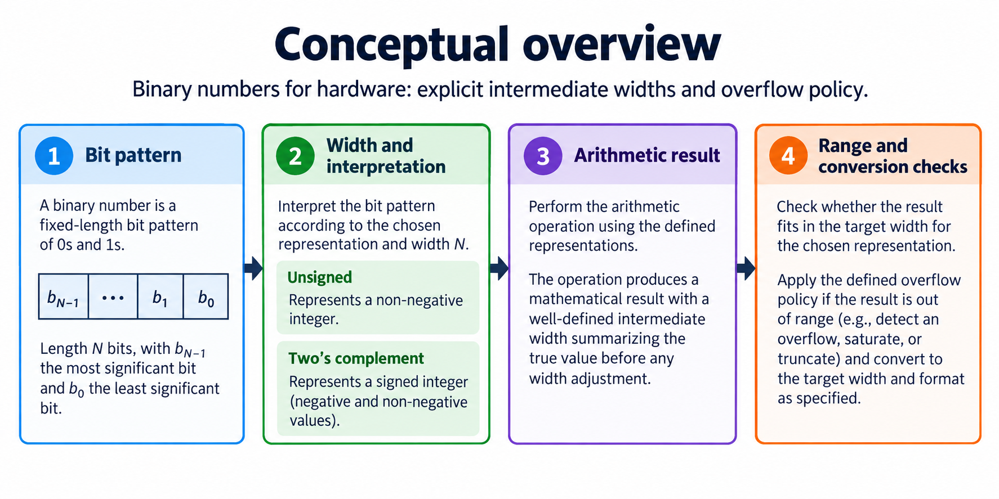
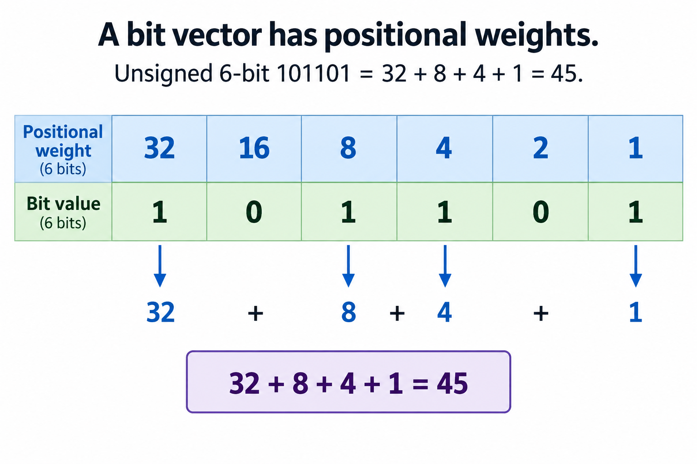
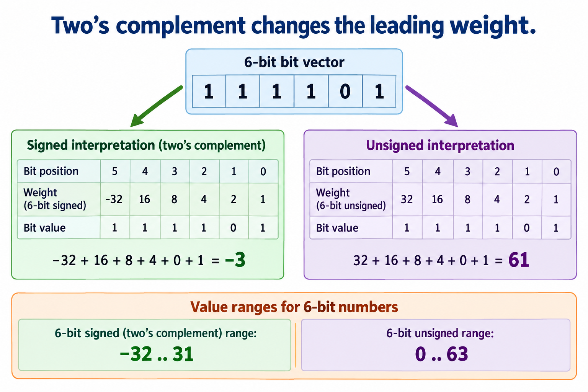
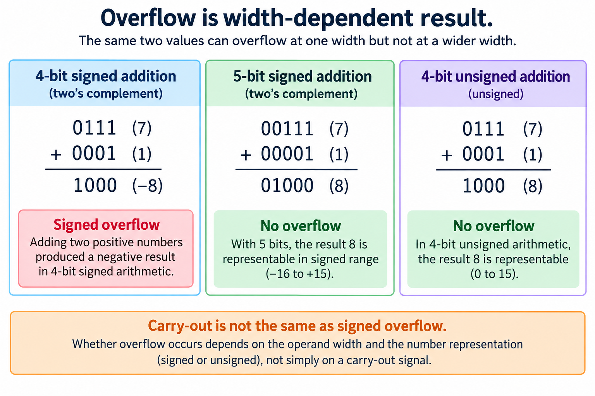
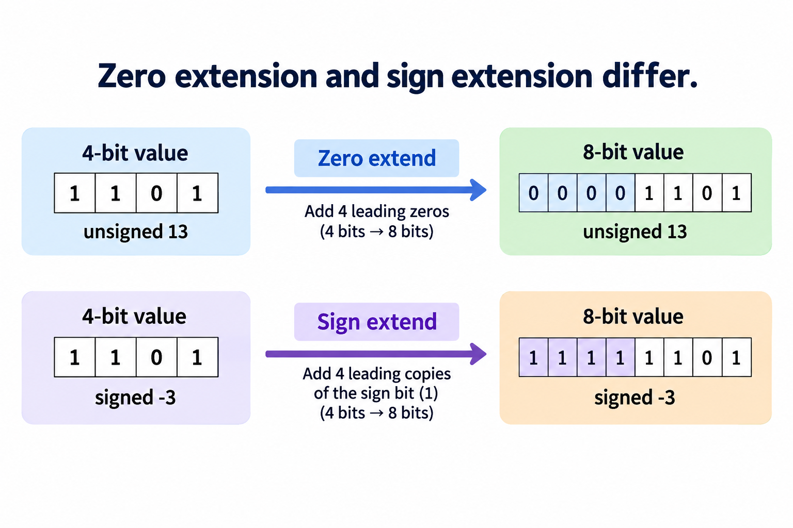

## Overview

The overview separates 3 questions that hardware beginners often merge: which bits are present, how those bits are interpreted, and which width is retained after an operation. A wire vector carries a fixed number of binary digits. Signedness gives those digits a numeric interpretation. Arithmetic and assignment rules determine which resulting digits survive. Correct reasoning needs all 3.

This lesson builds the number representation needed for later FPGA arithmetic. It uses small widths so every example can be checked by hand. The same principles apply to wider counters, addresses, tensor elements, and accumulators, but you must calculate their valid ranges for their own widths. A declaration such as 4 bits does not by itself say whether the value represents an unsigned count or a signed quantity.

Read the [FPGA introduction](/blog/what-is-an-fpga-programmable-hardware/) first if the distinction between logic and state is unfamiliar. You do not need a board to follow this lesson. The [foundations lab](/labs/fpga-fundamentals/foundations-lab.zip) checks decoding, extension, wrapped addition, and the matrix examples used later in the course. These are representation checks, rather than measurements of a particular FPGA implementation.

The figures use explicit bit positions and decimal values. When inspecting a result, first write its width and signedness, then decode it. This habit prevents a visually plausible binary answer from silently becoming a wrong mathematical value. It also gives a precise way to explain an overflow report.

## Deep dive

### A bit vector has positional weights

The first figure assigns a weight to each position in an unsigned 6-bit vector. Starting from the least significant position, the weights are 1, 2, 4, 8, 16, and 32. A 1 selects its weight and a 0 contributes nothing. The vector 101101 therefore represents 32 plus 8 plus 4 plus 1, which equals 45.

State the indexing convention rather than guessing it from the drawing. For a declaration with positions 5 down to 0, bit 5 carries the weight 32 and bit 0 carries the weight 1. The textual vector is usually written most significant bit first. Reversing that order changes the value. If a protocol sends bits or bytes in a different order, that transport convention needs its own definition; it does not change the mathematical weight of a declared bit position.

An unsigned vector of width W represents integers from 0 through 2 to the power W minus 1. W is the number of retained bits. 6 bits therefore provide 64 distinct patterns and a maximum value of 63. Increasing the width adds representable patterns. It does not automatically increase the number of meaningful application values: a counter that visits only 0 through 9 still has 10 legal states even if its register is wider.

A useful decoder can accumulate the selected weights in an ordinary unbounded reference integer. In the lab, the reference masks inputs to the declared width before interpreting them. This makes its contract explicit. A value outside the width cannot be accepted as if the hardware retained all its bits. For example, a value of 64 requires 7 unsigned bits; keeping only 6 leaves the all-0 pattern.

Check the all-0 pattern, the all-1 pattern, and a single one at each position before relying on a more elaborate arithmetic test. These cases expose reversed indexing and incorrect masks. Then enumerate all 64 patterns and verify that decoding and encoding agree within range.

Hardware interfaces benefit from the same discipline. An address, a packed flag field, and an arithmetic operand may all use 6 wires while carrying different meanings. Treating a collection of flags as one unsigned number might be convenient for display, but it does not establish that adding one is a meaningful operation. Representation is part of the interface specification, not a detail you defer until debugging.

### Two’s complement changes the leading weight

Two's complement gives the leading bit a negative weight. For a signed 6-bit vector, the weights are negative 32, 16, 8, 4, 2, and 1. The pattern 111101 sums to negative 3. The identical wires interpreted as unsigned instead sum to 61. The figure shows 2 interpretations of 1 pattern, not 2 different physical signals.

The signed range for width W extends from negative 2 to the power W minus 1 through positive 2 to the power W minus 1 minus 1. Here the phrase W minus 1 is the exponent. For 6 bits, that range is negative 32 through 31. It is asymmetric because 0 uses 1 pattern and the leading negative weight allows one additional negative magnitude. A design must account for this asymmetry when taking absolute values or negating the most negative input.

One practical decoding rule first gets the unsigned value. If the leading bit is 0, the signed value is unchanged. If that bit is 1, subtract 2 to the power W. For 111101, 61 minus 64 equals negative 3. The reference decoder uses this rule, which is independent of the later arithmetic DUT. It also handles the boundary pattern 100000 as negative 32.

The representation does not announce itself on a waveform. A simulator display may show hexadecimal digits unless the viewer is configured to interpret them as signed. A log that prints the pattern D without its width or interpretation leaves important information missing. 4-bit 1101 is unsigned 13 or signed negative 3; an 8-bit pattern containing the same low digits may mean something else if its upper bits differ.

Mixed signed and unsigned expressions need extra care in HDL. Declarations, literals, casts, and intermediate widths can influence the result. The [SystemVerilog author tutorial](https://systemverilog.dev/3.html) is useful alongside the language and tool documentation when introducing procedural hardware descriptions. In this course, the reference examples always specify interpretation rather than relying on implicit conversion.

Before comparing an output with a reference value, decide whether you are comparing the retained bit pattern or the represented integer. Both can be useful, but they answer different questions. A correct wrapped bit result may still be outside the application's allowed mathematical range. Recording both makes overflow and signedness failures easier to tell apart.

### Overflow is a width-dependent result

The overflow figure adds signed 4-bit 7 and one. The retained pattern is 1000, which represents negative 8 under 4-bit two's complement. The mathematical sum is positive 8, outside the signed range negative 8 through 7. This mismatch is signed overflow. The hardware's low 4 bits can be exactly as specified even though they cannot represent the intended mathematical result.

Widening both operands before addition changes the contract. 5-bit 00111 plus 00001 produces 01000, which represents positive 8. The important step is to keep enough width in the computation, not to attach a wider register after a previously truncated result. Check a source-level expression for its own sizing rules. The beginner lab uses explicit extension where the DUT should preserve a carry.

Carry-out and signed overflow are different conditions. Unsigned 4-bit 7 plus 1 fits in the range 0 through 15. The resulting pattern 1000 is valid unsigned 8 and no unsigned carry is required. The same addition overflows the signed 4-bit range. Conversely, unsigned 15 plus 1 wraps to 0 with a carry, while the signed interpretation of 1111 plus 0001 is negative 1 plus 1, which produces 0 without signed overflow.

For equal-width 2's-complement addition, a useful overflow check asks whether the operands have the same sign while the retained result has the opposite sign. This rule concerns addition under that representation; it should not be casually reused for subtraction or multiplication without deriving the relevant condition. The lab also compares the full reference sum against the permitted signed range, giving an independently understandable criterion.

Enumerate every signed 4-bit operand pair to compare the 2 criteria. There are 16 patterns for each operand and therefore 256 pairs. For each pair, keep the wrapped result and record whether the unbounded mathematical sum falls outside the representable range. Boundary examples alone can miss a mistake in a sign test.

The system response to overflow is another design decision. Wrapping, saturating, reporting an error, and using a wider accumulator are different behaviors. None follows automatically from the word signed. Later INT8 arithmetic uses wider accumulators because many products can contribute to one sum. This lesson shows why you must justify a local result width before discussing a complete accelerator's numerical accuracy.

### 0 extension and sign extension differ

Extension adds upper bits while preserving a chosen interpretation. The left path starts with 4-bit 1101 treated as unsigned 13. Adding 4 zeros produces 8-bit 00001101, still unsigned 13. The right path treats the initial pattern as signed negative 3. Replicating its leading 1 produces 11111101, which remains signed negative 3 in 8-bit two's complement.

Sign extension follows from the positional weights, not from a visual rule about filling empty space. Adding a new leading 1 introduces a larger negative weight while the old leading 1 becomes a positive weight. Their difference preserves the original negative contribution. Repeating this step for several added positions leaves the represented value unchanged. Positive signed values extend with zeros because their leading bit is 0.

Zero extension is appropriate for an unsigned count or address. Applying it to a negative 2's-complement operand changes its meaning: 4-bit 1101 becomes positive 13 when the 8-bit leading bits are 0. Sign-extending a pattern intended as unsigned 13 and later decoding it as signed instead produces negative 3. The circuit must know which interpretation the interface intended.

Narrowing is a separate operation. Retaining the low 4 bits of a wider value does not guarantee preservation. 8-bit positive 13 narrowed to signed 4 bits becomes negative 3. A safe conversion requires the source value to lie within the destination range, or it requires an explicit policy for an out-of-range input. Implement saturation as a range check and selection; it is not an ordinary truncation.

Use 3 columns in conversion tests: original integer, original pattern with width and signedness, and destination pattern with width and signedness. Test the minimum and maximum values and values immediately outside the destination range. The lab enumerates extension over every 4-bit pattern so both positive and negative cases are included.

This reasoning becomes practical when a narrow tensor element enters a wider multiplier or accumulator. Correctly extending an INT8 operand is part of preserving its value before arithmetic. The [INT8 arithmetic lesson](/blog/fpga-ai-number-1-int8-arithmetic/) applies the same principles to products, quantization, and sum bounds. First learn the representation here; then calculate the wider application's range instead of assuming that one extension example proves every numerical path.

## Conclusion

A binary answer is meaningful only when its width and interpretation are stated. Positional weights decode unsigned values, two's complement changes the leading weight, and extension preserves a value only under the intended signedness. Overflow reports that a mathematical result does not fit the retained representation; it is not interchangeable with carry-out.

Before writing an arithmetic interface, specify input widths, signedness, intermediate widths, destination range, and out-of-range behavior. Make the reference model use unbounded integers before applying the declared representation policy. Then compare the intended integer and the retained pattern separately when necessary. This is especially useful for tensor products and accumulations.

Continue with [combinational logic](/blog/combinational-logic-truth-tables-multiplexers/) to express complete functions over those vectors. The clocked-state and simulation lessons show how to retain results and check them across edges. Later, dot products and INT8 bounds connect these fundamentals to AI computation without skipping the representation contract.

### Sources

- [SystemVerilog procedural hardware descriptions](https://systemverilog.dev/3.html)
