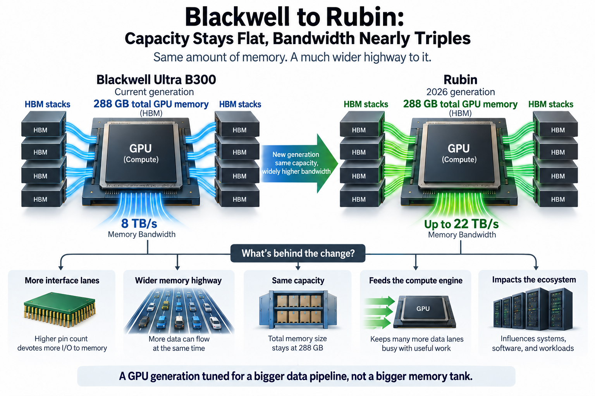
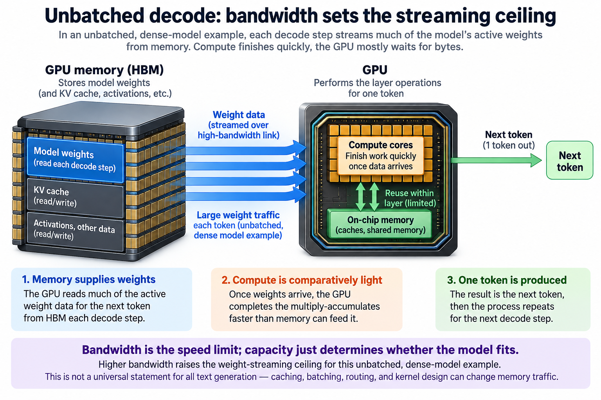
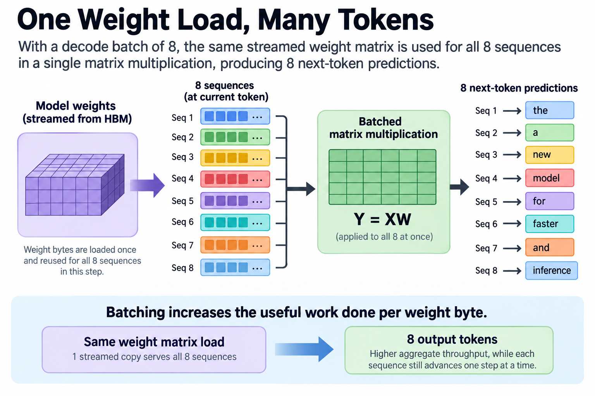
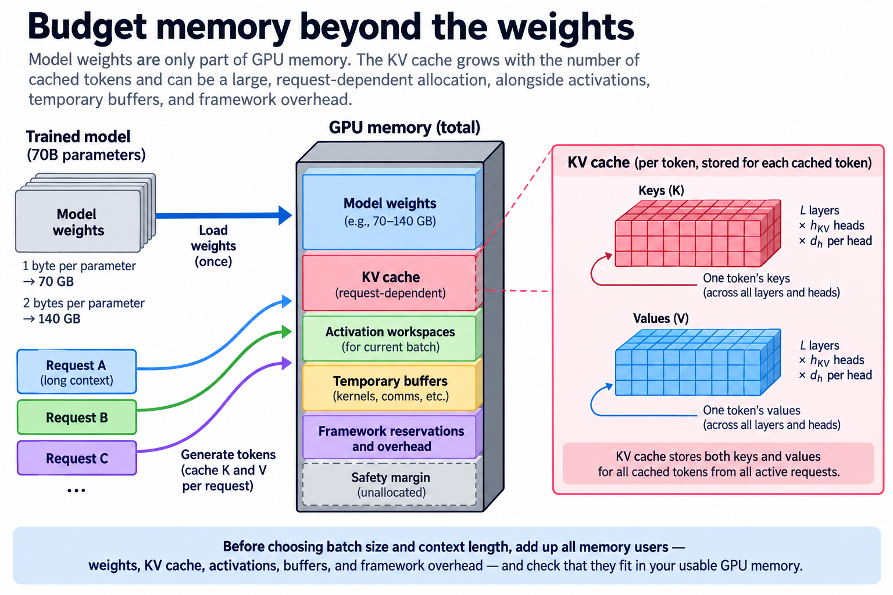
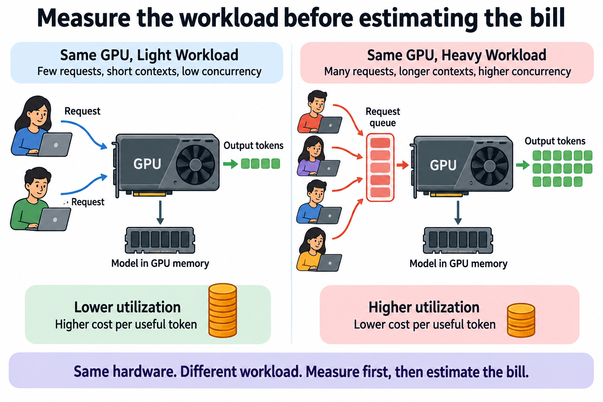

## Overview

Here is the strangest number pair in the GPU roadmap: NVIDIA's current flagship carries 288GB of memory, and its 2026 successor is specified with 288 GB. Meanwhile bandwidth jumps from 8 TB/s to up to 22 TB/s — nearly 3×.

A generation where capacity freezes while bandwidth explodes is not an accident. It is the clearest public signal of what actually limits AI workloads. This article decodes it.

## Deep dive

### The numbers on the table

Blackwell Ultra and MI355X both specify: **288GB of HBM3e at 8 TB/s** (NVIDIA GB300, AMD MI355X). You can only compare precision-specific peak throughput under matched numerical-format and sparsity assumptions, so this article compares memory specifications instead.

NVIDIA's [official HGX specifications](https://www.nvidia.com/en-us/data-center/hgx/) list Rubin with 288 GB HBM4 and up to 22 TB/s bandwidth. AMD's [MI400 series specifications](https://www.amd.com/en/products/accelerators/instinct/mi400.html) list MI455X with 432 GB HBM4 and up to 23.3 TB/s. These are vendor peak specifications, not measured application results. This comparison was checked September 13, 2026.

### Why bandwidth is the axis that matters

To see why NVIDIA spends its transistor and packaging budget on bandwidth, follow what an LLM does when it generates text.

An unbatched dense-model decode step commonly reads much of its active weight data from memory. Caching, routing, and kernel design affect actual traffic. A 70B-parameter model in 8-bit needs about 70 GB of weight traffic per decode step in an idealized unbatched dense-model example. The compute involved is comparatively light — multiply-accumulates the GPU finishes faster than the memory can feed it. Text generation is, in the standard framing, **memory-bandwidth-bound**: the GPU spends its time waiting for bytes, not crunching them.

Run the division and the ceiling is stark: 8 TB/s ÷ 70GB ≈ **114 tokens/second** for a single stream, before any cleverness. Bandwidth is the speed limit; capacity just determines whether the model fits at all. Once weights fit, extra capacity may still allow longer contexts, larger batches, or fewer shards. Extra bandwidth raises a different ceiling.

That's the roadmap decoded: 288 GB fits many models or individual shards, but not every large model and request configuration. Higher bandwidth raises an idealized weight-streaming ceiling; whether that is the best design trade depends on the intended workload.

### The pin-count story underneath

The bandwidth jump has a physical cause: [HBM4 doubles the interface width to 2,048 pins per stack](https://news.skhynix.com/en/sk-hynix-completes-worlds-first-hbm4-development-and-readies-mass-production/), versus 1,024 since HBM2. SK hynix reports >40% better power efficiency alongside the 2× bandwidth per stack. Memory manufacturing and packaging are real supply constraints; specifications alone do not tell you which component gates a particular product launch.

There is a second-order signal in AMD's 432GB counter-bet. Bigger memory pools reduce how many GPUs a giant model must be sharded across, which cuts inter-GPU communication — a different efficiency lever aimed at the same bill. 2 vendors, same physics, 2 positions on the capacity-bandwidth trade.

### What this means for the ecosystem

- **For serving economics**: bandwidth affects 1 decode limit, while utilization, batching, compute, power, and prices determine realized cost.
- **For model designers**: architectures that read fewer bytes per token — mixture-of-experts, latent attention, aggressive quantization — multiply with the hardware gain rather than merely riding it. (This co-evolution is the through-line of this whole series.)
- **For buyers**: if your models already fit, a capacity-heavy SKU can allow consolidation or higher batching; benchmark whether those changes improve your target metric. Know which one your bill needs.

The specifications are now available from vendors. Their peak numbers still need workload measurements before you make speed or cost claims.

### A ceiling is a model with assumptions

The division above uses decimal units: 1 TB is 1 1000 GB. Let W denote weight bytes read during 1 decode step and B denote sustained memory bandwidth in bytes per second. If memory traffic dominates the step, the idealized token-rate ceiling for 1 sequence is

$$
r_{\mathrm{decode}}\leq\frac{B}{W}.
$$

Substituting 8,000 GB/s and 70 GB gives about 114.3 tokens per second. Substituting 22,000 GB/s gives about 314.3. Their ratio is 2.75, exactly the ratio of the specified bandwidths. This is a consequence of holding the model and traffic assumptions fixed, not an observed speedup for a released inference engine.

The estimate omits KV-cache reads, activations, quantization scales, temporary buffers, launch costs, collective communication, and imperfect bandwidth utilization. If achieved bandwidth is 60% of peak in a hypothetical experiment, the corresponding weight-only rates become 68.6 and 188.6. Actual efficiency need not remain equal across 2 hardware generations.

The inequality also assumes the relevant weights are read each step. On-chip cache can help sufficiently small models or repeated data. Sparse routing changes which experts are active, and implementation overhead can increase traffic above a clean parameter-byte calculation. A useful model states which bytes move rather than treating the headline parameter count as measured memory traffic.

### Why batching changes the interpretation

If a decode batch contains b sequences, 1 streamed weight matrix can contribute to all b token predictions in a matrix multiplication. Ideally, the same weight bytes serve more useful arithmetic. The step produces b output tokens instead of 1, so aggregate throughput can improve even when each sequence waits for one step at a time.

For a hypothetical batch of 8 and a weight-only step time of 8.75 milliseconds, the aggregate ceiling is about 914 tokens per second, while each sequence's step rate is about 114 tokens per second. This idealization ignores the extra work and memory needed for 8 distinct prefixes. It illustrates why aggregate tokens per second and per-user latency are different quantities.

As batching increases, the matrix multiplication becomes more compute-intensive. The bottleneck can move from bandwidth toward compute throughput, KV attention, communication, or scheduling. A bandwidth ratio then no longer predicts the complete application speed ratio. The same hardware can be memory-bound for 1 batch size and compute-bound for another.

Capacity directly enters this story. More memory can hold more active requests and longer KV caches, which allows a different operating point. A comparison that says memory capacity never improves throughput misses that coupling. Separate the single-stream idealization from a production server's throughput under latency constraints.

### Budget memory beyond the weights

Suppose a model has 70 billion stored parameters. At 1 byte per parameter, parameter data alone occupy 70 GB in decimal units. At 2 bytes, they occupy 140 GB. Packed lower-precision representations need scale metadata and supported kernels; “4-bit weights” does not mean every allocation is exactly half a byte per parameter.

KV memory adds a request-dependent term. For a conventional grouped-query attention stack, a rough uncompressed cache estimate is

$$
M_{\mathrm{KV}}=2Lh_{\mathrm{KV}}d_hTs,
$$

where L is the number of cached attention layers, $$h_{\mathrm{KV}}$$ the number of KV heads, $$d_h$$ head width, T cached tokens across requests, and s bytes per cached scalar. The factor of 2 accounts for keys and values. Latent, recurrent, quantized, and cross-layer-sharing designs need their own formulas.

Using an illustrative 80-layer stack, 8 KV heads, width 128, and 2-byte cache values gives 327,680 bytes per cached token. A total of 100,000 cached tokens uses about 32.8 GB before paging metadata and allocator overhead. That is enough to make capacity relevant even when the weights themselves fit comfortably.

Add activation workspaces, framework reservations, temporary buffers, and a safety margin. Then check whether the intended batch and context lengths fit. A hardware specification lists total available memory, while a deployed process has a smaller usable budget. Measure the allocations that actually occur with your engine and numerical formats.

Capacity and bandwidth interact through private state. Let $$W$$ be shared weight traffic per decode step, $$K$$ private KV traffic per request, $$b$$ batch size, and $$\beta$$ achieved bandwidth. Under a memory-dominated equal-context model,

$$
T_b\ge\frac{W+bK}{\beta},\qquad r_{\mathrm{aggregate}}\le\frac{b\beta}{W+bK}.
$$

For hypothetical $$W=70$$ GB, $$K=2$$ GB, and $$b=8$$, total traffic is 86 GB. At 8 TB/s the bandwidth floor is 10.75 ms and the aggregate ceiling about 744.2 tokens/s. At 22 TB/s it becomes 3.909 ms and about 2046.5 tokens/s, if achieved efficiency and all other constraints remain equal. The earlier weight-only batch ceiling of about 914 tokens/s is therefore optimistic when this private traffic is included.

The engineering method is to identify which traffic is shared and which grows with requests before interpreting a hardware ratio. More capacity can permit a larger batch or fewer communication-heavy shards; more bandwidth speeds up a fixed traffic pattern. Neither automatically scales useful service output in proportion to a specification. When compute or communication becomes limiting, use its measured time alongside this traffic floor. Treat the roadmap as an interface budget, then compare equal model quality, concurrency, and tail-latency constraints. Strategic intent is an inference from specifications, not something this numerical example proves.

### HBM bandwidth is a physical interface budget

Memory bandwidth depends on interface width, transfer rate, and the number of memory stacks. A wider interface can move more bits per transfer, but final GPU bandwidth also depends on how many stacks are integrated and what operating rate the system supports. Doubling interface width by itself does not prove a whole product will deliver exactly twice the application's useful bandwidth.

HBM integrates stacked memory close to compute through advanced packaging. That reduces some distances and enables many parallel connections, while introducing manufacturing, thermal, yield, and packaging constraints. Capacity choices also depend on stack height and density. The vendor's chosen combination reflects multiple physical and commercial tradeoffs.

It is tempting to read a product specification as a unique statement of designer intent. Equal capacity with higher bandwidth is consistent with targeting bandwidth-sensitive workloads, but it does not prove that every transistor or packaging dollar was allocated for that reason. Explain the engineering consequences we can calculate and label strategic interpretations as interpretations.

### Measure the workload before estimating the bill

A practical comparison starts with a fixed model/checkpoint, precision, request distribution, context lengths, concurrency, and service-level objective. Record time to first token, per-token latency, accepted throughput, memory usage, and power under those conditions. A peak bandwidth number alone gives you none of those application measurements.

Next compare system boundaries. A single GPU, an 8-GPU node, and a rack have different communication paths and capacity pools. Summed device memory is not automatically a uniform low-latency allocation space, and summed bandwidth is not automatically available to 1 kernel. State tensor, pipeline, and expert parallelism settings when they affect the result.

Finally convert useful throughput into cost using the actual ownership or rental assumptions. Faster hardware can have a higher hourly cost and still reduce cost per useful token, or fail to do so at low utilization. Queueing and latency targets can prevent using the nominal maximum batch. Compute the economics from the measured operating point instead of equating a bandwidth uplift with a price reduction.

### A small decision worksheet

Before comparing 2 accelerators, write down the model weight format, usable device memory, total cached tokens, expected batch size, and latency target. Estimate weight and KV allocations separately, then verify them with the inference engine. Measure sustained bandwidth and useful throughput on representative requests rather than synthetic traffic alone.

If 1 configuration cannot meet the memory budget, check whether quantization, shorter context, or more shards changes that constraint. If both fit, check whether decode, prefill, communication, or idle capacity dominates the measured time. This worksheet makes the comparison reproducible and shows which assumption would need to change before a different hardware choice becomes attractive.

### Common misconceptions

**“Capacity and bandwidth are interchangeable.”** Capacity determines how much state fits; bandwidth limits how fast data can be moved. They affect different constraints and can interact through batching and sharding.

**“Peak bandwidth is sustained bandwidth.”** Real access patterns and kernels generally achieve a workload-dependent fraction. Use peak as an upper bound and measurements as the deployment evidence.

**“All LLM work is decode.”** Prompt processing, training, attention over long contexts, tool orchestration, and decoding have different resource demands. A favorable unbatched decode estimate does not establish a universal winner.

## Conclusion

- Generating a token means streaming the model's active weights through memory; for large models this makes decode bandwidth-bound, and memory bandwidth can set a ceiling under the stated unbatched dense-model assumptions.
- The Blackwell→Rubin roadmap (288 GB flat, 8→up to 22 TB/s) is that physics written into product strategy; AMD's 432GB MI455X bets on the consolidation axis instead.
- HBM4's 2,048-pin interface is the enabler — and 1 part of the manufacturing and packaging budget.

### Sources

- NVIDIA — [Inside Blackwell Ultra](https://developer.nvidia.com/blog/inside-nvidia-blackwell-ultra-the-chip-powering-the-ai-factory-era/) (GB300 specs, NVFP4)
- NVIDIA — [HGX specifications](https://www.nvidia.com/en-us/data-center/hgx/) and [Rubin architecture](https://developer.nvidia.com/blog/inside-nvidia-rubin-gpu-architecture-powering-the-era-of-agentic-ai/) (official peak specifications)
- SK hynix — [HBM4 development complete](https://news.skhynix.com/en/sk-hynix-completes-worlds-first-hbm4-development-and-readies-mass-production/)
- AMD — [Instinct MI455X](https://www.amd.com/en/products/accelerators/instinct/mi400/mi455x.html)

---

*Part of the [Efficient AI & Co-Design](/series/efficient-ai/) learning path. Browse its published articles by topic.*
