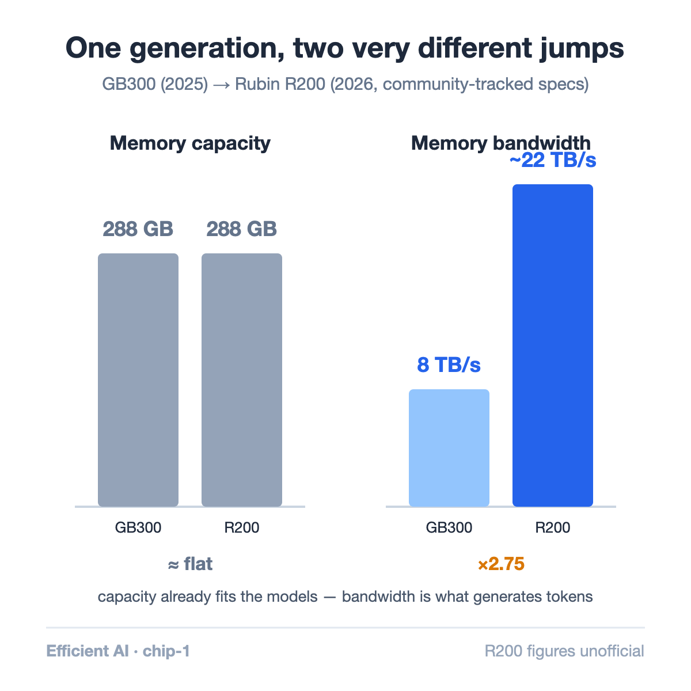
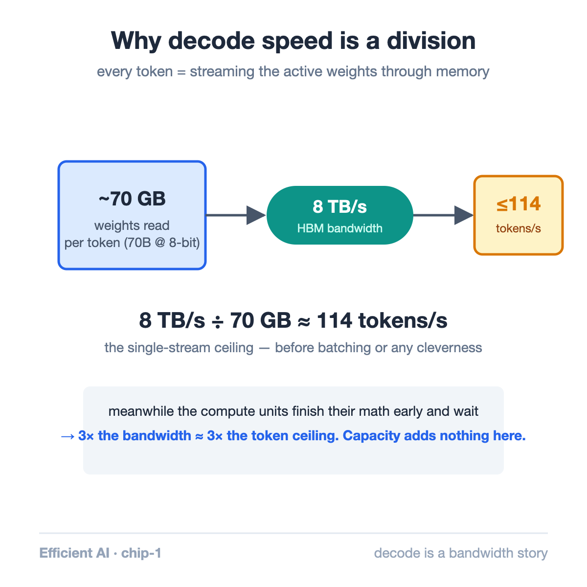

Here is the strangest number pair in the GPU roadmap: NVIDIA's current flagship carries 288GB of memory, and its 2026 successor is reported to carry… 288GB. Meanwhile bandwidth jumps from 8 TB/s to a reported 22 TB/s — nearly 3×.

A generation where capacity freezes while bandwidth explodes is not an accident. It is the clearest public signal of what actually limits AI workloads. This article decodes it.

## The numbers on the table

The shipping generation is defined by a spec both NVIDIA and AMD converged on: **288GB of HBM3e at 8 TB/s** (NVIDIA GB300, AMD MI355X). Blackwell Ultra's 1.5× compute uplift over base Blackwell comes almost entirely from [NVFP4, its 4-bit number format](https://developer.nvidia.com/blog/inside-nvidia-blackwell-ultra-the-chip-powering-the-ai-factory-era/) — a topic for its own article.

For the next generation, community-tracked specs for NVIDIA's Rubin R200 ([compiled by Glenn Lockwood](https://www.glennklockwood.com/garden/processors/r200) — unofficial, treat accordingly) show capacity flat at 288GB while HBM4 pushes bandwidth to ~22 TB/s. AMD's officially announced [MI455X](https://www.amd.com/en/products/accelerators/instinct/mi400/mi455x.html) counters on the other axis: 432GB at 23.3 TB/s — 1.5× the memory at similar bandwidth.

## Why bandwidth is the axis that matters

To see why NVIDIA spends its transistor and packaging budget on bandwidth, follow what an LLM does when it generates text.

Producing one token requires streaming essentially **all of the model's active weights** through the compute units. A 70B-parameter model in 8-bit needs ~70GB read from memory *per token, per user*. The compute involved is comparatively light — multiply-accumulates the GPU finishes faster than the memory can feed it. Text generation is, in the standard framing, **memory-bandwidth-bound**: the GPU spends its time waiting for bytes, not crunching them.

Run the division and the ceiling is stark: 8 TB/s ÷ 70GB ≈ **114 tokens/second** for a single stream, before any cleverness. Bandwidth is the speed limit; capacity just determines whether the model fits at all. Once it fits, extra gigabytes generate no extra tokens — extra TB/s do.

That's the roadmap decoded: 288GB already fits today's flagship models (or their shards, in multi-GPU serving). Tripling bandwidth nearly triples the token speed limit. Capacity would have been the wrong place to spend.

## The pin-count story underneath

The bandwidth jump has a physical cause: [HBM4 doubles the interface width to 2,048 pins per stack](https://news.skhynix.com/en/sk-hynix-completes-worlds-first-hbm4-development-and-readies-mass-production/), versus 1,024 since HBM2. SK hynix reports >40% better power efficiency alongside the 2× bandwidth per stack. It also means the memory ramp — not GPU logic — now gates the generation: whoever secures HBM4 supply ships.

There is a second-order signal in AMD's 432GB counter-bet. Bigger memory pools reduce how many GPUs a giant model must be sharded across, which cuts inter-GPU communication — a different efficiency lever aimed at the same bill. Two vendors, same physics, two positions on the capacity-bandwidth trade.

## What this means for the ecosystem

- **For serving economics**: token prices track bandwidth more than FLOPS. A ~2.75× bandwidth generation is, to first order, a ~2.75× decode-throughput generation for large models.
- **For model designers**: architectures that read fewer bytes per token — mixture-of-experts, latent attention, aggressive quantization — multiply with the hardware gain rather than merely riding it. (This co-evolution is the through-line of this whole series.)
- **For buyers**: if your models already fit, a capacity-heavy SKU buys you consolidation, not speed. Know which one your bill needs.

One honest caveat: Rubin's numbers are pre-launch and community-compiled; treat every figure here as directional until official spec sheets land. The *shape* of the bet — bandwidth over capacity — is consistent across every source.

## Takeaway

- Generating a token means streaming the model's active weights through memory; for large models this makes decode bandwidth-bound, and TB/s — not TFLOPS — the speed limit.
- The Blackwell→Rubin roadmap (288GB flat, 8→~22 TB/s) is that physics written into product strategy; AMD's 432GB MI455X bets on the consolidation axis instead.
- HBM4's 2,048-pin interface is the enabler — and the supply bottleneck that now paces the industry.

## Sources

- NVIDIA — [Inside Blackwell Ultra](https://developer.nvidia.com/blog/inside-nvidia-blackwell-ultra-the-chip-powering-the-ai-factory-era/) (GB300 specs, NVFP4)
- Glenn Lockwood — [Rubin R200 spec compilation](https://www.glennklockwood.com/garden/processors/r200) (⚠ unofficial)
- SK hynix — [HBM4 development complete](https://news.skhynix.com/en/sk-hynix-completes-worlds-first-hbm4-development-and-readies-mass-production/)
- AMD — [Instinct MI455X](https://www.amd.com/en/products/accelerators/instinct/mi400/mi455x.html)

---

*Part of the **Efficient AI & Co-Design** series. Next in series: NVFP4 vs MXFP4 — inside the 4-bit format war.*
