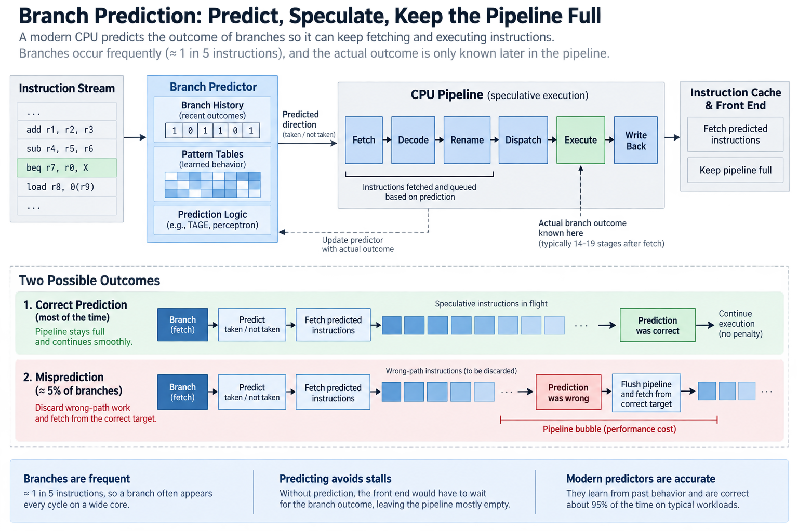
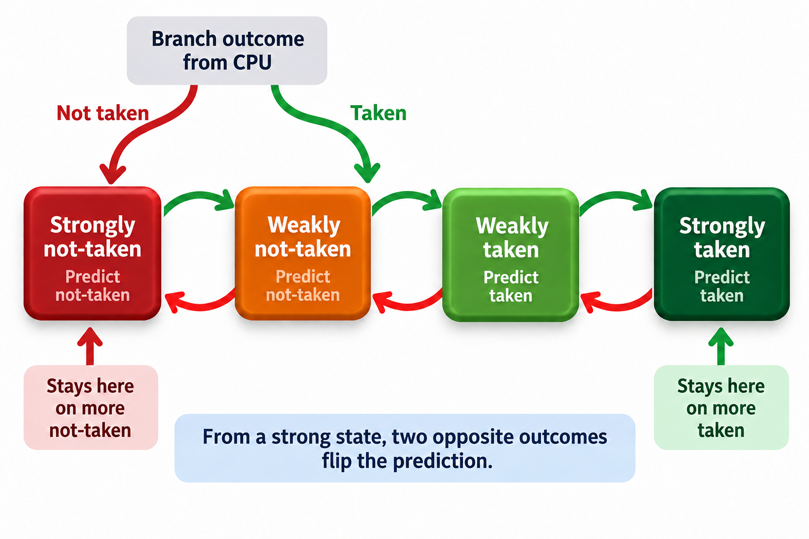
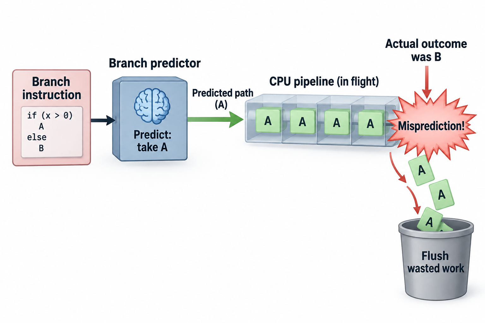
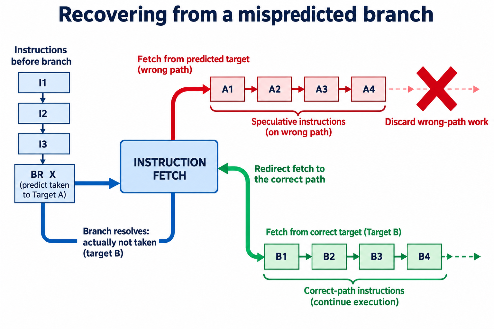

## Overview

1 instruction in 5. That's roughly how often a typical program asks the CPU to make a decision: an `if`, a loop test, a function return, a virtual call. In a processor executing 4 instructions per cycle, a branch shows up almost every single cycle, and the pipeline that makes the machine fast is exactly what makes each branch dangerous.

Recall the assembly line from [the pipeline article](/blog/what-a-cpu-actually-does/): a modern core doesn't finish 1 instruction before starting the next, and it has 14 to 19 stages of work in flight at once, with fetch running many cycles ahead of execute. Now look at what a branch does to that arrangement. The instruction says "if this register is 0, jump to address X; otherwise fall through," but the comparison happens deep in the pipeline, at the execute stage. By the time the CPU *knows* which way the branch goes, it has already fetched, decoded, and queued 15-plus instructions behind it. Which instructions should those have been? The ones at address X, or the ones right after the branch?

The honest answer is "wait until you know." The honest answer is also a performance disaster. Stalling the front end for every branch, with branches arriving every 4 or 5 instructions, would leave the pipeline mostly empty, and early RISC machines actually shipped this problem to the compiler as "branch delay slots." Modern CPUs do something bolder: they gamble.

## Deep dive

### Predict, then speculate

The bet has 2 halves. First, a **branch predictor** guesses the outcome the moment the branch is fetched, long before it executes, and it guesses taken or not-taken, and if taken, to what address. Second, the CPU **speculatively executes** down the predicted path: it doesn't just fetch the guessed instructions, it decodes them, renames their registers, executes them, computes real results. Everything is held in a kind of escrow, the reorder buffer, which we'll meet properly in the next article. It only becomes permanent, "retires," once the branch resolves and confirms the guess.

If the guess was right, the front end avoids the misprediction recovery penalty, the branch still uses predictor and execution resources, and the pipeline never hiccuped. The machine ran as if it could see the future.

If the guess was wrong, everything fetched after the branch is garbage, so the CPU flushes it: every in-flight instruction on the wrong path is discarded, the front end redirects to the correct address, and the pipeline refills from empty. On current Intel and AMD cores that penalty runs **roughly 15 to 20 cycles**, a figure you can cross-check in Agner Fog's microarchitecture manuals. 15 cycles in which a machine built to complete 4 to 6 instructions per cycle completes approximately none.

So everything hinges on the win rate. And this is where the story gets genuinely clever.

### How the predictor learns

The simplest dynamic predictor is 1 bit per branch: remember what this branch did last time, predict the same. It sounds reasonable and fails embarrassingly on the most common branch in all of computing, the loop test, because a loop that runs 100 iterations has a branch that's taken 99 times and not-taken once. A 1-bit predictor mispredicts twice per loop execution: once at the final iteration (it expected "taken"), and once at the *first* iteration of the next run (it now expects "not-taken"). 1 surprise becomes 2 mistakes.

The fix, proposed by James E. Smith in 1981, is a **2-bit saturating counter**: a tiny state machine with 4 states from "strongly not-taken" to "strongly taken." A taken branch nudges the counter up, a not-taken branch nudges it down, and it saturates at the ends. The crucial property is hysteresis: 1 wrong outcome moves a "strong" state to a "weak" 1 but doesn't flip the prediction, so the predictor needs to be wrong twice in a row to change its mind. Our 100-iteration loop now mispredicts once per run instead of twice: 99% accuracy from 2 bits of memory.

A CPU keeps thousands of these counters in a table, indexed by the branch's address, so every branch in your program gets its own little gambler with its own memory.

The next leap came from noticing that branches have *context*. Consider `if (x != 0) { ... }` inside code where x alternates between 0 and nonzero: taken, not-taken, taken, not-taken. Any per-branch counter settles into a confused middle state and wins only half its bets, but the pattern is perfectly predictable if you remember the recent *history*. 2-level adaptive predictors (Yeh and Patt, 1991) keep a shift register of the last N branch outcomes, and they use that history, combined with the branch address, to pick which counter to consult. The alternating branch now maps its 2 contexts to 2 different counters, each of which becomes strongly confident. McFarling's **gshare** (1993) made this cheap by XORing the history with the address to index 1 shared table.

Modern predictors push much further, and **TAGE** (Seznec and Michaud, 2006), an influential published predictor family, runs several tables in parallel. Each table tracks a different history length, from a few branches to several 100, in a geometric series, and TAGE trusts the longest history that has a confident, tagged match. **Perceptron** predictors, introduced by Jiménez and Lin in 2001, take another approach: each recent branch outcome gets a signed weight, the predictor sums them, and the sign of the sum is the prediction, so it is, quite literally, a single-layer neural network etched into the silicon of the machine that will later run your PyTorch jobs. Trained online, in hardware, making a prediction every cycle.

On real workloads these predictors hit **95 to 99% accuracy**. Which sounds like the problem is solved. Let's check that with actual numbers.

### A worked example: what 95% really costs

Take a program of 1 billion instructions on a 4 GHz core that can otherwise sustain 4 instructions per cycle (IPC = 4), and say 20% of instructions are branches, with a misprediction costing 17 cycles, the middle of our 15-20 range.

**Baseline, perfect prediction.** 1B instructions at 4 per cycle = 250M cycles, and at 4 GHz that's 62.5 ms.

**At 95% accuracy.** Branches: 200M. Mispredictions: 5% × 200M = **10M**. Penalty: 10M × 17 = **170M wasted cycles**. Total: 250M + 170M = 420M cycles, or 105 ms. Effective IPC: 1B / 420M ≈ **2.38**. The 95% gambler just cost you 40% of your machine, because 2-fifths of the core's time is spent executing work that gets thrown away, then refilling.

**At 99% accuracy.** Mispredictions: 2M. Penalty: 34M cycles. Total: 284M cycles, 71 ms, IPC ≈ **3.52**.

Sit with that comparison for a second. Going from 95% to 99% accuracy, a 4-point improvement, makes the whole program **1.48x faster**. This is why branch predictor teams at Intel, AMD, and Apple fight for tenths of a percentage point, and why the predictor is one of the most jealously guarded blocks on any modern die. The metric that matters is *mispredictions per kilo-instruction* (MPKI), not accuracy, because each miss burns a fixed, large number of cycles no matter how good your average looks.

Let $$f_b$$ be branches per instruction, $$m_b$$ mispredictions per branch, $$P_b$$ added cycles per miss, and $$c_0$$ baseline cycles per instruction. Assuming penalties add without overlapping other stalls,

$$
\mathrm{CPI}\approx c_0+f_bm_bP_b,\qquad
\mathrm{MPKI}=1000f_bm_b.
$$

Our example uses $$c_0=0.25$$, $$f_b=0.20$$, $$m_b=0.05$$, and $$P_b=17$$. CPI becomes 0.42 and MPKI becomes 10, effective IPC is $$1/0.42\approx2.38$$, and at 1-percent misses CPI becomes 0.284 and IPC about 3.52. This checks the table while exposing its additive-penalty assumption.

The important innovation from a per-branch counter to a history-based predictor is separating contexts that need different answers. A branch alternating outcomes defeats a single stable counter but becomes predictable when the previous outcome selects a different table entry. Shared tables introduce aliasing, because unrelated branch/history pairs can update the same counter, and tags, multiple history lengths, and allocation policies try to preserve useful distinctions under a finite storage budget. Longer histories are not always better, since they add state, training requirements, and lookup work, so measure misses by branch location and context, not only 1 program-wide accuracy percentage.

### Going deeper: what a "prediction" actually contains

Saying "the CPU predicts the branch" hides 3 separate questions the front end must answer, every cycle, before decode has even seen the bytes.

**Is there a branch here at all?** Fetch grabs a block of raw bytes. It doesn't know what they contain. The **branch target buffer** (BTB) is a cache, indexed by fetch address, that remembers "last time you fetched this block, there was a branch at this offset." A BTB miss on a taken branch costs a re-steer bubble even when the direction guess was right.

**Which way does it go?** That's the direction predictor we just built up, from 2-bit counters through TAGE and perceptrons.

**Where does it go?** For ordinary jumps the target is fixed and lives in the BTB. Function returns are nastier: `ret` goes back to whoever called, which differs call to call. CPUs solve this with a **return address stack**, a small hardware stack that pushes the return address on every call and pops it on every return, and it's nearly perfect until it overflows or the speculation itself corrupts it. Indirect branches (virtual calls, switch tables, interpreter dispatch) can go anywhere, and get their own history-based target predictors, which is why interpreters are a classic predictor stress test.

1 more consequence of speculation deserves a mention: the wrong-path work isn't just discarded, it leaves footprints. Speculatively executed loads pull data into the cache, and those timing footprints are measurable, which is the mechanism behind Spectre (2018), the work that turned the branch predictor from a performance story into a security story. The fix costs performance, naturally.

### Common misconceptions

**"The compiler handles branch prediction."** The compiler can shape branches (lay out the hot path fall-through, convert some branches to conditional moves, unroll loops) and hints like `likely()` influence code layout. But the prediction itself is made by hardware, at runtime, per branch instance, and modern x86 cores ignore static prediction-hint prefixes entirely. A profile-guided compiler and the hardware predictor are partners, not substitutes. The compiler decides what branches exist; the silicon decides what to do about them 4 billion times per second.

**"95% accuracy means you lose about 5%."** The worked example above shows the real bill: 40% of performance gone at 95% accuracy, in a plausible configuration. The error compounds because each miss costs ~17 cycles, and because deeper, wider cores lose *more* per flush, so the same accuracy number hurts a 6-wide machine more than a 2-wide 1, which is why predictor budgets have grown with core width.

**"Branchless code is always faster."** Replacing a branch with a conditional move (`cmov`) or arithmetic trick avoids misprediction, but it forces the CPU to wait for *both* inputs, and it creates a data dependency that speculation could have skipped past. If the branch is predictable, which is 95%+ of the time by definition of the average, the branch is effectively free and branchless code is slower. Branchless tricks win in the genuinely unpredictable cases: branches on random data, like the pivot comparison in quicksort or binary search over unsorted keys. Measure before "optimizing."

### What this means for AI chips

Here's the punchline for anyone who works on ML systems: the branch predictor is a monument to how expensive control flow is, and AI accelerators are designed around *not paying for it*.

A GPU streaming multiprocessor has no branch predictor worth the name, and it runs threads in **warps** of 32 (NVIDIA's term; AMD calls them wavefronts) that share 1 instruction stream in SIMT fashion. When threads in a warp disagree on a branch, some want the `if`, some want the `else`, the hardware doesn't guess: it executes *both* paths in sequence, with an active-mask switching off the lanes that didn't choose that path. Idle lanes, no flush.

Split a warp 50/50 and you run at half throughput through the divergent region, while a worst-case 32-way divergent branch runs at 1/32. The NVIDIA CUDA programming guide is blunt about keeping control flow uniform within a warp. GPUs get away with this because they hide latency by swapping in other warps instead of speculating past stalls. Throughput wins over latency: thousands of gamblers replaced by a scheduler with thousands of alternative jobs. It's the same lesson as [goodput vs utilization](/blog/goodput-vs-utilization/): a busy pipeline isn't the same as useful work, and each architecture picks a different mechanism for keeping the work useful.

Go one step further to a TPU-style systolic array and branches disappear entirely, because a matrix multiply is a fixed dance of multiply-accumulates with no decisions inside. That's not an accident: dense linear algebra is precisely the computation you can commit to in advance. It's a big part of why matmul-shaped workloads map so beautifully onto accelerators. It also explains why the awkward parts of modern inference (dynamic batching, mixture-of-experts routing, speculative decoding logic) tend to stay on the CPU, where a gambler with a 99% win rate is standing by. If your day job involves feeding these machines, as sketched in [what an ML performance engineer does](/blog/what-does-an-ml-performance-engineer-do/), warp divergence reported in a profiler is this article showing up in your flame graph.

Meanwhile the CPU's predictor keeps growing. Apple's and AMD's recent cores spend striking amounts of area and power on prediction. For irregular, branchy code, the general-purpose kind that runs the world, there is still no better trick than betting well.

## Conclusion

- Branches arrive about every 5 instructions while the answer lives 15+ stages deep, so modern CPUs predict the outcome and speculatively execute past it. A miss flushes roughly 15-20 cycles of work.
- Predictors are online learners in silicon, from 2-bit saturating counters to TAGE and true perceptrons. The honest cost metric is mispredictions per kilo-instruction, and going 95% → 99% accurate can speed real code by ~1.5x.
- AI accelerators sidestep the gamble instead of winning it: GPUs mask and serialize divergent warp paths, systolic arrays remove branches altogether, which is exactly why uniform, branch-free workloads are what they devour best.

### Sources

- Dan Luu, "Branch prediction" (history from 1-bit counters to TAGE and perceptrons): https://danluu.com/branch-prediction/
- Agner Fog, "The microarchitecture of Intel, AMD and VIA CPUs" (misprediction penalties, per-core details): https://www.agner.org/optimize/
- Onur Mutlu, ETH Zürich Computer Architecture lectures (branch prediction modules): https://safari.ethz.ch/architecture/
- J. E. Smith, "A Study of Branch Prediction Strategies," ISCA 1981 (the 2-bit saturating counter).
- D. A. Jiménez and C. Lin, "Dynamic Branch Prediction with Perceptrons," HPCA 2001; A. Seznec and P. Michaud, "A case for (partially) TAgged GEometric history length branch prediction," JILP 2006.
- NVIDIA CUDA C++ Programming Guide (SIMT execution and warp divergence): https://docs.nvidia.com/cuda/cuda-c-programming-guide/

*Part of the [Computer Architecture & ASIC](/series/comp-arch/) learning path. Browse its published articles by topic.*
