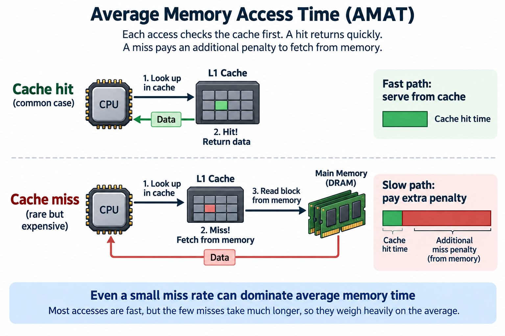
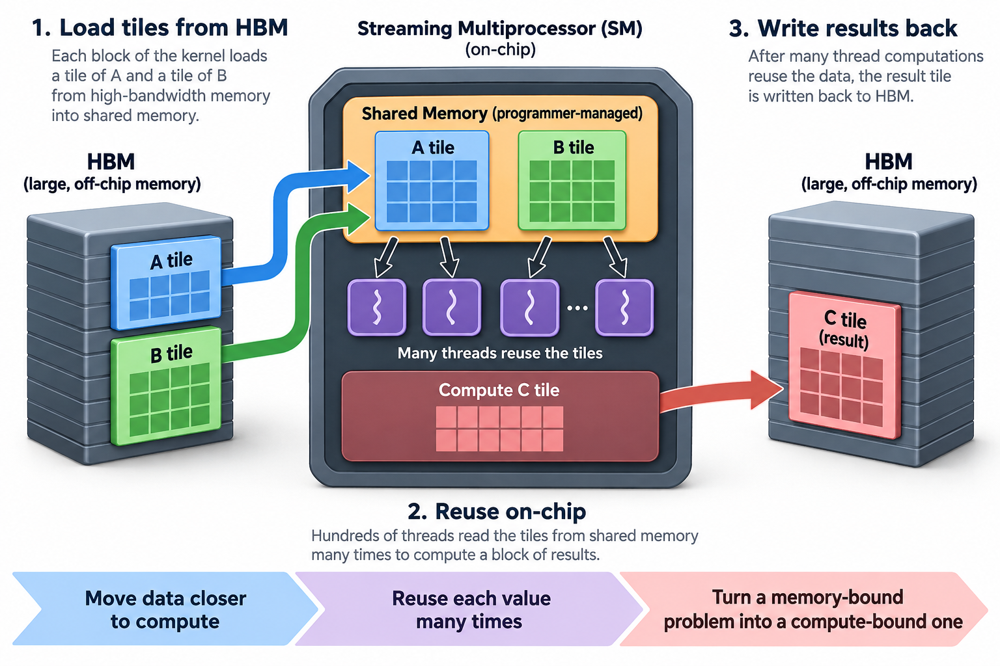

A load instruction that hits the L1 cache returns in about 1 nanosecond. The same instruction, missing all the way to main memory, takes roughly 100 nanoseconds. That is a 100x penalty hiding inside the most common operation a CPU performs, and a modern core issues billions of loads per second.

At 4 GHz, 100 nanoseconds is about 400 clock cycles. A core that could have retired well over a 1000 instructions in that window instead sits and waits for 1 value to arrive from a DRAM chip a few centimeters away. If every memory access paid this price, your 4 GHz processor would perform like a machine from the early 1990s.

It doesn't, because of a piece of hardware that exploits a statistical property of programs. This article is about that hardware, the arithmetic that governs it, and why the same idea now decides how fast large language models run.

## The gap, briefly

In the [CPU pipeline article](/blog/what-a-cpu-actually-does/) we treated memory as a black box: fetch an instruction, load a value, done. The uncomfortable truth is that CPU logic and DRAM have improved at wildly different rates for 40 years. Transistor scaling made cores faster and wider; DRAM optimized for *capacity and cost per bit*, and its access latency barely moved. Around 100 nanoseconds to open a row and read it out was true in 2005 and is still approximately true today.

Nobody closed this gap. Instead, architects built a hierarchy of small, fast memories between the core and DRAM, and bet the entire performance of the machine on 1 empirical observation: programs do not access memory randomly.

## 2 habits every program has

Watch the address stream of almost any real program and 2 patterns jump out.

**Temporal locality**: an address touched now will likely be touched again soon. Loop counters, stack variables, hot data structures, the instructions of the loop body itself. A program spends most of its life revisiting a small working set.

**Spatial locality**: an address touched now means nearby addresses will likely be touched soon. Arrays are traversed in order. Struct fields sit next to each other. The next instruction is usually the next address.

Neither pattern is guaranteed. Both are overwhelmingly common, because they fall out of how humans write code: loops, sequences, and data structures laid out contiguously.

A cache is a small, fast memory that bets on both. It keeps recently used data close to the core (exploiting temporal locality) and it fetches data in chunks larger than you asked for (exploiting spatial locality). A typical L1 data cache is 32 to 48 KB and answers in about 4 cycles. That's absurdly small next to gigabytes of DRAM, and it routinely serves well over 90% of all accesses.

## The 64-byte bet

The unit of that second bet has a name: the **cache line**. On essentially every mainstream CPU today, x86 and most ARM designs alike, a cache line is 64 bytes. The cache never moves a single byte or a single 8-byte word; it moves lines. Ask for 1 4-byte float and the hardware fetches the aligned 64-byte block containing it, all 16 floats.


This is spatial locality made mechanical. If you're walking an array front to back, the miss on element 0 pre-pays for elements 1 through 15. 1 slow trip to DRAM buys 16 fast accesses. If your access pattern actually has spatial locality, the cache line converts a 100x penalty into a small amortized surcharge.

If your access pattern doesn't, the same mechanism becomes pure waste: you pull 64 bytes across the memory bus, use 4 of them, and evict the rest untouched. Hold that thought.

## The arithmetic of a hit rate

The standard model for cache performance is **average memory access time**, or AMAT:

The relationship is written below with explicit timing conventions.

Let's put real numbers in. Suppose the L1 cache hits in 4 cycles and a miss costs 200 cycles to resolve from DRAM (I'm collapsing the L2 and L3 levels for the moment; they soften the penalty but don't change the shape of the argument).

**At a 95% hit rate:**

```
AMAT = 4 + 0.05 × 200 = 4 + 10 = 14 cycles
```

**At a 99% hit rate:**

```
AMAT = 4 + 0.01 × 200 = 4 + 2 = 6 cycles
```

Read those 2 lines again, because they contain the single most counterintuitive fact about caches. Going from 95% to 99% sounds like a rounding error, an improvement of 4 percentage points on an already good number. It cuts average memory latency from 14 cycles to 6. That's 2.3x faster.

The reason is that the hit rate is the wrong number to stare at. What matters is the **miss rate**, and from 5% to 1% is a 5x reduction. Misses are so expensive that they dominate the average even when they're rare: at 95%, the occasional miss contributes 10 of the 14 cycles, which is 71% of all memory time spent on 5% of accesses.


Run the numbers at 90% and the picture gets grim: 4 + 0.1 × 200 = 24 cycles, 4 times worse than the 99% machine, on identical hardware. This is why performance engineers obsess over the last few points of hit rate. It's also why "the cache hit rate is 95%, memory isn't our problem" is one of the most common wrong conclusions in profiling.


The model assumes a serialized access: the hit lookup happens first, and a miss adds a further penalty. Let $$h$$ be hit time, $$m$$ the fraction of accesses that miss, and $$p$$ the additional miss penalty, all times in cycles. Then

$$
\mathrm{AMAT}=h+mp.
$$

With $$h=4$$ and $$p=200$$, reducing $$m$$ from 0.05 to 0.01 changes the modeled average from fourteen cycles to 6. This is not automatically a 2.33× application speedup: a processor can overlap independent misses, and non-memory work remains.

The method that improves locality is to change the reuse distance: how much distinct data is accessed before revisiting a line. Blocking a matrix traversal keeps a smaller tile active, so useful lines survive until reuse instead of being displaced by an entire matrix sweep. Check tile footprint against the relevant cache, including all inputs and outputs. Larger tiles improve reuse only until capacity or associativity pressure introduces new misses. Prefetching addresses predictable latency, while tiling reduces traffic; they solve related but different constraints.




## A worked example you can feel: traversal order

Here's where the arithmetic meets code you have actually written. Take a large matrix, say 4096 × 4096 single-precision floats. That's 64 MB, far bigger than any CPU cache, stored in **row-major** order: row 0's elements sit at consecutive addresses, then row 1, and so on. C, C++, Rust, and NumPy (by default) all do this.

Now sum every element, 2 ways.

**Row order** (`for i: for j: sum += A[i][j]`): you touch consecutive addresses. 16 4-byte floats fit in 1 64-byte line, so you miss once and then hit 15 times, a 6.25% miss rate. AMAT = 4 + 0.0625 × 200 = **16.5 cycles** per access.

**Column order** (`for j: for i: sum += A[i][j]`): consecutive accesses are 16 KB apart (1 full row of 4096 floats). Every access lands in a different cache line, and by the time you wrap around to the second column, the 64 MB you've streamed through has evicted everything. Miss rate: essentially 100%. AMAT = 4 + 1.0 × 200 = **204 cycles** per access.


Same data. Same number of additions. Same instruction count, near enough. About 12x apart in modeled memory cost, purely from the order of 2 nested loops. In practice hardware prefetchers (more on them below) narrow the measured gap, but factors of 5 to 10x show up reliably on real machines, and you can reproduce this in 20 lines of C tonight.

This is the cheapest performance lesson in all of computing: **the loop order is a statement about locality, whether you meant it or not.**

## Going deeper: where a line lives, and who gets evicted

1 level down, a cache isn't a bag of lines; it's organized so lookups take a fixed, tiny time.

A **direct-mapped** cache assigns each memory line exactly 1 slot, computed from its address bits. Lookup is trivial, but 2 hot addresses that map to the same slot evict each other forever, a pathology called **conflict misses**. A **fully associative** cache lets any line live anywhere, which eliminates conflicts but requires comparing against every slot at once, and that's too slow and power-hungry at L1 sizes.

Real caches split the difference with **set associativity**. An 8-way set-associative cache divides its slots into sets of 8; an address maps to exactly 1 set but may occupy any of the 8 "ways" within it. Typical modern L1 caches are 8-way; L2 and L3 go wider. When a set is full, a replacement policy, usually an approximation of LRU (least recently used), picks the victim. LRU is temporal locality again, now as an eviction policy: the line you touched longest ago is the 1 least likely to be needed.

Stack the levels and you get the actual hierarchy in your laptop: L1 at ~32–48 KB per core answering in ~4 cycles, L2 at ~1–2 MB per core in ~14 cycles, a shared L3 of tens of megabytes in ~40–50 cycles, then DRAM. Each level catches most of what the 1 above missed, so the brutal 200-cycle penalty is paid only by the small residue that misses everywhere.

2 more pieces of machinery matter in practice. **Hardware prefetchers** watch the miss stream, detect strides, and fetch lines *before* you ask, which is why streaming through memory in a predictable pattern can hide much of the access latency even when the data can't fit in cache. And because writes also flow through this hierarchy, caches track **dirty lines** that must be written back on eviction, which is 1 reason random writes over a large footprint hurt roughly twice as much as random reads.

## Common misconceptions

**"A bigger cache is always a faster cache."** Size and speed are in direct tension. A bigger cache means longer wires, more sets to index, and higher access latency; that's precisely why the hierarchy exists instead of 1 giant cache. L1 has stayed in the 32–48 KB range for nearly 2 decades not because architects lack transistors but because keeping the 4-to-5-cycle latency requires staying small. Apple's M-series ships unusually large L1 caches (128 KB+ data) and pays for it with more access cycles at lower clocks, a deliberately different point on the same trade-off curve, not a free lunch.

**"95% hit rate means memory affects only 5% of my accesses, so it's a minor issue."** Do the AMAT math before believing this. At 95% with a 200-cycle penalty, misses consume 71% of your total memory time. The 5% of accesses that miss are not a footnote; they are the main cost. This is a specific case of a general rule: with a large enough penalty, the rare event dominates the average, the same reason a tail latency or a pipeline stall can own your throughput.

**"Caches are transparent, so software can't do anything about them."** Transparent means *correctness* doesn't depend on them; performance absolutely does. Loop order (the example above), tiling loops so a working set fits in cache, choosing structure-of-arrays over array-of-structures so you don't drag unused fields through 64-byte lines, and padding to avoid 2 threads fighting over 1 line (false sharing) are all standard techniques that regularly buy integer factors. The entire discipline of cache-aware programming exists because "transparent" hardware responds dramatically to how you lay out and walk your data.

## Why this decides how fast your LLM runs

Everything above scales up to AI hardware with 1 twist: on a GPU, part of the cache isn't automatic.

Each streaming multiprocessor on an NVIDIA GPU has a chunk of on-chip SRAM, up to 228 KB on Hopper, that CUDA exposes as **shared memory**: a cache whose contents *the programmer* manages explicitly. Nothing is fetched or evicted for you. A kernel stages a tile of data from HBM into shared memory, lets hundreds of threads reuse it, and writes results back. Tiled matrix multiplication, the beating heart of every neural network, is exactly the loop-tiling trick from the misconceptions section, done by hand: pull a block of each matrix on-chip once, reuse each value dozens of times, and turn a bandwidth-bound problem into a compute-bound 1.

FlashAttention is the most famous recent example of this as an algorithmic idea. Standard [attention](/blog/attention-in-plain-words/) materializes an N × N score matrix in HBM, and for long sequences the reads and writes of that matrix, not the arithmetic, dominate runtime. Dao and colleagues restructured the computation to process attention in tiles that live entirely in on-chip SRAM, never writing the full matrix to HBM, and reported 2–4x wall-clock speedups (vendor-independent, but self-reported in the paper) with exact, not approximate, results. No new math, in the numerical sense. Pure locality engineering.

This is also why memory bandwidth, not FLOPS, headlines modern accelerator spec sheets; the [Blackwell-to-Rubin memory math article](/blog/blackwell-to-rubin-memory-math/) works through those numbers, and [goodput versus utilization](/blog/goodput-vs-utilization/) shows what happens at the cluster level when data isn't where the compute needs it. The 100x gap never went away. From the L1 in your laptop to the SRAM tiles inside an H100 kernel, the entire stack is 1 long answer to the same question: how do we keep the fast thing from waiting on the slow thing? Locality is the answer, every time.




## Takeaway

- **Caches work because programs repeat themselves.** Temporal locality (reuse the same data soon) and spatial locality (use nearby data next) let a 48 KB cache satisfy the vast majority of accesses to gigabytes of memory, and 64-byte lines are the hardware's standing bet on the spatial half.
- **Think in miss rates, not hit rates.** AMAT = hit time + miss rate × miss penalty. With a 200-cycle penalty, improving from 95% to 99% hits cuts average latency 2.3x, because it's really a 5x cut in misses.
- **Locality is programmable.** Loop order alone swings memory cost by ~12x in the model (5–10x measured), and GPU shared-memory tiling and FlashAttention are the same principle applied deliberately at datacenter scale.

## Sources

- Ulrich Drepper, *What Every Programmer Should Know About Memory* (2007) — [people.freedesktop.org/~lkml/cpumemory.pdf](https://people.freedesktop.org/~lkml/cpumemory.pdf)
- Colin Scott, *Interactive Latency Numbers Every Programmer Should Know* — [colin-scott.github.io/personal_website/research/interactive_latency.html](https://colin-scott.github.io/personal_website/research/interactive_latency.html)
- John L. Hennessy and David A. Patterson, *Computer Architecture: A Quantitative Approach*, 6th ed., Morgan Kaufmann — Appendix B and Chapter 2 (memory hierarchy design, AMAT)
- Tri Dao, Daniel Y. Fu, Stefano Ermon, Atri Rudra, Christopher Ré, *FlashAttention: Fast and Memory-Efficient Exact Attention with IO-Awareness* (2022) — [arxiv.org/abs/2205.14135](https://arxiv.org/abs/2205.14135)
- NVIDIA, *CUDA C++ Programming Guide* (shared memory) — [docs.nvidia.com/cuda/cuda-c-programming-guide/](https://docs.nvidia.com/cuda/cuda-c-programming-guide/)
- Onur Mutlu, lecture materials on memory systems, ETH Zürich SAFARI group — [safari.ethz.ch](https://safari.ethz.ch/)

*Part of the [Computer Architecture & ASIC](/series/comp-arch/) learning path. Browse its published articles by topic.*
