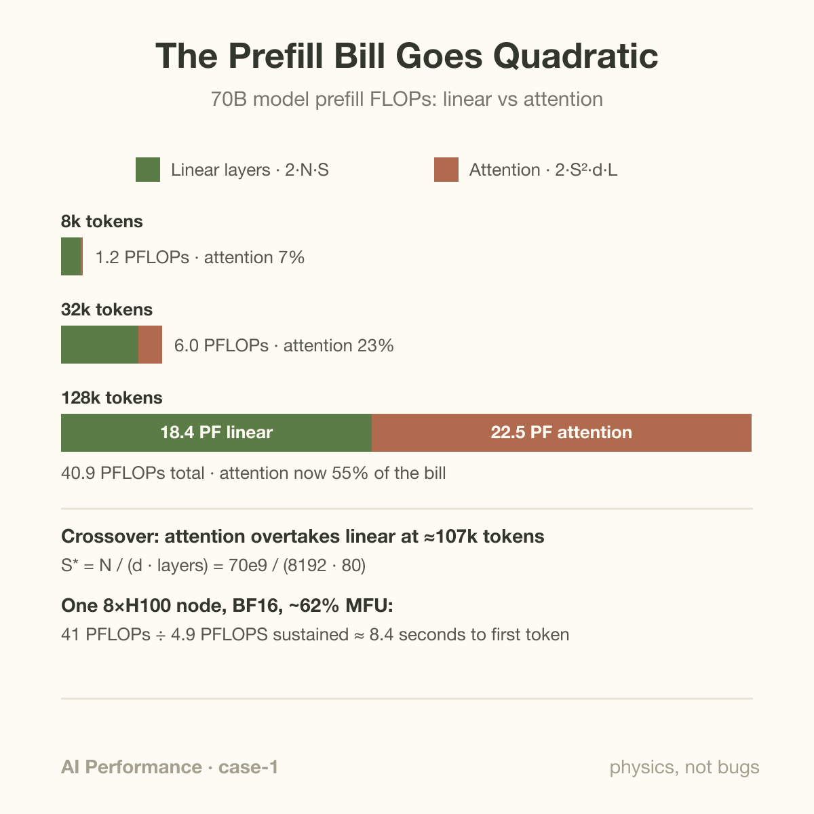
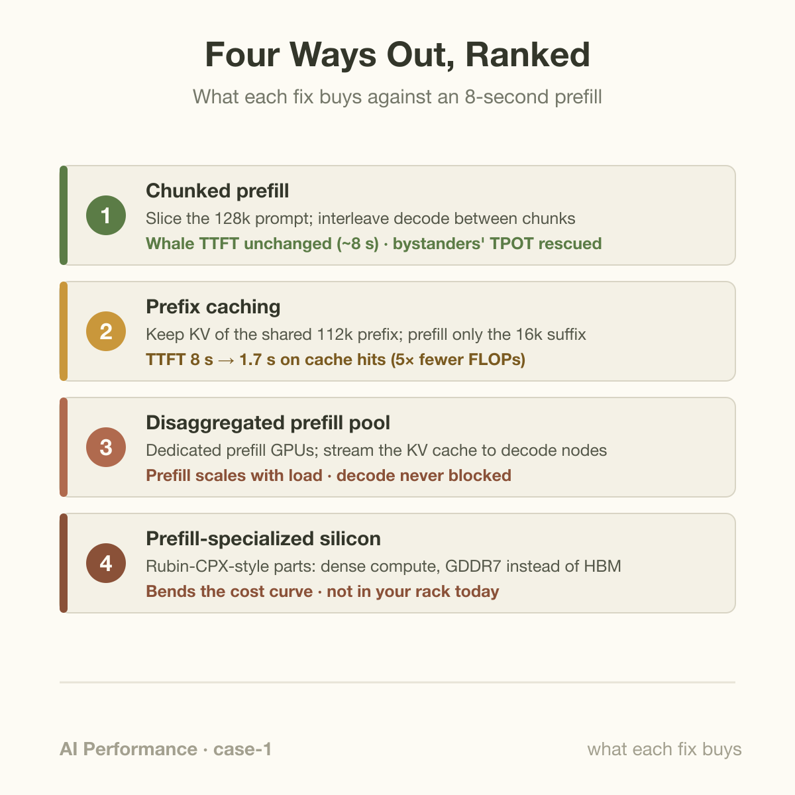

41 petaFLOPs. That is the arithmetic bill for prefilling one 128k-token prompt through a 70B-parameter model, and it is the entire explanation for the ticket that opens this case: *"Chat feels instant, but our document-analysis tier takes 8 seconds before the first word appears. Is the cluster broken?"*

The cluster was not broken. It was doing exactly what it was told, as fast as physics allows. This is the first entry in a series of troubleshooting case files: real symptom, real investigation, real numbers, and fixes ranked by what they actually buy you. If TTFT and TPOT are new vocabulary, start with the [basics article on those two metrics](/blog/ttft-and-tpot/) and come back; here we assume them.

## The symptom

The setup: a 70B dense model served in BF16 on one 8×H100 node with tensor parallelism across all eight GPUs, running a mainstream inference engine. Two traffic classes share the deployment. Interactive chat sends prompts of a few hundred to a few thousand tokens. A document-analysis product stuffs entire contract bundles into the context window: 100k to 128k tokens per request.

The metrics dashboard tells a clean story:

- Chat TTFT: p50 around 180 ms. Healthy.
- Document tier TTFT: p50 of 8.2 seconds. p99 north of 11.
- Decode speed once the first token lands: normal for both tiers, roughly 40 tokens/s per stream.
- GPU utilization during the incident windows: pinned at 100%.

That last line sent the on-call engineer down the wrong alley first, because 100% utilization usually means "we're fine, the hardware is earning its keep." As the [goodput article](/blog/goodput-vs-utilization/) argues, utilization tells you the GPU was busy, not that it was busy doing something you wanted at the latency you promised.

## The investigation

Step one in any latency case: split the time. TTFT decomposes into queueing time, prefill time, and scheduling overhead. The engine's request-level metrics showed queueing was under 200 ms even at p99, and scheduling overhead was noise. Roughly 7.9 of the 8.2 seconds was spent inside prefill itself, for a single request, with the GPUs fully occupied the whole time.

Step two: profile a captured request. An Nsight Systems trace of one 128k prefill showed the opposite of the usual pathology. No idle gaps between kernels. No host-side stalls. No memory-bound loitering. Just an unbroken wall of large GEMM and attention kernels, streaming multiprocessors saturated, for eight straight seconds. Tensor Core pipes busy, HBM bandwidth well below its ceiling.

That profile signature is the fingerprint of this case: **prefill on a long prompt is compute-bound**. There is no bug to find in a trace like this. The question changes from "what is broken?" to "why does the correct computation cost eight seconds?" And that question you can answer on a napkin.

## The arithmetic: 128k tokens through a 70B model

Prefill FLOPs come from two places: the linear layers (attention projections and the MLP, which together hold nearly all of the weights) and the attention score computation itself.

**Linear layers.** The standard estimate for a dense transformer is 2 FLOPs per parameter per token (one multiply, one add). With N = 70×10⁹ parameters and S = 131,072 tokens:

```
FLOPs_linear ≈ 2 · N · S
            = 2 · 70e9 · 131,072
            ≈ 1.84e16  →  18.4 PFLOPs
```

**Attention scores.** Take a Llama-3-70B-shaped model: 80 layers, model width d = 8192. Computing QKᵀ costs about 2·S²·d FLOPs per layer (summed across heads), and multiplying the softmax output by V costs the same again. A causal-aware kernel does roughly half of that triangle:

```
FLOPs_attn ≈ ½ · (4 · S² · d) · layers
          = 2 · (131,072)² · 8192 · 80
          ≈ 2.25e16  →  22.5 PFLOPs
```

Total: about **41 PFLOPs for one request**. Note which term won: at 128k tokens the quadratic attention part (22.5) has overtaken the linear part (18.4). Setting the two expressions equal gives the crossover: S* = N / (d · layers) = 70e9 / (8192 · 80) ≈ **107k tokens**. Below that, prompt cost grows essentially linearly with length; above it, the S² term takes over and every additional token costs more than the last.



**Now divide by the hardware.** One H100 SXM delivers 989 TFLOPS of dense BF16 through its Tensor Cores (NVIDIA's spec sheet number), so the 8-GPU node peaks at 7.9 PFLOPS. At 100% model FLOPs utilization the prefill would take 41 / 7.9 ≈ 5.2 seconds. Real prefills on a tensor-parallel node land at 55–65% MFU once you account for all-reduce communication, kernel launch edges, and the softmax/normalization work that runs on the vector units. At 62% MFU:

```
time ≈ 41 PFLOPs / (7.9 PFLOPS · 0.62) ≈ 8.4 s
```

The trace said 7.9 seconds. The napkin says 8.4. Case closed on the *diagnosis*: nothing is misconfigured, the machine is executing 41 PFLOPs at a respectable fraction of peak, and that simply takes eight seconds on this hardware. Which is the most uncomfortable kind of finding, because you cannot fix physics with a config flag.

## Going deeper: why FlashAttention didn't save us

A fair objection: "isn't FlashAttention supposed to fix quadratic attention?" It fixes the *memory* side, not the *math* side. Naive attention materializes the S×S score matrix in HBM; at 128k tokens that would be 17 billion entries per head per layer, which is why long contexts were once memory-impossible. FlashAttention tiles the computation through on-chip SRAM so the score matrix never touches HBM, turning attention from memory-bound to compute-bound (Dao, 2023). The FLOP count, though, is untouched: every query still multiplies against every prior key. FlashAttention is the reason our trace shows Tensor Cores saturated instead of HBM saturated. It moved the wall; it did not remove it.

The second deep point: tensor parallelism is already helping, and it has a ceiling. Our eight GPUs split every GEMM eight ways, so the "one GPU" framing understates the horsepower: a single H100 doing this prefill alone would take roughly a minute. But TP within a node hits diminishing returns because every layer ends in an all-reduce over NVLink, and going wider than the NVLink domain (TP=16 across nodes over InfiniBand) usually costs more in communication than it gains in FLOPs. Eight seconds is what a whole state-of-the-art node looks like when you hand it the full quadratic bill at once.

## The fixes, ranked



**Fix 1: chunked prefill, deployed first, for the collateral damage.** The 8-second monolithic prefill was not only slow for its own user; it froze every co-scheduled chat stream, because a batch executing one giant prefill emits no decode tokens. Chunked prefill (introduced as Sarathi-Serve, now standard in vLLM and friends) slices the 128k prompt into chunks of a few thousand tokens and interleaves decode steps between chunks. TPOT spikes for chat users vanished within an hour of enabling it. Be precise about what it does *not* do: the document request's own TTFT stays around 8 seconds, in fact a few percent worse due to chunk-boundary overhead. Chunked prefill is a fairness fix, not a speed fix.

**Fix 2: prefix caching, the actual TTFT win.** Inspecting the payloads showed what payload inspection usually shows: massive shared structure. Every document-tier request began with the same ~112k tokens (system prompt plus a shared contract corpus), followed by ~16k tokens of user-specific material. With automatic prefix caching, the engine keeps the KV cache of the shared prefix resident and only prefills the suffix. Redo the napkin for a 16k suffix attending over the full 128k context: about 2.3 PFLOPs of linear work plus 5.6 PFLOPs of attention, call it 8 PFLOPs, a 5× reduction. Measured TTFT on cache hits dropped to about 1.7 seconds. The lesson generalizes: before buying hardware, check how much of your prompt is the same prompt every time. (This is also why KV cache is becoming [a first-class citizen](/blog/kv-cache-first-class-citizen/) in serving stacks.)

**Fix 3: a disaggregated prefill pool, for the architecture.** Prefill and decode want opposite machines: prefill wants maximum FLOPs, decode wants maximum memory bandwidth per concurrent stream. Running both phases on one pool means each interferes with the other's goal, which is the whole argument of [the prefill/decode disaggregation article](/blog/stop-serving-prefill-and-decode-together/). Systems like DistServe and Mooncake prefill on a dedicated pool, ship the KV cache to decode nodes, and scale the two pools independently. For this case it means cache-miss 128k prefills can fan out across a wider prefill pool without ever blocking a decode GPU, and the prefill fleet can be sized to the document tier's arrival rate rather than to peak chat traffic.

**Fix 4: prefill-specialized silicon, the horizon option.** Once you accept that prefill is compute-bound and decode is bandwidth-bound, building different chips for them is the logical endpoint. NVIDIA's Rubin CPX is exactly that bet: a prefill-oriented part with high dense-compute throughput on cheaper GDDR7 memory, because prefill does not need HBM's bandwidth. That story gets its own article: [Prefill Gets Its Own Chip](/blog/prefill-gets-its-own-chip-rubin-cpx/). You cannot buy one today to close this ticket, but it tells you which way the industry believes this cost curve bends.

## Common misconceptions

**"TTFT is slow, so we need faster memory."** Backwards for this case. Decode is memory-bandwidth-bound, so engineers pattern-match all LLM slowness to bandwidth. Prefill's arithmetic intensity is enormous: 41 PFLOPs against a few hundred gigabytes of weight and activation traffic works out to thousands of FLOPs per byte, far past the roofline ridge point. An HBM upgrade would leave the 8 seconds untouched; only more usable FLOPs (or fewer required FLOPs) move it.

**"Attention's quadratic cost is why long prompts are slow."** Only half true, and only at extreme lengths. On this 70B model the quadratic term does not even overtake the linear layers until ~107k tokens. A 32k prompt costs 6 PFLOPs, of which 77% is plain matrix multiplies through the weights. For most production prompt lengths, prefill cost is effectively *linear* in prompt length, and "we're slow because attention is O(S²)" is the wrong diagnosis below 100k.

**"Enable chunked prefill and TTFT will drop."** Chunked prefill never accelerates the chunked request; it slightly slows it while unblocking everyone scheduled alongside it. If your dashboard shows a *queueing*-dominated TTFT (short prompts stuck behind a whale), chunked prefill helps those victims' TTFT dramatically. If, as here, the slow TTFT belongs to the whale itself, chunking redistributes pain rather than removing it. Read your TTFT breakdown before reaching for the flag.

## The bigger picture

Every fix in this case file is a special case of one idea: prefill and decode are different workloads wearing the same API. Prefill is a throughput problem measured in PFLOPs; decode is a latency problem measured in GB/s per stream (the [prefill and decode basics article](/blog/how-an-llm-generates-text/) builds this from scratch). Schedulers (chunked prefill), caches (prefix reuse), cluster topology (disaggregation), and silicon (Rubin CPX) are the same separation applied at four different layers of the stack. When a latency ticket lands on your desk, the first fork in the decision tree is always: which phase, and is it starved of compute, bandwidth, or scheduling? This case sat squarely in "prefill, compute" territory, and everything followed from placing it there.

Next case in the series: the OOM that only happens on Tuesdays, or, why your KV cache eviction policy is a latency policy in disguise.

## Takeaway

- An 8-second TTFT on a 128k prompt is often not a bug: ~41 PFLOPs of prefill for a 70B model divided by ~62% MFU on an 8×H100 node *is* about 8 seconds. Do the napkin math before hunting ghosts in traces.
- Attention only dominates prefill past a crossover length, S* ≈ N/(d·layers) ≈ 107k tokens for a 70B model; below that, linear layers dominate and cost grows linearly with prompt length.
- Rank fixes by what they buy: chunked prefill protects bystanders' TPOT, prefix caching cuts the whale's own TTFT (8s → 1.7s here), disaggregation lets you scale prefill independently, and prefill-specialized hardware bends the cost curve long-term.

## Sources

- Agrawal et al., "Taming Throughput-Latency Tradeoff in LLM Inference with Sarathi-Serve," OSDI 2024 — [arxiv.org/abs/2403.02310](https://arxiv.org/abs/2403.02310)
- Zhong et al., "DistServe: Disaggregating Prefill and Decoding for Goodput-optimized Large Language Model Serving," OSDI 2024 — [arxiv.org/abs/2401.09670](https://arxiv.org/abs/2401.09670)
- Qin et al., "Mooncake: A KVCache-centric Disaggregated Architecture for LLM Serving" — [arxiv.org/abs/2407.00079](https://arxiv.org/abs/2407.00079)
- Dao, "FlashAttention-2: Faster Attention with Better Parallelism and Work Partitioning" — [arxiv.org/abs/2307.08691](https://arxiv.org/abs/2307.08691)
- vLLM documentation: chunked prefill and automatic prefix caching — [docs.vllm.ai](https://docs.vllm.ai/)
- NVIDIA H100 Tensor Core GPU specifications (989 TFLOPS dense BF16 is NVIDIA's self-reported peak) — [nvidia.com/en-us/data-center/h100/](https://www.nvidia.com/en-us/data-center/h100/)

*Part of the **AI Performance Engineering** series. Previous: [Every Hyperscaler Ships Inference Silicon Now](/blog/hyperscaler-inference-silicon/). Next up: more case files from the troubleshooting drawer.*
