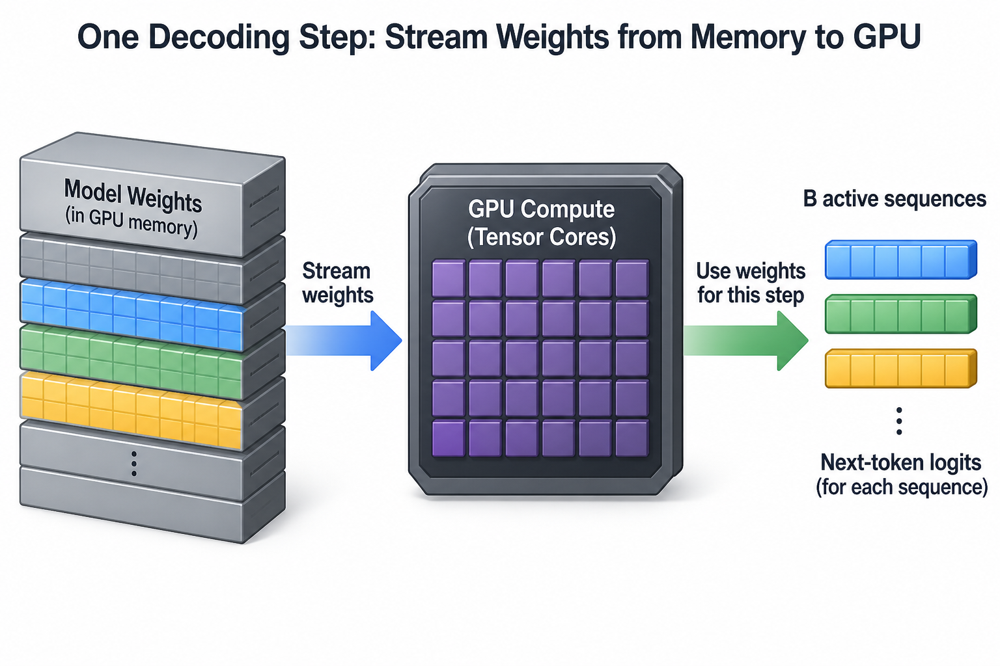
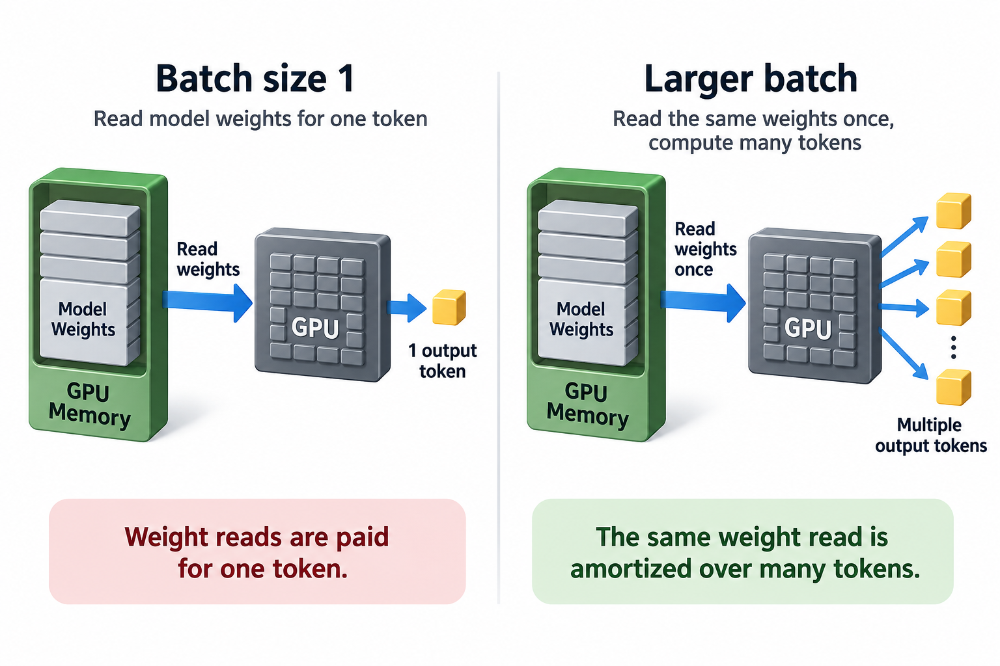

100% GPU utilization can coexist with disappointing token throughput. NVIDIA defines that utilization field as the fraction of a sampling interval during which at least 1 kernel executes. It does not mean that every compute unit is occupied, that tensor cores run at peak speed, or that useful tokens meet their latency target. A kernel waiting on memory can keep the utilization gauge high.

Consider an illustrative incident: a dense 13-billion-parameter model serves 8 independent conversations. The dashboard reports 99–100% utilization, yet each conversation streams at roughly 40 tokens per second. An engineer proposes a GPU with more tensor FLOPS. Before changing hardware, ask what 1 decode iteration reads, how many tokens it produces, and which resource actually limits that iteration. All measurements below are hypothetical; they demonstrate a diagnostic method rather than claim a benchmark result.

## Establish the workload behind the gauge

Decode usually advances each active sequence by 1 token per iteration. A batch of 8 sequences therefore produces 8 output tokens after 1 model forward pass. The weight matrices can be reused across those sequences, although that reuse depends on the actual kernels, cache behavior, and matrix shapes. Prefill is different: it processes many prompt positions together and often has enough arithmetic reuse to use tensor cores effectively.

First isolate these phases. Record prompt lengths, generated lengths, active batch size, precision, parallelism, and the exact serving-engine version. A request with a long prompt can briefly make the GPU compute-bound; that does not establish that its later decode steps have the same bottleneck. Capture stable decode windows instead of averaging prefill and decode into 1 utilization number.

Also separate aggregate output throughput from per-request streaming speed. If 8 users each receive 40 tokens per second, aggregate throughput is 320 output tokens per second. Reporting only 40 makes the system look 8 times less productive; reporting only 320 hides whether the user experience is acceptable. Both metrics matter, and neither can be inferred from the activity gauge.

*Original explanatory diagram based on NVIDIA's documented utilization definition; it is not a reproduction of a source figure.*

## Build a lower-bound model for one step

Let P be the parameter count, s_w the stored bytes per weight, B the number of active sequences, and beta_eff the effective memory bandwidth available to the relevant kernels. For a dense model whose weights are streamed once per batch step, the simplest weight-traffic estimate is P times s_w. Ignoring attention and other overhead for the moment:

$$
t_{\mathrm{step}} \gtrsim \frac{P s_w}{\beta_{\mathrm{eff}}},\qquad
R_{\mathrm{out}} \lesssim \frac{B\beta_{\mathrm{eff}}}{P s_w}.
$$

The inequalities are conditional modeling bounds. They assume the weight stream dominates, sufficient reuse across B exists, and bandwidth is the limiting resource. They are not promises about a serving framework. With sharding, use the weights and traffic local to each GPU and include communication on the critical path.

For 13 billion parameters stored in BF16, the raw weights occupy approximately 26 billion bytes, or 26 GB in decimal units. Suppose measured effective bandwidth for the decode kernels is 1.2 TB/s. Streaming those weights takes at least 26/1200 seconds, approximately 21.7 milliseconds. At batch 8, the weight-only throughput ceiling is about 369 output tokens per second, while each sequence advances at about 46 tokens per second.

A measured 25-millisecond iteration gives 320 aggregate tokens per second and 40 tokens per second per sequence. That is plausible relative to the simplified memory bound. It is evidence against the idea that low tensor-core utilization alone reveals a broken server. The remaining 3.3 milliseconds may include attention traffic, launch overhead, synchronization, and inefficient matrix shapes; a trace must determine their contributions.

## Arithmetic intensity explains why FLOPS can mislead

A linear layer with a B-row input approximately performs 2BP floating-point operations across the dense parameter stream. Dividing by P s_w bytes gives a weight-only arithmetic intensity of roughly 2B/s_w. For BF16, that simplifies to B FLOPs per byte. Batch 8 gives about 8 FLOPs per byte, before counting activations and the KV cache.

The roofline compares this intensity with the ratio of peak compute throughput to memory bandwidth. If a hypothetical GPU provides 240 TFLOP/s for the relevant dense precision and 1.2 TB/s effective bandwidth, its corresponding ratio is 200 FLOPs per byte. An 8-FLOP-per-byte workload lies far below that ridge. Adding compute capacity without increasing delivered bandwidth will not move this simplified bound much.

Be consistent about the numbers. A sparse peak, an FP8 peak, and dense BF16 work are different quantities. Published memory bandwidth is also a theoretical interface rate, whereas beta_eff should come from an applicable measurement. Using the vendor maximum for one side and a measured rate for the other can produce a misleadingly precise roofline.

The deeper lesson is that occupancy, utilization, arithmetic intensity, and bandwidth utilization answer different questions. High occupancy can help hide memory latency but cannot create additional memory bandwidth. A kernel can have enough resident warps, remain active continuously, and still finish at the rate allowed by its memory traffic.

## Add the KV cache to the model

Weights are not the entire decode budget. Full attention reads historical keys and values for each sequence. Let L be the layer count, H_kv the number of key/value heads, d the head dimension, s_kv the stored bytes per cache element, and C_i the current context length of sequence i. The raw cache size is:

$$
M_{\mathrm{KV}}=2 L H_{\mathrm{kv}} d s_{\mathrm{kv}}\sum_{i=1}^{B} C_i.
$$

For an illustrative grouped-query configuration with 40 layers, 8 KV heads, head dimension 128, and 2-byte cache elements, 1 cached token occupies 163,840 bytes. 8 sequences at context length 4096 contain about 5.37 GB of raw KV data. A decode attention step must consult that history, though actual HBM traffic depends on tiling, reuse, kernel implementation, and cache effects.

If we use a deliberately simple 1-read traffic estimate, weights plus KV amount to 31.37 GB per step. At 1.2 TB/s this is 26.1 milliseconds, giving a ceiling around 306 aggregate output tokens per second. This calculation is not an exact prediction. It shows why a weights-only explanation can become optimistic as context grows and why the batch that helps weight reuse can also increase cache traffic.

*Original worked-example figure. Numbers are assumptions used in this article, not measured hardware results.*

## Collect evidence that can falsify the hypothesis

Start with a timeline profiler to identify the dominant kernels and gaps. Use a kernel profiler on representative decode kernels to inspect achieved DRAM throughput, arithmetic intensity, memory stalls, and relevant tensor-core activity. NVIDIA Nsight Compute exposes memory and compute analysis, but metric names and availability vary by architecture and tool release.

Measure the uninstrumented workload before and after profiling. Detailed kernel collection can serialize work or perturb execution; a profiling run should establish mechanism, while a clean load test establishes production latency and throughput. Comparing an instrumented trace directly with a normal service dashboard can turn the profiler's overhead into a fictional regression.

Run a controlled batch-size sweep while holding prompt length, output length, precision, and engine settings constant. If increasing B raises aggregate throughput substantially while per-sequence step time rises only slightly, improved weight reuse is a credible explanation. If step time rises rapidly with context length at fixed B, attention traffic is probably becoming important. If neither change matters and the timeline contains large CPU gaps, revisit the launch path rather than insisting on the memory hypothesis.

Add a short-context versus long-context comparison. It distinguishes the relatively fixed weight stream from a growing attention history. Also check power, clocks, thermal limits, and GPU-sharing conditions, because delivered bandwidth and compute can fall under throttling or contention. A clean memory model is useful only if its assumed resource is actually available.

## Choose the fix that matches the evidence

Batching improves aggregate throughput by amortizing weight reads over more output tokens. It does not automatically improve each user's streaming latency. A larger batch can take longer per iteration, consume more KV memory, and make queueing worse if the server waits to collect work. Continuous batching should be tuned against both an output-throughput target and a token-latency target.

Quantization reduces weight bytes when compatible kernels can consume the compressed representation efficiently. A 4-bit storage format is not equivalent to a 4-times speedup: scales, metadata, packing, dequantization, and activation precision contribute overhead. Test the exact checkpoint and kernel path; connect this diagnosis with the separate case on [why a quantized model is not faster](/blog/case-quantized-model-isnt-faster/).

A GPU with higher sustained memory bandwidth may help more than one with a higher compute headline. Tensor parallelism can reduce per-GPU weight traffic, but it introduces collectives and often changes the cost and latency balance. Speculative decoding can produce multiple accepted tokens per expensive target-model pass, yet its benefit depends on acceptance rate and draft overhead. Each is a different way to change useful work per byte or bytes on the critical path.

Do not apply all remedies simultaneously. Keep a before/after record for one change, including batch size, context distribution, and service-level goodput. Otherwise an apparent kernel win may simply come from serving shorter prompts or permitting higher latency.

*Original diagnostic summary; investigate the listed mechanisms with controlled measurements.*

A useful production experiment also holds the arrival pattern constant. If 1 configuration receives a fixed stream of requests and another uses a client that waits for each completion before sending the next request, their batch sizes will evolve differently. The second server may appear to have lower latency because the driver offers less work when responses slow down. Record offered requests, admitted requests, active sequences, and output tokens over the same interval. That makes a throughput improvement interpretable as a resource improvement instead of an accidental change in load.

For example, suppose the baseline completes 3 hundred requests within the target during a measurement interval and a larger batch completes 3 hundred and 50, but only 2 hundred and 80 satisfy the token-latency target. Raw completion throughput improved while goodput fell. The larger batch should not be accepted for an interactive pool on those observations alone. It may still be useful for an offline pool with a different latency contract. State that contract before deciding whether the extra aggregate tokens are useful.

## Common misconceptions

“100% utilization means maximum performance.” It means kernels were active through the sampling period under NVIDIA's definition. The useful throughput can still be limited by memory, poor shapes, or irrelevant work. A token metric and a resource-specific profile are needed to interpret that activity.

“More batching makes every request faster.” Batching often increases aggregate outputs per second through reuse. The individual token interval can increase, and extra queueing may outweigh the reuse. Report aggregate throughput alongside per-request inter-token latency.

“Decode is always memory-bound.” That is a useful low-batch intuition, not a universal law. Large batches, different model architectures, long-context attention, parallel communication, and kernel overhead can move the bottleneck. The roofline is a workload-specific model, and the profiler is how you test it.

## Make the result operational

The incident is resolved when the observed output rate matches a defensible resource model and a tested change improves the metric users care about. Retain the batch sweep, context sweep, and representative trace as a regression baseline. Track effective bandwidth on stable decode windows instead of treating the activity gauge as a capacity-planning metric.

For further mechanism, read [compute-bound versus memory-bound](/blog/compute-bound-vs-memory-bound/), [occupancy and the roofline](/blog/occupancy-and-the-roofline/), and [batching as a throughput lever](/blog/batching-the-biggest-throughput-lever/). Those concepts explain the case; the case supplies a reproducible way to decide which one matters in a running service.

## Takeaway

- Interpret utilization as activity, then measure useful tokens and latency separately.
- Estimate weight and KV traffic before buying additional tensor FLOPS.
- Confirm the bandwidth hypothesis with controlled batch/context sweeps and representative kernel profiles.

## Sources

- [NVIDIA System Management Interface documentation](https://docs.nvidia.com/deploy/nvidia-smi/index.html), definition of GPU and memory utilization.
- [NVIDIA Nsight Compute Profiling Guide](https://docs.nvidia.com/nsight-compute/ProfilingGuide/index.html), roofline analysis and profiling behavior.
- [vLLM optimization documentation](https://docs.vllm.ai/en/stable/configuration/optimization/), batching, KV capacity, and preemption considerations.
