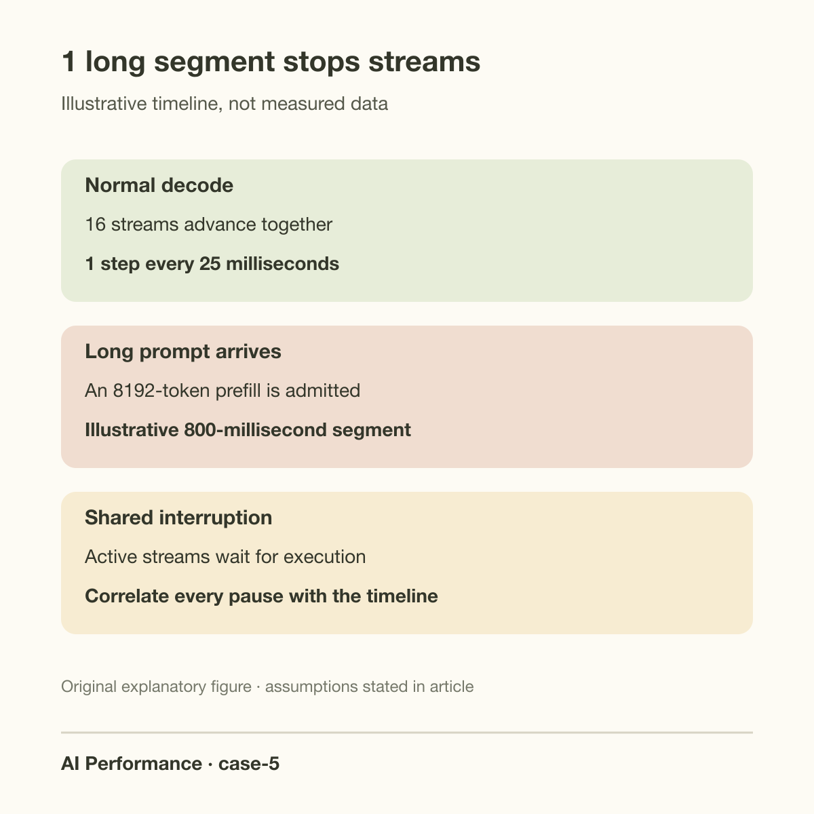
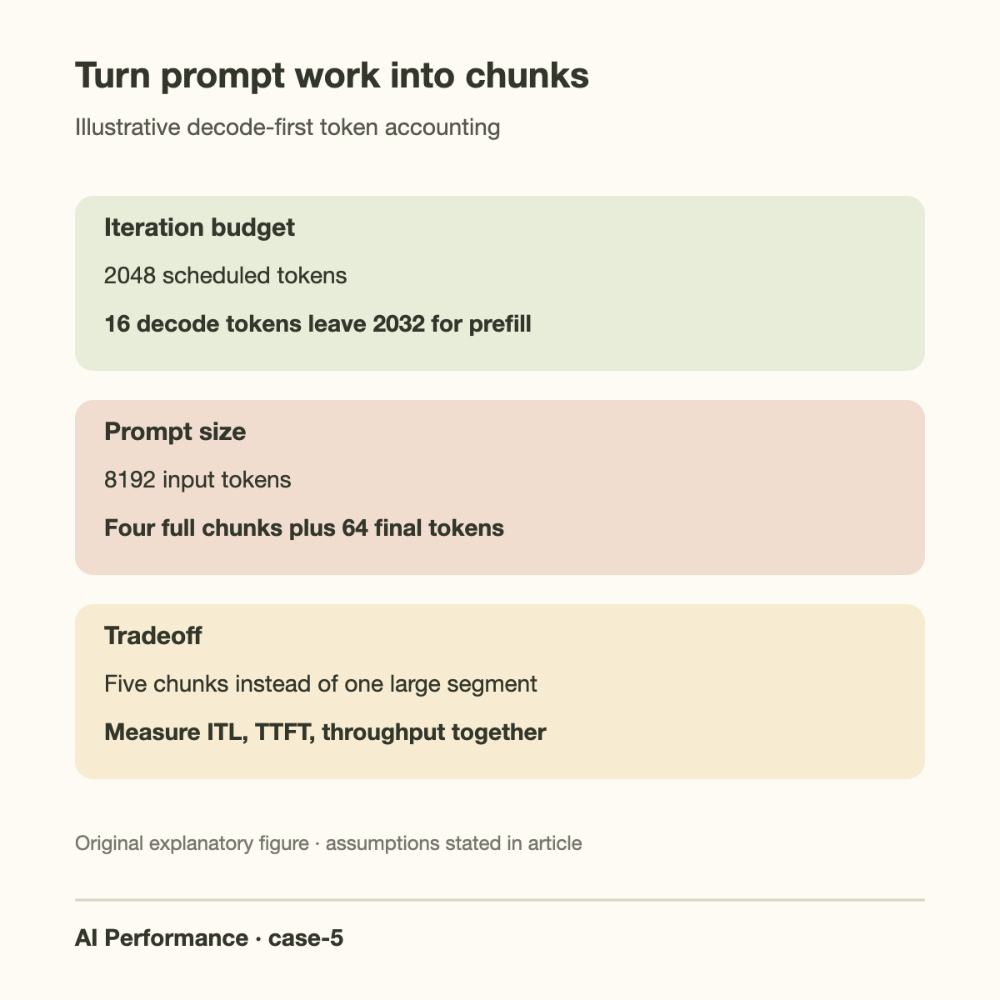
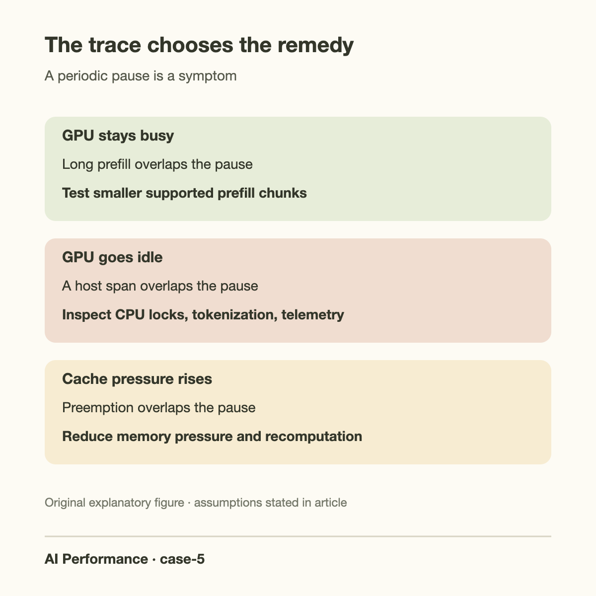

A streaming service emits tokens every 25 milliseconds, then pauses for almost a second every few seconds. Average output throughput looks respectable, and no request fails. Users still describe the experience as broken because the pauses interrupt every active conversation at once. A periodic symptom is an invitation to correlate events, not proof that the scheduler is defective.

This case uses an illustrative server with 16 active decode sequences and occasional long prompts. The baseline iteration takes 25 milliseconds. A new 8192-token prompt sometimes coincides with an 800-millisecond streaming gap. Those numbers are hypothetical, selected to make the scheduling arithmetic easy to follow. The investigation must determine whether the gap comes from a long prefill, CPU work, memory pressure, or another recurring event.

## Measure the pause at the token level

End-to-end request latency combines queueing, prefill, generation, and delivery. A request can have an acceptable total duration while containing a conspicuous mid-generation pause. Capture inter-token intervals for every sequence and correlate them with server-side timestamps. If all streams stop together, look first for a shared execution or delivery interruption.

Separate time spent computing a token from time spent making it visible. Reverse-proxy buffering, client-side batching, network congestion, and flush behavior can imitate a GPU stall. A GPU trace showing uninterrupted decode work during a client pause argues for a delivery-path investigation. Server-side token completion timestamps and client receipt timestamps make this distinction concrete.

Do not summarize the problem only as mean time per output token. A mean of 30 milliseconds can hide hundreds of normal 25-millisecond intervals and 1 800-millisecond gap. Retain per-request interval distributions, maximum gaps, and a timeline around the event. An aggregate percentile over all tokens can also obscure which requests experience repeated interruptions.

*Original incident timeline. Durations are illustrative, and this is not a source-paper figure.*

## Why prefill can block ongoing decode

At any scheduler iteration, the engine chooses which active sequences to advance and which prompt tokens to process. If it admits an entire long prompt into 1 non-preempted execution segment, that segment can occupy resources much longer than an ordinary decode step. Ongoing streams then wait for the next opportunity to advance.

This is related to head-of-line blocking, but the queue may be a GPU work schedule rather than a network queue. A large prompt and a 1-token decode step compete for the same critical path. The fact that both operations run fast relative to their own work does not establish that their combination provides smooth streaming.

Continuous batching lets an engine add and retire requests as sequences finish. Chunked prefill adds another control: divide a long prompt into pieces that can be scheduled alongside decode. These are related but distinct mechanisms. An engine can use continuous batching and still have an unsuitable prefill budget for a latency-sensitive workload.

Current vLLM V1 documentation describes decode-prioritized scheduling with chunked prefill enabled whenever possible: pending decode requests are scheduled first, remaining token budget admits prefill work, and a prompt that does not fit is split. That describes a documented implementation, not a guarantee for every engine or version. Record the actual configuration and release before reasoning from it.

## Work a token-budget example

Let T be the maximum scheduled token budget for an iteration and B_d the number of active decode sequences. Under a simplified decode-first accounting, the prompt-token allowance is:

$$
N_{\mathrm{prefill}} \leq \max(0,T-B_d).
$$

This is an accounting model, not an exact latency model. Other scheduler limits, sequence constraints, and implementation details can reduce the admitted work. Nevertheless it makes 1 practical tradeoff visible: the same budget can allow a small or very large prompt chunk after decoding advances.

With T equal to 2048 and B_d equal to 16, at most 2032 prompt tokens fit in the illustrative iteration. An 8192-token prompt needs at least ceiling(8192/2032), or 5 chunks. The last chunk contains only 64 prompt tokens if each earlier chunk consumes the full allowance. With T equal to 8192, the allowance is 8176 and the same prompt needs 2 chunks.

Assume isolated prompt processing costs 0.10 milliseconds per token over this range. A monolithic 8192-token prefill then takes about 819 milliseconds. A 2032-token chunk contributes about 203 milliseconds under a naive additive timing model. That can greatly reduce the largest interruption, but it is still much larger than the 25-millisecond decode baseline. Chunking is not synonymous with meeting a 50-millisecond inter-token target.

If we set a tentative allowance of 25 milliseconds for extra prompt work, this linear approximation suggests only 250 prefill tokens per iteration. Adding 16 decode tokens gives T around 266. The required chunk count becomes ceiling(8192/250), or 33. Such a small budget may damage prompt completion time and throughput, and real mixed-batch timing is not generally linear. Use the arithmetic to choose a search range, then measure.

*Original worked-example diagram based on the scheduling mechanism documented by vLLM; numerical settings are illustrative.*

Translate the budget into a tentative latency constraint only with a measured cost curve. If d is the decode baseline, a the marginal prompt cost, and I_max the iteration target, a linear approximation gives

$$
n_{\mathrm{chunk}}\le\left\lfloor\frac{I_{\max}-d}{a}\right\rfloor,\qquad
K\ge\left\lceil\frac{S}{n_{\mathrm{chunk}}}\right\rceil.
$$

S is the uncached prompt length and K the minimum chunk count. The bound is meaningful only when I_max exceeds d and a is positive. At I_max equal to 50 milliseconds, d equal to 25, and a equal to 0.10 milliseconds per token, the tentative chunk limit is 250 and an 8192-token prompt needs 33 chunks.

Chunking changes the longest admitted execution segment compared with monolithic prefill; it does not remove prompt computation. Fit the mixed-batch duration curve from controlled injections, including cache misses and long attention contexts. Then check both streaming gaps and prompt completion. If the smaller budget makes new arrivals queue indefinitely, its latency benefit is not sustainable. This adds a stability check to the token accounting rather than treating the scheduler flag itself as evidence of a resolved incident.

## Chunk size is a multi-objective decision

A smaller chunk often protects streaming latency by limiting prompt work admitted at once. It can also delay time to first token for newly arriving requests and add scheduling or launch overhead. A larger chunk improves prompt processing opportunities but may lengthen iterations shared with decoding. The optimum depends on the model, accelerator, context lengths, and mix of incoming requests.

The important variable is elapsed iteration time, not token count alone. 1000 prompt tokens in 1 kernel path may have a different cost from 1000 in another. Prefix-cache hits, padding, attention lengths, compiler choices, and batch composition all change the work represented by a nominal token budget.

Measure a Pareto curve: output throughput, first-token latency, and inter-token latency for a sequence of chunk budgets. Keep offered load and request distributions constant. Select a setting that satisfies the user-facing streaming target while preserving enough prefill capacity to keep the arrival queue stable. A configuration that makes existing streams smooth by indefinitely postponing new requests has merely moved the problem.

For sustained mixed workloads, separate prefill and decode workers may be appropriate. That introduces cache transfer and coordination costs, so it belongs after a local scheduler diagnosis. Link the decision to the broader article on [prefill and decode as different workloads](/blog/the-prefill-decode-disaggregation-story/) rather than treating disaggregation as an automatic cure.

## Going deeper: locate the actual critical path

Capture a timeline spanning several pauses. Label request arrivals, scheduling decisions, prefill chunks, decode kernels, CPU scheduling spans, cache allocation events, and delivery flushes. The strongest evidence is repeated alignment: each large streaming gap begins with the same class of event and disappears when that event is controlled.

If the GPU runs a long prefill kernel while every stream waits, the scheduling hypothesis is supported. If the GPU is idle during the gap, inspect the host path: tokenization, Python garbage collection, model-server locks, logging, a metrics scrape, CPU throttling, or memory allocation. Periodic work can cause periodic stalls without any faulty GPU kernel.

If pauses align with KV exhaustion or preemption, count those events. vLLM documents that requests may be preempted when insufficient cache space is available and later recomputed. Recompute adds real work and can hurt latency. Reducing concurrency or increasing usable cache capacity may help, but increasing the token budget could aggravate the memory pressure rather than fix it.

A periodic checkpoint, adapter load, or maintenance task can also share the GPU or host resources. Verify whether these tasks run on the serving critical path. Use a short, controlled test with the task disabled or moved, preserving the rest of the workload. A causal intervention is stronger evidence than finding a periodic timestamp that merely happens to be nearby.

## A controlled diagnosis sequence

First run a decode-only workload with fixed prompt lengths and enough active requests to reproduce normal occupancy. If the periodic pauses persist without new prompt admission, long prefill is not sufficient to explain the incident. Keep the trace and pursue host, cache, or delivery effects.

Next inject 1 long prompt at a known time while existing streams remain active. Observe whether the gap scales with injected prompt length. Sweep 1024, 4096, and 8192 prompt tokens without changing output limits. A roughly increasing shared stall supports the prefill interference explanation, although nonlinear kernel behavior can change the slope.

Then enable or adjust the engine's supported chunked-prefill settings and repeat exactly the same injection. Compare the largest streaming gap, first-token latency of the injected request, aggregate goodput, and preemption count. A better p50 alone does not demonstrate that the original issue is resolved. The gap that users reported must improve.

Finally repeat with realistic arrival variability. A setting that works for 1 injected prompt may fail when several long prompts arrive together. Include cancellations and disconnects, because unfinished requests should release their resources promptly. Confirm that the test driver actually sends arrivals independently of response completion; a closed-loop driver can mask growing queues.

*Original diagnostic summary; investigate the listed mechanisms with controlled measurements.*

Write down the expected event sequence before the controlled test. A scheduler explanation predicts a long prompt arrival, followed by a large prompt execution span, followed by a shared streaming gap, followed by recovery when decoding can advance again. A delivery explanation predicts that token-completion events continue during the visible pause and several tokens arrive together after a flush. These predictions tell the engineer which timestamps to collect and what would contradict the preferred diagnosis.

Then compare more than 1 recurrence. A single coincidence can be misleading because a busy server contains many overlapping events. If a periodic logging task occurs near each pause, move that task off the request path for 1 test while preserving the long-prompt injections. If the pauses remain and still follow prompt execution, the logging hypothesis loses support. If they disappear without changing GPU work, the host task deserves a focused investigation. This intervention is inexpensive and prevents a scheduler flag from becoming a permanent workaround for a separate host problem.

## Common misconceptions

“Continuous batching guarantees smooth streaming.” It improves the admission and retirement of work, but the admitted work can still contain long critical-path segments. Verify the engine's prefill policy and measure token intervals directly.

“The smallest prefill chunk is always best.” It may reduce an individual interruption while increasing scheduling overhead and starving first-token progress. Optimize for both ongoing streams and newly arriving requests under a stable load.

“Every regular spike is garbage collection.” Garbage collection is 1 plausible host event. Prefill arrivals, telemetry, adapter changes, cache preemption, and network buffering are also plausible. Align the stall with a trace and change 1 cause at a time.

## Close the case with a reproducible workload

Save the injected-prompt experiment, scheduler settings, engine release, and arrival trace. Add alerts for large token gaps and preemption rates alongside first-token latency. A capacity dashboard should show whether the chosen chunk budget remains appropriate as prompts get longer or concurrency increases.

The general mechanism connects to [batching](/blog/batching-the-biggest-throughput-lever/), [profiling](/blog/profiling-basics-where-time-goes/), and [TTFT versus TPOT](/blog/ttft-and-tpot/). The operational result is narrower: identify the recurring event on the critical path, limit its interference, and demonstrate that users receive smoother tokens under the same offered work.

## Takeaway

- Correlate shared streaming gaps with GPU, host, cache, and delivery timelines.
- Use token-budget arithmetic to guide chunk-size experiments, then measure actual mixed-batch duration.
- Accept a scheduler change only when streaming latency, new-request latency, and sustainable goodput meet their targets together.

## Sources

- [vLLM optimization documentation](https://docs.vllm.ai/en/stable/configuration/optimization/), chunked prefill, token budgets, and preemption.
- [vLLM serving metrics documentation](https://docs.vllm.ai/en/stable/usage/metrics/), latency and request instrumentation.
- [NVIDIA Nsight Systems User Guide](https://docs.nvidia.com/nsight-systems/UserGuide/index.html), CPU/GPU timeline analysis.
