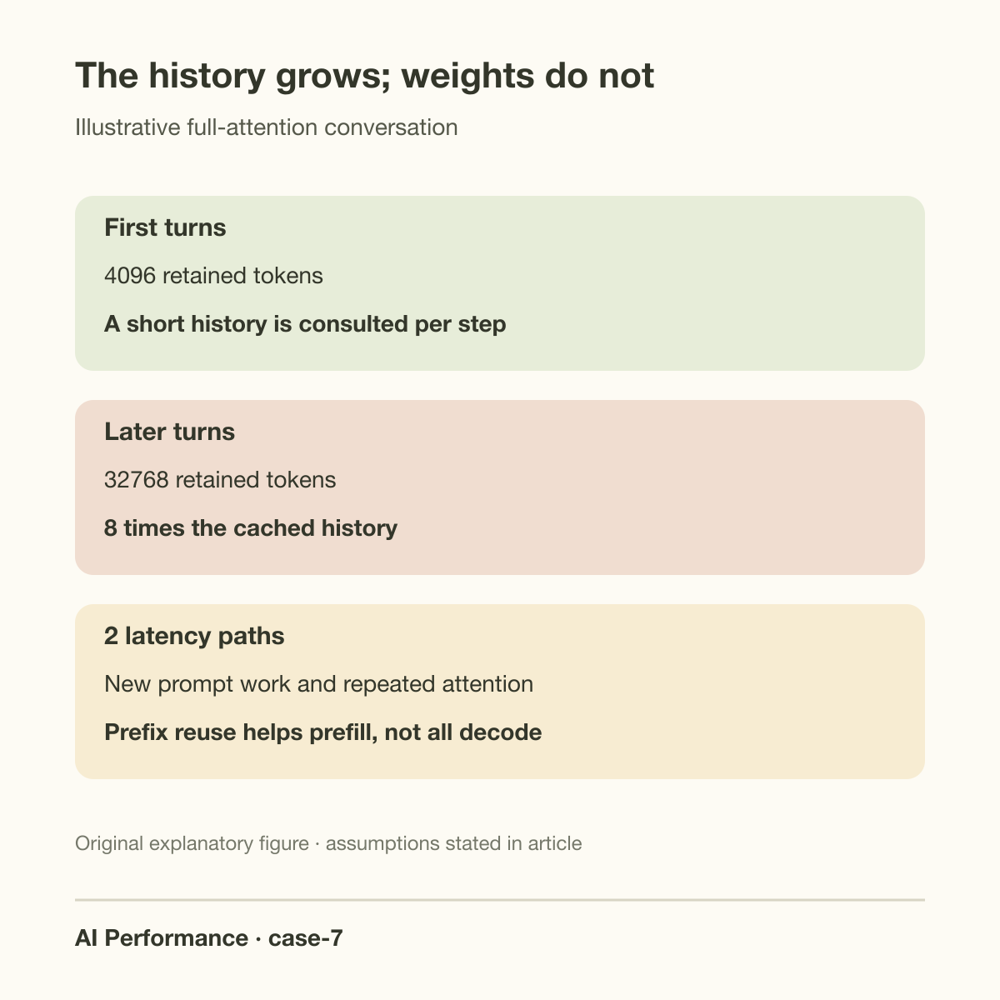
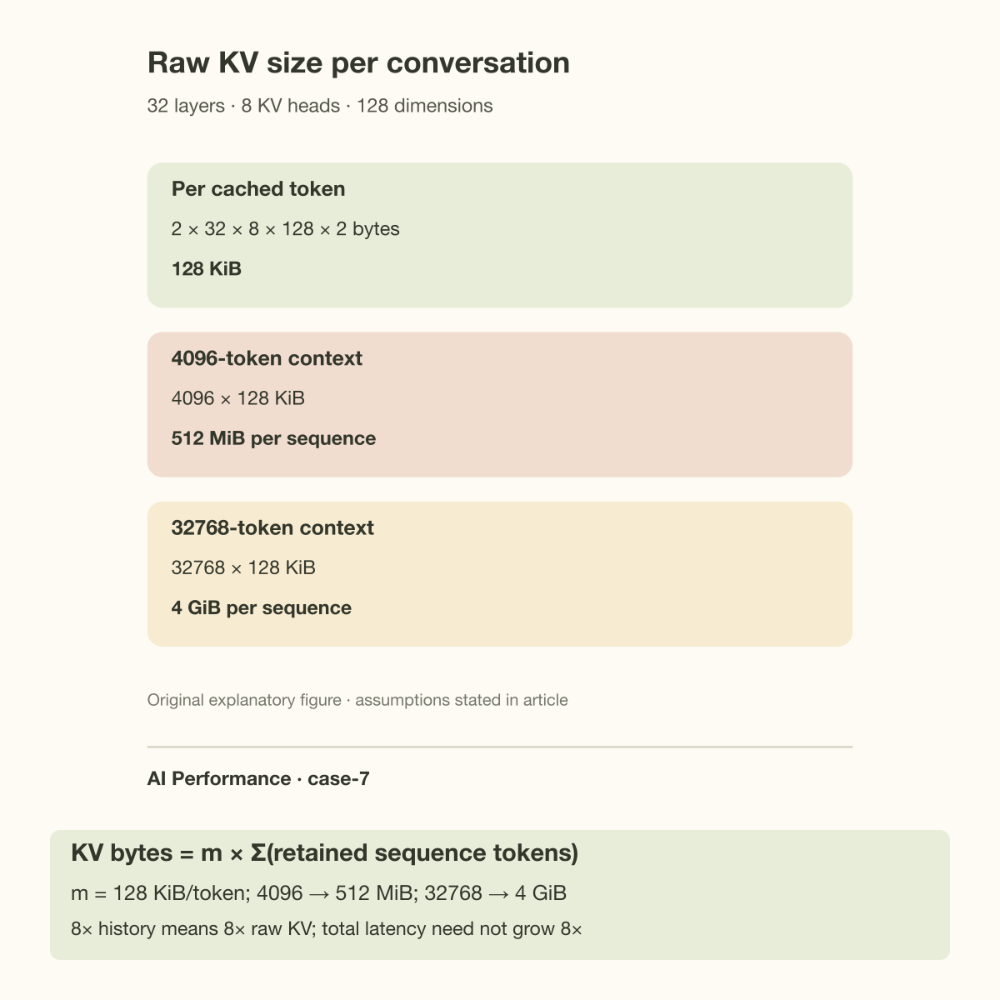
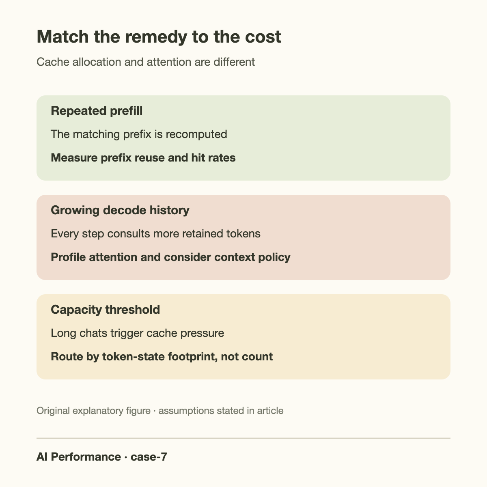

A conversation streams quickly at its first turn and slowly at its twentieth. The model checkpoint, GPU, and decoding parameters are unchanged. Restarting the conversation restores the earlier speed. That pattern suggests context-dependent work, but it does not yet distinguish longer prompt prefill, larger decode attention, cache recomputation, or a client that repeatedly sends unnecessary history.

This case follows a hypothetical service whose contexts grow from 4096 to 32768 tokens. Its operators see both higher first-token latency on later turns and wider gaps between generated tokens. Treat those as separate symptoms. The first concerns processing a newly submitted prompt; the second concerns repeatedly consulting historical keys and values during decode. Both depend on context, but their costs and remedies differ.

## Count the context the server actually sees

Conversation length is not the same as the number of visible user messages. The submitted prompt may include system instructions, earlier assistant outputs, tool results, retrieved documents, hidden formatting, and duplicated transcript sections. Tokenize the final serialized request with the model's tokenizer and log that token count without logging private content.

Track how much history is reused across turns. Many stateless chat APIs receive the entire transcript again. A server-side prefix cache may avoid recomputing matching prefix tokens, but the presence of a cache feature does not guarantee a hit. Differences in templates, ordering, tokenization, or content can invalidate the reusable prefix.

Separate 3 lengths: the serialized prompt length, the reused prefix length, and the active decode context length. A prompt of 16000 tokens with 14000 cached prefix tokens has only 2000 newly computed prompt tokens, yet its decode attention can still need to consult a much longer retained history. Prefix reuse changes prefill work; it does not make all later attention work constant.

Record input and output lengths per turn and per request cohort. Later turns may generate longer answers, use tools more frequently, or arrive at busier times. Compare token intervals at matched active batch sizes before attributing every latency change to context growth. Good observability makes the context hypothesis testable instead of merely intuitive.

*Original explanatory schematic based on the standard KV-cache mechanism; context sizes are illustrative.*

## Derive the raw KV-cache size

For an autoregressive transformer, each layer stores historical key and value vectors. Define L as the layer count, H_kv as the key/value head count, d as the per-head dimension, s_kv as bytes per stored cache element, and C_i as the retained token count of sequence i. The raw cache requirement is:

$$
M_{\mathrm{KV}}=2 L H_{\mathrm{kv}} d s_{\mathrm{kv}}\sum_i C_i.
$$

The leading 2 accounts for keys and values. Use the KV-head count rather than the query-head count for grouped-query or multi-query attention. Using all query heads in the formula can overestimate the cache by the grouping ratio. Conversely, assuming every model uses grouped-query attention can severely underestimate capacity.

This formula covers the raw tensors. A production allocation also includes block rounding, metadata, quantization scales when applicable, allocator overhead, and any implementation-specific cache layout. Reserved workspaces and activations belong in the total GPU memory budget even though they are not KV entries. Distinguish raw size from the serving engine's available block pool.

For an illustrative model with 32 layers, 8 KV heads, dimension 128, and BF16 cache entries, each retained token uses 131072 bytes, exactly 128 KiB. At 4096 tokens, 1 sequence holds 512 MiB. At 32768 tokens, it holds 4 GiB. 16 such long-context sequences require 64 GiB of raw KV data before weights and overhead.

Suppose a GPU has 80 GiB usable in our hypothetical budget, weights and persistent buffers consume 20 GiB, and another 8 GiB is reserved for workspaces and operating margin. The remaining 52 GiB supports at most 13 4-GiB caches by raw arithmetic. Block fragmentation or additional buffers can lower that number. 16 long conversations cannot be admitted at their full length under these assumptions, even if the same server comfortably supports 16 short ones.

## Capacity and speed are different problems

KV growth can slow a service before it runs out of memory. Full attention for the next generated token must compare its query with historical keys and combine the corresponding values. The per-token attention work and data consulted therefore grow with the retained context. Weight memory remains roughly fixed; the history does not.

In a simple traffic approximation, each decode step reads the relevant KV tensors once. Let W be weight bytes streamed per batch and beta_eff the effective delivered bandwidth. Then:

$$
t_{\mathrm{step}}\gtrsim\frac{W+M_{\mathrm{KV,read}}}{\beta_{\mathrm{eff}}}.
$$

This model intentionally omits attention arithmetic, intermediate traffic, launch overhead, and cache effects. Actual HBM reads depend on the kernel's tiling and reuse, especially with grouped-query attention. The estimate is useful as a trend model, not a replacement for profiling.

If the batch contains 16 short sequences, their raw KV total is 8 GiB. Growing them to 32768 tokens raises it to 64 GiB. With a hypothetical 16-GiB weight stream and 1 TiB/s effective bandwidth, the simple traffic lower bound rises from about 23.4 milliseconds to 78.1 milliseconds per step. Individual streaming speed falls from a weight-and-cache ceiling near 43 tokens per second to roughly 13, even though the checkpoint is identical.

The calculation also reveals a capacity violation under the previous 52-GiB cache budget. In reality the engine would need to admit fewer sequences, limit their histories, distribute the model differently, or handle memory pressure through another supported policy. Never present a throughput estimate for an impossible memory configuration as an achievable benchmark.

*Original calculation figure. The model dimensions are hypothetical and the cache equation is stated in the text.*

## Going deeper: why a generation gets more expensive

Let a request start with C prompt tokens and generate G output tokens. Under full attention, the context lengths consulted across its decode steps are approximately C, C+1, through C+G−1, depending on indexing conventions. Their sum is:

$$
\sum_{j=0}^{G-1}(C+j)=GC+\frac{G(G-1)}{2}.
$$

Multiplying that sum by cache bytes per token gives a crude total-history traffic model if every step reads the retained KV once. The GC term says a longer initial conversation makes every output token more expensive. The quadratic-in-G term says long generations add their own growing history.

For C equal to 4096 and G equal to 1024, the sum is 4718080 token-history entries. At C equal to 32768 with the same G, it is 34078208, about 7.2 times larger. That is not a claim of a 7.2-times wall-clock slowdown: fixed weight work, attention kernels, batch sharing, and other costs remain. It shows why a constant-cost-per-output-token assumption eventually fails.

Models with sliding-window or other restricted attention can have different scaling. If a layer consults only a window of size C_max, its historical work can stop growing after that window fills. Hybrid models may mix local and full-attention layers. Read the model configuration and serving implementation before applying a full-attention equation to every layer.

A fixed-batch context sweep can estimate the history cost without assuming that every slowdown comes from the same cause. If W is the approximately fixed weight stream, m cache bytes per token, B active sequences with matched length C, and beta effective bandwidth:

$$
t(C)\approx t_0+\frac{W+BmC}{\beta},\qquad
\frac{dt}{dC}\approx\frac{Bm}{\beta}.
$$

The intercept t_0 collects exposed work not represented by the traffic estimate. For B equal to 8, m equal to 131072 bytes, and beta equal to 1 TiB/s, the predicted slope is about 0.000954 milliseconds per added context token. Increasing C from 4096 to 32768 adds approximately 27.34 milliseconds of ideal cache service per iteration.

Fit that trend using several context lengths while holding batch, dtype, and kernel path fixed. A smooth measured slope supports the history-traffic explanation; a sudden jump accompanied by preemptions supports a separate capacity mechanism. A changed attention kernel can also change the slope or intercept. Prefix reuse reduces new prefill work but not this full-attention context term. Shortening history changes the information supplied to the model, so accept that method only with task-quality checks as well as a faster latency curve.

## Distinguish growth from memory-pressure amplification

Plot inter-token latency against retained context at fixed batch size. A gradual increase without preemptions supports the attention-growth explanation. Abrupt jumps near a cache threshold suggest capacity effects layered on top. Correlate those jumps with available cache blocks, active requests, and preemption or recomputation events.

vLLM documents that insufficient KV capacity can cause requests to be preempted and later recomputed. This avoids simply failing all affected work, but recomputation can worsen end-to-end latency. A long conversation may cross the threshold that turns ordinary attention growth into repeated extra prefill work.

Inspect prefix-cache hit behavior on later turns separately. A low hit rate can explain high first-token latency even when decode intervals match the context model. A high hit rate with slow decode is equally possible. Do not conclude that prefix caching is broken merely because long-chat streaming remains slower.

Also check whether the client resends duplicated history. For example, adding a summary while retaining the complete transcript can increase the prompt instead of reducing it. A serialization test that counts tokens before and after the proposed change is a cheap way to catch that mistake.

## Remedies and what each one changes

Bound the context intentionally when the product permits it. A rolling window reduces retained attention history but discards older information. Summarization can preserve selected facts with fewer tokens, yet it can omit details or introduce errors. Evaluate task quality on long conversations, not merely token counts and speed.

Retrieve relevant earlier turns rather than appending every turn. This changes the application contract: the model sees selected evidence instead of a complete transcript. Use citations or source identifiers where the user needs traceability, and evaluate whether important facts are still recovered. Systems optimization cannot assume semantic equivalence after deleting context.

KV quantization reduces stored cache bytes when the engine and model support it. Its effect on speed depends on the attention kernel and conversion overhead, while its quality impact depends on the quantization method and workload. Validate long-context tasks, because short-prompt evaluations may miss the very accuracy loss this change could introduce.

Lower concurrency for long contexts or route them to a separate pool. This can reduce memory pressure and interference, although it may increase queueing unless capacity is added. Admit work according to its expected token-state footprint rather than a single request-count limit. 16 short requests and 16 long conversations are not equivalent resource commitments.

Prefix caching helps repeated prompt processing; paged allocation helps cache management and sharing opportunities. Neither removes the information that full attention must consult during decode. The separate article on [KV cache as a first-class serving resource](/blog/kv-cache-first-class-citizen/) develops those management decisions.

*Original diagnostic summary; investigate the listed mechanisms with controlled measurements.*

Resource-aware admission also needs to reserve growth, not just the cache that exists at the instant a request arrives. A request beginning with a short prompt can generate a long answer or continue for many turns. If admission consumes every currently free cache block, several accepted requests can grow into a capacity crisis together. Use an output limit, an explicit context limit, or a conservative growth allowance when estimating the request commitment. Measure how often that allowance is too small and how much unused capacity it leaves, then tune it against the service target rather than guessing once.

## Common misconceptions

“The model remembers the conversation for free.” The serving system must supply or retain the relevant state. More history consumes cache capacity and often more decode work. There is no constant-size hidden memory implied by a chat interface.

“Prefix caching fixes long-chat latency.” It can avoid repeating prefill computation for matching history. Full-attention decode may still read that history at every new token. Diagnose first-token and inter-token effects separately.

“Paging makes the cache smaller.” Paging improves allocation and can support sharing; it does not change the raw tensor size for an unshared context. Cache quantization, restricted attention, or shorter retained history are different mechanisms.

## Verify the improvement with quality and latency

Save a matched-context experiment with fixed batch sizes and generation limits, plus a realistic multi-turn test. Compare cache occupancy, preemptions, first-token latency, inter-token latency, and completed requests within the service target. For truncation, summarization, or retrieval, include factual recall and task-completion checks from the affected long conversations.

Read [KV cache explained](/blog/kv-cache-explained/) for the mechanism and [GPU memory budgeting](/blog/gpu-memory-math-will-it-fit/) for capacity planning. The case closes when context growth is visible in the resource model, threshold effects are controlled, and any reduction in retained history preserves the product's required behavior.

## Takeaway

- Count serialized, reused, and retained tokens separately.
- Model both raw KV capacity and the history consulted during decode.
- Treat context reduction as a quality-affecting product change, and validate it alongside serving performance.

## Sources

- [vLLM optimization documentation](https://docs.vllm.ai/en/stable/configuration/optimization/), cache pressure and preemption.
- [Hugging Face Transformers cache documentation](https://huggingface.co/docs/transformers/en/kv_cache), cache implementations and supported tradeoffs.
- [vLLM PagedAttention paper](https://arxiv.org/abs/2309.06180), KV allocation and sharing mechanisms.
