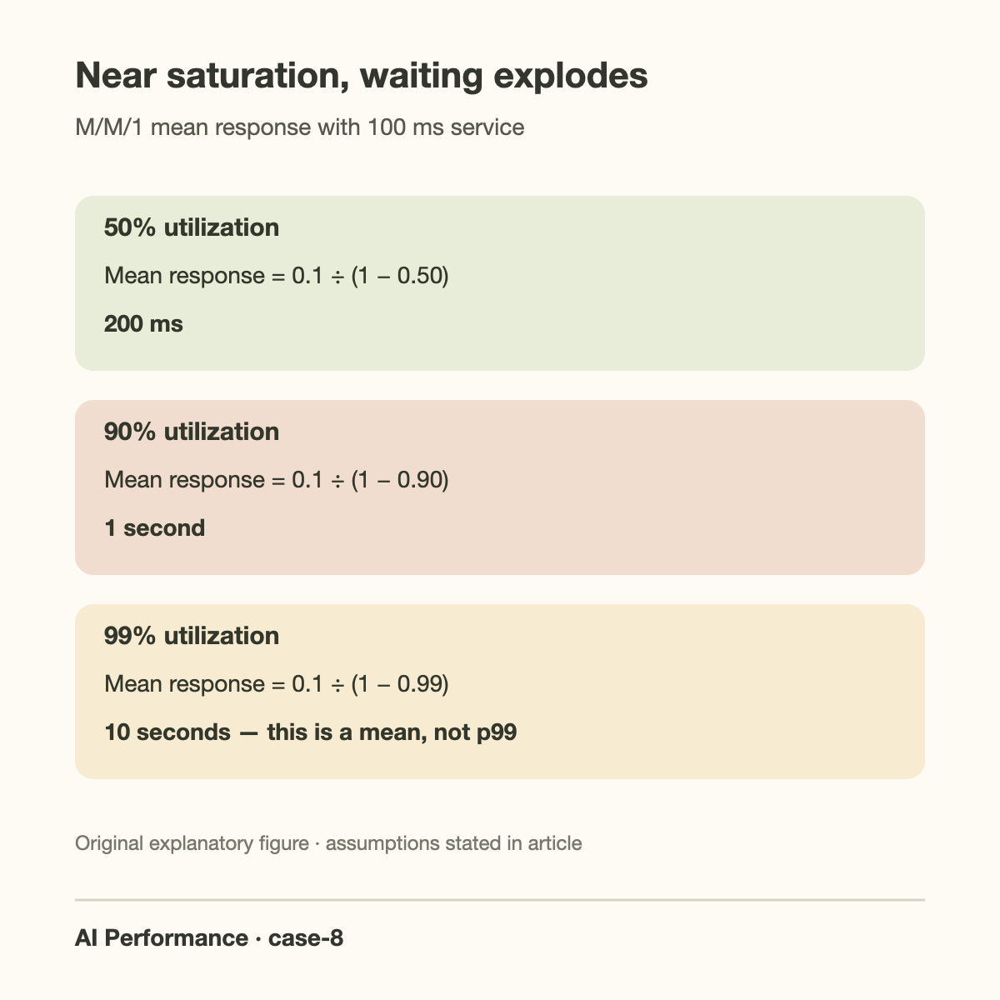
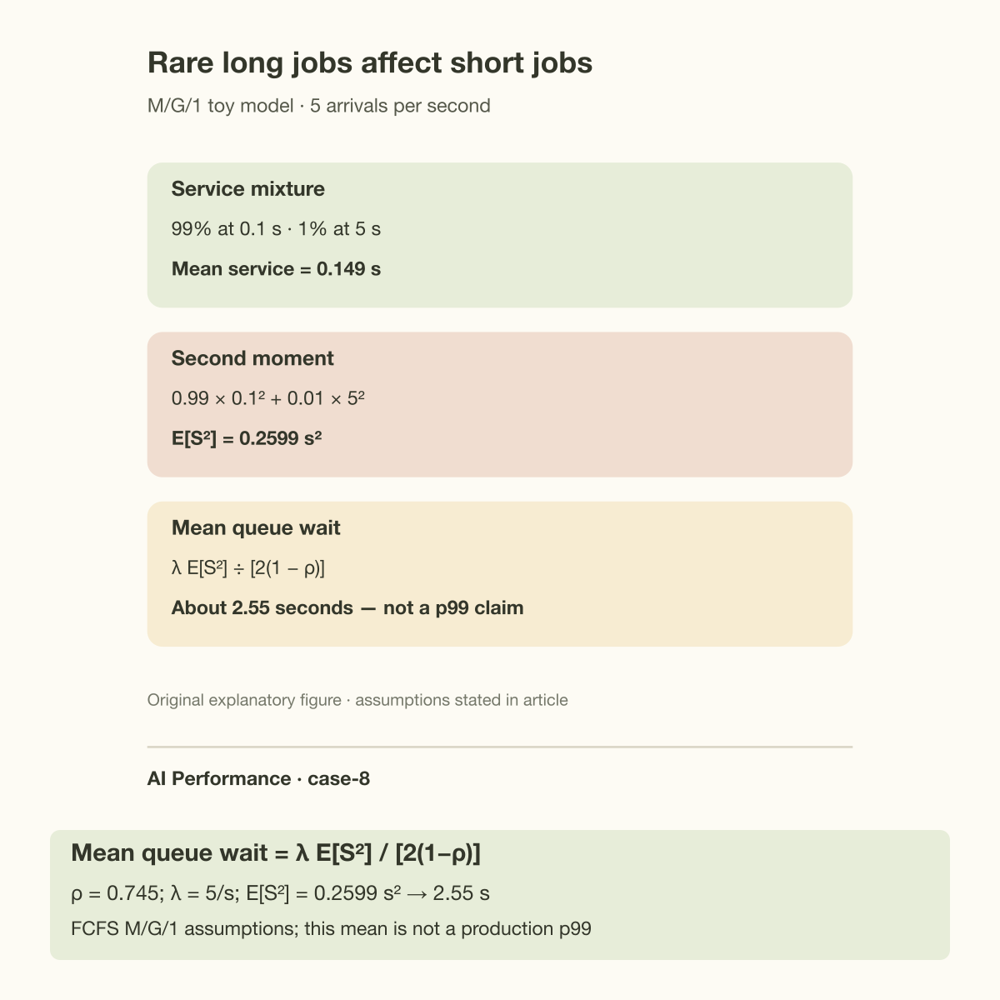
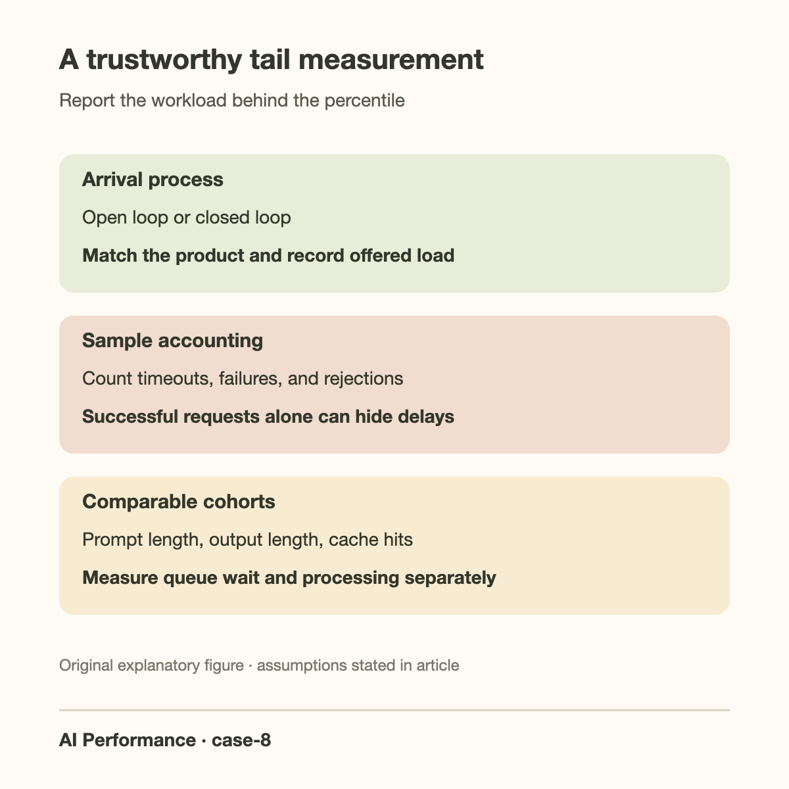

A service reports 300-millisecond median first-token latency and a 9-second p99. The team celebrates the median and blames the tail on a few unusually long prompts. Users who encounter the tail still wait 9 seconds. More importantly, a small number of expensive requests can delay ordinary requests through shared queues, so the tail may be a property of the scheduler and offered load rather than only of those prompts.

This case uses a deliberately simplified single-server queue to build intuition. A real inference engine performs continuous batching, has separate prefill and decode behavior, and shares GPU work across requests. The equations below are therefore an analytical toy model, not an exact prediction for vLLM or any other engine. They make 3 facts concrete: high utilization magnifies waiting, service-time variance matters, and request percentiles must be measured under a specified arrival process.

## Define the latency whose tail you are discussing

First-token latency includes the time from arrival until the first visible output token. End-to-end latency also includes generation and delivery of the remaining output. Inter-token latency describes gaps during streaming. A 9-second p99 in 1 is not equivalent to a 9-second p99 in another. Name the metric and its clock boundaries before selecting a remedy.

Break first-token latency into ingress, queueing, prompt processing, and delivery. Break generation into scheduled decode intervals and transmission. A request arriving behind a long prompt may wait before doing any GPU work, while an already streaming request may suffer interference during decode. The same long input can create 2 distinct tails.

Record separate distributions by prompt length, output length, cache-hit status, priority, and tenant. The global p99 is useful for a broad service target, but a conditional view explains who is affected. If short requests have a long queueing tail whenever long prompts arrive, dismissing the incident as “only long prompts are slow” contradicts the evidence.

## Start with utilization in the simplest queue

Let lambda be the request arrival rate and S the random service time. In a single-server queue the utilization is rho equal to lambda times E[S]. Stability requires rho less than 1 under the model assumptions. This is server occupancy in a queueing model, not NVIDIA's GPU-activity utilization field.

For an M/M/1 queue, which assumes independent Poisson arrivals and exponential service times, the mean time in system is:

$$
E[T]=\frac{E[S]}{1-\rho}.
$$

At E[S] equal to 0.1 seconds, utilization 0.5 produces a mean response time of 0.2 seconds. At utilization 0.9 the mean becomes 1 second. At 0.99 it becomes 10 seconds. The service itself has not become slower; requests spend more time waiting for a resource that has almost no spare capacity.

These are means, not p99 estimates. Do not multiply a production p50 by a queueing factor and call the result a tail prediction. The model's value is directional: a small increase in offered work near saturation can cause a large increase in waiting, even if isolated kernel performance is unchanged.

*Original analytical figure using the M/M/1 mean-response formula; it is not a measured serving benchmark.*

The M/M/1 assumptions also permit an exact tail calculation, which helps distinguish a model result from an empirical percentile. With service rate mu equal to 1 divided by mean service time and Poisson arrival rate lambda:

$$
P(T>t)=\exp[-(\mu-\lambda)t],\qquad
t_{0.99}=\frac{\log100}{\mu-\lambda}.
$$

This is the stationary time-in-system distribution for that queue, requiring lambda less than mu. With mean service 0.1 seconds and utilization 0.9, mu is 10 and lambda is 9 requests/s. The model mean is 1 second while p99 is 4.605 seconds. At utilization 0.5, p99 is approximately 0.921 seconds.

These are valid theoretical percentiles under an exponential single-server model, not percentiles for continuous-batched inference. The benefit is methodological: reducing utilization changes the queue tail even when isolated service time remains fixed. Compare predicted direction with a load sweep, then use the actual engine's observed distribution for the decision. A measured p99 improvement should include acceptance and recovery after bursts, since rejecting the slowest arrivals can improve the accepted sample while reducing delivered service.

## Work a long-tail service-time example

Now use an M/G/1 queue: Poisson arrivals remain, but service times may have a general distribution. For a first-come, first-served single server with independent service times and finite second moment, the Pollaczek–Khinchine formula gives mean waiting time:

$$
E[W_q]=\frac{\lambda E[S^2]}{2(1-\rho)}.
$$

Suppose 99% of requests need 0.1 seconds of service and 1% need 5 seconds. The mean service time is 0.99 times 0.1 plus 0.01 times 5, or 0.149 seconds. Its second moment is 0.99 times 0.1 squared plus 0.01 times 5 squared, or 0.2599 seconds squared.

At 5 arrivals per second, rho is 0.745. Mean waiting is 5 times 0.2599 divided by 2 times 0.255, approximately 2.55 seconds. Mean time in system is therefore around 2.70 seconds, despite 99% of requests having only 100 milliseconds of intrinsic work.

For comparison, if every request deterministically took the same 0.149 seconds, E[S squared] would be 0.022201. At the same arrival rate and utilization, mean waiting would be about 0.218 seconds. The mixed workload has roughly 11.7 times the mean queue wait because its second moment is much larger. Equal mean service demand does not imply equal queueing behavior.

Again, none of those values is p99. The calculation shows why a rare long job can affect many short jobs and why trimming only the median service time may fail to fix the user-facing tail. To obtain percentiles for the actual engine, measure an appropriate workload or simulate a model whose assumptions match that engine closely enough.

*Original worked-example figure. Arrival rate and service times are hypothetical analytical inputs.*

## Going deeper: estimate the distribution honestly

A reported p99 is an estimated quantile, and the number of observations matters. With 1000 completed requests, only about 10 observations lie in the top 1 percent by rank. A single burst or unusual prompt can change the estimate materially. With 100 requests, a nominal p99 is essentially near the largest observed value under common quantile conventions.

State the sample count, duration, warmup procedure, and quantile convention. Retain raw event times or a histogram with enough resolution in the tail. Averaging the p99 of 10 separate windows does not generally equal the p99 of all requests pooled together. Those answer different questions because quantiles are nonlinear summaries.

Stratify and then report the aggregate under the expected workload mixture. A benchmark containing only short prompts cannot support a claim about long-conversation p99. A benchmark that increases the short-request fraction between runs can make the median improve even when every comparable request type stays unchanged.

For a simple statistical view, define an SLO violation indicator X_i equal to 1 when latency exceeds the target and 0 otherwise. Estimate its probability as the sample mean. Under independent observations, the approximate standard error is:

$$
\operatorname{SE}(\hat p)\approx\sqrt{\frac{\hat p(1-\hat p)}{n}}.
$$

If 10000 requests have a 1-percent violation rate, that standard error is about 0.001, or 0.1 percentage points. Bursty or correlated arrivals reduce the validity of the independence approximation. Use longer runs or block-based uncertainty estimates when requests share incident periods. This small equation is more honest than presenting a tail number with unexplained decimal precision.

## The load generator can hide the problem

A closed-loop client starts its next request after the previous response completes. As the server slows, that client offers less work. The resulting test can show bounded queues and a reassuring latency distribution because the generator automatically backs off. That behavior may match an interactive user population, but it does not represent a fixed external arrival stream.

An open-loop test schedules arrivals independently of completion. It can expose queue buildup at a specified request rate. Track scheduled arrival time, actual send time, server arrival time, and completion time. If the generator falls behind its own schedule, reporting latency only from actual send time can omit the waiting that the test was supposed to measure.

This issue is often discussed as coordinated omission: the measurement process omits opportunities to observe delays during a stall. Avoid claiming that one load-generation mode is universally correct. Choose the mode that matches the product, then disclose it and preserve offered-load information.

Measure failures, cancellations, rejections, and timeouts. A p99 computed only over successful requests can improve when the slowest requests time out and disappear from the sample. Report success rate and completed goodput within the latency target alongside the successful-request distribution. Rejected or failed work should not become an invisible route to a better dashboard.

## Locate the tail's source before tuning

Compare queue wait and processing time for tail requests. If queue wait dominates and grows sharply with arrival rate, first reduce saturation or control admission. If prompt-processing time dominates for long inputs, chunking, prefix reuse, or a separate prefill pool may help. If shared streaming gaps dominate, revisit the [batch-scheduler stall case](/blog/case-latency-spikes-batch-scheduler/).

Examine per-request traces for tail events and also sample normal requests from the same time window. A slow request may have a cache miss, recomputation, network interruption, or host pause absent from its neighbors. Conversely, a shared queue spike can delay every tenant. The comparison tells you whether the remedy belongs to a specific request class or the shared service.

Track KV pressure and active context lengths. The request rate can remain constant while offered GPU work increases because prompts become longer or generations expand. Requests per second is not a complete load metric for language-model serving. Use input tokens, output tokens, active token-state footprint, and phase-specific work where possible.

Check queue placement across replicas. A balanced total arrival rate does not guarantee balanced work when 1 replica receives several expensive requests. Routing by request count can create an overloaded tail replica while another remains lightly loaded. Work-aware routing needs estimates, but even a coarse prompt-length and cache-capacity signal can be more informative than counting requests alone.

## Remedies have fairness and capacity costs

Add headroom when queueing dominates. A server running close to its effective limit may need more replicas or less admitted work to satisfy p99. Faster kernels help only to the extent that they reduce the dominant service demand. Extra headroom can be more valuable than chasing a small median improvement at saturation.

Separate request classes when their service demands differ substantially. Long prompts can use a pool or queue designed for their work; interactive short requests can have a latency-oriented path. This reduces interference but can waste capacity if pools are rigid. Share spare capacity where the scheduler permits it and monitor both classes.

Priority scheduling can improve interactive tails while delaying bulk work. Shortest-job policies can reduce mean waiting under suitable assumptions, but job lengths are estimates and large jobs can starve. Use aging, explicit service targets, and honest accounting for lower-priority delays. An improved high-priority p99 is not an all-user improvement if another class becomes unusable.

Admission control bounds the queue and returns a timely overload signal. It protects accepted-request latency but reduces acceptance rate. The decision must be visible in the product and the benchmark. Pair it with retry behavior that avoids synchronized retry storms; otherwise rejecting work simply transforms 1 queue into a later arrival burst.

*Original diagnostic summary; investigate the listed mechanisms with controlled measurements.*

After changing capacity or routing, repeat a load sweep around the operating point rather than checking only 1 arrival rate. A configuration may improve the tail at light load yet reach saturation sooner because its smaller batches sacrifice throughput. Include a burst that resembles the product's busiest interval and a recovery period afterward. The recovery curve matters: a server that keeps a large backlog long after arrivals return to normal can continue delivering poor latency even though its current arrival rate looks safe. Save the offered arrival trace so that the before and after runs face comparable work.

## Common misconceptions

“A good p50 means the service is mostly healthy.” It describes the middle observation, not stability under offered load or the cost of long delays. Track a service target and its violation rate alongside the median.

“p99 is determined only by the longest prompts.” Long jobs can delay short ones through a shared queue. Conditional latency and queue-wait measurements reveal that interference.

“Queueing formulas predict our engine's p99 exactly.” The examples here predict means under stated single-server assumptions. Continuous batching and mixed-phase scheduling need measurement or a richer model. Use theory to form a hypothesis, not to manufacture a percentile.

## Takeaway

- Name the latency metric, arrival process, workload mixture, and sample count.
- Investigate both saturation and service-time variance before optimizing the median.
- Validate tail improvements with acceptance rate and SLO goodput, including timeouts and failures.

For related practice, see [benchmarking pitfalls](/blog/benchmarking-pitfalls/), [profiling the critical path](/blog/profiling-basics-where-time-goes/), and [TTFT versus TPOT](/blog/ttft-and-tpot/).

## Sources

- [MIT OpenCourseWare: Eytan Modiano, Lectures 8–9, M/G/1 Queues](https://ocw.mit.edu/courses/6-263j-data-communication-networks-fall-2002/65d9ab519ec4851af812f4b89ffaeedc_Lectures8_9.pdf), service-time second moments and the Pollaczek–Khinchine mean-wait formula.
- [MIT: Cathy Wu, Queuing Models](https://web.mit.edu/1.041/www/lectures/L8-queuing-models-2026sp.pdf), M/M/1 assumptions and mean-response analysis.
- [vLLM serving metrics documentation](https://docs.vllm.ai/en/stable/usage/metrics/), first-token, inter-token, and request instrumentation.
- [vLLM optimization documentation](https://docs.vllm.ai/en/stable/configuration/optimization/), scheduling and cache-pressure mechanisms.
- [HdrHistogram repository](https://github.com/HdrHistogram/HdrHistogram), histogram measurement and coordinated-omission documentation.
