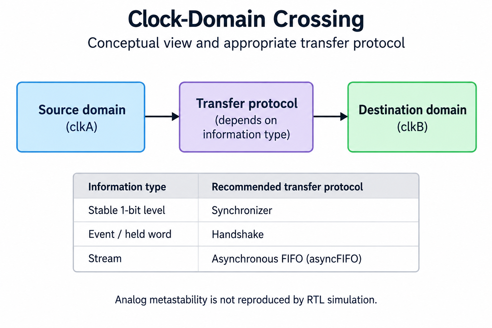
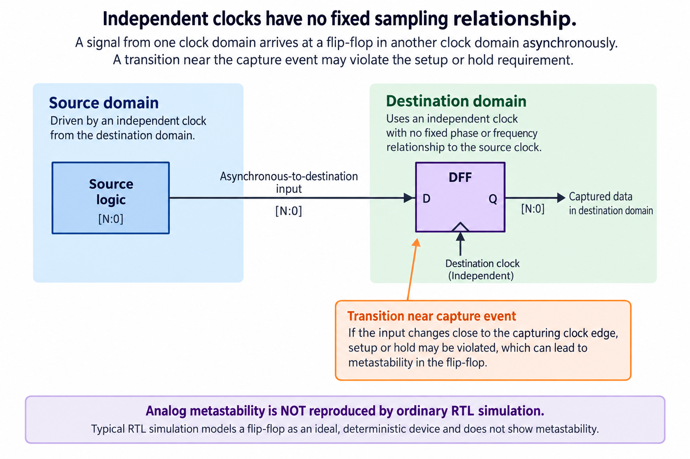
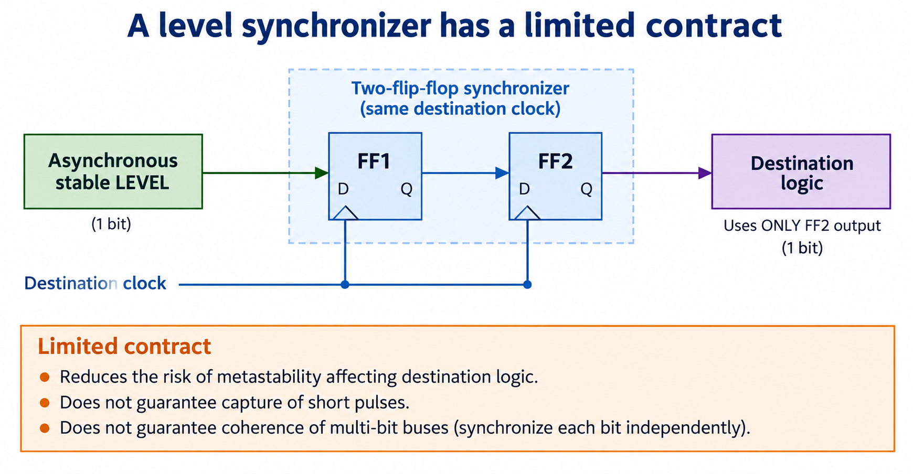
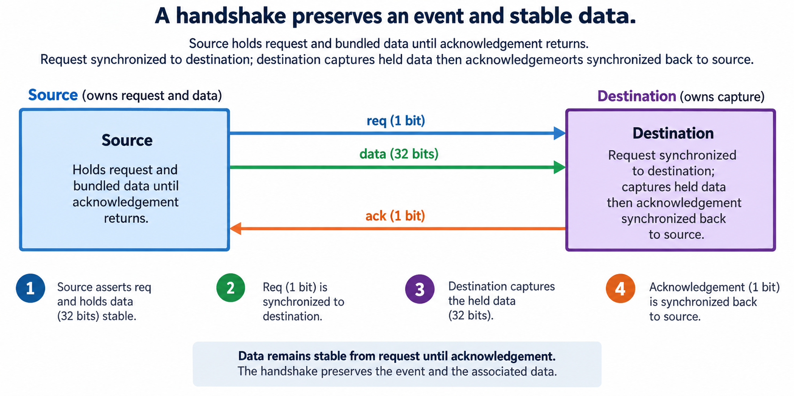
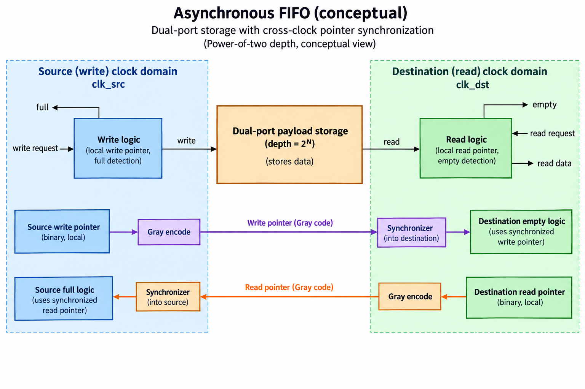

## Overview

A clock-domain crossing happens when information moves between logic driven by clocks that have no assumed synchronous capture relationship for that transfer. The overview separates the source, the crossing mechanism, and the destination. Connecting wires is easy; preserving the intended information under independent sampling is the actual design problem.

Read [setup and hold](/blog/digital-timing-setup-hold-latency-pipelining/) first. A receiving register expects data to be stable around its capture event. With independent clocks, an input transition can occur near that event. A transfer mechanism must account for this uncertainty and for the type of information being sent: a stable level, an event, a coherent word, or a stream.

This article introduces the contracts of a 2-flop level synchronizer, a held-data handshake, and a conceptual asynchronous FIFO. It does not supply a physical CDC signoff result or a new production FIFO implementation. The [foundations lab](/labs/fpga-fundamentals/foundations-lab.zip) checks small digital examples, including Gray-code transitions. Ordinary RTL simulation does not reproduce analog metastability or establish a numeric reliability guarantee.

The figures emphasize direction and ownership. Request and acknowledgement travel in opposite directions. FIFO data stays in storage, while pointer information crosses through synchronizers. These distinctions are more useful than applying one generic synchronizer icon to every multi-bit wire. Before choosing a mechanism, specify what must be preserved and how long the source can hold it.

## Deep dive

### Independent clocks have no fixed sampling relationship

The source and destination in the first figure do not have a fixed sampling relationship for this transfer. A source transition can approach the receiving register's active edge closely enough to violate its setup or hold requirement. The register may then enter an analog metastable condition before resolving. This is a physical behavior of a receiving element, not an extra binary value deliberately implemented in the RTL.

An ordinary RTL simulation evaluates digital events using its language model. Even if 2 clocks are scheduled at nearly the same simulated time, the resulting digital trace does not quantify analog resolution behavior. Adding an X to a scratch model may help explore downstream assumptions about uncertainty, but it is not a physical metastability simulation or a measured mean time between failures.

Identify the relevant clock relationship from the implementation; do not infer it from a name. 2 signals called slow_clk and fast_clk may be related generated clocks, or they may be independent. A clock divider, gating arrangement, or external source needs documentation and appropriate constraints. The [AMD asynchronous-crossing constraints guide](https://docs.amd.com/r/en-US/ug903-vivado-using-constraints/Asynchronous-Clock-Domain-Crossings) discusses the distinction between timing treatment and crossing structures.

A receiving interface should specify whether losing or delaying information is acceptable. A level that remains high for many destination cycles has a different contract from a 1-source-cycle pulse. A binary counter bus has a different coherence requirement from one independent status bit. Without these distinctions, a diagram may look orderly while the interface loses events or captures a word that never existed at the source.

A generic 2-register symbol does not eliminate metastability risk. A practical reliability assessment depends on device characteristics, clock and transition rates, available resolution time, physical implementation, and the transfer mechanism. This beginner lesson deliberately avoids fabricated numerical reliability values because no such implementation analysis was done.

The first design action is therefore classification: identify the clocks, the information type, the source stability guarantee, and the destination's required interpretation. Then choose a mechanism whose documented contract matches those needs. Digital tests can examine protocol behavior, and structural or physical tools can provide additional evidence. No single waveform proves all of these properties.

### A level synchronizer has a limited contract

The level synchronizer figure places FF1 and FF2 in the destination domain. The asynchronous stable input reaches FF1; FF1's output reaches FF2; destination logic uses only FF2. There is no combinational logic between the 2 stages. The first stage may receive an inconveniently timed transition, and the second gives that state extra time to resolve before it is used downstream.

The scope is a level, not an arbitrary event stream. If a pulse is shorter than the destination's opportunity to sample it, both destination captures can miss it. Adding more synchronization stages does not make that vanished pulse persist. A source that needs guaranteed event delivery must stretch or encode the event under a defined protocol, often using a handshake or a documented pulse-crossing primitive.

2-flop synchronization also does not make a multi-bit bus coherent. Different source bits can change at slightly different times or be captured on different destination edges. Independently synchronized bits can therefore form a combination that was not a valid source word. This is especially visible in a binary counter transition where several bits change together.

The [AMD XPM CDC single-bit documentation](https://docs.amd.com/r/en-US/ug1704-spartan-ultrascaleplus-libraries/XPM_CDC_SINGLE) provides device-flow guidance for a supported single-bit crossing primitive. A selected implementation still needs its documented parameter, structural, and physical requirements. The teaching diagram describes the conceptual chain rather than claiming that the foundations lab instantiated or physically verified that macro.

Destination observation is delayed and can vary relative to the source transition. A consumer should use the synchronized level under its destination clock, not compare it as if it were a same-cycle source value. If latency matters, define it in terms of the documented protocol and clock relationship rather than promising a universal number of source cycles.

Reset strategy also needs attention. Independently resetting source and destination logic can create transitions or inconsistent protocol state. This article does not turn reset into an arbitrary asynchronous bypass. A practical design uses a documented reset-domain scheme and verifies how the crossing returns to a legal state. Treat reset behavior as part of the transfer contract, not a line omitted from the diagram because it makes the picture less tidy.

### A handshake preserves an event and stable data

The handshake figure keeps bundled data stable at the source while the request travels to the destination, where the destination observes the synchronized request, captures the held data under the documented protocol, and returns an acknowledgement through a reverse-direction synchronization path, and the source does not change or replace the data until that acknowledgement establishes that the transfer completed.

The request travels source to destination, while acknowledgement travels destination to source. Reversing either arrow destroys the ownership story. Data does not need to pass through a separate 2-flop chain for every bit under this bundled-data contract; instead, the protocol and implementation must ensure that the complete word is stable when the destination captures it. The stability relationship needs appropriate design and physical consideration.

For a 4-phase level handshake, one possible sequence is source raises request, destination accepts and raises acknowledgement, source lowers request, and destination lowers acknowledgement. A new transaction begins only after the protocol returns to its idle state. Other handshake encodings exist, but their state and reset rules must be stated rather than mixed into this sequence.

This mechanism trades throughput for explicit completion. A source may wait several clock observations for the round trip, and it must define what happens if another event arrives while busy. Queuing, rejecting, or coalescing requests are different policies. A design that overwrites the held data before acknowledgement can deliver a different word from the one associated with the original request.

A digital protocol test can vary source and destination clock periods, insert delays, and verify that accepted words arrive once and in order. It should check data stability while busy and the legal request-acknowledgement sequence. Such a test is useful but does not quantify metastability or prove routed bundled-data timing. The foundations release teaches the contract and does not claim a physically signed-off implementation of this handshake.

When integrating a crossing, write down which side owns the data at each phase and exactly which event permits reuse of the source register, a discipline that resembles a normal ownership protocol but adds independent observation delays, and that clear ownership prevents a source from assuming destination acceptance occurred just because it asserted request on its own clock.

### An asynchronous FIFO separates local ownership

The FIFO figure separates payload storage from crossed pointer information. The source writes under its clock, and the destination reads under its clock. Each side keeps a local pointer. Gray-coded pointer information crosses through synchronizers so the opposite side can conservatively evaluate occupancy conditions. The payload remains in the dual-port storage and is not sent through the pointer synchronizer chain.

A conceptual power-of-2-depth FIFO typically uses local binary pointers for address arithmetic and Gray-coded representations for crossing. Gray code changes 1 bit between adjacent encoded pointer values, reducing the multi-bit transition problem for that pointer sequence. This does not mean that any arbitrary payload bus becomes safe after converting unrelated bits to Gray code.

For a 3-bit Gray sequence, encode a binary value as that value XOR itself shifted right by one. Adjacent codes for the complete wrapping sequence differ in 1 bit. The lab checks this property by counting changed bits, including the wraparound. That arithmetic result explains the encoding choice; it is not proof that an asynchronous FIFO has correct full and empty flags.

A practical FIFO needs extra pointer state to distinguish wraparound, correct flag comparisons, documented memory read behavior, and safe reset handling. Full and empty decisions use delayed synchronized knowledge of the remote pointer. Conservative status can affect when a side proceeds. An explanation that compares unsynchronized remote binary pointers skips the central crossing problem.

Physical requirements still matter. You must still meet the Gray-bit path relationships, synchronization placement and clock constraints, and follow the selected FIFO or CDC primitive's guidance. The [AMD constraints guide](https://docs.amd.com/r/en-US/ug903-vivado-using-constraints/Asynchronous-Clock-Domain-Crossings) is a primary starting point for this distinction. Excluding asynchronous paths from an ordinary synchronous check does not by itself preserve the intended Gray or bundled-data relationship.

The lesson stops at the mechanism and its limits. Readers implementing a stream should use a documented vendor primitive or a rigorously reviewed FIFO and keep structural, protocol, and physical evidence. The accelerator project begins with a simpler single-clock verified design. Introducing a second clock is an additional architecture task, not an incidental wiring change that its original simulation transcript already proves.

## Conclusion

A crossing mechanism must match the information being transferred. A level synchronizer can support a suitably stable single-bit level, a handshake can preserve an event and held word under a completion protocol, and an asynchronous FIFO can support a stream through local storage and synchronized pointer knowledge. Their contracts are different.

The figures deliberately keep payload, request, acknowledgement, and pointer paths distinct. Use the same discipline in a real interface specification: identify ownership, source stability, busy behavior, reset recovery, and the destination observation rule. Then collect digital, structural, and physical evidence appropriate to that mechanism.

The foundations lab's Gray-code check and ordinary RTL examples provide educational digital evidence. They do not model analog metastability, establish a numeric reliability guarantee, or sign off a physical crossing. Continue with [dot products and matrix shapes](/blog/ai-arithmetic-dot-products-matrix-shapes-reuse/) to connect the now-established representation, state, and transfer vocabulary to AI arithmetic.

### Sources

- [AMD XPM CDC single-bit primitive](https://docs.amd.com/r/en-US/ug1704-spartan-ultrascaleplus-libraries/XPM_CDC_SINGLE)
- [AMD asynchronous clock-domain constraints](https://docs.amd.com/r/en-US/ug903-vivado-using-constraints/Asynchronous-Clock-Domain-Crossings)
