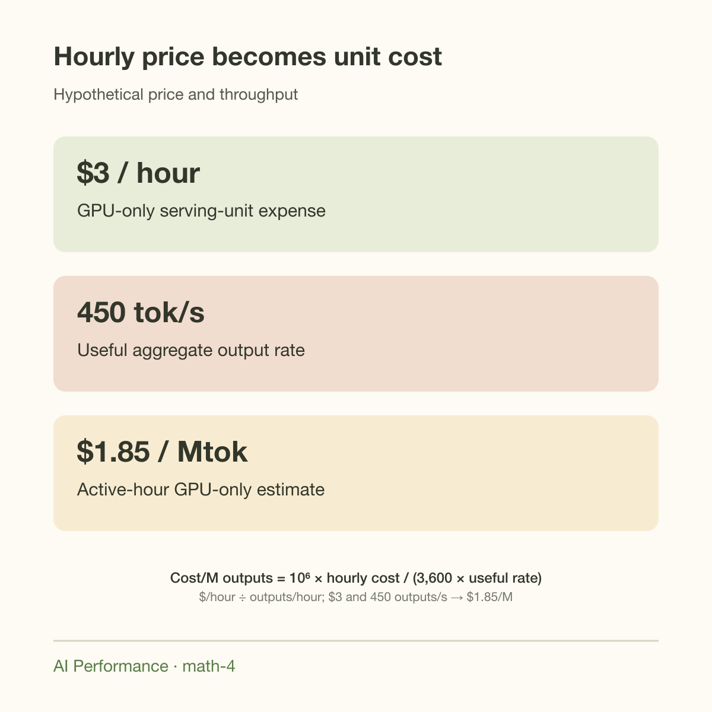
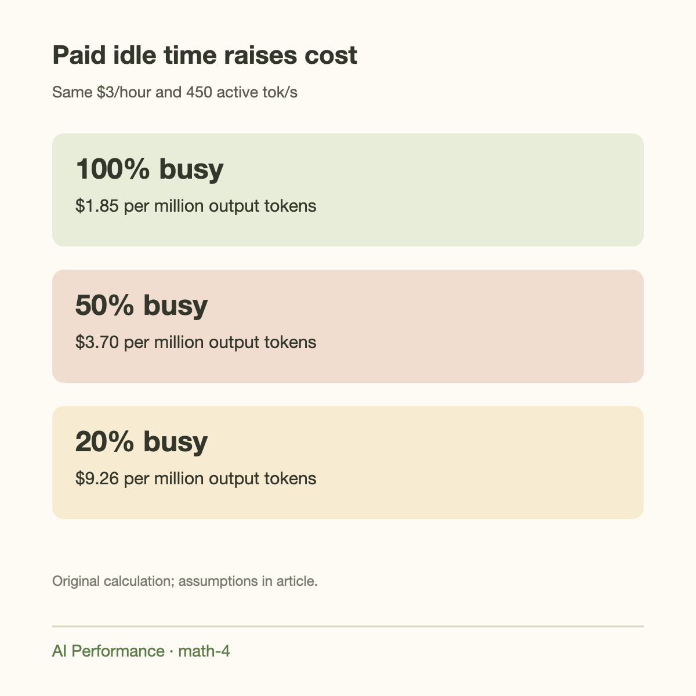
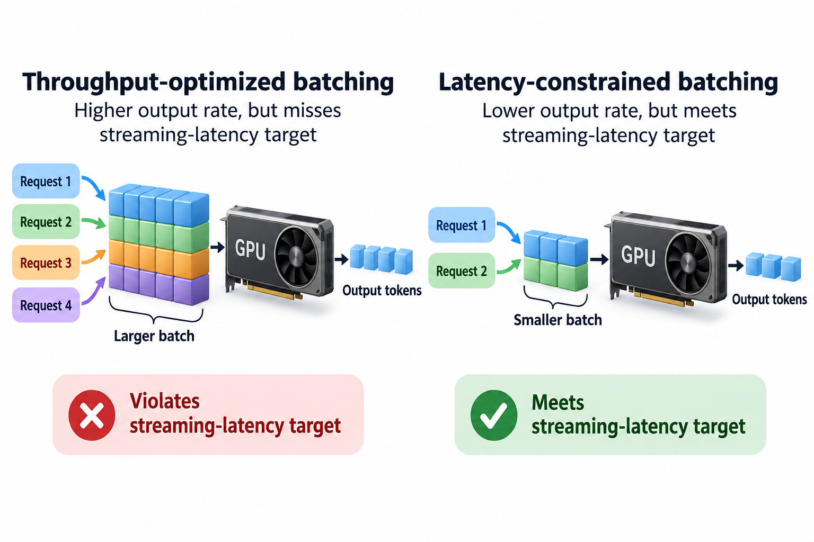
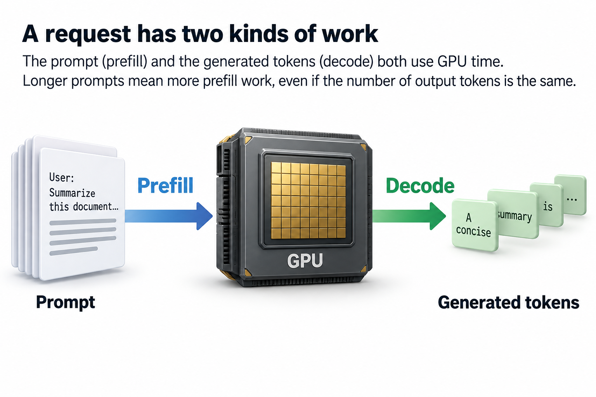
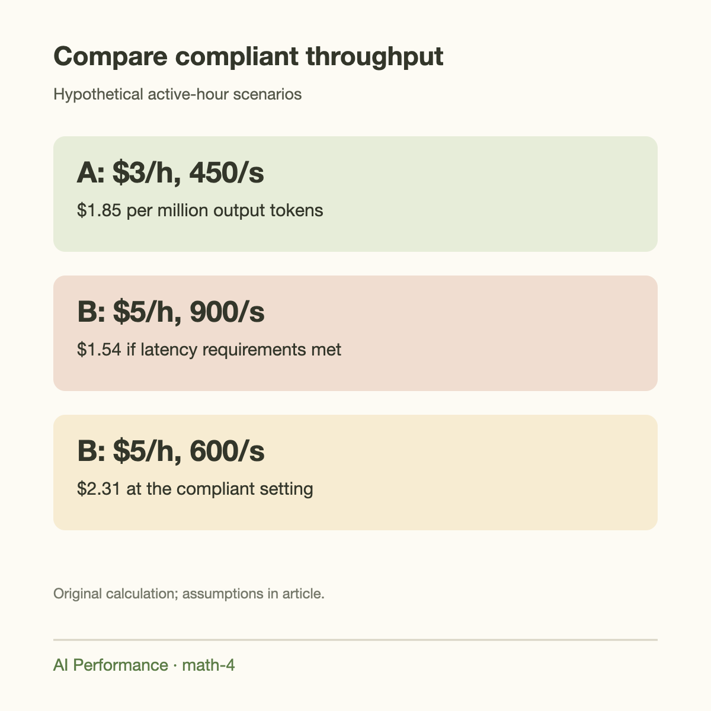

A hypothetical GPU rental price of $3 per hour produces a GPU-only cost of about $1.85 per million output tokens at 450 tokens per second. At 45 tokens per second, the same rental costs $18.52 per million output tokens. Hardware price is only half the calculation; useful service throughput supplies the other half.

Neither price nor throughput here is a current commercial quote or a measured deployment result. They are explicit scenarios designed to make the conversion reproducible. Use your actual contract price and a benchmark that meets your service requirements before making a purchasing decision.

This article connects the resource calculations in the preceding GPU Math articles to operating cost. It separates theoretical ceilings from measured rates, distinguishes active-hour efficiency from fleet occupancy, and shows why latency and workload mix belong in the denominator.

## Derive the basic conversion

Let $$p$$ be the hourly cost of the complete serving unit in dollars per hour. Let $$R$$ be its useful aggregate output rate in tokens per second during the measured interval. In 1 hour it produces

$$
N_{\mathrm{hour}}=3{,}600R.
$$

The corresponding cost per million output tokens is

$$
C_{\mathrm{Mtok}}=\frac{10^6p}{3{,}600R}.
$$

The factor 3,600 converts seconds to hours; 1 million converts tokens to the reporting unit. Omitting either factor is a common spreadsheet error. Dimensionally, dollars/hour divided by tokens/hour gives dollars/token.

For $$p=3$$ and $$R=450$$,

$$
C_{\mathrm{Mtok}}=\frac{3\times10^6}{3{,}600\times450}=1.85185.
$$

Round to about $1.85 for reporting. The many decimal places in the arithmetic do not imply that price or measured throughput is known to that accuracy.

## The serving unit must be complete

A model may need 2, 4, or 8 GPUs. If a 4-GPU replica costs $3 per GPU-hour, its GPU rental is $12 per replica-hour. Its measured throughput must be the replica's aggregate throughput, not 1 GPU's shard throughput.

Some providers quote a complete instance including CPU, RAM, and networking; others quote GPUs separately. If the complete instance costs $14 per hour, use $14 rather than adding the same CPU cost a second time. Read the billing unit and configuration before inserting a price.

A useful decomposition is

$$
p_{\mathrm{unit}}=p_{\mathrm{GPU}}+p_{\mathrm{CPU/RAM}}+p_{\mathrm{fixed\ network}}+p_{\mathrm{other\ hourly}}.
$$

Variable costs, such as storage operations or traffic charges, can be added separately per request or per token. There is no universal list that every cloud bills the same way. The point is to make the chosen cost boundary explicit.

GPU-only cost is a meaningful engineering metric if labeled. It is not the same as total operating cost or the retail price of an API. Staffing, support, availability reserves, and provider margins are outside a simple GPU-hour calculation.

## Use useful aggregate output throughput

A batch-8 server might stream 40 output tokens per second to each active request, producing 320 aggregate tokens per second. Insert 320 into the replica cost equation. Inserting 40 would charge all 8 users for the entire server separately.

Conversely, do not multiply a benchmark's already aggregate throughput by batch size again. Read its metric definition. Input prompt tokens, generated output tokens, and total processed tokens are different denominators and have different computational costs.

A benchmark that reports 2,000 total tokens per second while ingesting long prompts may have a much lower output rate. If your cost unit is per million generated tokens, use completed generated output. The prompt workload still consumes time and must be present in the benchmark, but it is not silently added to the output count.

Also decide whether rejected or failed requests count. If a request spends GPU time and then fails without delivering acceptable output, that time belongs in cost while its unusable output should not inflate useful throughput. The same principle applies to speculative tokens that are generated internally and rejected: they are work, not delivered tokens.

## Fleet occupancy changes the result

The first equation assumes the measured output rate is sustained over every paid hour. Real demand varies. A warm replica may sit idle overnight, and capacity reserved for sudden spikes may produce little output for much of the day.

Let $$u$$ represent the fraction of paid time spent serving at active rate $$R_a$$, under a simplified busy/idle model. Then

$$
R_{\mathrm{paid\ average}}=uR_a,
\qquad C_{\mathrm{Mtok}}=\frac{10^6p}{3{,}600uR_a}.
$$

At $3 per hour, 450 active tokens per second, and 50% occupancy, the estimate doubles to $3.70 per million output tokens. At 20% occupancy, it rises to $9.26. These changes occur without altering the GPU or active-hour kernel efficiency.

Do not confuse this occupancy factor with hardware utilization reported by a monitoring tool. A GPU can be busy on retries or inefficient work, and a low-demand fleet can contain a highly efficient active replica. Different utilization definitions describe different parts of the system.

If your measured $$R$$ already averages output over the entire paid interval, do not multiply by $$u$$ again. That would double-count idle time. The direct accounting formula below avoids that ambiguity.

## Direct accounting over an interval

For an interval with total attributable cost $$K$$ and useful completed output $$N$$,

$$
C_{\mathrm{Mtok}}=\frac{10^6K}{N}.
$$

This is the safest operational definition because it handles varying demand, multiple replica types, and changing prices. The hourly formula is a special case when price and rate are steady.

For example, 2 replicas costing $3 per hour each run for 24 hours, so GPU rental totals $144. Suppose the service delivers 60 million acceptable output tokens during that day. Its GPU-only cost is $2.40 per million outputs. If CPU and other attributable expenses add $36, the selected broader cost becomes $3.00.

The required bookkeeping is straightforward: define the interval, cost boundary, accepted-output counter, and attribution policy. If 1 fleet serves several models, allocate shared costs consistently and document that policy. A precise token counter paired with an arbitrary allocation rule still yields an uncertain estimate.

## A worked latency-constrained comparison

Consider 2 hypothetical configurations for the same model and request distribution. Configuration A costs $3 per hour and delivers 450 aggregate output tokens per second while meeting the chosen latency limits. Configuration B costs $5 per hour and delivers 900 compliant output tokens per second.

Their active GPU-only costs are approximately $1.85 and $1.54 per million outputs, respectively. B is more expensive per hour but cheaper per useful token. Its doubled throughput more than compensates for the 67% hourly-price increase.

Now suppose B's 900-token result requires a batch policy that violates the service's streaming-latency target. At the compliant setting, it delivers only 600 tokens per second. Its cost becomes approximately $2.31 per million outputs, making A cheaper under the actual requirement.

A peak-throughput comparison would have selected the wrong configuration. Define the time-to-first-token and time-per-output-token limits before benchmarking, and count the output rate achieved within them. Tail behavior matters because a fleet average can conceal a subset of users experiencing unacceptable stalls.

If the 2 configurations have different occupancies, compare paid-interval cost rather than active cost. A faster replica may finish demand sooner, but if it remains rented and idle, that theoretical capacity has not necessarily become a billing saving. Autoscaling delay and minimum replica count affect the result.

## Going deeper: prompt and output work

A request includes prefill and decode. Long prompts consume GPU time even when the service bills or reports only generated tokens. Holding output length fixed while increasing prompt length can raise cost per output token.

For a simple request-class model, let $$t_p$$ be prefill time and $$t_d$$ decode time for $$O$$ delivered outputs. A single sequential request's output productivity is

$$
R_{\mathrm{request}}=\frac{O}{t_p+t_d}.
$$

This does not directly predict a batched server because requests overlap and share weights. It does show why quoting decode-only speed can understate full-service cost. A benchmark must include the prompt distribution it is intended to serve.

Compare a request with 100 output tokens after 0.2 seconds of prefill and 2.5 seconds of decode to one with the same output after 4 seconds of prefill and 2.5 seconds of decode. Their isolated output rates are about 37.0 and 15.4 tokens per second. The output counter is identical; the resource time is not.

Prefix caching can save repeated prefill, but the hit rate and shared-prefix lengths must come from the workload. Do not assume a popular system prompt guarantees a large benefit if most input comes from unique documents. Measure both useful output and cache behavior.

## Theoretical ceilings are optimistic denominators

[The bandwidth article](../theoretical-tokens-per-second-from-bandwidth/) derived a peak-bandwidth ceiling near 457 aggregate output tokens per second for an illustrative capacity-compatible quantized workload. Substituting that ceiling into a cost equation gives an optimistic lower-bound scenario, not a measured operating cost.

Real kernels may achieve less bandwidth, and request scheduling adds overhead. Long histories increase cache traffic. Sampling, communication, and prefill interfere with decode. Every reduction in useful rate raises unit cost if hourly expense remains fixed.

A useful report can include 3 columns: theoretical resource bound, measured active compliant rate, and paid-interval useful average. They explain hardware potential, implementation efficiency, and operational demand respectively. Presenting only the first column creates an unrealistically favorable price estimate.

## Sensitivity and uncertainty

The basic equation is inversely proportional to throughput. A 20% throughput loss raises cost by 25%, because $$1/0.8=1.25$$. A 20% hourly-price reduction lowers cost by 20%. These changes are not symmetric.

If price lies between $2.50 and $3.50 per hour and compliant active throughput between 350 and 500 outputs per second, the active GPU-only range is approximately $1.39 to $2.78 per million outputs. The low end pairs the lowest price with highest throughput; the high end pairs the highest price with lowest throughput.

That interval is a scenario envelope, not a statistical confidence interval. A confidence interval requires a sampling model and observed variation. For measured workloads, repeat comparable intervals or use independent workload runs to quantify uncertainty rather than attaching “95%” to assumed limits.

Correlations also matter. Higher demand may improve batching and occupancy while worsening tail latency. Treating all variables as independent can create combinations that the service never actually exhibits. Keep the traffic distribution in the experiment.

## Availability has an explicit price

A service may keep spare replicas to survive failures or demand spikes. Those replicas belong in paid cost even when healthy active replicas could theoretically handle average traffic. The reserve is part of the availability policy.

A 2-replica service that must tolerate 1 failure may operate each below its maximum capacity. Comparing its cost with a single saturated benchmark is unfair unless the benchmark also satisfies the same availability requirement. State replica count and failure assumptions alongside the latency targets.

Spot capacity and reserved contracts can change hourly expense, but interruption behavior and commitment periods matter. Use the realized cost and useful output over the relevant interval. A low advertised rate is not automatically the cheapest way to deliver reliable output.

## Common misconceptions

**Cheaper GPU-hours guarantee cheaper tokens.** Unit cost depends on price divided by useful rate. A faster, more expensive serving unit can win.

**Peak aggregate throughput is a cost denominator for every service.** It must meet latency and workload requirements. Noncompliant output does not establish usable capacity.

**GPU utilization measures fleet occupancy.** It measures a different behavior over a particular device interval. Paid idle replicas and wasted busy work require separate accounting.

**Output-only billing means prompts are computationally free.** Prefill consumes time and can dominate long-document workloads. Include it when measuring useful output rate.

## Takeaway

Divide the full serving unit's cost by its useful completed output over the same interval. Use active-hour throughput for controlled engineering comparisons and paid-interval throughput for operating cost. Keep input workload, latency requirements, and availability reserves explicit.

The examples use hypothetical prices throughout. Replace them with actual billing records and compliant benchmark results; do not turn a theoretical resource ceiling into a commercial quote. [The batch-transition article](../how-big-a-batch-before-compute-bound/) explains why increasing batch size eventually stops improving that denominator.

## Sources

- [NVIDIA matrix-multiplication performance guide](https://docs.nvidia.com/deeplearning/performance/dl-performance-matrix-multiplication/index.html): batching, arithmetic intensity, and throughput limits.
- [NVIDIA H100 specifications](https://www.nvidia.com/en-us/data-center/h100/): resource ceilings used in linked workload estimates.
- The monetary examples and cost equations are original dimensional calculations with explicitly hypothetical prices; they are not provider pricing claims.
