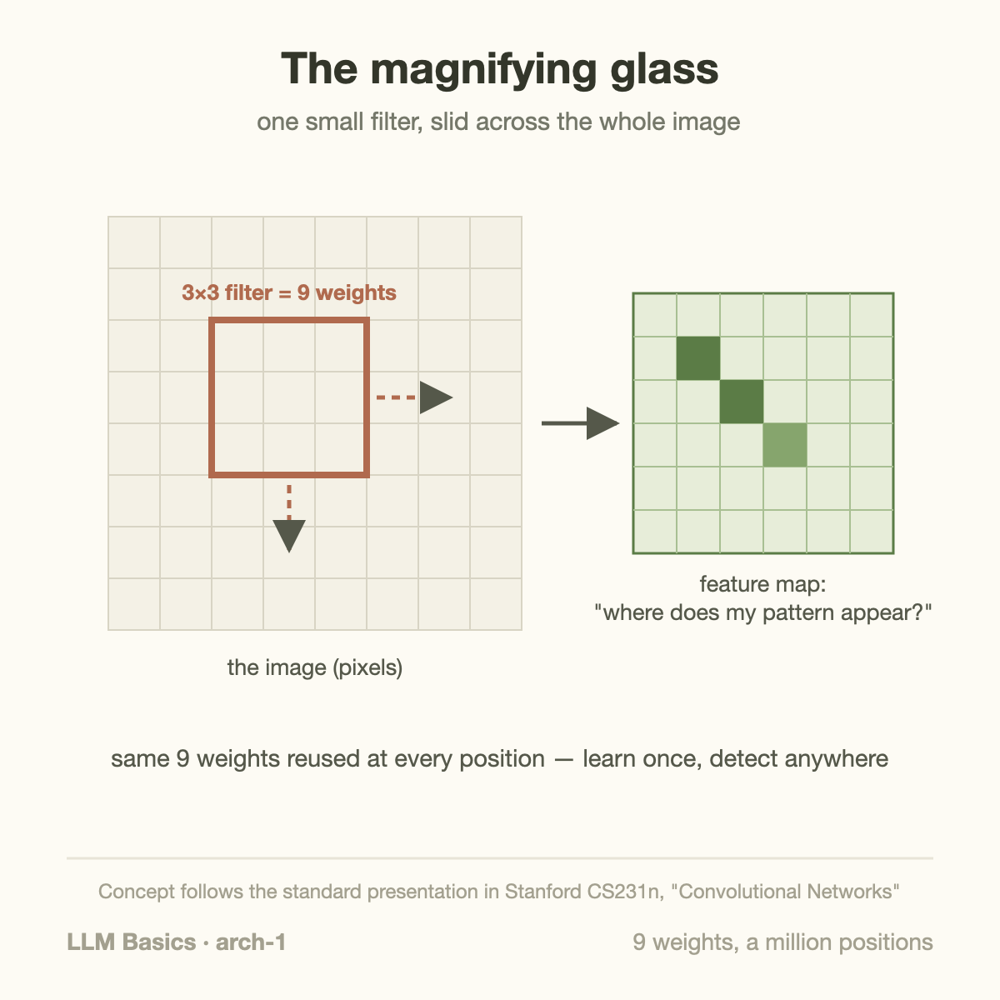
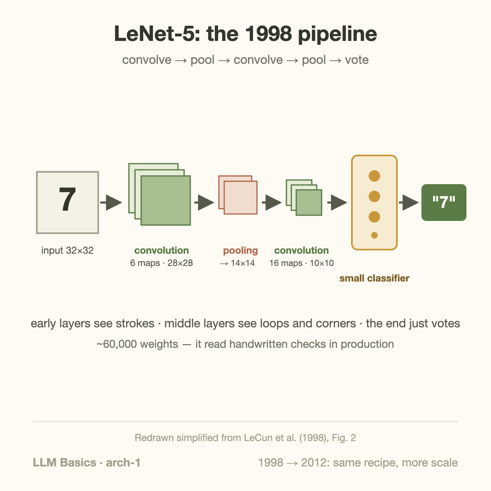

A tiny 1998 network with 60,000 weights read a large share of America's handwritten bank checks. Its core trick is 3 lines of intuition — and it's the same trick that, scaled up, won ImageNet in 2012 and kicked off the deep learning era.

[Previous articles](/blog/what-is-a-neural-network/) built the plain network: layers of weighted votes. This article covers the first great *architecture* — a network shaped to fit its data. That idea, "shape the network to fit the structure of the problem," is the single most reusable lesson in this series, and it returns when we reach Transformers.

## The problem with plain networks and images

Feed a 1000×1000 photo into the fully-connected networks we've seen so far and you hit a wall: every neuron in the first layer connects to every pixel — a million weights *per neuron*. Worse, that design has to re-learn everything at every location: a cat-ear detector learned in the top-left corner knows nothing about cat ears in the bottom-right.

Images have structure a plain network ignores: **nearby pixels are related, and patterns repeat across locations**. A convolutional neural network (CNN) bakes exactly those 2 facts into its wiring.

## The magnifying glass

Instead of looking at the whole image at once, a CNN slides a small window — say 3×3 pixels — across the image, checking for 1 specific pattern at every position:



That window is called a **filter**, and it is just a tiny set of weights — a 3×3 filter has 9. The output is a *map* of where in the image the pattern appears. 1 filter might light up on vertical edges, another on a patch of orange, another on a curve.

2 enormous wins fall out of this design:

- **Weight sharing.** In this single-channel, single-filter example, 9 weights cover spatial positions, because the same filter is reused at every position. The million-weight problem collapses to dozens.
- **Translation tolerance.** A cat ear activates the same filter wherever it appears. Learn once, detect anywhere.

Nobody designs the filters, by the way. They're weights — [gradient descent and backprop](/blog/how-models-learn/) set them, exactly as before. Early filters reliably converge to edge and color detectors on their own.

## Stacking: from edges to ears to cats

The real power is layering, and it's the "votes about votes" story again with a spatial twist. Layer 1's filters find edges. Layer 2's filters slide over *layer 1's maps*, finding combinations of edges — corners, textures, circles. Layer 3 finds combinations of those: an eye, a wheel, a beak. In between, **pooling** layers shrink the maps, so each successive filter effectively sees a wider patch of the original image.



The figure above is (a redrawn version of) LeNet-5, [Yann LeCun's 1998 digit reader](http://yann.lecun.com/exdb/publis/pdf/lecun-98.pdf) — the design that read bank checks in production when "neural network" was still a dirty word in grant applications. Fourteen years later, [AlexNet](https://proceedings.neurips.cc/paper/2012/hash/c399862d3b9d6b76c8436e924a68c45b-Abstract.html) was recognizably the same recipe — convolution, pooling, stacking — with more layers, ReLU activations, GPUs to train on, and a million-image dataset. Same idea, more scale: 60 1000 weights to 60 million.

## A worked example: 9 weights detect an edge

Let's actually run a filter, because the arithmetic makes the magic mundane. Take this 3×3 filter — 9 weights arranged as a grid:

```
 +1   0  -1
 +1   0  -1
 +1   0  -1
```

To apply it at a position, lay it over a 3×3 patch of pixels, multiply each weight by the pixel under it, and sum. Now slide it over 2 different patches (pixel values: 0 = dark, 9 = bright):

```
patch A (uniform):     patch B (vertical edge):
 5 5 5                  9 9 0
 5 5 5                  9 9 0
 5 5 5                  9 9 0
```

- **Patch A**: (+1×5+0×5−1×5) × 3 rows = **0**. Nothing to see.
- **Patch B**: each row gives +1×9 + 0×9 − 1×0 = 9, total **27**. Strong response.

This filter fires precisely where brightness drops from left to right — it is a *vertical-edge detector*, built from 9 numbers. Rotate the weights 90° and you detect horizontal edges. Nobody chose these values in a real CNN: [gradient descent](/blog/how-models-learn/) discovers edge detectors (and color-blob detectors, and texture detectors) in the first layers of many image-trained convolutional networks, because edges are the most reusable evidence about what's in an image. When AlexNet's authors visualized their trained first-layer filters, the grid looked like a catalog of oriented edges and color patches — learned, not designed.

## Going deeper: pooling, stride, and the growing field of view

2 supporting mechanics complete the picture. **Pooling** (typically "max pooling") slides a small window that keeps only the strongest response in each neighborhood — shrinking the map, discarding exact positions, keeping "this feature occurred around here." That builds in a useful indifference: a digit shifted 2 pixels still classifies the same.

The subtler consequence is the **receptive field**. After 1 3×3 convolution, each value "sees" 3×3 original pixels. Stack another 3×3 conv on the pooled map and each new value indirectly sees a much larger patch of the original image. Depth therefore buys *scope*: layer 1 sees strokes, layer 5 sees letterforms, layer 10 sees whole objects. That's the mechanical reason the edges→textures→objects hierarchy emerges — each layer literally looks at a bigger piece of the world, expressed in the previous layer's vocabulary.

1 number to anchor the efficiency claim: AlexNet's 5 convolutional layers, which do nearly all the visual understanding, hold only ~3.7M of its 60M weights — the old-style fully-connected layers bolted on the end hold the rest. The convolutional idea does the seeing at ~6% of the parameter budget.

## Common misconceptions

**"CNNs are obsolete now that Transformers exist."** Vision Transformers lead many benchmarks, but CNNs still run in enormous volume — phone cameras, medical imaging, industrial inspection, autonomous-vehicle stacks — because they're efficient at small scale and their built-in translation tolerance means they need far less training data. Architectures retire from the frontier long before they retire from production.

**"The filters are hand-designed."** Pre-2012 computer vision really did hand-design features (SIFT, HOG — an entire field's worth of PhD theses). The deep learning revolution was precisely that [backprop](/blog/how-models-learn/) *learns* the features end-to-end, and learned features beat 2 decades of engineered ones by 11 points in 1 contest.

**"Convolution is fundamentally different math from a normal network."** It's the same multiply-add-squash — with 2 constraints bolted on: each neuron connects only to a local patch, and all patches share 1 weight set. Constraints, not new machinery. That framing is worth keeping, because it recurs: most "new architectures" are the same core network with different constraints encoding different assumptions about data.

## The lesson that outlived the architecture

CNNs dominated vision for a decade, and they still run in your phone's camera. But the deeper lesson is the 1 to carry forward:

**A CNN is a plain neural network with knowledge about its data wired into its shape.** Images are local and repetitive, so the network looks locally and reuses weights. The data's structure became the network's structure — and that made it radically more efficient than a general network of the same power.

Hold that thought. In a few articles, we'll meet text — where the structure is *"any word can relate to any other word, near or far"* — and see why CNN-style locality fails there, why the recurrent networks of the next article struggled too, and why the architecture that finally fit language's structure ended up conquering everything, images included.

## Why CNNs and GPUs found each other

There's a hardware subplot here that foreshadows this blog's other series. Convolution looks like a bespoke operation, but implementations unroll it into **giant matrix multiplications** — thousands of independent patch-times-filter products with no ordering constraints between them. That's precisely the workload GPUs were built for (originally to shade millions of independent pixels for games).

The numbers behind the 2012 moment: AlexNet trained on **2 consumer GTX 580 gaming cards** (with 3 GB memory each) for about 6 days. The authors estimated the same run on the CPUs of the day would have taken months — long enough that nobody would have bothered iterating. The experiment only became *runnable* because an architecture whose core op was embarrassingly parallel met mass-market parallel hardware with a general-purpose programming ecosystem. This fit helped establish GPUs as practical neural-network training hardware.

Keep this pattern; it's the thesis of the [Efficient AI series](/blog/blackwell-to-rubin-memory-math/): **architectures win when they fit the hardware of their moment, and hardware evolves toward the architectures that win.** CNNs-meet-GPUs was the first round. Transformers-meet-tensor-cores was the second. Whatever wins next will fit the silicon of 2030.

## Count channels, outputs, and parameters

The 9-weight example assumed 1 input channel and 1 output filter. A color image ordinarily has 3 channels. A convolution with a 3×3 kernel, 3 input channels, and 16 output channels uses $$3\times3\times3\times16=432$$ kernel weights, plus 16 biases if biases are enabled. Each output filter combines all 3 input channels, and the learned weights are reused across spatial positions.

For an input width W, kernel width K, padding P on each side, and stride S, the output width is

$$
W_{\mathrm{out}}=\left\lfloor\frac{W+2P-K}{S}\right\rfloor+1.
$$

A 32×32 input with kernel 3, padding 1, and stride 1 stays 32×32. Changing stride to 2 produces 16×16. Those output positions multiply arithmetic and activation storage, but they do not multiply the number of learned kernel parameters. This is the key separation between parameter count and work.

Spatial translation equivariance means shifting the input can shift a convolution's output correspondingly under suitable boundary and stride assumptions. Classification invariance is a stronger requirement and is not guaranteed by convolution alone. Pooling, augmentation, padding, and downstream computation influence how much a final prediction changes after an image moves.


A receptive-field recurrence makes the stacking argument testable. Let $$r_l$$ be the input-space receptive-field width at layer $$l$$ and $$j_l$$ the spacing between neighboring output centers in original input pixels. For kernel width $$k_l$$, stride $$s_l$$, and dilation $$d_l$$,

$$
r_l=r_{l-1}+(k_l-1)d_lj_{l-1},\qquad j_l=s_lj_{l-1}.
$$

Initialize $$r_0=j_0=1$$. A stride-1, dilation-1, width-3 convolution gives $$r_1=3$$ and $$j_1=1$$. A width-2, stride-2 pooling operation gives $$r_2=4$$ and $$j_2=2$$. Another width-3 convolution then gives $$r_3=8$$: each output can depend on an 8-pixel-wide original region. Apply the calculation separately to height and width for square layers.

This improves the magnifying-glass explanation by tracing the actual geometry through downsampling rather than assigning “objects” to an arbitrary layer number. The theoretical receptive field describes possible dependency; learned weights can make the effective influence smaller or uneven. Stride removes spatial positions and can lose fine detail, while dilation expands coverage without the same downsampling but changes sampling patterns. Choose them around the task's required resolution and test small features and boundary cases. Parameter sharing creates useful structure, but translation-invariant classifications still depend on padding, pooling, augmentation, and the final prediction head.


## Separate arithmetic cost from parameter efficiency

A 32×32 output with 16 channels contains 16,384 output values. With a 3×3 kernel and 3 input channels, each output value uses 27 multiplications and an accumulation. The layer therefore performs 442,368 multiplications before counting bias additions or activation work. It stores only 432 kernel weights because they are reused.

That reuse can be useful for GPUs, but convolution implementations need not explicitly unroll the entire image into a large temporary matrix. Direct kernels, implicit matrix multiplication, and other algorithms trade arithmetic, memory, and numerical behavior differently. “It becomes a matrix multiplication” is a useful implementation connection rather than a universal requirement to materialize every patch.

This accounting also reveals why shrinking spatial resolution can reduce compute dramatically without changing parameter count. Halving both output dimensions quarters the number of spatial positions. A network can be parameter-efficient yet expensive on high-resolution inputs, so report input size alongside parameter counts when comparing inference cost.

## Takeaway

- Plain networks waste millions of weights on images and re-learn every pattern per location; CNNs fix both with 1 move — a small filter slid across the whole image.
- Weight sharing (9 weights, million positions) plus stacking (edges → textures → objects) is the entire recipe, from 1998's LeNet to 2012's AlexNet.
- The transferable lesson: match the network's shape to the data's structure. That principle picks the winners in every architecture era, including the Transformer's.


A deployment benchmark should preserve the actual image pipeline. Decoding, resizing, normalization, and transfers can consume more time than the convolutional layers for a small model. Measure the pipeline first, then isolate the network if you need to understand its kernels. Keep input resolution and batch size explicit because both affect activation memory and arithmetic. Finally, inspect examples after preprocessing: an incorrect channel order or normalization scale can produce a fast system with poor predictions. The architecture describes how features are computed, while the surrounding pipeline determines which pixels the architecture actually receives and how quickly results reach the application.

## Sources

- LeCun, Bottou, Bengio, Haffner (1998). ["Gradient-Based Learning Applied to Document Recognition"](http://yann.lecun.com/exdb/publis/pdf/lecun-98.pdf) (LeNet-5; the pipeline figure is redrawn from it)
- Krizhevsky, Sutskever, Hinton (2012). ["ImageNet Classification with Deep Convolutional Neural Networks"](https://proceedings.neurips.cc/paper/2012/hash/c399862d3b9d6b76c8436e924a68c45b-Abstract.html) (AlexNet)
- Stanford CS231n — [Convolutional Networks notes](https://cs231n.github.io/convolutional-networks/) (the standard visual treatment)

---

*Part of the [LLM Foundations & Mathematics](/series/llm-basics/) learning path. Browse its published articles by topic.*
