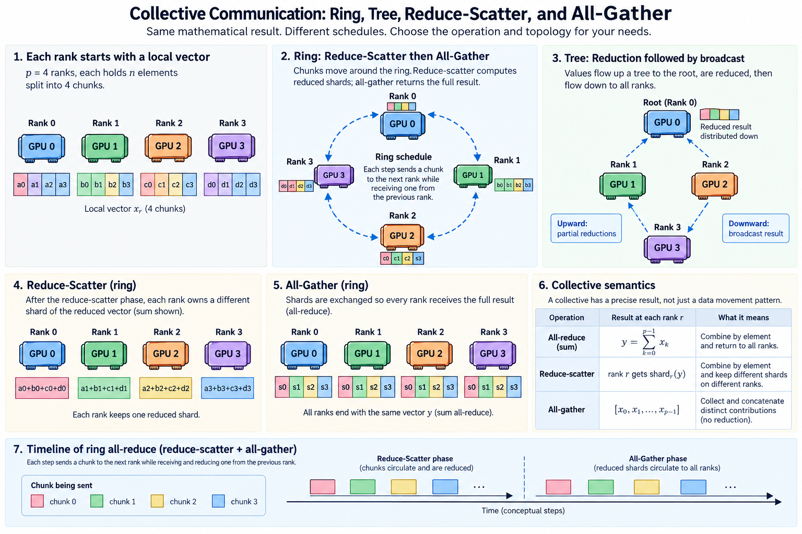
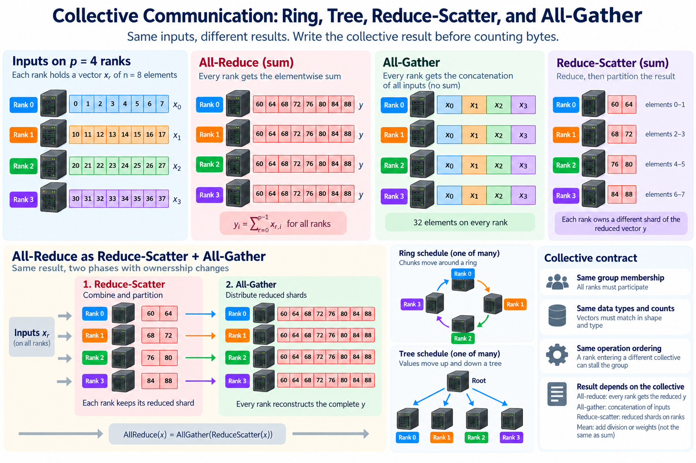
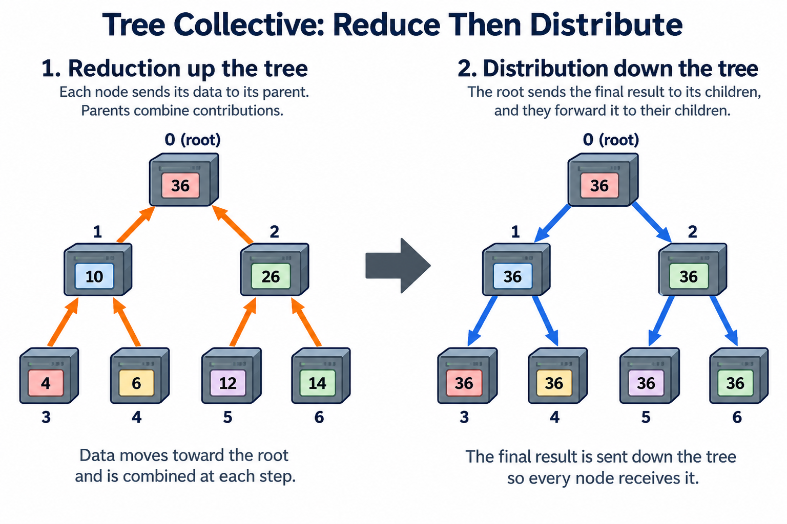
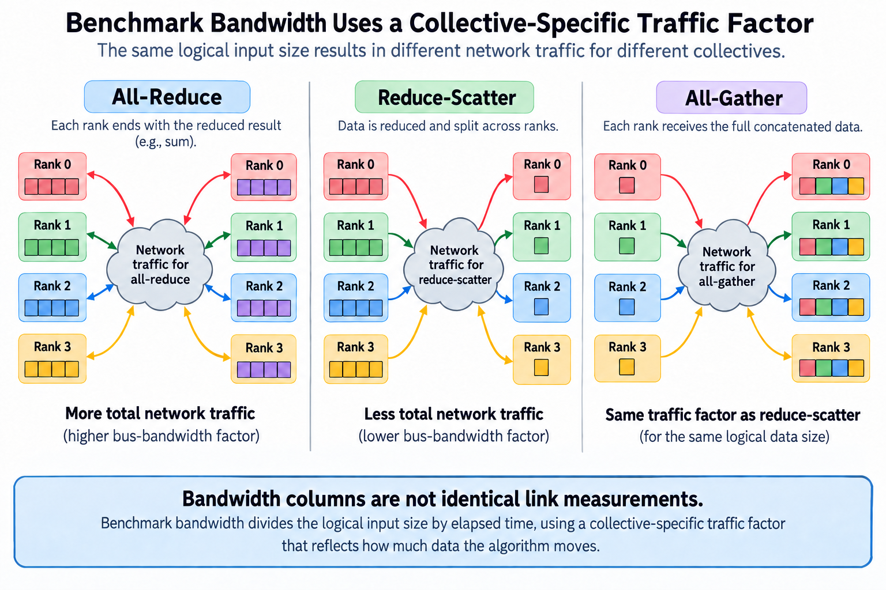

## Overview

A collective is a distributed operation with a precise result, not merely a command to move a tensor quickly. All-reduce combines corresponding values and returns the result to every participant. All-gather collects distinct contributions. Reduce-scatter combines values but leaves different reduced shards on different ranks. Confusing these semantics can produce a communication plan that is fast but computes the wrong training update.

The implementation then chooses an execution schedule: chunks travel around rings, values move through trees, or local and cross-node phases are combined hierarchically. The schedule determines startup count, traffic, reduction work, and exposure to slow participants.

This article connects the mathematical result to those schedules and explains how to compare them. Performance calculations are simplified models with illustrative parameters. Actual algorithm selection depends on the communication library, topology, message size, and configuration.

## Deep dive

### 1. Write the collective result before counting bytes

Suppose p ranks each hold a vector x_r of n elements. For a sum all-reduce, every rank receives y with

$$
y_i=\sum_{r=0}^{p-1}x_{r,i},\qquad i=0,\ldots,n-1.
$$

A mean reduction adds division by the appropriate population or weight. Do not assume that sum and mean are interchangeable in a training framework. Unequal token counts can require weighted gradient aggregation even if every rank's vector shape matches.

All-gather instead produces a concatenation or equivalent layout of the original contributions. It does not sum corresponding elements. Reduce-scatter performs the reduction and partitions the resulting vector among ranks according to the operation's defined layout.

The participants must agree on group membership, data types, counts, and operation ordering. A rank entering a different collective can stall the group or violate the protocol. A collective's semantic contract therefore includes distributed participation, not only the output tensor formula.

### 2. Decompose all-reduce into ownership-changing phases

Divide the reduced vector into p equal shards for a simple model. After reduce-scatter, rank r owns reduced shard y_r. An all-gather can then distribute those reduced shards so every rank reconstructs the complete y.

The composition is

$$
\operatorname{AllReduce}(x)=\operatorname{AllGather}(\operatorname{ReduceScatter}(x)),
$$

with compatible reduction, partitioning, and output layouts. This identity describes the result; it does not require every implementation to execute two separate high-level API calls. A library can pipeline or fuse the corresponding work.

For a 4-rank example, each input has 8 elements and the reduced result has 4 shards of 2 elements. Reduce-scatter leaves elements 0–1 on rank 0, 2–3 on rank 1, and so on. All-gather copies these already reduced shards to the other participants.

Sharded training can stop after reduce-scatter when the next consumer needs only its owned shard. Gathering the entire tensor unnecessarily would add traffic and memory. Choose the collective from the ownership required by the next computation, rather than treating all-reduce as the default for every distributed tensor.

A deterministic ownership test can give rank r the vector whose element i equals 10r plus i. Across 4 ranks, the sum at element i is 60 plus 4i. The expected shards are therefore easy to calculate, and all-gather should reconstruct those same reduced values in the specified order. This pattern distinguishes summation from concatenation and catches many layout mistakes. Repeat with uneven supported partitions only if the API explicitly permits them; the equal-shard identity does not authorize unsupported input counts.

### 3. Derive the ring traffic budget

In a simplified ring, each rank exchanges chunks with neighbors. Reduce-scatter takes p minus 1 rounds, and all-gather takes another p minus 1 rounds. Each phase transfers roughly n_bytes times p minus 1 divided by p bytes per rank.

For startup alpha and effective neighbor bandwidth beta, the explanatory time model is

$$
T_{\mathrm{ring}}\approx2(p-1)\alpha+2\frac{p-1}{p}\frac{n_{\mathrm{bytes}}}{\beta}.
$$

The model assumes balanced chunks and comparable paths. It omits details such as multiple channels, reduction arithmetic, pipelining, and transport transitions. Its purpose is to identify the startup and payload scaling of this idealized schedule.

For p=8 and a 256 MiB logical input, per-rank transferred payload is about 448 MiB across both phases. With an illustrative beta=25 GB/s, its payload component is about 18.79 milliseconds. If alpha=10 microseconds, the 14 rounds add 140 microseconds.

For tiny messages, startup can dominate; for large messages, the transferred-byte slope becomes more important. A ring's near-constant large-p byte factor does not mean its latency is independent of rank count. The number of rounds still grows in this model.

### 4. Trees trade a different schedule against payload distribution

A reduction tree combines contributions along a hierarchy, then a distribution phase returns the result. An ideal balanced tree has a logarithmic number of levels, making it attractive when startup dominates. The detailed byte movement and concurrency depend on how the implementation divides and pipelines the payload.

A deliberately simplified whole-message tree model is

$$
T_{\mathrm{tree}}\approx2\lceil\log_2 p\rceil\left(\alpha+n_{\mathrm{bytes}}/\beta\right).
$$

This is not a general formula for every optimized tree collective. It models full-message work on each critical-path level and is useful only under those assumptions. Chunking, complementary trees, and hardware topology can change the performance substantially.

At p=8, the idealized level count is 3 for reduction and 3 for distribution. That can reduce startup exposure relative to a 14-round ring, but the full-message term in this simple model can be larger. Comparing the equations illustrates why message size matters; it does not establish an unconditional winner.

Actual libraries can select among algorithms and protocols based on measured or configured behavior. Inspect the executed path and benchmark the relevant size range before attributing performance to a schedule inferred from the operation name.

### 5. Hierarchical collectives fit physical locality

A hierarchical operation can first combine data within a strong local accelerator domain, then exchange information across servers, and finally distribute results locally. The logical result remains the same, but fewer or differently organized messages cross expensive physical boundaries.

The benefit depends on what traffic the chosen schedule moves over each topology cut. A cross-node phase can become the bottleneck even when local phases are fast. Conversely, poor local GPU-to-NIC mapping can prevent the cross-node phase from reaching the available fabric capacity.

Count the actual local and remote work rather than assuming hierarchy always reduces total cost. Extra local phases have startup and data movement, and some layouts require redistribution. The useful question is whether the reduced expensive-path demand outweighs those costs on the application critical path.

Process placement is part of this comparison. Preserve rank-to-device and adapter mappings across runs. If the launcher changes placement, the same collective configuration can stress different shared resources and produce results that look like an algorithm regression.

### 6. Reduction order introduces numerical considerations

Floating-point addition is not associative. Different ring, tree, and hierarchical schedules can combine values in different orders, changing rounding even when each implementation computes the same mathematical reduction. Exact bitwise agreement is therefore a stronger requirement than ordinary numerical correctness.

For a simple illustration in limited precision, adding a very small value to a much larger value can lose the small contribution. Combining several small values first can preserve a different rounded result. This is a property of finite-precision arithmetic, not automatically evidence of a transport error.

Choose tolerances appropriate to dtype and application behavior. Compare small deterministic inputs against a suitable reference, then validate training stability where the reduction influences optimization. Large errors, NaNs, missing contributions, or layout mismatches need separate investigation.

User-defined reduction operators require additional semantic care. An operation that is not compatible with the implementation's ordering assumptions can invalidate the result. Follow the communication API's supported operator contract rather than assuming any local function can be distributed arbitrarily.

### 7. Rank readiness can dominate an otherwise fast collective

A collective waits on participation and data readiness, not just network transfer. If one rank reaches the operation late because of a long kernel, delayed input, or previous synchronization, the other ranks can appear to spend time in communication while the real cause is upstream.

Let r_r be the readiness time of rank r. A simplified synchronized-start budget is

$$
T_{\mathrm{finish}}\gtrsim\max_r r_r+T_{\mathrm{collective\ after\ readiness}}.
$$

Some implementations can make partial progress before every rank is ready, so this is a diagnostic approximation. It reminds us to compare per-rank arrival with transfer progress rather than attributing the full interval to link bandwidth.

Collect traces around the preceding computation and the collective. If all ranks are ready together but transfer is slow, investigate the communication path. If one rank arrives much later, inspect that rank's compute, input, and host execution first.

For overlapped gradient synchronization, bucket readiness and operation ordering matter. Early work can be hidden behind backward computation, while the final bucket determines an exposed tail. An isolated all-reduce benchmark cannot measure that application scheduling effect.

### 8. Interpret benchmark bandwidth using its definition

Algorithm bandwidth typically divides the logical input size by elapsed time. NCCL tests additionally define bus-bandwidth factors for particular collectives to reflect associated traffic. An all-reduce factor differs from all-gather and reduce-scatter factors, so column values across operations are not identical link measurements.

Record rank count, message size, operation, dtype, process model, and benchmark version. Include the actual time as well as the derived bandwidth. The time is the quantity used by an application budget, while bandwidth helps compare transfer efficiency under a defined convention.

Sweep sizes around the application's messages rather than reporting only a maximum from an unrelated large tensor. Include single-node and multi-node cases, and inspect per-rank behavior where available. A topology issue can be invisible in the aggregate mean.

Test correctness before ranking performance. Fill inputs with patterns that reveal shard ownership and reduction errors, not merely all zeros. Check the resulting layout and values after every relevant phase. A misplaced shard can pass a weak uniform-input test while breaking the real application.

When comparing a forced algorithm with the library default, preserve the diagnostic output showing what was selected and whether fallback occurred. A configuration request is not evidence that every tested size used that path. Some combinations are unsupported, and protocols can change independently of the algorithm. Report those transitions alongside the size sweep. If a setting improves one large-message point but regresses the many smaller messages used by the job, its peak bandwidth result is insufficient justification for adopting it.

### 9. Choose the operation and schedule from the consumer's needs

Begin with the result and ownership required by the next computation. Use reduce-scatter when consumers need distinct reduced shards, all-gather when they need the distributed contributions reconstructed, and all-reduce when every participant needs the complete reduced tensor.

Then count startup rounds and payload demand under candidate schedules. Map that traffic onto physical paths and identify readiness dependencies. Measure the relevant size range and the application tail, keeping numerical behavior and placement constant.

A useful comparison report names the semantic operation, the executed algorithm or observed configuration, the bytes and rank population, the timing boundary, and the downstream effect. These details make a speedup reproducible and prevent a change in ownership or workload from being mistaken for an implementation improvement.

## Conclusion

Collectives are valuable because they express distributed computation compactly. Their performance becomes understandable when that compact expression is expanded into ownership, rounds, paths, and readiness. The fastest useful collective is the one that computes the required result and delivers it to the required consumers with the least exposed cost.

### Sources

- [NCCL collective semantics](https://docs.nvidia.com/deeplearning/nccl/user-guide/docs/usage/collectives.html).
- [NCCL tests performance definitions](https://github.com/NVIDIA/nccl-tests/blob/master/doc/PERFORMANCE.md).
- [NCCL official implementation](https://github.com/NVIDIA/nccl).
