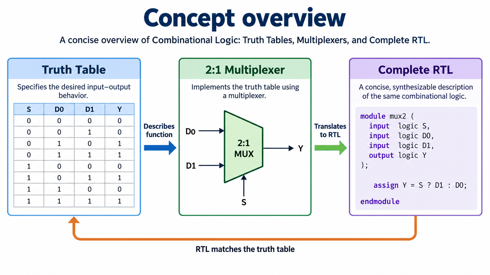
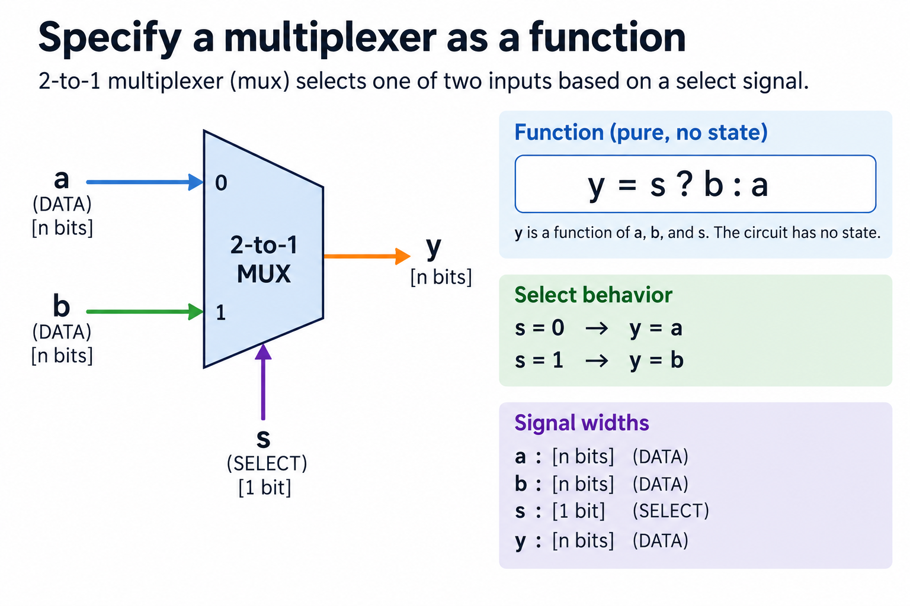
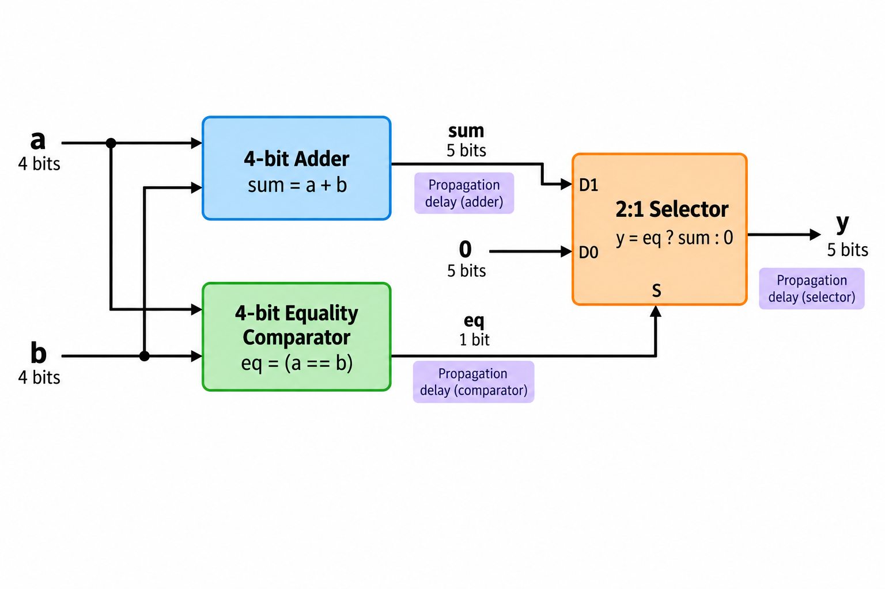
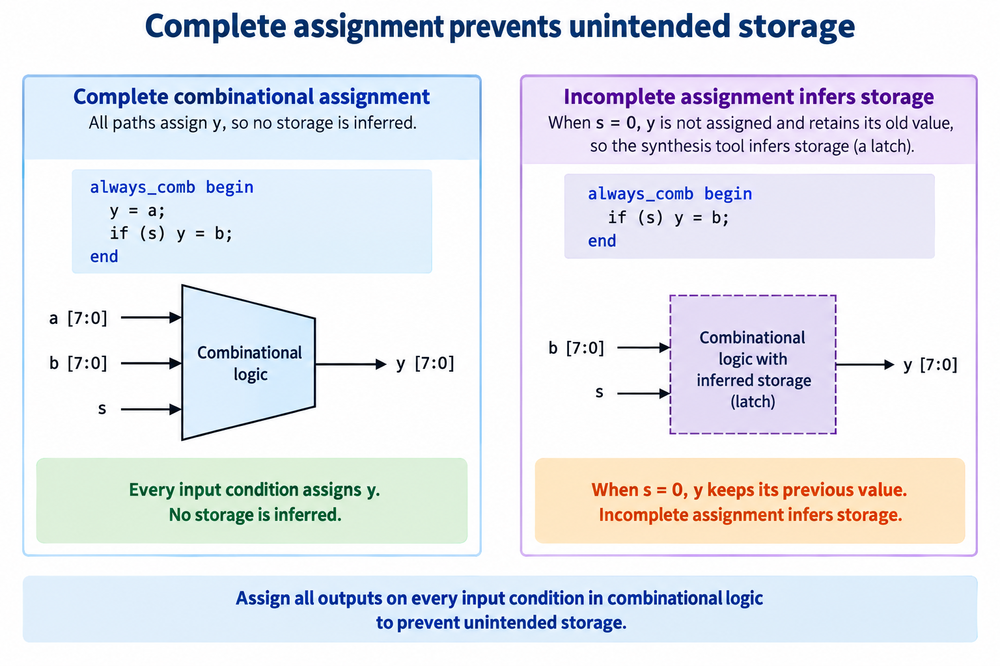
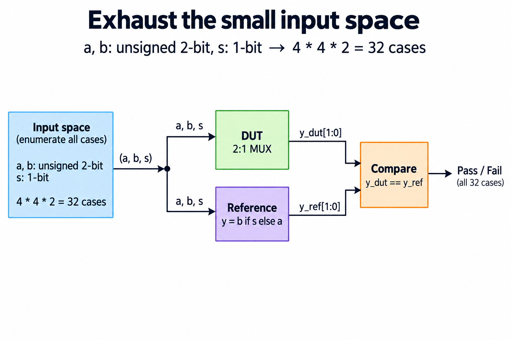

## Overview



Combinational logic computes outputs from current inputs without intentionally retaining past values. The overview follows a specification through a logic network to a checked result. A truth table defines what the function should do, RTL describes the function, and a testbench compares its outputs with an independent expectation. These are connected steps, rather than 3 unrelated ways to draw a circuit.

Read the [binary representation lesson](/blog/binary-numbers-hardware-signedness-overflow/) first. Here a and b are unsigned bit vectors, while s is a 1-bit selection signal. The principal example is a 2-input multiplexer: choose a when s is 0 and b when s is one. Its simplicity lets the complete input space be enumerated before the course introduces clocked state.

A combinational output is not physically instantaneous. Signals propagate through gates and routing, and intermediate transitions may occur while the network settles. The functional model describes the stable result for a legal input combination. Later timing analysis determines whether that result arrives when a receiving register needs it. Keeping those questions separate helps beginners avoid both incomplete logic and unsupported timing claims.

The [foundations lab](/labs/fpga-fundamentals/foundations-lab.zip) includes a synthesizable mux and an exhaustive self-check. You can inspect the 32 cases used for 2-bit data inputs and compare them with the figure. This lesson finishes with a complete functional contract; the next clocked-state lesson explains how a circuit remembers values between edges.

## Deep dive

### Specify a multiplexer as a function



The multiplexer figure identifies 3 inputs with different roles. The data inputs a and b carry the possible output values. The select input s chooses which value appears at y. The expression y equals s ? b : a means that s equal to one selects b and s equal to 0 selects a. Moving s to a data port would describe a different function.

A truth table for 1-bit data has 8 rows, because a, b, and s each have 2 possibilities. For 2-bit data, each data input has 4 patterns and selection still has 2. There are 32 combinations. The operation does not perform arithmetic on a or b; it forwards a selected pattern. Signedness matters to subsequent interpretation, but selecting between equal-width patterns does not itself require a signed numerical calculation.

A direct RTL description makes the function visible:

```systemverilog
module mux2(input logic [1:0] a, b,
            input logic s, output logic [1:0] y);
  always_comb begin
    y = a;
    if (s) y = b;
  end
endmodule
```

The default assignment covers the s equal to 0 case, and the conditional assignment covers the other case. Both output bits have a defined value for every binary input combination. The [SystemVerilog tutorial](https://systemverilog.dev/3.html) explains combinational procedural blocks and assignment completeness. The lab compiles this description with an actual simulator rather than merely checking its text.

Test a case in which a and b differ; otherwise a reversed selection convention can remain invisible. With a equal to one, b equal to 2, and s equal to 0, the expected output is one. Changing only s to one changes the expected output to 2. Also include equal inputs: selection should leave the same output regardless of s.

Unknown simulation values are a separate concern. The exhaustive binary test covers defined 0 and one patterns; it does not automatically establish the intended treatment of X or Z. An interface that requires known selection and data inputs should assert that requirement or document its initialization sequence. Do not describe a binary truth-table sweep as complete evidence for every 4-state simulation scenario.

Finally, name the selected behavior in the module interface or accompanying specification. A reader should not have to infer whether select 0 means port a or port b from a downstream waveform. A clear selection convention prevents integration errors when a mux chooses between operands, addresses, or control sources.

### Parallel logic does not mean sequential statements



The second figure fans the same inputs into independent arithmetic and comparison functions. Their results reach a selector. The branches express parallel hardware dependencies: neither function needs to wait for the other merely because one appears earlier in a source file. The selected output does depend on the branch values and selection condition arriving through their respective paths.

This is where software intuition can mislead a beginner. Statements inside one combinational procedural block are evaluated in a defined procedural order by the simulator, but a synthesizable description represents a network. A temporary value assigned before use can make that description easier to read. It does not necessarily add a clock cycle. Conversely, careless ordering or an incomplete sensitivity model can produce confusing simulation behavior, so use the supported language constructs consistently.

For a concrete network, compute an extended sum of 2 4-bit operands and compare the operands for equality. The sum needs 5 bits to retain unsigned carry. The equality result needs 1 bit. A selector that returns either the sum or a constant needs an output width appropriate to both choices. Drawing only unnamed boxes hides these width decisions; annotate the function and its port widths before writing the RTL.

Propagation delay affects the completed network. An output may briefly change several times after the inputs change because paths have different delays. An ordinary 0-delay RTL simulation is useful for functional evaluation, but it cannot establish the waveform of a routed combinational network. If an output controls an asynchronous event or leaves the device directly, its transient behavior may require special attention beyond this lesson's synchronous use case.

A dependency graph is a useful design tool. Write which inputs each intermediate result needs, then connect those results to their consumers. 2 branches with no mutual dependency can be computed concurrently in a spatial mapping. Sharing one arithmetic unit introduces selection, scheduling, and storage that do not appear in the pure combinational graph. That is an architectural change rather than a cosmetic rearrangement of the same diagram.

When reviewing code, ask whether every intermediate width is explicit and whether an expression refers to the intended current input or to retained state. Check that the selector receives the correct branches. Then verify the completed function independently. A plausible graph does not replace a reference calculation, but it helps identify which calculation the reference should represent and where truncation might occur.

### Complete assignment prevents unintended storage



The contrast in this figure concerns an omitted assignment. In the complete block, y first receives a, then receives b if s is true. In the incomplete block, only the true branch assigns y. When s is false, no new value is specified, so retaining the previous y becomes part of the behavior. That introduces storage into a description intended to be combinational.

The relevant storage is an inferred latch under the appropriate synthesis interpretation, not an explicitly edge-triggered register. A latch's transparency and retention behavior differ from a flip-flop capturing on a clock edge. Replacing the latch icon with a clocked register would conceal the actual problem. Some tools warn or reject incomplete assignments in an always_comb block; the beginner should fix the functional coverage rather than depend on a warning to make the output correct.

Completeness applies to every output and to every branch through a procedure. A case statement missing an applicable input value can have the same problem. Nested conditionals can assign one field while leaving another uncovered. Providing defaults at the start of the block is often a readable way to cover these paths, provided the chosen defaults actually match the specification.

The complete mux has an intentional default of a. For other functions, 0 is not automatically the right default. A default should represent defined behavior for the uncovered conditions. If an input combination is illegal, decide whether the design reports it, maps it to a safe value, or relies on an asserted external contract. Silently assigning 0 can conceal a missing requirement even though it prevents a latch.

To reveal accidental retention, apply a sequence rather than just a single isolated input. First choose s equal to one with b equal to 2, then change s to 0 and a to one. The complete mux should produce one. A description that retains 2 has failed the current-input contract. Testing only the first condition would miss this difference.

The next [digital-state lesson](/blog/fpga-ai-logic-1-digital-logic-for-ai-hardware/) shows intentional registers and state machines. Its hold cases belong in clocked next-state behavior. The distinction here is intent: a combinational function must define a current output for every legal input, while a sequential circuit explicitly defines how previous state contributes to the next state. Keeping those models separate makes both easier to implement and verify.

### Exhaust the small input space



The scoreboard figure splits stimulus into the DUT and the reference. The expected output is calculated from the input values and the mux contract. It does not use the observed output to decide what should have happened. Both outputs meet at the comparison, whose result determines pass or fail. Independence makes the comparison meaningful.

For 2-bit a and b and 1-bit s, nested loops enumerate 4 times 4 times 2 cases. In each case, apply the input patterns, allow the combinational simulation to settle, compute the expected selection, and compare y. Stop with a diagnostic if any case differs. The diagnostic should contain a, b, s, expected y, and observed y, so the selection error can be reconstructed without rerunning an opaque test.

Use an integer reference or a simple conditional expression outside the DUT implementation. Copying a complex internal helper into the testbench can repeat the same error. Here the reference is intentionally small: b if s is one, otherwise a. Its convention comes from the specification. The DUT may use a procedural block or a continuous assignment without changing that expectation.

An exhaustive test is practical because this input space is small. Its claim must retain that scope. It establishes correct outputs for 32 defined binary combinations in the simulated module. It does not prove a routed device's timing, analog behavior, initialization under arbitrary unknown values, or integration with another module. Exhaustive over one declared domain is valuable evidence without being a universal hardware proof.

Mutation is a useful way to evaluate the test. Temporarily reverse the selector or remove the default assignment in a scratch copy, then check that the expected tests fail. Do not publish the broken design as the DUT. This exercise demonstrates that the test can detect the targeted mistake rather than merely report success whenever the simulator exits.

The lab prints its actual comparison count and uses a nonzero failure result. A successful compilation alone is insufficient: a testbench may compile and then perform no checks. Record both compile and execution steps, along with the number of comparisons. As designs become larger, the simulation lesson adds clocked sampling phases, boundary tests, and waveforms while preserving this same independent-reference principle.

## Conclusion

A complete combinational specification maps every legal current input to a defined output. A mux makes the selection convention visible, a dependency graph exposes parallel branches, and complete assignment prevents accidental storage. Widths and legal-input assumptions remain part of the contract even for a tiny function.

Use the included exhaustive mux test as a model for small modules. It checks all 32 defined binary combinations and reports a mismatch with enough context to reconstruct it. This gives functional evidence while leaving physical propagation delay and timing to later implementation analysis.

Continue with [registers, clocks, and state machines](/blog/fpga-ai-logic-1-digital-logic-for-ai-hardware/), now placed in the foundations series. Then the SystemVerilog lesson connects complete functions with explicit edge-triggered state. These separate models are the basis of a controller and datapath; understanding both is more useful than memorizing a list of HDL keywords.

### Sources

- [SystemVerilog combinational procedures](https://systemverilog.dev/3.html)
- [Icarus Verilog compile and simulation workflow](https://steveicarus.github.io/iverilog/usage/getting_started.html)
