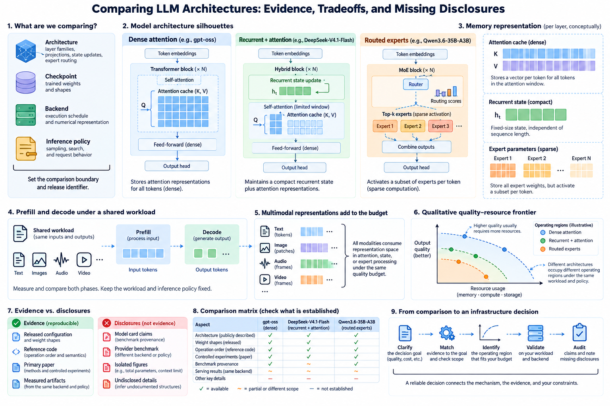
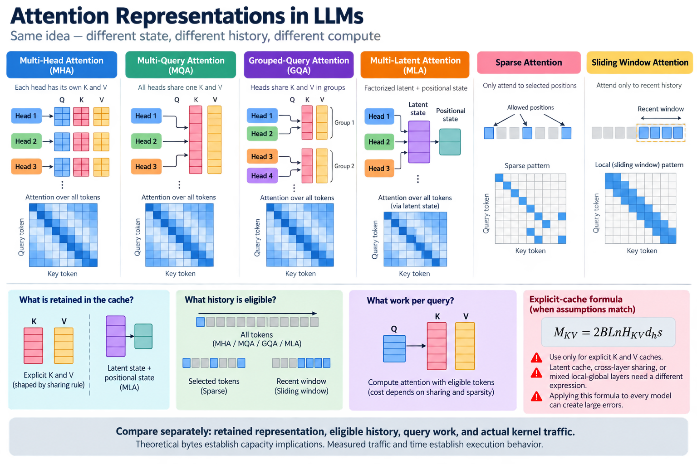
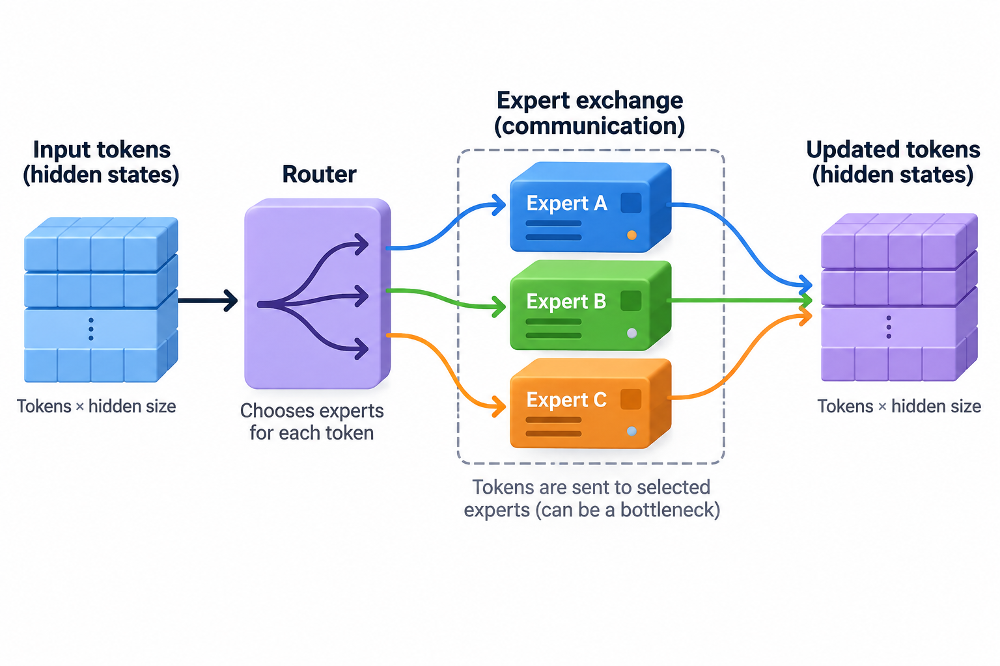

Architecture comparisons often combine incompatible evidence: a total-parameter headline, a provider benchmark, a context limit, and a serving result from another backend. Each can be useful, but they answer different questions. A reliable comparison begins by defining what is being compared and which claims the available sources establish.

This article uses the disclosed gpt-oss, Qwen3.6-35B-A3B, and DeepSeek-V4.1-Flash designs as examples of an evidence method. It does not rank them from unmeasured performance or infer undocumented structures for closed models. The aim is to make tradeoffs and missing information visible enough for an infrastructure decision.

## 1. Define the object of comparison

*Overview of the article’s core mechanism. The following sections explain the objects, relationships, equations, assumptions, and worked examples shown here.*

Architecture is the structured computation: layer families, projections, state updates, expert routing, and residual paths. A checkpoint supplies trained weights. A backend chooses an execution schedule and numerical representation. An inference policy chooses sampling, search, and other request behavior.

A comparison can target any of these objects, but its label should match the evidence. Two checkpoints with different training and inference budgets provide a complete-system comparison. They do not isolate the effect of a head-sharing rule.

Record the release identifier and comparison boundary first. This prevents later numbers from silently changing meaning as the discussion moves from quality to memory or latency.

## 2. Establish a source hierarchy

Released configuration and weight shapes establish dimensions. Reference code establishes operation order and implementation semantics. A primary paper explains methods and controlled experiments. A model card supplies release claims and benchmark provenance.

Marketing summaries can point toward these sources but should not replace them for precise technical claims. A family name is especially weak evidence when later releases revise layer arrangements or state formats.

Retrieval date or source revision makes an analysis reproducible. If a page changes, the recorded evidence explains which version supported the article. State missing fields explicitly rather than guessing from a related checkpoint.

## 3. Compare attention representations

MHA, MQA, and GQA differ in key-value head sharing. MLA retains a factorized latent and positional side state. Sparse attention restricts eligible positions, and sliding windows bound recent history. These mechanisms address different dimensions of the system.

A simple explicit-cache formula is useful only when its assumptions match the architecture:

$$
M_{KV}=2BLnH_{KV}d_hs.
$$

Latent cache, cross-layer sharing, or mixed local-global layers require another expression. Applying this formula to every model because they all use attention can create large errors.

Compare retained representation, eligible history, query work, and actual kernel traffic separately. Theoretical bytes establish capacity implications; measured traffic and time establish execution behavior.

## 4. Compare hybrid state correctly

Qwen3.6's disclosed layout contains 30 Gated DeltaNet blocks and 10 Gated Attention blocks. Its recurrent and attention head dimensions differ. This composition needs separate state terms rather than one standard Transformer estimate.

$$
M_{\mathrm{hybrid}}=M_{\mathrm{explicitHistory}}+M_{\mathrm{recurrentState}}+M_{\mathrm{auxiliary}}.
$$

The recurrent term can be bounded with sequence length while explicit history still grows. State precision and auxiliary history matter. A hybrid label alone does not disclose exact runtime allocation.

A comparison with an explicit-attention model should use actual configurations and workload lengths. Constant recurrent state is an architectural property; useful long-distance retrieval is behavioral evidence requiring evaluation.

## 5. Compare sparse experts with definitions

Total parameters describe learned capacity under a counting convention. Active parameters describe a selected path under another convention. Weight residency follows assigned storage and representation, while arithmetic follows selected functions and other active components.

A representative decomposition is:

$$
P_{\mathrm{total}}=P_{\mathrm{base}}+EP_{\mathrm{expert}},\qquad
P_{\mathrm{selected}}\approx P_{\mathrm{base}}+kP_{\mathrm{expert}}.
$$

Shared branches and conditional-memory modules require additional terms. Do not add separately reported populations without knowing whether they overlap. DeepSeek's backbone and Engram figures illustrate why inclusion definitions matter.

Expert count and selected count also do not determine dispatch cost. Group sizes, placement, padding, and topology affect execution. Compare those under an identified backend.

## 6. Keep numerical representations attached

The gpt-oss card reports MXFP4 MoE weights, while its straightforward PyTorch reference upcasts weights to BF16. DeepSeek-V4.1-Flash reports FP4 main cache with grouped scales. These statements refer to different stored quantities.

A precision table should distinguish expert weights, other weights, KV or latent state, recurrent state, and accumulators. Scale metadata and padding belong in byte estimates.

Comparing one implementation's packed weights with another's expanded reference allocations can be a useful backend comparison, but it should not be presented as an inherent architecture memory ranking. Quality evidence should match the actual numerical path where possible.

## 7. Separate prefill and decode

Prefill processes input and establishes state. Decode produces new tokens using that state. Architectures and backends can have different bottlenecks in these phases. DeepSeek's card explicitly reports different active-parameter figures for the 2 phases.

A first-order request model organizes the accounting:

$$
T_{\mathrm{request}}\approx T_{\mathrm{setup}}+T_{\mathrm{prefill}}(n_{\mathrm{in}})
+\sum_{t=1}^{n_{\mathrm{out}}}T_{\mathrm{decode}}(n_{\mathrm{in}}+t).
$$

The decode term can change as history grows. Batching and concurrency add further dependence. A single total-token throughput hides these distinctions.

Compare prompt-length and output-length distributions explicitly. An input-heavy advantage does not establish the same result for long generation. Time to first token and complete-response duration are separate user-facing quantities.

## 8. Include multimodal representation costs

A multimodal request can include image or audio encoding and many inserted feature positions beyond text tokens. The processor determines their representation under the release's input contract.

Count preprocessing, encoder execution, connector work, language prefill, and generation within the chosen boundary. Cached modality features can alter the boundary but require compatible source signals and processor versions.

Do not infer modality capability from a generic family label. Consuming images, consuming audio, and generating those modalities are different claims. Use the release's disclosed interfaces and task evaluations.

## 9. Match quality budgets

Post-training and inference work can materially affect benchmark scores. A reasoning policy sampling several candidates is not directly comparable to a single-attempt policy without identifying the budget and selector.

Report generated tokens, candidate count, verification work, and task controls. A pass-at-k-style success measure can use an evaluation oracle that is unavailable in deployment. Selected-answer accuracy is another metric.

Training data and evaluation leakage also matter. A quality difference across differently trained checkpoints cannot isolate architecture unless the experiment controls the relevant factors. State that limit without dismissing the system result.

## 10. Quantify uncertainty

A measured latency distribution and task-success sample have uncertainty. Report sample count and a suitable summary rather than one unusually favorable run. Tail latency can matter more than the mean for interactive workloads.

For a defined Bernoulli success population, maximum likelihood estimates the rate as observed successes divided by trials. That estimate is conditional on the sampled tasks and policy. Correlated problem variants provide less independent evidence than their raw count suggests.

A benchmark report should identify the population, repetition method, and uncertainty calculation. Extra decimal places do not compensate for small samples or uncontrolled workload differences.

## 11. Preserve reported memory scopes

DeepSeek's card distinguishes global cache at 890 bytes per token from a separate persistent-cache reduction through bounded replay. Global state, active device state, persistent inactive state, and peak application memory are different categories.

A comparison table should retain the category beside each number. Never compare a persistent-only figure from one design with peak device allocation from another as if they were equivalent.

Likewise, a model's reported ability to run on a device does not reserve arbitrary context, batch size, or workspace. Capacity decisions need actual allocation under the intended request distribution and admission policy.

## 12. Build a comparison matrix

For each release, record layer families, attention state, expert counts and definitions, multimodal inputs, context policy, numerical representation, training disclosure, and reference implementation. Mark unknown fields as unknown.

Then add measured backend evidence in a separate set of columns: device topology, workload, memory, prefill, decode, and quality budget. This keeps architecture facts from blending into one deployment's results.

A missing field is useful information. It tells the reader which inference would require further disclosure or measurement. Filling it with a plausible family resemblance makes the table look complete while reducing its reliability.

## 13. Test the mechanism behind a claim

If a claim concerns smaller cache, calculate state dimensions and compare actual allocation. If it concerns bounded deeper indexing, measure that component across contexts rather than only total latency. If it concerns expert efficiency, inspect group distributions and communication.

Use a semantic reference to establish correctness before comparing speed. A missing branch, wrong mask, or truncated input can produce a fast result while changing the task. Numerical and behavioral contracts should accompany the timing boundary.

No models were executed or GPU benchmarks performed for this article. Its comparisons describe disclosed mechanisms and an evaluation method, not an independently measured ranking.

## 14. Present tradeoffs as operating regions

A system can perform well for short prompts and lose at long contexts, or favor input-heavy requests over long generation. Quality can improve with additional inference work while latency rises. These are operating regions rather than permanent architecture winners.

A useful visualization plots quality against defined cost or latency across several policies, with memory and workload labels. The reader can then choose a region matching the application rather than copying one maximum-budget headline.

Keep uncertainty visible and identify which quantities were calculated, provider-reported, or measured locally. This makes the conclusion reviewable and supports updates when new evidence appears.

## 15. Turn the comparison into an infrastructure decision

Start from the workload's quality requirement, prompt and output distributions, modalities, latency target, and available devices. Eliminate unsupported interfaces, then assess capacity and measured performance under compatible backends.

Use architecture formulas to predict likely pressure points and design measurements. Use actual results to choose the operating configuration. When a field remains undisclosed, state the uncertainty and test what can be observed rather than inventing an internal structure.

The resulting comparison is stronger because it preserves definitions. Architecture, training, representation, and inference work each contribute to a system. Evidence tied to those contributions supports a practical decision without turning incomplete disclosures into confident claims.

## 16. Audit an apparently simple comparison

Suppose a report says that one model is faster because it has fewer active parameters. Before accepting the explanation, ask whether the timing covers prefill, decode, or the complete request; whether outputs use the same length and quality budget; and whether both backends use comparable numerical representations. A difference in any of these can explain the result without isolating active parameter count.

Next inspect the limiting resource. If the slower run spends most time on expert exchange or attention history reads, fewer selected matrix weights may not be the relevant cause. If it spends most time on selected expert arithmetic, active work becomes a more plausible contributor. Profiling connects the architectural hypothesis to execution evidence.

Then check quality and correctness. A faster run truncating visual inputs, dropping overflowing expert assignments, or using a smaller generation budget has changed the workload. That can still be an intentional operating choice, but the report must identify it. The speed comparison should not silently imply equivalent behavior.

Finally preserve the conclusion's scope. A measured advantage on one device and context distribution supports that operating point. It does not prove superiority across every backend, prompt length, or task. Publishing the configuration and measurement method allows readers to reproduce or challenge the result.

This audit turns a headline into a testable chain: disclosed mechanism, predicted resource effect, observed execution, and validated task behavior. Each link can be examined independently. The chain is a useful standard for the entire series because it makes architectural innovation concrete while keeping uncertainty and workload dependence visible.

## 17. Separate compressed preparation from architecture

Distillation, low-rank adaptation, and quantization can change the prepared artifact without defining the original architecture. A fair comparison records those changes alongside the disclosed structure and numerical backend. In particular, a low trainable-parameter count does not establish low inference cost, and a small payload does not establish a smaller context state.

The [compression experiment guide](/blog/compression-experiment-quality-deployment/) develops this separation through controlled candidates and a quality-resource frontier. For the theoretical mechanisms, compare [LoRA's factorized update](/blog/lora-low-rank-updates-memory/) with [teacher/student distillation](/blog/distillation-temperature-teacher-student/). Their preparation interfaces and deployed execution differ even when both are described broadly as efficient model methods.

## Sources

- [Official gpt-oss repository](https://github.com/openai/gpt-oss).
- [Official Qwen3.6-35B-A3B model card](https://huggingface.co/Qwen/Qwen3.6-35B-A3B).
- [Official DeepSeek-V4.1-Flash model card](https://huggingface.co/deepseek-ai/DeepSeek-V4.1-Flash).
- [DeepSeek-R1 primary paper](https://arxiv.org/abs/2501.12948).
