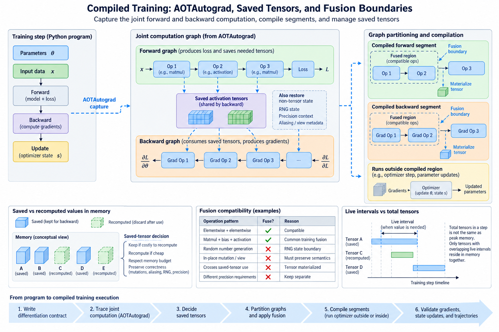
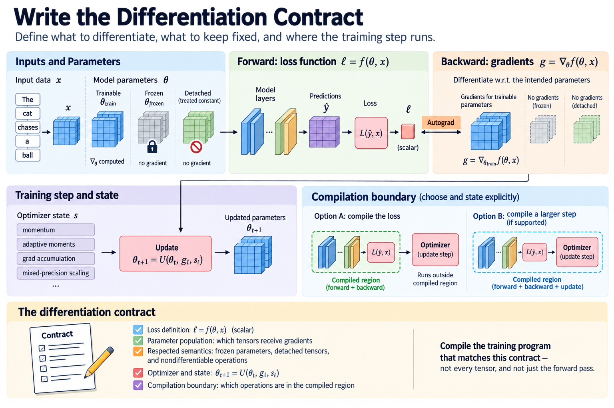
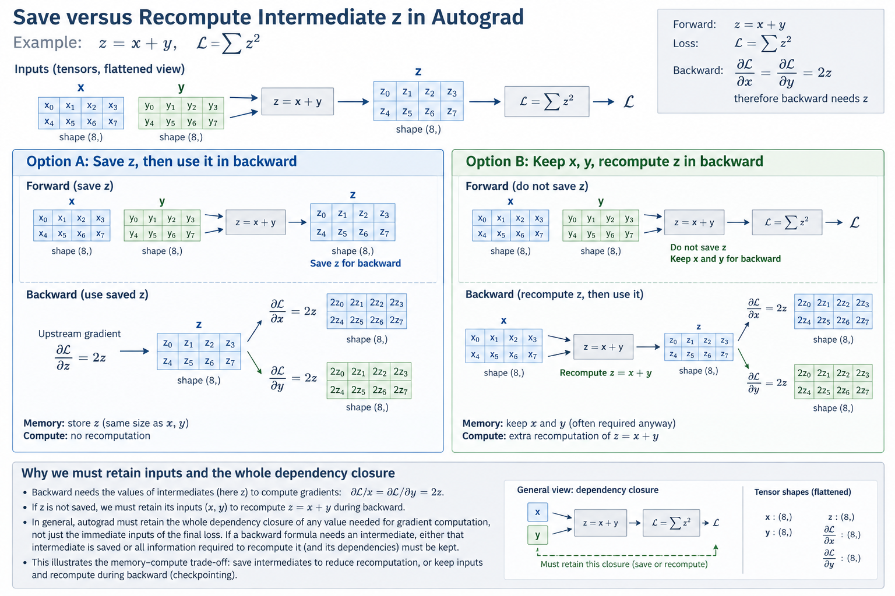
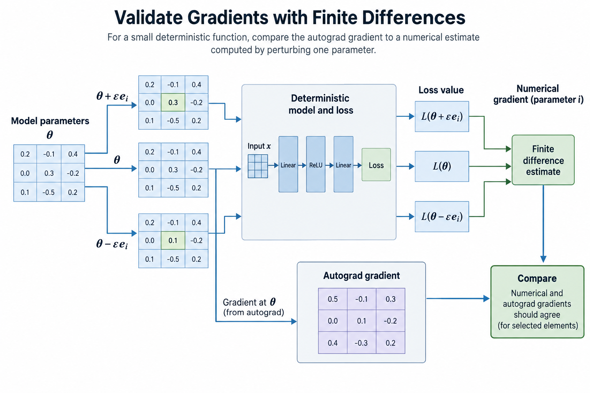
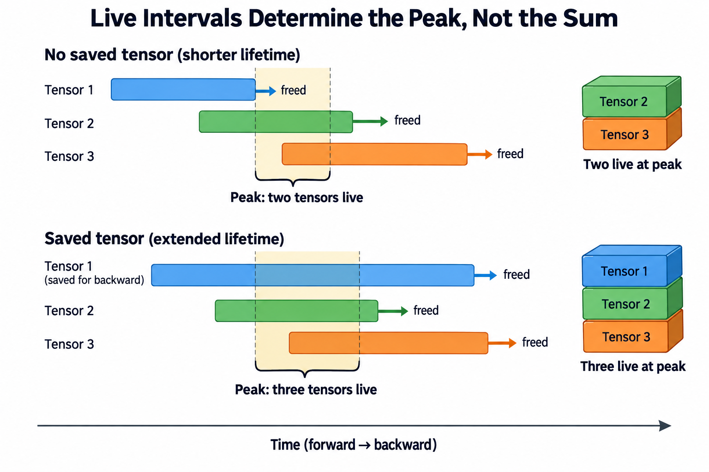

## Overview

Compiling a training program is more involved than compiling its forward pass. The program must produce a valid loss, compute gradients with the intended differentiation rules, preserve state updates, and respect tensor lifetimes across forward and backward execution. A fast inference graph can still leave the expensive training path unchanged or introduce a costly saved-tensor boundary.

AOTAutograd provides a way to trace differentiable computation and expose forward and backward graphs to compilation. The name refers to preparing those graphs before their compiled execution, not to a promise that the entire application has become one permanent ahead-of-time binary. Actual integration, graph capture, and supported behavior depend on the PyTorch version and backend.

## Deep dive

### 1. Write the differentiation contract

Consider a function producing a scalar loss from parameters and input data. The training step needs both the loss and its derivatives with respect to the intended parameter population. Frozen parameters, detached tensors, and nondifferentiable operations alter that population. The compiler must preserve those semantics rather than differentiating every available tensor.

$$
\ell=f(\theta,x),\qquad g=\nabla_{\theta}f(\theta,x),\qquad
\theta_{t+1}=U(\theta_t,g_t,s_t).
$$

The update function also depends on optimizer state s. Momentum, adaptive moments, gradient accumulation, and mixed-precision scaling make this state meaningful. A forward-only comparison does not test the complete update function.

Establish which operations belong to the compiled region. The loss can be compiled while the optimizer remains outside it, or a larger step can be captured under supported conditions. State the actual boundary in the benchmark. “Compiled training” is otherwise too broad to interpret.

### 2. Trace the joint computation

A differentiation system can expose a joint representation of forward operations and the operations needed to calculate gradients. AOTAutograd tracing makes that computation available for partitioning and backend compilation. The resulting representations need not resemble the handwritten Python function line by line.

Tracing observes tensor operations under particular assumptions about inputs, shapes, state, and supported behavior. Python-side effects or unsupported control flow can remain outside captured regions or cause capture difficulties. Dynamic shapes and guards are therefore relevant to training as well as inference.

The joint graph gives a compiler visibility into relationships that separate forward and backward optimization would miss. For example, a cheap forward intermediate might be recomputed in backward instead of saved. Conversely, an expensive operation may justify retaining its result even if that increases memory use.

### 3. Derive a saved-tensor decision

Suppose a backward operation needs an intermediate z produced by an earlier forward operation. Saving z consumes memory over its live interval. Recomputing z avoids that saved allocation but repeats work and may require saving some of its inputs. The comparison must include the entire dependency closure, not just z's own size.

A simplified objective combines execution time with a penalty for memory pressure:

$$
J=T_{\mathrm{forward}}+T_{\mathrm{backward}}+T_{\mathrm{recompute}}+\lambda M_{\mathrm{peak}}.
$$

The coefficient is a modeling device, not a universal compiler setting. Real systems have a hard memory-capacity constraint and discrete kernel choices. The equation nevertheless clarifies why minimizing saved bytes alone can select an unacceptably slow schedule.

For an illustrative intermediate of sixteen megabytes whose producer is inexpensive element-wise arithmetic, recomputation may be attractive if its inputs already remain live. If producing the same-size intermediate requires a large matrix multiplication and retaining its inputs adds substantial memory, the tradeoff changes. Equal output size does not imply equal recomputation cost.

### 4. Understand graph partitioning

A partitioner divides the joint graph into forward and backward execution regions and determines values crossing their boundary. Saved tensors are part of this interface. Their placement affects memory lifetime, transfer cost where relevant, and opportunities to fuse surrounding operations.

The official AOTAutograd optimization tutorial discusses partitioning strategies, including approaches that use graph structure to trade recomputation against saved values. Treat its examples as explanations of the method. The exact partitioner and configuration in a current torch.compile backend can differ from a standalone historical tutorial.

A useful inspection asks which values are outputs of the compiled forward graph for backward use, which backward operations recompute values, and which inputs must survive. Do not infer those decisions from the source code alone. Generated graphs and memory observations provide the relevant evidence.

### 5. Work through a small derivative

Let an element-wise forward computation multiply a parameter by an input, apply a sigmoid, and sum the resulting values. The backward gradient depends on the sigmoid output and the input. It need not save the product if the chosen differentiation path has sufficient other values.

$$
z_i=\theta_i x_i,\quad y_i=\sigma(z_i),\quad
\ell=\sum_i y_i,\quad
\frac{\partial\ell}{\partial\theta_i}=x_i y_i(1-y_i).
$$

One partition can save y and x. Another can retain the required inputs and recompute z and y during backward. Both implement the same real-number derivative, but their floating-point behavior and memory traffic can differ. If x is already live for another reason, the incremental storage cost differs from a case in which retaining x extends its lifetime.

This example explains the boundary without suggesting that the compiler always selects one policy. Measure the actual graphs. A numerical test should compare the gradient as well as the scalar loss, using a tolerance appropriate to precision and expected operation reordering.

### 6. Explain fusion boundaries

Fusion combines compatible operations into fewer kernels and can avoid writing intermediate tensors to device memory. It can also reduce launch overhead. Compatibility depends on iteration domains, layouts, reduction structure, numerical behavior, and backend capabilities.

A saved value can force an intermediate to remain available after the forward region finishes. An otherwise fusible expression may therefore still need an output write for backward. A partition that recomputes that expression can change the materialization requirement, but it adds backward work. This is one reason training fusion cannot be assessed from forward code alone.

Larger fused regions can increase register pressure and live state. They may constrain scheduling around reductions or matrix operations. A kernel-count reduction is evidence about launches, not a sufficient performance result. Record elapsed time and resource use for the complete relevant step.

### 7. Preserve mutations and aliasing

Training code often changes parameters, optimizer buffers, counters, or accumulated gradients. Tensor views can share storage even when their Python objects differ. A compiler must represent those dependencies correctly, including mutations that become observable outside the captured region.

Functionalization can transform supported mutations and view behavior into a representation more suitable for graph transformations. That does not grant permission to alter the program's observable state. Check the resulting values and alias-sensitive behavior at the actual interface.

An in-place operation can also violate autograd's own saved-value requirements independently of compilation. Establish a correct eager baseline first. A compiler failure caused by an invalid differentiation program should not be addressed by silently changing the mathematical training objective.

### 8. Include randomness and precision

Dropout and other stochastic operations influence both forward values and gradients. Recomputing them requires a valid relationship to the intended random-number state. Activation checkpointing, graph partitioning, and backend lowering must be examined under their documented behavior rather than assumed to redraw equivalent masks.

Mixed precision introduces cast placement, accumulator precision, loss scaling, and possible skipped updates. A compiled step must preserve the intended handling of nonfinite gradients and scaling state. Comparing only finite forward outputs can miss an update-semantic mismatch.

Control random seeds and initial state for comparisons, but do not assume every compiled implementation reproduces the eager random sequence bit for bit. State whether the test requires exact reproducibility, numerical closeness under matched randomness, or a statistical property. Those are different validation contracts.

### 9. Measure compilation separately

The first execution can include tracing, graph transformation, code generation, autotuning, and initialization. Report cold-start cost separately from warmed steady-state step time. Recompilation under changed shapes or guards belongs in a workload measurement when the real input distribution triggers it.

Use a consistent timing boundary covering forward, backward, and whichever optimizer operations the claim includes. Device synchronization or events must establish the completion boundary. Host enqueue time alone does not measure GPU training duration.

Record peak allocated memory and, when useful, reserved memory separately. The allocator's reserved pool is not the same as simultaneously live tensors. A reduction in saved tensors can change peak allocation without immediately reducing reserved capacity. Explain the measured quantity instead of presenting one memory number as universal.

### 10. Validate gradients and trajectories

Compare eager and compiled runs from identical parameters and optimizer state. Test loss, selected intermediate outputs, gradients, and updated parameters. Exercise accumulation, zeroing behavior, supported shapes, and noncontiguous layouts if they belong to the input contract.

For a small deterministic function, finite differences can independently check selected derivatives:

$$
\frac{\partial f}{\partial\theta_i}\approx
\frac{f(\theta+\epsilon e_i)-f(\theta-\epsilon e_i)}{2\epsilon}.
$$

Choose the perturbation with floating-point error in mind; making it arbitrarily small increases cancellation problems. Finite differences on a small smooth case do not validate every large-model training path, but they can expose a mistaken gradient reference.

A few successful steps establish local agreement. A longer trajectory can reveal accumulating state or precision differences, although exact trajectories may diverge under allowed floating-point reordering. Define acceptable evidence for the use case and keep the eager reference reproducible.

### 11. Build a useful regression record

Store the PyTorch version, backend, compile options, shape distribution, dtype, initial state, and timing method. Include graph breaks and recompilation behavior when they materially affect the result. A performance regression can originate in partitioning, generated kernels, saved-value lifetime, or a changed workload boundary.

Compare one change at a time when diagnosing. If peak memory rises, inspect new saved values and their live intervals before assuming an allocator bug. If backward becomes slower, inspect recomputed work and fusion boundaries. If only cold-start worsens, separate compilation from steady-state execution rather than calling both the same regression.

The methods and derivative examples here have not been benchmarked on a GPU in this editing environment. They explain how to assess compiled training: preserve the differentiation and update contract, inspect the forward-backward boundary, and measure the complete supported step.

### 12. Distinguish live intervals from tensor totals

Suppose the forward pass creates three intermediate tensors, each occupying ten megabytes. Adding their sizes gives thirty megabytes, but that is not necessarily the peak. If the first tensor dies before the third is created, only two may coexist. Conversely, saving the first tensor for backward can extend its lifetime until all three coexist. The saved-value decision changes the overlap of intervals rather than merely the number of tensors created.

Backward execution can create its own temporaries while saved forward values are still live. The actual peak can therefore occur after the forward pass has finished. Measure the complete step and inspect where the high-water mark occurs. A forward-only allocation trace can understate the training requirement even when every forward intermediate is accounted for.

Recomputation has a similar subtlety. Recomputing a ten-megabyte tensor avoids its long saved interval, but briefly materializing it beside a large backward temporary can still contribute to peak memory. Fusion may avoid that materialization, whereas a backend boundary may preserve it. The partition and lowering decisions interact, which is why a simple sum of saved tensor sizes is only a diagnostic quantity.

## Conclusion

For a concrete review, draw each important value's lifetime from creation to last use on a forward-backward timeline. Mark the tensors crossing the partition boundary and the temporaries introduced by backward. Then compare the timeline with measured peak allocation. An unexplained discrepancy identifies missing state, aliasing, allocator behavior, or an incorrect assumption about generated execution. This exercise makes a memory claim reviewable without pretending the source-level graph determines every runtime allocation.

### Sources

- [Official AOTAutograd optimization tutorial](https://docs.pytorch.org/functorch/stable/notebooks/aot_autograd_optimizations.html).
- [PyTorch torch.compile tutorial](https://docs.pytorch.org/tutorials/intermediate/torch_compile_tutorial.html).
- [PyTorch dynamic shapes documentation](https://docs.pytorch.org/docs/stable/torch.compiler_dynamic_shapes.html).
