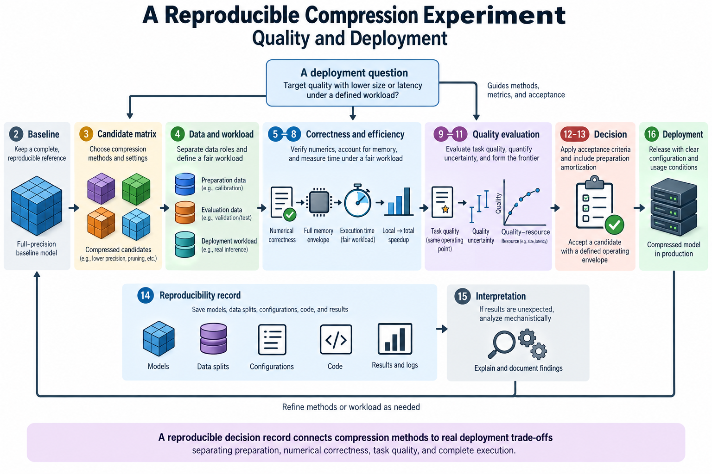
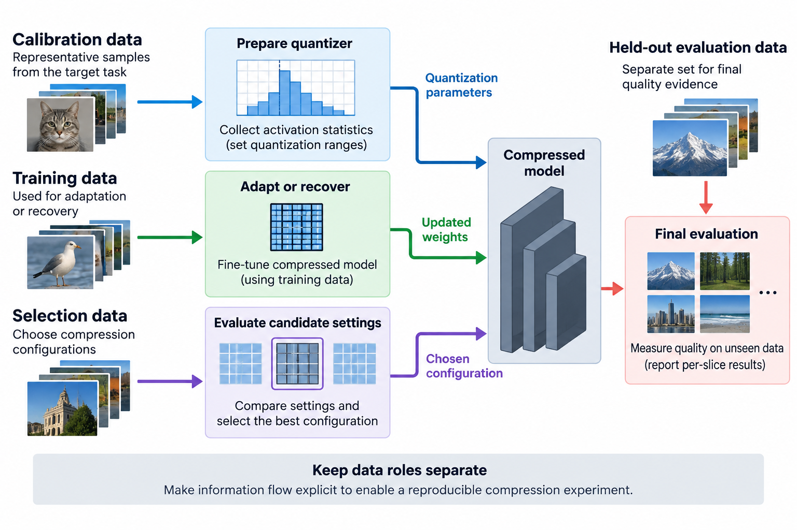
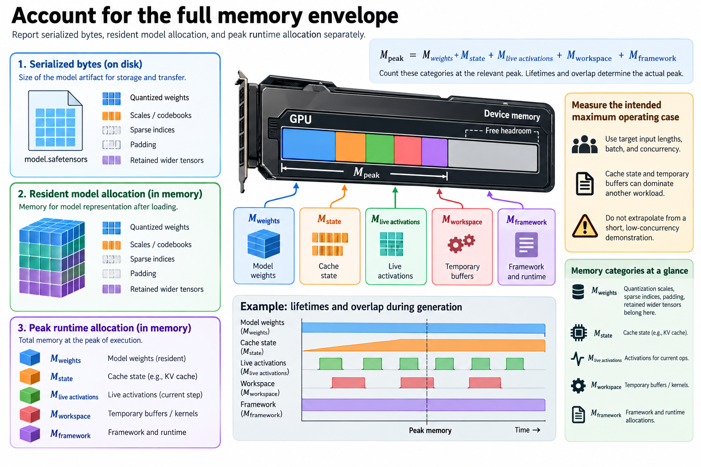
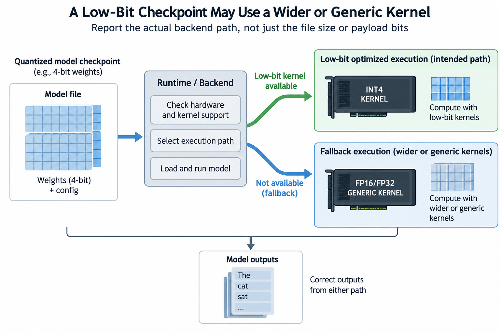
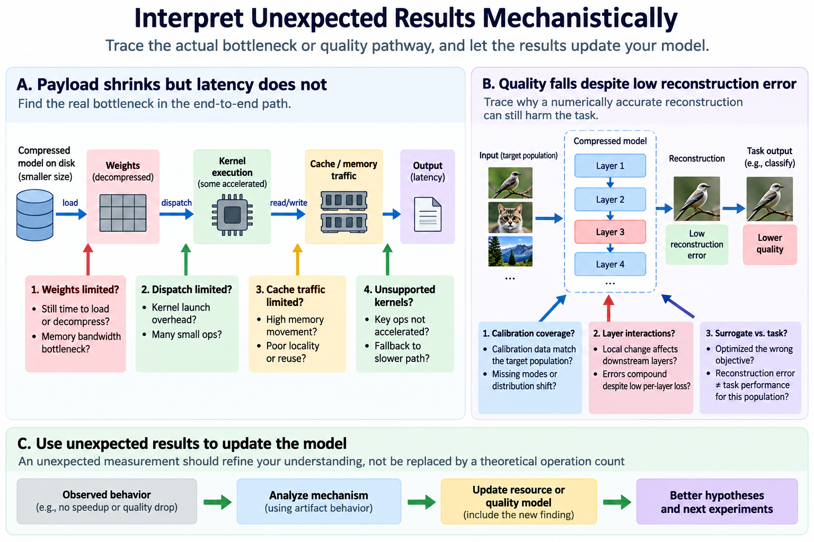
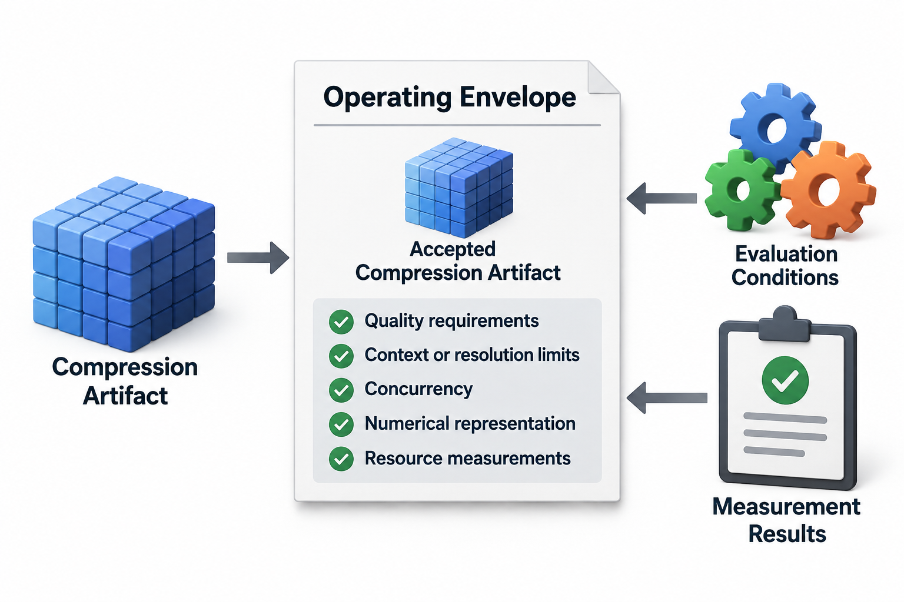

## Overview

A compression experiment should answer a deployment question. Can a smaller or lower-precision artifact preserve required quality while improving capacity, latency, throughput, or preparation cost under a defined workload? Without that question, a collection of compressed checkpoints can produce numbers that are hard to compare or use.

This guide connects the methods in this series through a controlled evaluation protocol. It includes mathematical accounting and a worked selection example, but it does not fabricate a GPU benchmark. The outcome is a reproducible decision record that separates algorithmic preparation, numerical correctness, task quality, and complete execution.

*An original conceptual illustration. Numerical plots and examples are illustrative unless explicitly identified as measured evidence.*

## Deep dive

### 1. State the decision before choosing methods

Define the baseline checkpoint and the deployment requirement. A capacity problem might require fitting a documented context and concurrency into a device-memory budget. A latency problem might require meeting a request deadline while preserving a task-quality threshold.

Write the workload precisely: input distribution, lengths or resolutions, batch, concurrency, output budget, and numerical policy. Specify the hardware and backend revisions used for measurement.

Then choose candidate methods that address the suspected resource term. Weight quantization targets stored representation, structured pruning can change executable dimensions, and distillation can recover quality for an efficient student. Mixing them without a baseline bottleneck makes the experiment harder to interpret.

### 2. Preserve a complete baseline

The baseline includes weights, tokenizer or preprocessing, generation settings, quality implementation, and backend configuration. Record the artifact revision rather than only a model family name.

Evaluate the baseline before preparing candidates. This confirms that the reference works in the target environment and gives quality and resource values to judge changes against.

Separate initialization or compilation from steady-state inference unless startup is part of the requirement. Preserve the exact measured path. Comparing a warmed candidate with a cold baseline can create an apparent benefit unrelated to compression, while changing backend kernels can confound an algorithm comparison.

### 3. Design the candidate matrix

Choose a small set of interpretable configurations. For example, compare a supported weight-only quantizer, a structured student trained without distillation, and the same student with distillation. Add combinations only when they answer a specific question.

An ablation isolates a component's contribution by controlling surrounding choices. If pruning and additional training are introduced together, include a relevant training control when preparation resources allow it.

Record every changed variable: groups, codebook, calibration, retained high-precision layers, rank, module selection, target data, and recovery budget. A method name is not enough metadata. The candidate matrix should identify actual artifacts, not just acronyms that can hide different numerical policies.

### 4. Separate data roles

Use calibration data for quantizer preparation, training data for adaptation or recovery, selection data for choosing configurations, and held-out evaluation for final quality evidence. These roles can be implemented differently, but their information flow should be explicit.

Repeatedly choosing compression settings against the final benchmark can overfit the recipe. Teacher-generated targets can also contain examples or patterns related to evaluation data. Document provenance and check overlap when it affects the claim.

Match calibration preprocessing to the intended task. A numerical format selected using a narrow population can be correct yet unsuitable for another distribution. Include relevant held-out slices rather than assuming one aggregate score covers every operating condition.

### 5. Check numerical correctness first

Verify packing, scales, axes, and reconstruction on tiny known examples. For feature scaling, compare the transformed unquantized function with the original. For adapters, compare the separate branch with the effective matrix under the selected scale.

These checks catch implementation mistakes before expensive quality evaluation. They do not prove that a correct approximation preserves task behavior. Keep the correctness result distinct from the quality result.

Use tolerances that fit the numerical policy and reference computation. Include partial groups, nonuniform values, zero-range blocks, and incompatible shape cases under the supported contract. Uniform random tensors alone can miss swapped axes and metadata errors.

### 6. Account for the full memory envelope

Report serialized bytes, resident model allocation, and peak runtime allocation separately. A resource model can organize the runtime categories.

$$
M_{\mathrm{peak}}=M_{\mathrm{weights}}+M_{\mathrm{state}}+M_{\mathrm{live\ activations}}+M_{\mathrm{workspace}}+M_{\mathrm{framework}}.
$$

The expression assumes these categories are counted at the relevant peak and avoids summing unrelated maxima. Lifetimes and overlap determine actual peak allocation.

Quantization scales, sparse indices, padding, and retained wider tensors belong in weight representation accounting. Cache state and temporary buffers can dominate another workload. Measure the intended maximum operating case rather than extrapolating from a short, low-concurrency demonstration.

### 7. Measure time under a fair workload

Record latency and throughput with the same inputs, outputs, concurrency, and generation policy. For language serving, report prefill and decode behavior separately where useful. End-to-end timing should include relevant scheduling and data movement.

Warm up the intended path, repeat measurements, and summarize variability. The required statistic depends on the decision: sustained throughput differs from a tail-latency service objective.

Check fallback operations and compilation. A nominal low-bit checkpoint using wider or generic kernels can have correct outputs without the expected acceleration. Report the actual backend path instead of inferring execution from file size or payload bits.

### 8. Relate local speedup to total speedup

If a fraction f of baseline time is improved by a factor s while the rest is unchanged, Amdahl's model gives an optimistic total speedup under those assumptions.

$$
S_{\mathrm{total}}=\frac1{(1-f)+f/s}.
$$

For an illustrative fraction of 0.6 and local improvement of 2, the total is about 1.43. Even making that fraction arbitrarily fast limits the total to 2.5 under the model.

Compression can also change scheduling, memory, and capacity, so check the assumptions. The formula explains why a faster isolated matrix multiplication cannot be copied directly into an end-to-end claim. Measure the complete path and identify changed resource mechanisms.

### 9. Evaluate quality at the same operating point

Keep prompts, input processing, decoding, output length limits, and evaluation implementation consistent. A candidate that produces shorter answers or fewer samples may use fewer resources while answering a different quality question.

Use the task's required metrics and inspect diagnostic slices. Aggregate quality can hide rare but important failures, including long-context cases or a specific domain changed by calibration.

Report absolute baseline and candidate values along with differences. Include sample counts and uncertainty where the evaluation supports it. Teacher agreement, layer reconstruction, and task quality answer different questions; do not substitute one for another without a stated reason.

### 10. Quantify observed quality uncertainty

For independent binary outcomes, an estimated success proportion p_hat has an approximate standard error determined by the sample count n.

$$
\operatorname{SE}(\widehat p)\approx\sqrt{\frac{\widehat p(1-\widehat p)}n}.
$$

At an illustrative proportion of 0.8 over 1,000 independent cases, the standard error is about 0.0126. This simple model does not account for clustered or dependent examples, dataset selection, or systematic evaluation bias.

When baseline and candidate answer the same cases, paired analysis can be more informative than treating them as unrelated samples. Check disagreements and use an uncertainty method that matches the metric and data structure. More repetitions do not fix a biased evaluation population.

### 11. Build a quality-resource frontier

Plot candidate quality against the resource relevant to the decision. A Pareto-dominated candidate is worse or equal on every considered objective and strictly worse on at least one within the measured set.

$$
\mathcal F=\{a:\nexists b\text{ that dominates }a\}.
$$

Attach the workload, device, backend, and uncertainty to the frontier. It represents tested configurations under those conditions, not a universal ordering of compression methods.

If memory and latency are both important, keep both rather than collapsing them into an unexplained efficiency score. A memory-saving candidate can enable a larger workload even when single-request latency improves little. That is a distinct and potentially useful operating-point change.

### 12. Work through an acceptance decision

Suppose a service requires quality of at least 0.79, peak allocation below 20 GB, and latency below 100 milliseconds under a defined workload. A candidate with quality 0.82, 18 GB, and 95 milliseconds passes the point estimates.

Another candidate with quality 0.80 and 16 GB but latency 110 milliseconds fails the stated latency constraint. A third with latency 80 milliseconds and 15 GB but quality 0.76 fails quality. The cheapest payload is therefore not automatically the accepted artifact.

These are invented values, not benchmark results. A real decision must consider measurement uncertainty and the exact acceptance statistic. A candidate barely meeting a point estimate can require more evidence or operating margin before its configuration supports the service requirement.

### 13. Include preparation amortization

Preparation consumes calibration, teacher inference, recovery training, search, and export resources. Let C_p be added preparation cost and delta c the per-request savings in the same cost unit.

$$
N_{\mathrm{break\ even}}\approx\frac{C_p}{\Delta c},\qquad \Delta c>0.
$$

This accounting model assumes stable per-request savings and excludes changes in demand or operating policy. It helps explain when a costly distilled student or architecture search can be worthwhile under repeated use.

Keep memory-capacity benefits and monetary savings distinct. A deployment that otherwise cannot fit can justify preparation for feasibility even without a simple request-cost calculation. State which benefit supports the decision rather than forcing every outcome into one amortization number.

### 14. Preserve the reproducibility record

Store artifact hashes or revisions, preparation settings, data provenance, numerical policy, exported graph, backend identity, and measurement summary. Include failed candidates when they explain constraints or prevent repeating an unsupported configuration.

The record should let another engineer evaluate the selected artifact without rerunning every preparation experiment. Reproducing the method and verifying the deployment are different tasks with different resource bills.

No compression training run or GPU benchmark was executed for this guide. Its calculations and acceptance example are illustrative. The protocol is intended to produce the evidence needed for a real decision, while the primary method articles explain the mechanisms behind each candidate.

### 15. Interpret unexpected results mechanistically

If payload shrinks but latency does not, check whether the workload was limited by weights, dispatch, cache traffic, or unsupported kernels. If a local kernel improves but end-to-end time barely changes, examine the accelerated fraction and the remaining path.

If quality falls despite low reconstruction error, check calibration coverage, layer interactions, and the relationship between the surrogate and task. A correctly implemented numerical method can optimize the wrong local criterion for the intended population.

Unexpected results are useful when they update the resource or quality model. Do not replace an unfavorable measurement with a theoretical operation count. The experiment should connect the method's mechanism to actual artifact behavior, including cases where the hypothesized benefit does not appear.

### 16. Conclude with a concrete operating envelope

The final report should name the accepted artifact and the conditions under which it was evaluated. Include quality requirements, context or resolution limits, concurrency, numerical representation, and resource measurements.

If no candidate passes, record that result and identify the limiting term. The next experiment can then target a different architecture, representation, recovery budget, or execution path. A transparent failed hypothesis is more informative than an unqualified compression claim.

This connects the whole series: theory proposes a useful change, preparation creates an artifact, correctness verifies its numerical contract, and complete evaluation determines whether it improves the intended deployment.

## Conclusion

Keep the decision record alongside the artifact rather than only in a temporary notebook. A later backend change, new workload, or revised quality requirement can invalidate the previous operating point without changing the compressed weights. Repeating the relevant measurements under those new conditions is then a targeted verification task, supported by the existing configuration and evidence.

### Sources

- [Amdahl's original paper](https://doi.org/10.1145/1465482.1465560).
- [Roofline performance model](https://doi.org/10.1145/1498765.1498785).
- [GPTQ](https://arxiv.org/abs/2210.17323).
- [Distilling the Knowledge in a Neural Network](https://arxiv.org/abs/1503.02531).
- [Once-for-All](https://arxiv.org/abs/1908.09791).
