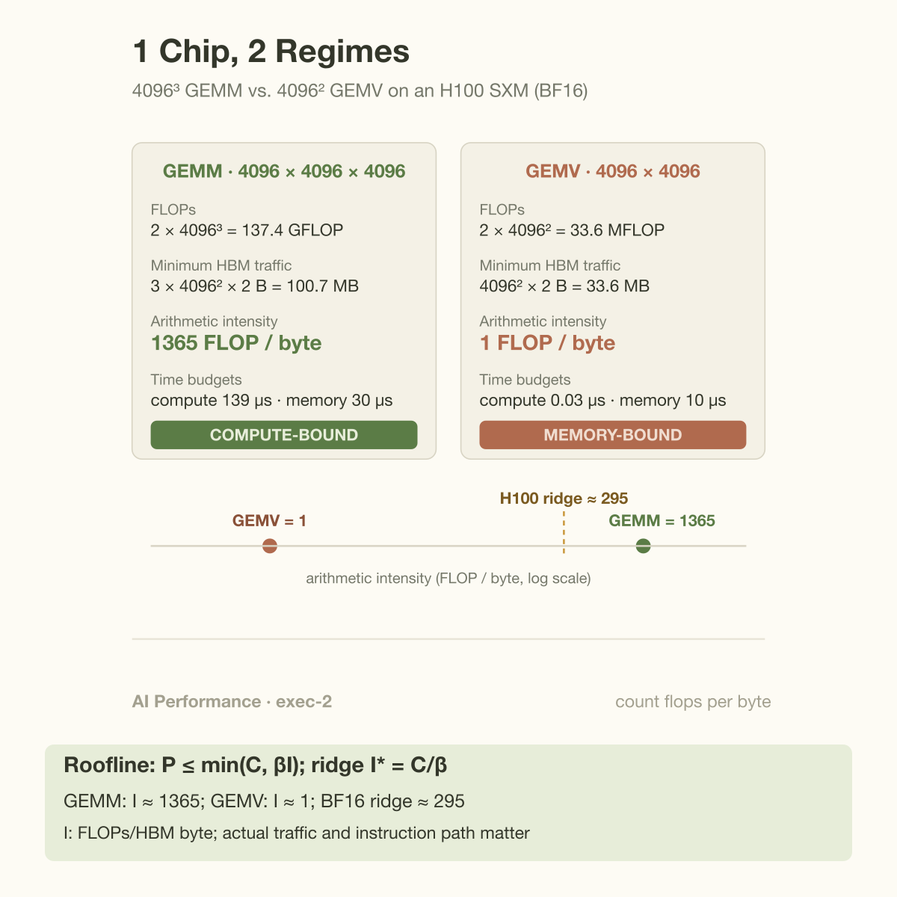

The same H100 that sustains close to 989 TFLOPS on a large matrix multiply tops out around 3.4 TFLOPS on a matrix-vector product. That is 0.3% of peak, on identical silicon, running math that is correct and fully parallelized. Nothing is broken. The 2 workloads simply sit on opposite sides of 1 number, and if you know that number you can predict the 295x gap with a pencil before you ever open a profiler.

This article is about that number and the question it answers: is this kernel compute-bound or memory-bound? It is the first question a performance engineer asks about any GPU workload, because the answer decides everything downstream. It tells you which optimizations can possibly help, which ones address the estimated constraint, and what "fast" even means for this operation. Get the answer wrong and you can spend a month tuning tensor core utilization on a kernel whose actual bottleneck is a memory bus.

## 2 budgets, 1 winner

Every kernel spends from 2 budgets at once. It performs floating-point operations, drawn against the chip's compute budget: for an H100 SXM, 989 TFLOPS of dense BF16 tensor-core throughput. And it moves bytes between HBM and the chip, drawn against the memory budget: 3.35 TB/s of HBM3 bandwidth. (Both figures are from NVIDIA's H100 datasheet; the TFLOPS number is the dense figure, not the 2x sparsity headline.)

The hardware works through both budgets concurrently, so to a first approximation the kernel's runtime is whichever budget runs out last:

$$
 t\gtrsim\max(F/C,D/\beta).
$$

Which term wins depends only on the ratio of work to traffic. That ratio has a name: **arithmetic intensity**, measured in FLOPs per byte of HBM traffic. The hardware has a matching ratio, sometimes called the **machine balance**: peak FLOPS divided by peak bandwidth. For the H100 in BF16:

```
989e12 FLOP/s ÷ 3.35e12 B/s ≈ 295 FLOP/byte
```

Read that as a price. Every byte you pull from HBM must be amortized over roughly 295 floating-point operations, or the tensor cores stall waiting for data. Since a BF16 element is 2 bytes, that means about 590 operations per element loaded. A kernel whose intensity exceeds 295 has a compute-limited ideal roof: the FLOP budget is the binding constraint, and peak FLOPS is the right ceiling to chase. Below 295 its ideal roof is memory-limited: bandwidth is the constraint, and the only ceiling that matters is `intensity × 3.35 TB/s`.

This ratio is not an H100 quirk. An A100 sits at about 153 FLOP/byte in BF16 (312 TFLOPS over 2.0 TB/s); a B200 lands near 280 (roughly 2.25 PFLOPS dense BF16 over 8 TB/s HBM3e). Compute has outgrown bandwidth for decades, which is the [memory wall](/blog/the-memory-wall-latency-numbers/) restated: the balance point keeps drifting right, and more and more kernels fall on the memory-bound side of it.

## The roofline: the whole diagnosis in 1 picture

Williams, Waterman, and Patterson packaged this max() into a single log-log plot in 2009, and it remains the most useful diagram in performance engineering. Put arithmetic intensity on the x-axis and attainable FLOPS on the y-axis. Peak bandwidth draws a slanted line rising from the left (attainable FLOPS = intensity x bandwidth). Peak compute draws a horizontal roof. Where they meet is the ridge point, which is exactly the machine balance.


Any kernel is a dot on this plot. Its x-position comes from counting FLOPs and bytes; the roof above that x-position is the best the hardware can do. The vertical gap between the dot and the roof is your remaining optimization headroom, and the shape of the roof at that point tells you what kind of work will close the gap. Under the slanted section, only 2 things help: move fewer bytes, or move the dot right by raising intensity. Under the flat section, only better utilization of the compute units helps. Buying more of the wrong resource moves nothing.

The plot also makes an uncomfortable fact visible at a glance: a kernel at intensity 1 on an H100 cannot exceed 3.35 TFLOPS no matter how good the code is. That is not a quality ceiling, it is a physics ceiling, and reaching 90% of it is excellent engineering even though nvidia-smi will look embarrassing.

## A worked example you can check by hand

Take a square matrix multiply, C = A x B with all matrices 4096 x 4096 in BF16, and compare it with a matrix-vector product, y = A x v with the same 4096 x 4096 matrix.

**GEMM, 4096 x 4096 x 4096.** A matmul does 2 x M x N x K FLOPs (1 multiply and 1 add per inner-product term):

- FLOPs: 2 x 4096^3 = 137.4 GFLOP
- Minimum HBM traffic: read A and B, write C. 3 matrices of 4096^2 elements at 2 bytes: 3 x 16.78M x 2 B = 100.7 MB
- Arithmetic intensity: 137.4e9 / 100.7e6 = **1365 FLOP/byte**

1365 is far right of the 295 ridge, so compute sets the ideal roof. Check it with the 2 budgets: compute needs 137.4e9 / 989e12 = 139 µs, memory needs 100.7e6 / 3.35e12 = 30 µs. Compute dominates by 4.6x, and a well-tuned kernel (cuBLAS will do fine here) spends its life keeping tensor cores fed. Note the tidy closed form: for square N x N x N matmuls the intensity is 2N^3 / (3 x 2 x N^2) = N/3. Intensity grows linearly with problem size, which is why big matmuls are the happiest workload a GPU ever runs.

**GEMV, 4096 x 4096.** Same matrix, but now it multiplies a vector:

- FLOPs: 2 x 4096^2 = 33.6 MFLOP
- Minimum HBM traffic: the matrix must be read once, 4096^2 x 2 B = 33.6 MB; the input and output vectors add 8 KiB each
- Arithmetic intensity: 33.6e6 / 33.6e6 = **1 FLOP/byte**

Every matrix element is used exactly once, touched for 1 multiply-add, then discarded. There is no reuse to exploit, so no amount of cleverness raises this number. At intensity 1 the roofline caps attainable throughput at 1 x 3.35 TB/s = 3.35 TFLOPS, which is the 0.3%-of-peak figure from the opening. The budget check agrees: memory needs 10 µs, compute needs 0.03 µs. The ideal attainable FLOP rate is about 0.3% of peak; this does not establish a literal tensor-core idle fraction.



Here is why this pair of toy problems matters: they are literally the 2 phases of LLM inference. [Prefill](/blog/how-an-llm-generates-text/) processes thousands of prompt tokens at once, so every weight matrix multiplies a fat activation matrix and lands GEMM-like on the compute roof. Decode generates 1 token per step per sequence, so at batch size 1 every weight matrix multiplies a single vector: the model becomes a stack of GEMVs at intensity around 1, and each token costs at least (weight bytes / bandwidth). 1 transformer forward pass, 2 opposite corners of the roofline. This single plot is the reason [prefill and decode are increasingly served by different hardware](/blog/the-prefill-decode-disaggregation-story/).

Batching moves decode rightward. Serving B sequences turns each GEMV into a B-row skinny GEMM: the weights are read once but used B times, so intensity is roughly B FLOP/byte while weight traffic dominates. On the H100's BF16 balance you need on the order of B ≈ 300 concurrent sequences before decode's linear layers cross the ridge, which is exactly why decode throughput scales almost free with batch size until it suddenly doesn't. (KV-cache reads, which grow with context length and don't batch across sequences, drag the effective intensity back down; that story deserves its own article.)

## Going deeper: intensity is a property of the implementation

The clean numbers above quietly assumed the *minimum* traffic: each matrix crosses the HBM boundary exactly once. Real kernels have to earn that.

Consider the naive matmul, 1 thread per output element, each reading a full row of A and column of B from memory. Per output: 2N FLOPs against 2N elements = 4N bytes, an intensity of 0.5 FLOP/byte, independent of N. The same algorithm that should sit at 1365 collapses to the far left of the roofline, 590x below the ridge. Everything we call a "fast matmul kernel" is machinery for closing that gap through reuse: tiles of A and B are staged in shared memory and registers, and each loaded element participates in many multiply-adds before eviction. With T x T tiles, HBM intensity scales roughly with T. The algorithm's FLOP count never changed; its byte count did. Arithmetic intensity is not a property of the math, it is a property of the math *plus* the data movement strategy, which is why the [cache hierarchy](/blog/caches-how-locality-rescues-speed/) is where matmul performance actually lives.

2 more refinements matter in practice. First, there are multiple roofs: the 989 TFLOPS ceiling belongs to BF16 tensor cores, but FP32 CUDA-core work on the same chip peaks around 67 TFLOPS, a roof 15x lower with a ridge 15x further left. A kernel can be compute-bound against the roof it is actually using while sitting far below the marketing number. Second, there are multiple slanted lines: you can draw a roofline against L2 bandwidth or shared-memory bandwidth as well as HBM, and Nsight Compute's roofline view does precisely this, plotting measured intensity per memory level. A kernel can clear the HBM roofline and still be bound by L2. And some kernels are bound by neither FLOPs nor bytes: tiny launches that can't fill the machine are latency-bound, a third regime the roofline doesn't show and the next article's territory.

The mathematical roof is an upper bound, not proof of the active bottleneck. With operation count F, actual HBM traffic D, compute ceiling C for the instruction path used, and memory bandwidth beta:

$$
I=\frac FD,\qquad I^*=\frac C\beta,\qquad
P\le\min(C,\beta I),\qquad t\ge\max(F/C,D/\beta).
$$

For the 4096-square GEMM, minimum traffic is 100663296 bytes and work is 137438953472 FLOPs, giving intensity 1365.33. The ideal compute and memory terms are 139 and 30 microseconds. The corresponding GEMV has intensity approximately 1, making memory the tighter ideal constraint. Actual performance may sit below either roof because of insufficient parallelism, dependencies, instruction issue, or extra traffic.

Measure intensity at each relevant memory boundary before choosing a method. Tiling changes reuse; fusion removes intermediate traffic; wider precision can change both bytes and the applicable compute roof. An optimization can therefore move both coordinates and ceilings. Run a matched-shape comparison and inspect delivered bandwidth and compute-pipe activity. Faster memory can directly improve a memory-limited kernel even when the newer GPU's compute-to-bandwidth ratio grows; the ratio alone is not a statement that an upgrade cannot help.

## Common misconceptions

**"The GPU shows 98% utilization, so we're compute-bound."** The utilization figure in nvidia-smi measures the fraction of time at least 1 kernel was resident on the device. A GEMV crawling along at 0.3% of peak FLOPS reports essentially 100% utilization while doing so. Utilization tells you the GPU was busy, not what it was busy waiting for; the memory-bound H100 and the compute-bound H100 both read as "fully utilized." [Goodput, not utilization](/blog/goodput-vs-utilization/), is the number that survives contact with the roofline.

**"Memory-bound is a hardware problem; the fix is a faster GPU."** Upgrading rarely rescues a memory-bound kernel, because FLOPS grow faster than bandwidth generation over generation: the ridge moved from ~153 (A100) to ~295 (H100), so the new chip is proportionally *worse* for low-intensity work. The real fixes raise intensity or cut bytes: fuse adjacent kernels so intermediates never round-trip through HBM, batch requests so weights are reused, or quantize. Note what quantization actually does for decode: FP8 weights halve the bytes, not the operation count. It is a bandwidth optimization wearing a compute costume, and it is most of why 4-bit formats matter for [serving economics](/blog/nvfp4-vs-mxfp4-the-4bit-format-war/).

**"Attention is compute-bound; it's all matmuls."** Matmul shape decides everything. Standard attention at decode time streams a growing KV cache to compute scores for a single query: intensity near 1, firmly memory-bound. Even at training time, vanilla attention materializes the S = QK^T score matrix to HBM and reads it back for the softmax and the V product, sinking the whole operation's intensity. FlashAttention's contribution was not fewer FLOPs (it does slightly more, recomputing in the backward pass); it was an intensity rewrite, tiling the computation so the N x N matrix never touches HBM. The paper's own framing is IO-awareness. Same math, different dot position, 2-4x wall-clock speedup.

## The bigger picture

The roofline question scales from a single kernel to the entire industry. At kernel level it is triage: before profiling, count FLOPs and bytes, divide, and you know which roof you are under and what your realistic ceiling is. A 1-line estimate on paper regularly saves a week of misdirected tuning, and it is the first calculation an [ML performance engineer](/blog/what-does-an-ml-performance-engineer-do/) runs on any new workload.

At system level, the balance point explains serving architecture. Prefill's compute-bound GEMMs and decode's memory-bound streaming want different silicon ratios, which is why disaggregated serving splits them across pools and why NVIDIA now ships a [prefill-specialized chip](/blog/prefill-gets-its-own-chip-rubin-cpx/) with big compute and cheaper memory next to decode GPUs drowning in HBM. Chip designers are drawing rooflines too; they just get to move the roofs.

## Takeaway

- 1 division answers the first question: arithmetic intensity (FLOPs / HBM bytes) above the machine balance (~295 FLOP/byte for H100 BF16) means compute-bound; below means memory-bound, and attainable FLOPS is capped at intensity x bandwidth regardless of code quality.
- The 2 regimes have disjoint fixes. Memory-bound kernels respond to fusion, batching, and quantization (fewer bytes); compute-bound kernels respond to tensor-core utilization and better tiling. Optimizing the wrong side is exactly 0 speedup.
- Intensity belongs to the implementation, not the operation: naive matmul sits at 0.5 FLOP/byte, tiled matmul at N/3, and FlashAttention is the same math with the dot moved right. Raising intensity is what most famous kernel optimizations actually are.

## Sources

- S. Williams, A. Waterman, D. Patterson, "Roofline: An Insightful Visual Performance Model for Multicore Architectures," Communications of the ACM, 2009. https://doi.org/10.1145/1498765.1498785
- NVIDIA H100 Tensor Core GPU datasheet (989 TFLOPS dense BF16, 3.35 TB/s HBM3, SXM). https://www.nvidia.com/en-us/data-center/h100/
- NVIDIA Deep Learning Performance Guide, "GPU Performance Background" (arithmetic intensity, math-vs-memory limits). https://docs.nvidia.com/deeplearning/performance/dl-performance-gpu-background/index.html
- T. Dao, D. Fu, S. Ermon, A. Rudra, C. Ré, "FlashAttention: Fast and Memory-Efficient Exact Attention with IO-Awareness," 2022. https://arxiv.org/abs/2205.14135
- NVIDIA Nsight Compute documentation, roofline analysis section. https://docs.nvidia.com/nsight-compute/ProfilingGuide/index.html

*Part of the [GPU Programming & Performance](/series/gpu-performance/) learning path. Browse its Beginner, Intermediate, and Advanced topics and planned articles.*
