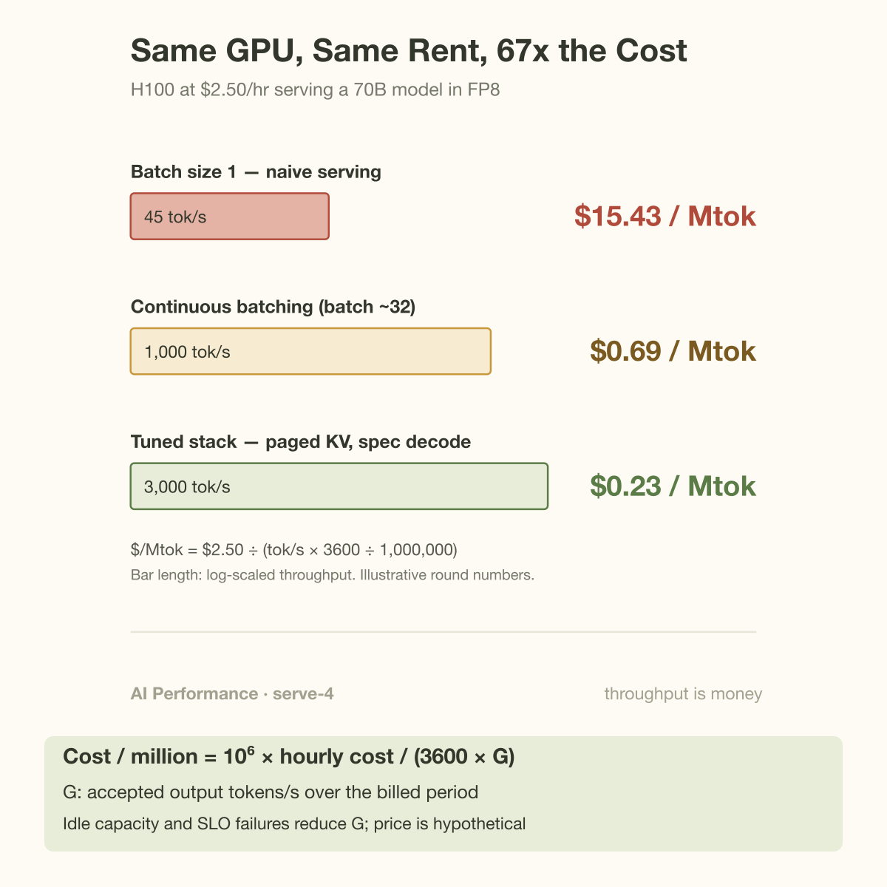

The same H100, rented at the same $2.50 an hour, can serve the same 70B model for $15.43 per million tokens or for 23 cents. A 67x spread, and not a single component changed hands. The only difference is software: how many requests share the GPU, how the KV cache is managed, whether the kernels keep the memory bus busy.

That spread is the entire business case for performance engineering, compressed into 1 number. Everything this series has covered so far, rooflines, batching, quantization, disaggregation, has been measured in tokens per second. This article does the last step: converting tokens per second into dollars, because dollars are the unit your CFO, your capacity planner, and your pricing page actually speak.

## The 1-line formula

A GPU costs some rate in dollars per hour. While you hold it, it emits tokens at some rate. Divide 1 by the other:

```
$/Mtok = (GPU $/hr) / (tokens/sec × 3600 / 1,000,000)
```

The denominator is just tokens per second converted to millions of tokens per hour. At 1,000 tokens per second, 1 hour produces 3.6 million tokens, so a $2.50/hr GPU lands at $2.50 / 3.6 ≈ $0.69 per million tokens.

3 things about this formula deserve a hard look before we plug in numbers.

First, the numerator is a *fully loaded* hourly rate, not a sticker price. If you rent from a cloud, it is the on-demand or committed rate you actually pay. If you own the hardware, it is depreciation plus power, cooling, networking, rack space, and the humans who keep it alive, amortized per GPU-hour. A $30,000 H100 depreciated over 4 years is about $0.86/hr in capital alone; power and facility costs for a 700W card at typical datacenter PUE add roughly $0.10 to $0.15/hr at US industrial electricity rates, and hosting overhead pushes the realistic floor toward $1.50 to $2/hr even before margin. Rental prices in 2025 to 2026 have hovered between $2 and $3/hr for H100s at the large GPU clouds, so $2.50/hr is a fair working number.

Second, tokens per second here means *aggregate delivered throughput per GPU*, all concurrent requests summed, averaged over real traffic. Not the peak number from a benchmark run at ideal batch size, and not the per-request speed a single user experiences. Those are different quantities, and confusing them is the most common way this calculation goes wrong. I wrote about the gap in [Tokens per Second: What It Hides](/blog/tokens-per-second-what-it-hides/).

Third, the formula is deliberately symmetric: halve the hourly cost or double the throughput and you get the same result. That symmetry is why performance work and procurement work are the same job viewed from different chairs.

## Worked example: 1 H100, 3 software stacks

Take Llama-70B-class weights served in FP8, so roughly 70 GB of parameters sitting on an 80 GB H100. (A tight fit once KV cache needs its share; real deployments often shard across 2 GPUs, which doubles both the hourly cost and the throughput and cancels out in the division, so the single-GPU math is a fair proxy.) The GPU rents at $2.50/hr.

**Level 1: batch size 1, naive serving.** Decode is bandwidth-bound: producing each token requires streaming essentially all 70 GB of weights from HBM through the compute units. The H100's HBM3 moves about 3.35 TB/s, so the physical ceiling is 3,350 / 70 ≈ 48 forward passes per second. Real single-stream decode lands around 45 tokens/sec. Plug it in:

45 × 3600 / 1e6 = 0.162 Mtok per hour. $2.50 / 0.162 = **$15.43 per million tokens.**

**Level 2: continuous batching.** The insight behind Orca (Yu et al., OSDI 2022) and every modern serving engine: each of those 70 GB weight reads can serve *many* requests at once, because the extra matrix math per additional request is nearly free while the memory bus is the bottleneck. Batch 24 to 32 requests and aggregate throughput climbs toward 1,000 tokens/sec even as each individual stream slows only modestly.

1,000 × 3600 / 1e6 = 3.6 Mtok per hour. $2.50 / 3.6 = **$0.69 per million tokens.**

**Level 3: a tuned stack.** PagedAttention-style KV management to fit bigger batches without fragmentation, FlashAttention kernels, CUDA graphs, speculative decoding, prefix caching for shared prompts. Sustained aggregate rates around 3,000 tokens/sec per H100-equivalent are reported for 70B-class models under these conditions (illustrative round numbers; exact figures depend on sequence lengths and traffic mix).

3,000 × 3600 / 1e6 = 10.8 Mtok per hour. $2.50 / 10.8 = **$0.23 per million tokens.**



Now hold those numbers against the market. GPU aggregators list 70B-class open-weight models at roughly $0.30 to $0.90 per million output tokens (vendor list prices, e.g. Together AI's published rates, so read them as marketing-adjacent). The batch-1 operator at $15.43 is not merely uncompetitive; they are losing money on every request at a 20x markup below their cost. The tuned operator at $0.23 can sell at $0.60 and enjoy a healthy gross margin. Same silicon, same rent. The entire difference between bankruptcy and a business is the serving stack.

This is also why "should we self-host?" has no general answer. Self-hosting wins only if your team can climb this ladder and keep the GPUs busy; a half-utilized cluster running batch-4 workloads is almost always more expensive than an API.

## Input tokens are cheaper to make, and priced accordingly

The formula above quietly assumed all tokens cost the same to produce. They do not, and the price sheets of every provider say so: output tokens typically list at 3 to 5x the price of input tokens.

The asymmetry is physical, not commercial. Prefill (processing your prompt) reads the model weights *once* and applies them to every prompt token in parallel; it is compute-bound, and a single H100 can chew through tens of thousands of prompt tokens per second. Decode (generating the answer) pays a full pass over the weights *per token*; it is bandwidth-bound, and the same GPU manages tens of tokens per second per stream. 1 weight read amortized over 4,000 prompt tokens versus 1 weight read per output token: the cost per token differs by orders of magnitude at the hardware level, and batching only partially closes the gap. If prefill and decode are hazy, the mechanics are in [How an LLM Generates Text](/blog/how-an-llm-generates-text/); the pricing consequences get a full autopsy in [Reading GPU Economics Off OpenAI's Price Sheet](/blog/gpu-economics-from-openais-price-sheet/).


The practical consequence for cost modeling: never compute 1 blended $/Mtok for your workload. Compute 1 for input and 1 for output, weighted by your actual traffic shape. A RAG service pushing 8,000-token contexts to produce 200-token answers lives almost entirely in cheap prefill; a code-generation agent emitting 3,000-token diffs lives in expensive decode. 2 services with identical total token counts can differ 5x in real serving cost.

## Going deeper: why API prices fell 10 to 100x in 2 years

GPT-4 launched in March 2023 at $30 per million input tokens and $60 per million output. By 2025, models matching or beating its benchmark scores listed at $2.50/$10 (GPT-4o) and small-tier models at $0.15/$0.60. Depending on the capability tier you compare, that is a 10x to 100x collapse in about 2 years. Hardware alone cannot explain it; H100 to B200 bought maybe 2 to 3x per dollar in that window. The rest came from stacked multiplicative software and model-design wins, each one an instance of the formula's denominator growing:

- **Kernel efficiency.** FlashAttention (Dao et al., 2022) restructured attention to be IO-aware, cutting memory traffic and unlocking both longer contexts and higher throughput per GPU.
- **Scheduling.** Continuous batching turned GPUs from single-request machines into shared pipelines, a 10 to 20x aggregate throughput gain by itself.
- **Memory management.** PagedAttention (Kwon et al., 2023) eliminated KV-cache fragmentation, roughly doubling achievable batch sizes at the same HBM capacity.
- **Precision.** FP16 to FP8 to FP4 halves weight-streaming traffic at each step, and decode throughput follows bandwidth almost linearly.
- **Model architecture.** Mixture-of-experts activates a fraction of parameters per token; DeepSeek-V3 activates 37B of 671B, so its weight-streaming cost per token resembles a much smaller model. Distillation compresses capability into smaller dense models outright.
- **System co-design.** Prefill/decode disaggregation puts each phase on hardware shaped for it, the logic behind [the disaggregation story](/blog/the-prefill-decode-disaggregation-story/).

Multiply a handful of 2x and 3x factors and 100x stops looking miraculous. The falling prices were not charity or a subsidy war (though subsidies exist at the margins); they were mostly engineers moving the denominator. When a provider cuts prices 50% overnight, the honest reading is usually "our cost per token just fell by more than that."

1 caveat the clean formula hides: the denominator must be *goodput*, not raw throughput. Tokens from requests that timed out, failed mid-stream, or blew their latency SLO were produced but not sold. A cluster emitting 3,000 tokens/sec of which 15% miss the SLO has a real denominator of 2,550, and your true cost is 18% higher than the naive math says. That correction has its own article: [Goodput: Your "100% Utilized" Cluster Is Mostly Wasted](/blog/goodput-vs-utilization/).

Price arithmetic should use delivered, accepted work. Let h be fleet dollars per hour, Q measured output tokens per second while busy, u the fraction of the billing period producing work, and a the fraction meeting the declared service and quality targets:

$$
G=Q u a,\qquad
\mathrm{CPM}=\frac{10^6 h}{3600G}.
$$

The approximation assumes the busy throughput represents the actual request mix. It excludes staff, storage, networking, and other costs unless those are included in h. At h equal to 2.50, Q equal to 3000, u equal to 0.5, and a equal to 0.85, effective goodput is 1275 tokens/s and cost is approximately 0.545 dollars per million output tokens. Dividing only by peak Q would report 0.231 dollars, less than half as much.

The 3 throughput points above are illustrative scenarios, not validated 70B deployments. A 70-GB FP8 checkpoint leaves only 10 nominal gigabytes on an 80-GB GPU before workspace and cache, so high-concurrency feasibility requires an explicit context budget or more devices. Measure utilization across the billed period and acceptance across all offered work. Provider list prices are customer charges; they cannot by themselves reveal the provider's production cost or explain its pricing decisions.

## Common misconceptions

**"A cheaper GPU-hour means cheaper tokens."** The formula has 2 variables. An A100 at $1.20/hr looks like a bargain next to an H100 at $2.50, but with roughly 2 TB/s of HBM bandwidth against 3.35 TB/s plus a weaker compute and kernel ecosystem, its delivered throughput on a 70B model is often well under half. $1.20 divided by a small number can easily exceed $2.50 divided by a big 1. Buy tokens per dollar, never GPU-hours per dollar.

**"Providers pricing below my computed cost must be dumping."** Before alleging subsidy, check whose cost you computed. If your math assumed your batch sizes, your utilization, and your kernels, it describes your cost, not theirs. A provider aggregating traffic from thousands of customers runs fat, well-mixed batches around the clock, quantizes aggressively, and caches shared prefixes across tenants. Their denominator can be 10x yours in complete good faith. Sometimes prices really are subsidized; you cannot tell from arithmetic that assumes your own stack.

**"Input/output price asymmetry is just price discrimination."** The 3 to 5x output premium tracks a genuine hardware asymmetry: parallel, compute-bound prefill amortizes 1 weight pass over the whole prompt, while sequential, bandwidth-bound decode pays a full pass per token. Providers did not invent the gap; the memory wall did. The evidence is that the same ratio shows up across competing providers who would happily undercut each other on any padded margin.

## The metric that unifies the series

Every article in this series has secretly been about this number. A kernel that lifts throughput 30% is a 23% cost cut. Quantization that fits double the batch is a near-halving. Disaggregation that stops prefill from stalling decode raises goodput, which is the honest denominator. Even the power story reduces to the same shape: [Tokens per Megawatt](/blog/tokens-per-megawatt/) is this exact formula with the numerator swapped from dollars to watts, and as electricity becomes the binding constraint on AI buildout, the 2 versions converge, because power is becoming the dominant term in the fully loaded rate.

That is the quiet dignity of performance engineering. It rarely ships a feature anyone screenshots. It moves a denominator, and the denominator decides which products are economically possible at all. Agents that burn 100,000 tokens per task exist as products only because tokens stopped costing 1998 long-distance rates.

## Takeaway

- **$/Mtok = hourly cost ÷ (tokens/sec × 3600 / 1e6).** Use fully loaded cost in the numerator and delivered aggregate goodput in the denominator; every optimization in this series is an attack on that ratio.
- **The same $2.50/hr H100 spans $15.43 to $0.23 per million tokens** between naive batch-1 serving and a tuned stack. Software, not silicon, decides whether self-hosting beats the API.
- **Cost input and output tokens separately.** Prefill amortizes 1 weight pass across the whole prompt; decode pays a full pass per token. Workload shape can swing real cost 5x at identical token counts.

## Sources

- NVIDIA, H100 Tensor Core GPU specifications: https://www.nvidia.com/en-us/data-center/h100/
- Kwon et al., "Efficient Memory Management for Large Language Model Serving with PagedAttention" (vLLM): https://arxiv.org/abs/2309.06180
- Dao et al., "FlashAttention: Fast and Memory-Efficient Exact Attention with IO-Awareness": https://arxiv.org/abs/2205.14135
- Yu et al., "Orca: A Distributed Serving System for Transformer-Based Generative Models," OSDI 2022 (USENIX).
- DeepSeek-AI, "DeepSeek-V3 Technical Report": https://arxiv.org/abs/2412.19437
- Together AI pricing page (vendor list prices): https://www.together.ai/pricing

*Part of the **AI Performance Engineering** series. Previously: [Goodput: Your "100% Utilized" Cluster Is Mostly Wasted](/blog/goodput-vs-utilization/). Next stop on the money trail: [Tokens per Megawatt](/blog/tokens-per-megawatt/).*
