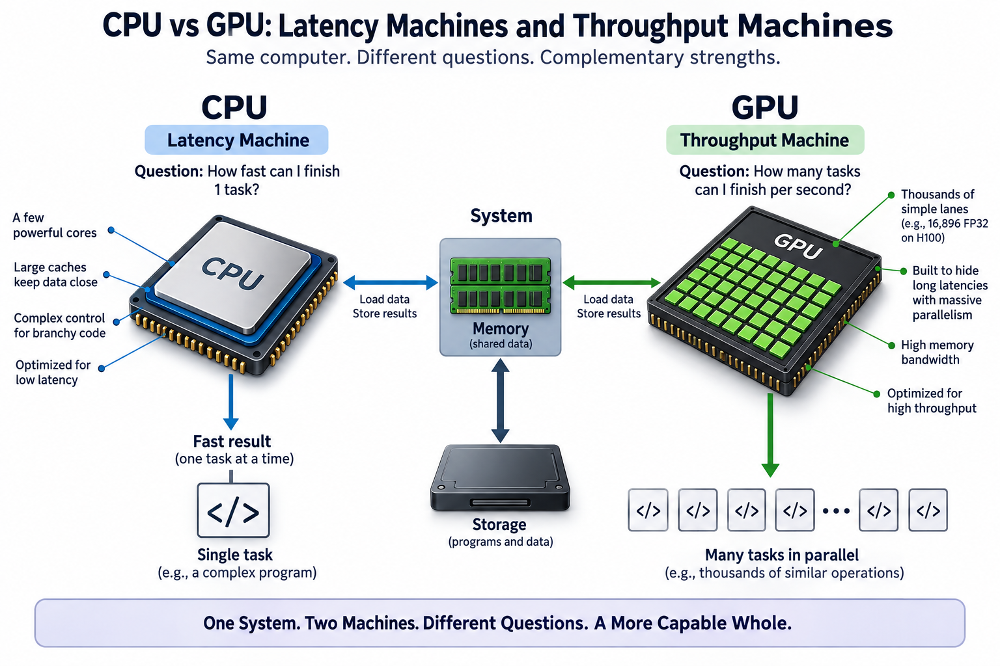
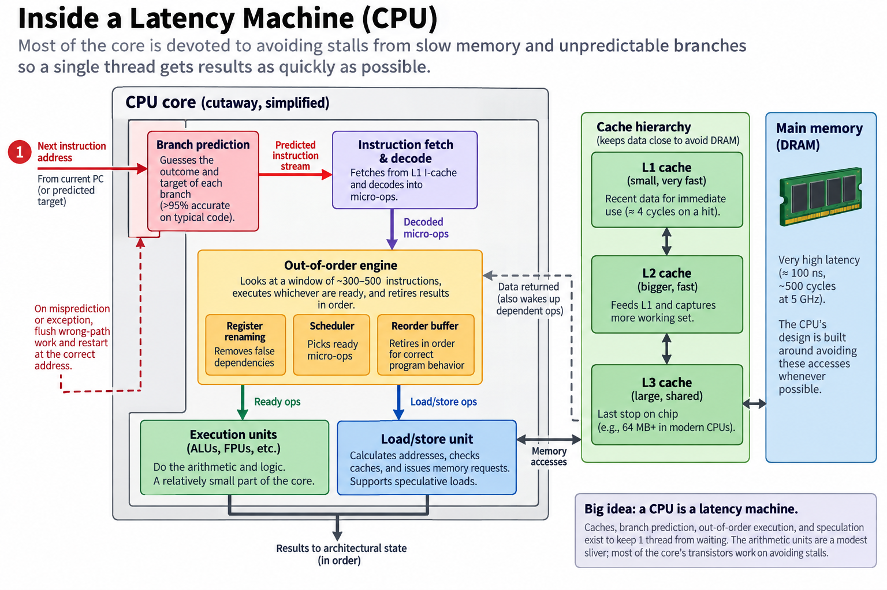
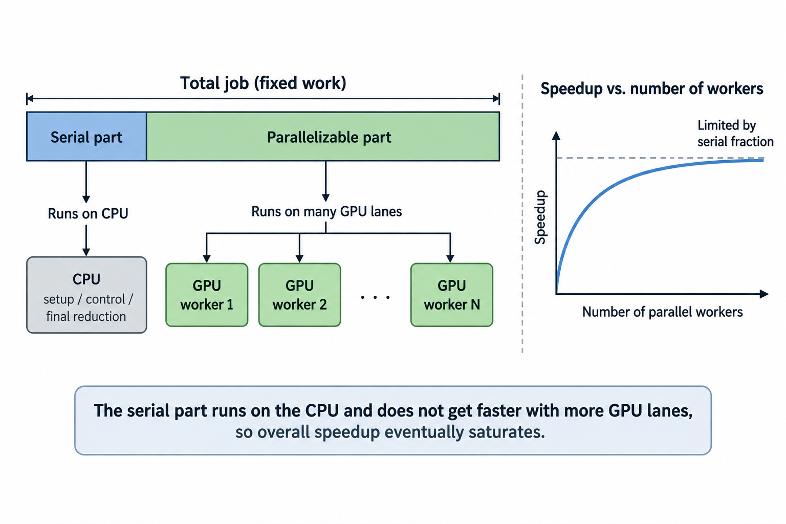
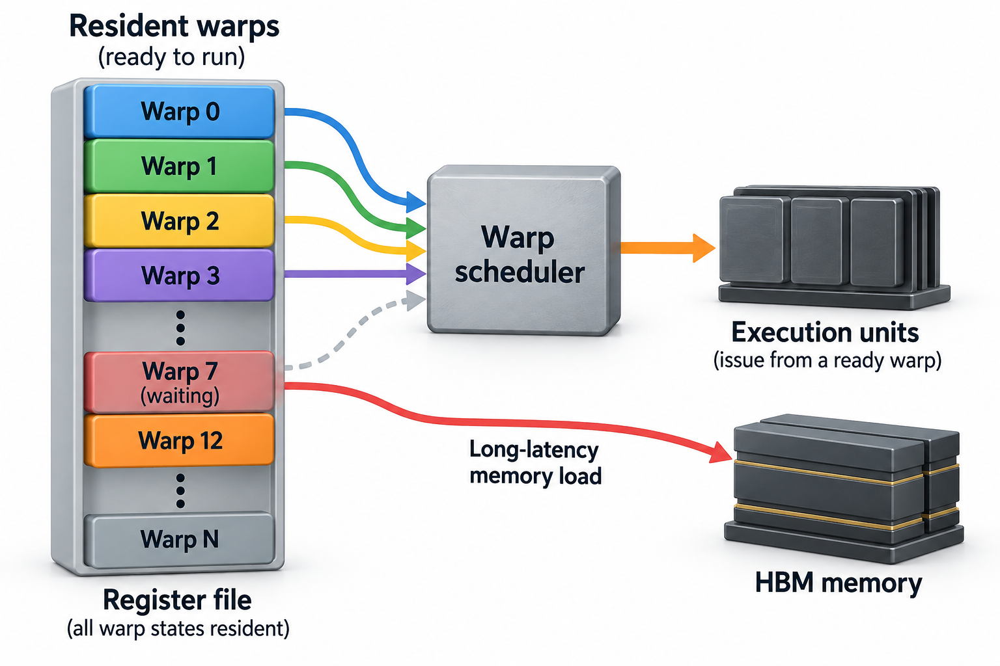

## Overview



An NVIDIA H100 has 16,896 FP32 lanes. AMD's flagship desktop CPU has 16 cores. That is a ratio of roughly 1,000 to 1. And yet the CPU will finish plenty of real programs first. Neither chip is "better." They are answers to 2 different questions. Once you see the questions clearly, almost everything about modern hardware design falls into place.

The CPU's question: *how fast can I finish 1 task?* The GPU's question: *how many tasks can I finish per second?* The first is a latency problem, the second a throughput problem. They pull silicon design in opposite directions.

## Deep dive

### The latency machine



A CPU is built around an uncomfortable fact: main memory is slow. A load from DRAM takes on the order of 100 nanoseconds. At 5 GHz, that is roughly 500 clock cycles of potential idleness for a single miss. Programs also branch every 5 or 6 instructions on average. Each branch threatens to stall the pipeline while the machine figures out where to go next.

So the CPU spends most of its transistor budget not on arithmetic but on *avoiding waiting*:

- **Caches.** Small, fast memories (L1, L2, L3) that keep recently used data close. A hit in L1 costs about 4 cycles instead of 500. Desktop CPUs now carry 64 MB or more of L3. AMD's 3D V-Cache parts stack past 96 MB.
- **Branch prediction.** Dedicated hardware that guesses the outcome of each branch before it is computed, with accuracy above 95% on typical code. The pipeline therefore almost never has to pause at an `if`.
- **Out-of-order execution (OoO).** The core scans a window of upcoming instructions, 300 to 500 of them in current designs, and executes whichever ones have their inputs ready, regardless of program order. It then retires the results in order, so the program can't tell the difference.
- **Speculation.** The machine executes past predicted branches and even past loads it isn't sure about, throwing work away when a guess turns out wrong.

All of this exists to serve 1 thread. If you covered an annotated die photo of a modern high-performance core, the actual arithmetic units would be a modest sliver. The predictors, schedulers, load/store machinery, and cache hierarchy dominate. That imbalance is deliberate. For a single dependent chain of instructions, the only thing that matters is time-to-result. And time-to-result is mostly determined by how rarely you stall.

### The throughput machine

A GPU makes the opposite bet. Its native workload consists of huge numbers of near-identical, mostly independent operations: originally shading millions of pixels, now multiplying enormous matrices. When work is abundant and independent, *stalling doesn't matter as long as something else is ready to run.* So the GPU rips out nearly everything the CPU added.

An H100 streaming multiprocessor (SM) has no out-of-order window worth the name, no branch predictor in the CPU sense, and small caches. In exchange, the chip carries 132 SMs, each with 128 FP32 lanes, for 16,896 lanes total. They clock lower than a CPU, around 1.8 GHz versus 5+ GHz, and execute in lockstep groups of 32 threads called **warps**. NVIDIA's peak spec for the SXM part is 67 teraFLOPS of FP32. That is a vendor-reported peak, achievable only when every lane has work every cycle, but a fair statement of what the silicon can do.


The famous first figure of the CUDA Programming Guide makes the point in 1 glance: same silicon budget, opposite allocation. The CPU buys *low latency for 1 thread*. The GPU buys *arithmetic density* and accepts that any individual thread will run slowly and stall often.

Slowly and stall often. That sounds bad. The trick is what the GPU does about it.

### Worked example: the 1% that eats your speedup



Before looking at how the GPU stays busy, it's worth asking how much parallel hardware can help *at all*. Gene Amdahl answered this in 1967 with an argument you can do on a napkin.

Say a job takes **100 seconds** on 1 core. 99 of those seconds are perfectly parallelizable, while 1 second is inherently serial: setup, a reduction at the end, a lock-protected update. Run it on N lanes:

```
T(N) = 1 + 99/N   seconds
```

Now follow the numbers by hand:

| Lanes N | Parallel part | Total time | Speedup |
|---:|---:|---:|---:|
| 1 | 99.0 s | 100.0 s | 1.0x |
| 9 | 11.0 s | 12.0 s | 8.3x |
| 99 | 1.0 s | 2.0 s | 50x |
| 999 | 0.099 s | 1.099 s | 91x |
| 9,999 | 0.0099 s | 1.0099 s | 99x |
| infinite | 0 s | 1.0 s | **100x** |

With 99 lanes you get 50x, not 99x: the serial second is already half your runtime. Going from 999 lanes to 9,999 is a 10x increase in hardware, and it buys you the difference between 91x and 99x. The general formula below shows the ceiling: speedup saturates at the reciprocal of the serial fraction. A 1% serial fraction caps you at 100x forever, no matter how many billions of transistors you throw at the parallel part.


This single curve explains the shape of the industry. It is why GPUs don't bother making individual threads fast, since the serial fraction runs on the CPU anyway, and why every serious system pairs a GPU with a strong host CPU to execute that 1% quickly. It is also why performance work is so often about shrinking `s`, by overlapping communication with compute and removing synchronization, rather than adding lanes.


Write the general fixed-work model explicitly. Let $$T_1$$ be baseline time, $$s$$ its inherently serial fraction, and $$N$$ equally capable parallel workers. With perfect load balance and no communication overhead,

$$
T_N=T_1\left(s+\frac{1-s}{N}\right),\qquad
S_N=\frac{T_1}{T_N}=\frac{1}{s+(1-s)/N}.
$$

For $$T_1=100$$ seconds, $$s=0.01$$, and $$N=99$$, the predicted time is 2 seconds and speedup is 50. Real systems add a workload-dependent overhead term $$H_N$$ for launches, communication, synchronization, and imbalance. Even 0.5 seconds of overhead lowers that example's speedup to 40.

This is the method behind the CPU/GPU division: speed up the parallel region and shorten or overlap its surrounding serial path. Compare full-job time before and after offload, including transfers, rather than comparing isolated arithmetic peaks. A faster kernel can lose overall when its launch and data movement exceed the saved compute time. Conversely, keeping data resident across several kernels amortizes those costs. The relevant threshold is useful parallel work per offload, not a universal lane-count ratio.

### Going deeper: how a GPU hides 500 cycles



Amdahl tells you how much parallelism helps. It doesn't tell you how the GPU survives memory latency with no OoO engine and barely any cache. The answer is **latency hiding through massive multithreading**, and the mechanism is worth knowing precisely.

Each SM keeps up to 64 warps (2,048 threads) *resident* simultaneously. Resident means their full register state lives permanently in the SM's register file for the duration of the kernel. Every cycle, the warp scheduler picks among resident warps that are ready and issues from one of them. When warp 7 issues a load and must wait several 100 cycles for HBM, the scheduler simply issues from warp 12 next cycle. Nothing is saved or restored. The context switch costs 0 cycles because every context is already in hardware.


This is why GPU register files are enormous. Each H100 SM carries 256 KB of registers. Across 132 SMs that is about 33 MB of *registers*, more capacity than most desktop CPUs' entire L3 cache. The GPU replaces the CPU's "keep data close so 1 thread never waits" strategy with "keep so many threads in flight that waiting is free." A CPU hides latency with speculation inside 1 thread. A GPU hides it with concurrency across thousands.

The scheme has a knob and a failure mode. The knob is **occupancy**, meaning how many warps are actually resident. That is limited by how many registers and how much shared memory each thread demands. A kernel whose threads each need 200 registers can keep far fewer warps resident, leaving the scheduler with too few candidates to cover memory latency. The failure mode is **divergence**. Threads in a warp share 1 instruction stream, so if half a warp takes the `if` branch and half takes the `else`, the hardware runs both paths serially with lanes masked off. Your 32 lanes then deliver the throughput of 16 or worse. Branchy, pointer-chasing, dependency-heavy code is exactly where the latency machine's branch predictor and OoO window earn their area back.

So when does each win? The CPU wins when the working set fits in cache, when control flow is irregular, when the dependency chain is long, or when there simply isn't enough parallel work to fill 16,896 lanes. Kernel launch can cost microseconds, which is material for very small tasks. The GPU wins when you have tens of thousands of independent work items and arithmetic or bandwidth is the bottleneck: dense linear algebra, image pipelines, transformer training. Real systems use both, in the roles Amdahl assigned: CPU for the serial 1%, GPU for the parallel 99%.

### Common misconceptions

**"A CUDA core is like a CPU core, just smaller."** A CUDA "core" is a single FP32 arithmetic lane, roughly comparable to 1 lane of a CPU's vector unit. The honest structural analogy is SM ≈ CPU core: both fetch instructions, schedule them, and drive wide SIMD lanes. On that count the comparison is 132 SMs versus 16 cores, about 8x rather than 1,000x. Each SM is far simpler and slower per thread. The 1,000x framing compares lanes to cores and mostly generates confusion.

**"GPUs are faster than CPUs."** Faster at what? Take 1 thread executing a dependent chain and the CPU wins enormously. It has 3x the clock rate, out-of-order execution finding parallelism the programmer never expressed, and caches serving loads in 4 cycles. A single GPU thread is a slow, in-order machine that frequently waits its turn behind 63 other warps. GPUs deliver more *aggregate* arithmetic. An individual dependent thread often has lower performance than on a high-performance CPU core. If your workload is 1 thread, the GPU is the slower chip.

**"Amdahl's law makes massive parallelism pointless."** The 100x ceiling assumes the problem size stays fixed while lanes grow. In practice, people with 10,000 lanes don't run 1985-sized problems on them. They scale the work to the machine. John Gustafson's 1988 reformulation makes this precise: if the parallel portion grows with the machine while the serial portion stays roughly constant, effective speedup grows nearly linearly with N. Training runs illustrate this. Nobody trains a 1990s-sized network on 10,000 GPUs; they train models 10,000 GPUs make possible. Amdahl caps fixed problems, not scaled ones.

### The bigger picture

This split is 1 instance of a theme that runs through the whole series. Hardware performance now comes from *specializing the machine to the shape of the work*, because the free lunch of faster general-purpose cores ended when Dennard scaling died. Hennessy and Patterson's Turing Lecture calls the resulting era a new golden age for architecture. The CPU/GPU pair is its first and largest fossil record: 2 mature answers, coexisting because neither question went away.

If you want the latency machine's internals in detail (pipelines, hazards, and why branch prediction exists at all), that story is in [What a CPU Actually Does](/blog/what-a-cpu-actually-does/). The throughput machine's economics show up everywhere in ML infrastructure. The gap between peak FLOPS and delivered work is the subject of [Goodput vs Utilization](/blog/goodput-vs-utilization/), and the reason bandwidth (not lane count) is usually the binding constraint is worked through in [Blackwell to Rubin memory math](/blog/blackwell-to-rubin-memory-math/). And if this trade-off space looks like a career, it is 1: it's roughly the job description in [What Does an ML Performance Engineer Do?](/blog/what-does-an-ml-performance-engineer-do/)

The next stop in this series pushes specialization one step further: if lockstep lanes beat general cores for parallel work, what beats lockstep lanes for *1 specific computation*? That is the systolic array, the design at the heart of Google's TPU.

## Conclusion

- CPUs and GPUs answer different questions: the CPU minimizes the latency of 1 task using caches, branch prediction, and out-of-order execution. The GPU maximizes aggregate throughput by filling the die with simple lanes and keeping thousands of threads resident to hide stalls.
- Amdahl's law is the hard budget on parallel speedup: with a 1% serial fraction, 99 lanes give 50x and infinite lanes give only 100x. That is why every GPU system still needs a fast host CPU for the serial part.
- The GPU's core mechanism is 0-cost warp switching out of a giant register file (about 33 MB on an H100, larger than most desktop L3 caches). It fails on branchy, divergent, low-parallelism code, which is exactly where the CPU's machinery earns its area.

### Sources

- J. Hennessy and D. Patterson, "A New Golden Age for Computer Architecture," Communications of the ACM, 2019. https://cacm.acm.org/research/a-new-golden-age-for-computer-architecture/
- NVIDIA, CUDA C++ Programming Guide (design-philosophy chapter and Fig. 1). https://docs.nvidia.com/cuda/cuda-c-programming-guide/
- G. M. Amdahl, "Validity of the Single Processor Approach to Achieving Large Scale Computing Capabilities," AFIPS Spring Joint Computer Conference, 1967.
- J. L. Gustafson, "Reevaluation of Amdahl's Law," Communications of the ACM, 1988.
- M. J. Flynn, "Some Computer Organizations and Their Effectiveness," IEEE Transactions on Computers, 1972.
- S. Hooker, "The Hardware Lottery," 2020. https://arxiv.org/abs/2009.06489

*Part of the [Computer Architecture & ASIC](/series/comp-arch/) learning path. Browse its published articles by topic.*
