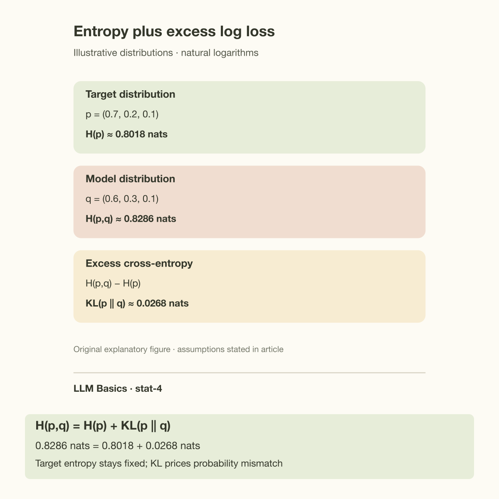
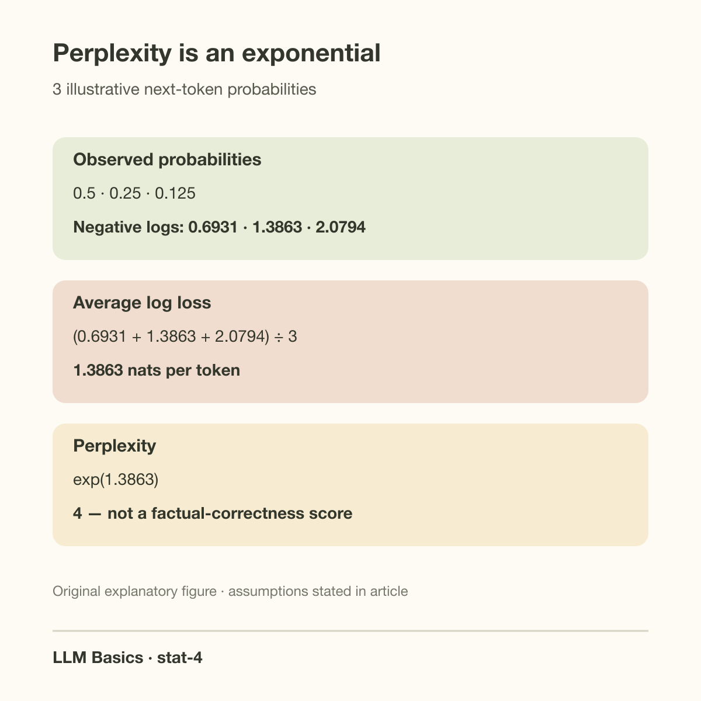
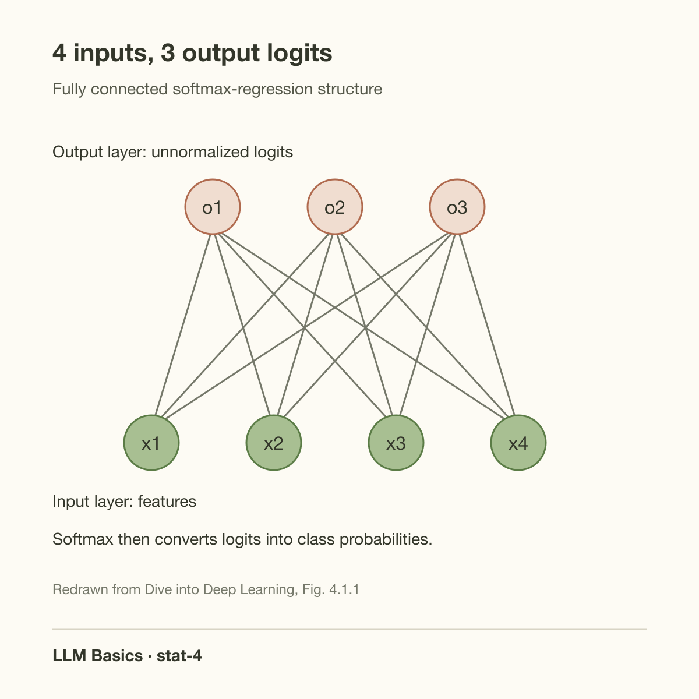

Assigning the observed token probability 0.8 produces a much smaller training penalty than assigning it 0.01. That penalty is negative log probability: approximately 0.223 versus 4.605 using natural logarithms. A language model receives this signal repeatedly across its training tokens. The loss tells it to allocate more probability to observed continuations under the supplied prefixes.

Cross-entropy explains this objective, and KL divergence explains how it relates to matching distributions. The names sound more complicated than the underlying idea: score a predicted distribution by how much log probability it gives to outcomes from another distribution. We will derive the relationship, calculate an example, and identify what low loss does and does not demonstrate.

## Start with the observed-label likelihood

Let x denote an input and y its observed label among K possible classes. A model with parameters theta assigns probabilities q_theta(k given x), each nonnegative and summing to 1. For 1 labeled observation, its likelihood contribution is q_theta(y given x). Maximizing that probability is equivalent to minimizing its negative logarithm.

For n observations treated as conditionally independent under the model, the likelihood is the product of their observed-label probabilities. Taking the logarithm converts that product into a sum. The mean negative log-likelihood is:

$$
\mathcal{L}(\theta)=-\frac1n\sum_{i=1}^{n}\log q_\theta(y_i\mid x_i).
$$

The logarithm here is natural, so the units are nats per observation. Using base 2 instead would give bits and multiply the numerical value by a constant. It would not change the maximizing parameter for the same unregularized objective, although learning-rate and regularization conventions would need consistent scaling.

This is the likelihood logic derived in [MLE](/blog/maximum-likelihood-estimation/). Choosing log loss is connected to a categorical data model, not just convention. Optimization then tries to minimize the resulting function. A theoretically appropriate objective does not guarantee that a finite training run finds its global minimum.

## 1-hot labels make the cross-entropy visible

Represent the observed label y by a 1-hot vector p: its y entry equals 1 and all other entries equal 0. The per-observation loss becomes negative the sum of p_k times log q_k across classes. Only the observed class contributes, so this expression equals negative log q_y.

For a general target distribution p over the same K outcomes, cross-entropy is:

$$
H(p,q)=-\sum_{k=1}^{K}p_k\log q_k.
$$

The first argument supplies the outcomes' weighting; the second supplies the predicted probabilities being scored. Cross-entropy is not generally symmetric. Swapping p and q changes which distribution generates outcomes and which one is evaluated.

A 1-hot label is 1 observed outcome, not proof that the true conditional distribution assigns probability 1 to that class. If an input can legitimately have several outcomes, repeated data or soft targets can represent that uncertainty. Treating the one-hot sample as the true population distribution confuses an observation with the underlying process.

Soft targets appear in label smoothing or distillation. The same formula applies, but the target has changed. Be explicit about that change: a smoothed-label objective is not numerically identical to the ordinary observed-label negative log-likelihood. Distillation also involves choices about temperature and teacher distributions that this introductory derivation does not cover.

## Work a 3-outcome example

Suppose the target distribution is p equal to (0.7, 0.2, 0.1), and a model predicts q equal to (0.6, 0.3, 0.1). The cross-entropy is negative 0.7 log 0.6 minus 0.2 log 0.3 minus 0.1 log 0.1, approximately 0.8286 nats.

The target's own entropy is:

$$
H(p)=-\sum_k p_k\log p_k.
$$

For this p, entropy is approximately 0.8018 nats. Even predicting the true distribution perfectly does not make expected log loss 0 because the process itself is uncertain. Outcomes from the target are not always its most probable label.

If q matches p, the cross-entropy equals H(p). If q shifts mass away from outcomes that p produces, cross-entropy increases. The difference in our example is approximately 0.0268 nats. That excess is the KL divergence from p to q.

*Original analytical example. Distributions and values are illustrative and calculated with natural logarithms.*

## Derive entropy plus KL divergence

For discrete distributions, KL divergence from p to q is:

$$
D_{\mathrm{KL}}(p\Vert q)=\sum_k p_k\log\frac{p_k}{q_k}.
$$

Expand the logarithm of the ratio into log p_k minus log q_k. The sum of p_k log p_k equals negative H(p), and negative the sum of p_k log q_k equals H(p,q). Rearranging gives:

$$
H(p,q)=H(p)+D_{\mathrm{KL}}(p\Vert q).
$$

When p is fixed, its entropy does not depend on the model parameters. Minimizing expected cross-entropy therefore minimizes KL divergence to p under this orientation. KL is nonnegative and vanishes when the distributions match, subject to the usual support conditions. This makes log loss a proper scoring rule: in expectation, the target distribution itself achieves the minimum.

The decomposition does not say that we know p exactly. Training usually supplies samples from an unknown data process, so empirical negative log-likelihood estimates an expected objective. Finite samples, distribution shift, and model restrictions can prevent the fitted q from matching the relevant population distribution.

Support matters. If p assigns positive mass to an outcome and q assigns exactly 0, its cross-entropy and KL contribution are infinite. We conventionally interpret 0 times log 0 as 0 for a target outcome with 0 mass. A model can avoid mathematical zeros through softmax, but finite-precision underflow still requires numerically stable computation.

KL is also not a distance metric: it is asymmetric and does not satisfy the triangle inequality in general. Calling it a “distribution distance” informally can be useful, but do not import geometric properties it does not have. Its direction identifies which mistakes receive high weight.

## Going deeper: logits and stable gradients

A neural classifier commonly produces real-valued logits z_k and transforms them with softmax. The predicted probability q_k equals exp(z_k) divided by the sum of all exp(z_j). Logits are scores, not normalized probabilities. Adding the same constant to every logit leaves the distribution unchanged.

For 1-hot class y, substituting softmax into negative log q_y gives a stable objective expressed as log-sum-exp minus the observed-class logit:

$$
\ell=\log\left(\sum_j e^{z_j}\right)-z_y.
$$

Compute log-sum-exp by subtracting the maximum logit m before exponentiating and then adding m back. This avoids unnecessarily exponentiating huge positive numbers. Framework cross-entropy functions commonly accept logits and implement a stable combined operation; passing an already normalized vector to a logits-based function changes the intended calculation.

Differentiating with respect to each logit gives:

$$
\frac{\partial\ell}{\partial z_k}=q_k-p_k.
$$

For a correct class predicted with probability 0.2, the derivative for its logit is minus 0.8. Gradient descent increases that logit relative to the others. An incorrect class assigned probability 0.6 has derivative plus 0.6, pushing its score downward. The compact gradient connects probability mismatch to the backpropagation signal.

The derivation assumes the target p is fixed with respect to these logits. Training may also include masks, example weights, smoothing, or auxiliary objectives. Define those before comparing reported losses. A summed loss and an averaged loss produce different gradient scales, even if they have the same minimizer when used alone.

Stable evaluation has a directly checkable implementation rule. With maximum logit m, the 1-hot loss is

$$
\ell=m+\log\sum_j\exp(z_j-m)-z_y.
$$

For logits (1000,1001,999) and observed class 2, subtracting m equal to 1001 gives exponent inputs (-1,0,-2). Loss is log(1+exp(-1)+exp(-2)), approximately 0.4076 nats, and the observed-class probability is about 0.6652. Naively exponentiating 1001 can overflow even though the final probability is ordinary. A fused logits-based loss fixes numerical evaluation of the same objective; it does not change the target distribution or add a new learning principle.

Check an implementation using both the loss and its gradients on a small reference case before enabling lower precision. Preserve masks and reduction conventions when comparing optimized paths. Label smoothing intentionally changes p, so a different loss after smoothing cannot be credited solely to a faster or more stable kernel. Separate objective changes from implementation changes in the experiment.

## Apply the objective to next-token prediction

Let x_1 through x_T be a token sequence. The chain rule factorizes its probability into conditional next-token probabilities. Taking negative logarithms converts the sequence product into a sum of per-token log losses:

$$
-\log q_\theta(x_1,\ldots,x_T)
=-\sum_{t=1}^{T}\log q_\theta(x_t\mid x_{<t}).
$$

The notation x_{<t} means the prefix before position t. Training supplies that observed prefix, often described as teacher forcing. At generation time, the model may instead receive tokens selected from its own earlier predictions. That difference helps explain why a low training objective alone does not guarantee every generated sequence behaves well.

Padding and excluded tokens should not contribute to the numerator or denominator of a reported mean loss. Some instruction-tuning setups mask prompt positions and train only on assistant outputs. 2 runs can report different “loss per token” values because their masks or normalization differ, not because 1 predicts the same evaluated tokens better.

Tokenization also changes the unit. A tokenizer that splits text into more tokens can change average nats per token and perplexity. Compare perplexity only under compatible tokenization, datasets, masks, and evaluation procedures. It is not a universal model-quality scale across arbitrary vocabularies.

## Perplexity is an exponential summary

For mean token negative log-likelihood L measured with natural logs, perplexity is exp(L). Suppose the observed next-token probabilities across 3 positions are 0.5, 0.25, and 0.125. Their negative log probabilities are approximately 0.6931, 1.3863, and 2.0794. The mean is 1.3863 and perplexity is 4.

This equals the inverse geometric mean of the observed-token probabilities. It does not mean the model literally considers exactly 4 words equally likely at every position. A uniform distribution across 4 outcomes has perplexity 4, but nonuniform distributions and changing contexts can produce the same summary.

Perplexity is useful for evaluating modeled text likelihood under a fixed setup. It does not directly measure factual correctness, reasoning success, user satisfaction, or safety. A model can assign high probability to familiar but false text. Use task evaluations and evidence checks for those separate claims.

*Original worked-example figure. Values follow directly from the probabilities stated in this article.*

## Interpret changes in loss carefully

A small improvement in average log loss can be meaningful over many tokens. Because likelihood multiplies probabilities, tiny average differences compound across long sequences. Yet average improvement can also hide regressions on rare formats, domains, or long contexts. Report subgroup metrics where the application depends on them.

Validation loss estimates performance on a chosen held-out distribution. If evaluation text overlaps training text, or if preprocessing leaks information, the estimate can be optimistic. If deployment inputs differ materially from the validation corpus, a well-estimated validation loss can still describe the wrong population. This is a generalization issue, developed in [regularization and generalization](/blog/generalization-and-regularization/).

Calibration is another distinct question. A probabilistic classifier is calibrated when outcomes occur at frequencies matching its predicted probabilities under an appropriate evaluation. Log loss encourages useful probabilities in expectation, but limited data, optimization, model misspecification, and distribution shift can leave a fitted model miscalibrated. Do not use a low objective value as a substitute for measuring calibration.

Normalization also determines whose mistakes receive more weight. Averaging the loss across all unmasked tokens gives a long sequence more total influence than a short sequence when they are pooled together. Averaging each sequence first and then averaging sequences gives every sequence equal weight instead. Neither convention is inherently the same objective, and neither should be hidden behind the phrase average loss. Choose the unit that matches the training design and disclose it when comparing results.

For example, a short sequence with 10 evaluated tokens and a long sequence with 90 evaluated tokens contribute 1 tenth and 9 tenths of a pooled token average. In an equal sequence average they each contribute 0.5. If the long sequence comes from a domain the application rarely uses, that weighting difference can change which improvement appears most valuable. Keep masks, sample weights, and corpus mixture fixed in an objective comparison, or explicitly describe the intentional change.

*Redrawn from [Dive into Deep Learning, Fig. 4.1.1](https://d2l.ai/chapter_linear-classification/softmax-regression.html#fig-softmaxreg). The diagram shows the source's fully connected structure; softmax normalization follows the logits.*

## Common misconceptions

“Cross-entropy should become zero.” It can approach 0 for deterministic 1-hot training labels that the model fits, but expected loss for an uncertain target is bounded below by that target's entropy. Our example has minimum expected loss around 0.8018 nats.

“KL divergence is symmetric.” Reversing the arguments changes the weighting and can produce a different finite value or support problem. State the direction whenever using KL as an objective.

“Low perplexity means the answer is true.” It measures assigned probability to evaluated tokens under a specified setup. Truth and task correctness need separate evaluation.

## Takeaway

- Observed-label negative log-likelihood is 1-hot cross-entropy; soft targets define a different weighting.
- Expected cross-entropy equals target entropy plus KL divergence from target to model.
- Stable logits-based computation, normalization, tokenization, and evaluation population all matter when interpreting the loss.

Continue from [MLE](/blog/maximum-likelihood-estimation/) and [MAP](/blog/map-estimation-and-priors/) to [generalization](/blog/generalization-and-regularization/) and then [pretraining and adaptation](/blog/pretraining-finetuning-rlhf/).

## Sources

- [Dive into Deep Learning: Softmax Regression](https://d2l.ai/chapter_linear-classification/softmax-regression.html), cross-entropy, information theory, and softmax gradients.
- [Dive into Deep Learning: Language Models](https://d2l.ai/chapter_recurrent-neural-networks/language-model.html), autoregressive likelihood and perplexity.
- [PyTorch CrossEntropyLoss documentation](https://docs.pytorch.org/docs/stable/generated/torch.nn.CrossEntropyLoss.html), logits, target forms, masking, and reduction conventions.
