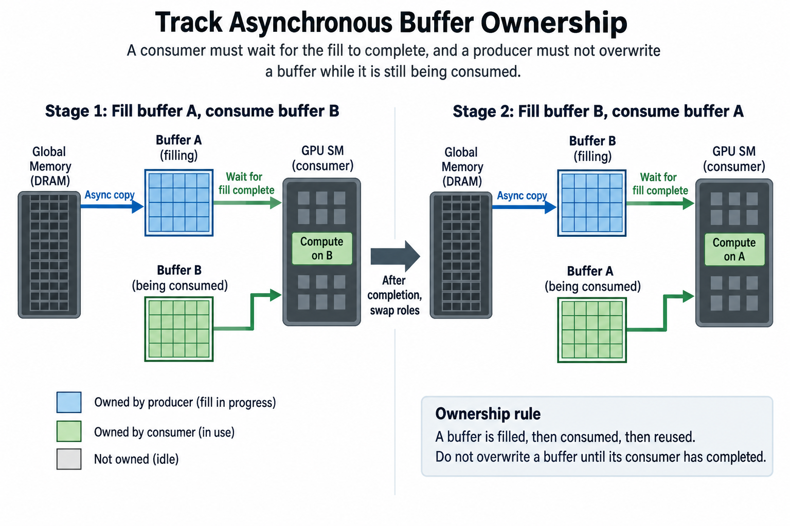
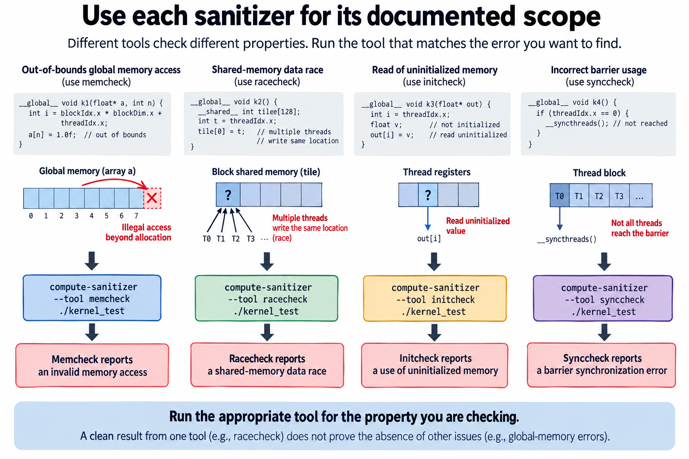

## Overview


A GPU kernel can produce plausible output while reading invalid memory, racing on a shared buffer, or breaking a synchronization rule that happens not to fail on the tested input: the numbers match the reference, the test goes green, and nothing in that result says the addresses were in range or that 2 threads never wrote the same slot at once. Numerical comparison is necessary evidence. It is not a memory and concurrency analysis.

Split correctness into 5 parts, namely address validity, ownership, synchronization, initialization, and numerical behavior, because each part carries its own invariants and its own tests, and Compute Sanitizer ships a separate tool for several of them. Using those tools well means knowing what each one checks and what it leaves unproven.

The method below is built around common kernel failures and a small shared-buffer example. This article describes diagnostic procedures rather than reporting executed GPU tests: run the hardware-dependent examples on a supported CUDA system, and read the current tool documentation for what each check can actually do.

## Deep dive

### 1. Define the claimed interface and supported inputs

Write down what the kernel really promises: shapes, strides, dtypes, pointer relationships, alignment assumptions, launch geometry, and the stream dependencies it allows. A kernel written for 1 contiguous layout does not automatically support every view with the same logical shape. A kernel built on aligned vector loads needs that alignment contract preserved by its caller.

Specify the 3 awkward cases as well: empty dimensions, partial tiles, and indices large enough to leave the range the arithmetic can hold. Say what the host wrapper does with each one, whether it rejects the call or takes another path. Silent execution outside the claimed contract makes failures hard to interpret.

Keep aliasing explicit. If the output buffer overlaps the input, 1 thread can overwrite a value another thread still needs. Some operations do support selected in-place forms, but that property has to follow from the dependency analysis rather than from the shape of the mathematical expression.

Use a reference that computes the same operation with the same ownership semantics. A reference with different masking, reduction, or layout can make a correct kernel look wrong, or an incorrect kernel look acceptable.

### 2. Prove physical address validity


For an allocation containing A elements and an access offset o, a basic requirement is

$$
0\le o<A.
$$

The offset comes from the real storage strides and base location rather than the logical dimensions: a matrix subview can live inside a row stride larger than its own column count, and padding can leave physical positions allocated but outside the logical operation. A bounds proof needs the 2 numbers the allocation has. One is its element count, the other the offset each thread computes.

Index arithmetic must fit its type before the bounds check, because a narrow multiplication can overflow and wrap to a small offset near 0 that passes every check you wrote. Cast to a supported wide type at the right stage, and keep the allocation and launch limits in the interface.

A mask should guard every access that could be invalid. Masking the stores while leaving out-of-range loads unguarded is not enough. For shared staging, the invalid logical lanes can write a neutral value, usually 0, into their allocated shared slots. Every consumer then sees initialized data.

Alignment is another invariant, and the operations that require it require it exactly. Both the relevant pointer and the offset have to satisfy the supported alignment rule. A tensor shape divisible by the vector width says nothing about whether its base pointer or its view offset is aligned.

### 3. Separate coverage from absence of invalid accesses

A kernel can stay in bounds and still omit outputs, or write the same output more than once. Prove that the ownership mapping covers the required population and gives each ordinary output a single writer, or a supported reduction mechanism instead.

For one-dimensional tiles of width D, index i equals the block index times D plus the local thread index, and adjacent tiles then hold disjoint intervals. A tail predicate restricts writes to i below N. That leaves every produced output with exactly 1 writer under the stated launch.

Test with recognizable output patterns that reveal missing writes. Uniform zeros can hide an unwritten output if the allocation happened to contain 0 already, so initialize outputs with a sentinel where the test method permits it, then compare every required result.

For scatter or reduction, duplicate destinations can be intentional, and the implementation then needs a supported combining and ordering mechanism. A many-to-one mathematical reduction does not authorize unsynchronized ordinary writes to the same location.

### 4. Analyze conflicting operations through ordering

Two accesses to the same location can conflict when at least one writes and their execution lacks the required ordering. A conceptual race condition is

$$
\operatorname{sameLocation}(a,b)\land\operatorname{hasWrite}(a,b)\land\neg(a\prec b\lor b\prec a).
$$

The relation denotes the supported ordering relevant to the memory operations. Different memory spaces and synchronization mechanisms have specific scopes, and a block barrier cannot order arbitrary work in another block. The CUDA Programming Guide is where the scope of a given operation is written down.

Draw the producer and consumer events for shared tiles, queues, and reused buffers, then identify which supported operation actually transfers ownership. A flag becoming visible is not proof that every associated payload is visible too, unless the protocol's memory-ordering contract says so.

Atomics make particular operations indivisible under their supported semantics. They do not turn every surrounding non-atomic access into a safe protocol, and publication and reclamation still need the right order and scope.

### 5. Match block-barrier participation


A block-wide synchronization operation requires supported participation and control flow, so returning some threads before a barrier that the remaining threads still execute can invalidate the program. Tail handling is where this mistake usually appears.

Instead of letting the invalid global lanes return before shared staging, keep the required participants alive through the barrier. They can write neutral values into their allocated shared slots and skip only the final global stores. The exact structure depends on the algorithm.

A simplified staging sequence is

```cpp
float value = global_index < n ? input[global_index] : 0.0f;
shared[threadIdx.x] = value;
__syncthreads();
// Supported consumers now use the initialized shared tile.
```

This fragment assumes allocated shared slots for all local threads and omits the consuming algorithm. Read it as a participation and initialization pattern, not a complete reduction kernel.

A conditional barrier is valid only under the operation's documented control-flow requirements, so do not infer safety from 1 tested schedule. Warp-level synchronization carries its own participant-mask rules and is no substitute for a block dependency that crosses several warps.

A loop that reuses the same shared tile usually needs a second dependency after consumption: the first barrier establishes that filling is complete before readers begin, but it does not establish that every reader has finished before a fast thread starts filling the next tile, so the algorithm needs a consume-to-reuse boundary as well as a fill-to-consume boundary. A single iteration never exercises that transition, which is why repeated-tile tests matter. Place synchronization according to the actual readers and writers instead of inserting a barrier mechanically.

### 6. Track asynchronous buffer ownership



Asynchronous copies and device instructions separate issuing work from completing it. A consumer has to wait through the supported completion mechanism before it reads a produced tile, and a producer must not overwrite a buffer while a consumer is still using it.

Double buffering introduces at least 2 logical states, a buffer being filled and a buffer being consumed, and the next iteration swaps their roles only after the required events. Barrier counts, phases, and ownership transitions all have to match the actual transfer and consumer population.

The invariant can be stated as

$$
\operatorname{fillComplete}(b)\prec\operatorname{consume}(b)\prec\operatorname{reuse}(b).
$$

This expresses a required dependency, not a particular API. CUDA's supported asynchronous mechanisms define how the events are implemented for the target architecture.

A diagnostic global synchronization can make a race disappear by serializing the work. That observation helps locate the ordering problem, but it is not the asynchronous repair: restore the intended concurrency once the correct ownership boundary is in place, then test again.

### 7. Use each sanitizer for its documented scope



Memcheck detects supported memory-access and related errors. Racecheck targets supported data-access hazards, in particular the shared-memory hazards its documentation describes, while Initcheck and Synccheck cover their own documented initialization and synchronization checks.

Run the tool that matches the property you care about instead of assuming one mode covers all of them: a clean shared-memory Racecheck result is not a universal proof that every global-memory protocol is race-free.

Typical invocations select a tool around the test executable:

```text
compute-sanitizer --tool memcheck ./kernel_test
compute-sanitizer --tool racecheck ./kernel_test
compute-sanitizer --tool initcheck ./kernel_test
compute-sanitizer --tool synccheck ./kernel_test
```

Use current options for error reporting, exit behavior, filtering, and source attribution. Preserve the first useful report together with its input, its launch configuration, and the software versions. Instrumented execution changes timing, so the absence of a reported race on 1 run does not establish correctness for every uninstrumented schedule.

An initialization failure needs a population-aware reading as well, because a buffer can be allocated legally and still hold no valid produced value at a location the consumer reads, which makes the real question whether every required field and tile slot has a producer on every supported branch. Tail lanes, zero-count destinations, and conditionally populated metadata are the usual places to look, and Initcheck points at the read rather than at the missing producer. A convenient initial allocation pattern hides the whole problem during ordinary output comparison.

Keep the tool limitations visible in the test record, because detection support varies with memory space, operation, architecture, and version. The honest conclusion is evidence within the exercised scope, complemented by ownership analysis and other tests.

### 8. Distinguish numerical error from memory corruption

Floating-point reduction order and accumulator precision both change rounding, so a tiled sum can differ from a sequential reference while computing the same mathematical operation inside a valid numerical contract.

A common comparison condition is

$$
|y-y_{\mathrm{ref}}|\le\mathrm{atol}+\mathrm{rtol}|y_{\mathrm{ref}}|.
$$

Choose tolerances from the operation, the dtype, the scale, and the behavior the application actually requires. Relative error alone is a problem near a reference value of 0, and NaNs, infinities, and special-case semantics need explicit handling rather than an arbitrarily large tolerance to bury them.

For reductions, compare against a suitable higher-precision reference and test cancellation and large dynamic ranges. An error that grows with sequence length can be numerical, indexing-related, or both. Sanitizer evidence plus deterministic small cases is what separates those explanations.

Do not raise the tolerance until a failing test passes without explaining the difference first. A wrong stride or a missing contribution can produce plausibly small errors on 1 input and severe errors on another.

### 9. Build cases around invariants and transitions

Include aligned and partial tiles, small and large dimensions, supported strides, dtype variants, repeated buffer reuse, and the intended concurrency. Each case should exercise a claimed contract or a known risky transition.

For a shared reduction with 235 valid values equal to 1 in a 256-slot tile, the invalid slots must be initialized to the correct neutral value and the expected sum is 235, while dividing by 256 would be a separate statistical-denominator error if the operation claims a mean over valid elements. This example separates initialization, participation, and mathematical semantics in one controlled case.

Vary the outstanding depth and the buffer roles for asynchronous pipelines, because a bug can appear only when 1 buffer is reused while another stage is still active. Preserve the phase or sequence identifiers around the first failure.

Keep reference comparisons and sanitizer runs focused but complementary: exhaustive random testing cannot replace a proof of address bounds and ownership, while a proof built on an incorrect interface cannot replace testing the real wrapper.

### 10. Verify the production path after the repair

A debugging configuration can change code generation, launch geometry, and timing. Once the cause is fixed, exercise the supported production path with the same boundary and concurrency cases, and preserve both the numerical outcomes and the useful-work outcomes.

Measure performance only after correctness is established. A required barrier or visibility event belongs inside the valid execution budget, and removing it to recover a previous timing number changes what the program computes, not just how fast it computes it.

Record the invariant that failed, the causal evidence, the repair, and the verification scope. The resulting test should detect a recurrence of the mechanism rather than mirror incidental source structure.

## Conclusion

CUDA correctness joins mathematical semantics to valid memory and concurrency behavior: address proofs, unique ownership, supported barriers, initialization, and lifetime are what define the program, and reference outputs plus Compute Sanitizer then supply targeted evidence that the implemented path respects those contracts on the inputs you exercised.

### Sources

- [NVIDIA Compute Sanitizer guide](https://docs.nvidia.com/compute-sanitizer/ComputeSanitizer/).
- [Current CUDA Programming Guide](https://docs.nvidia.com/cuda/cuda-programming-guide/).
- [CUDA runtime API](https://docs.nvidia.com/cuda/cuda-runtime-api/).
