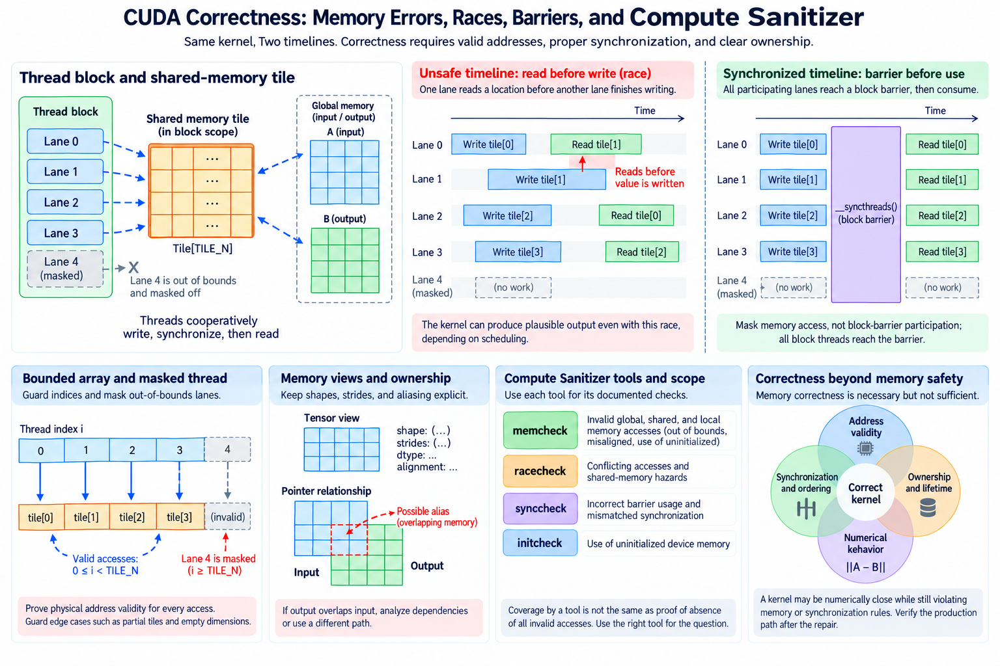
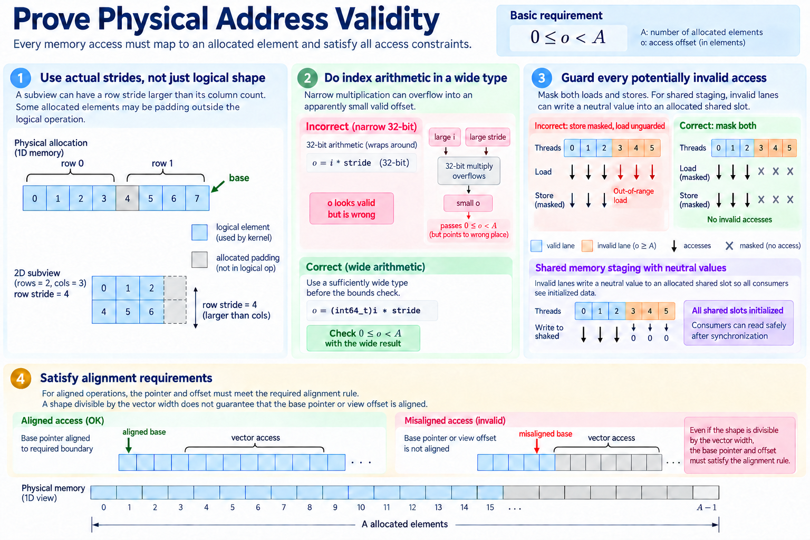
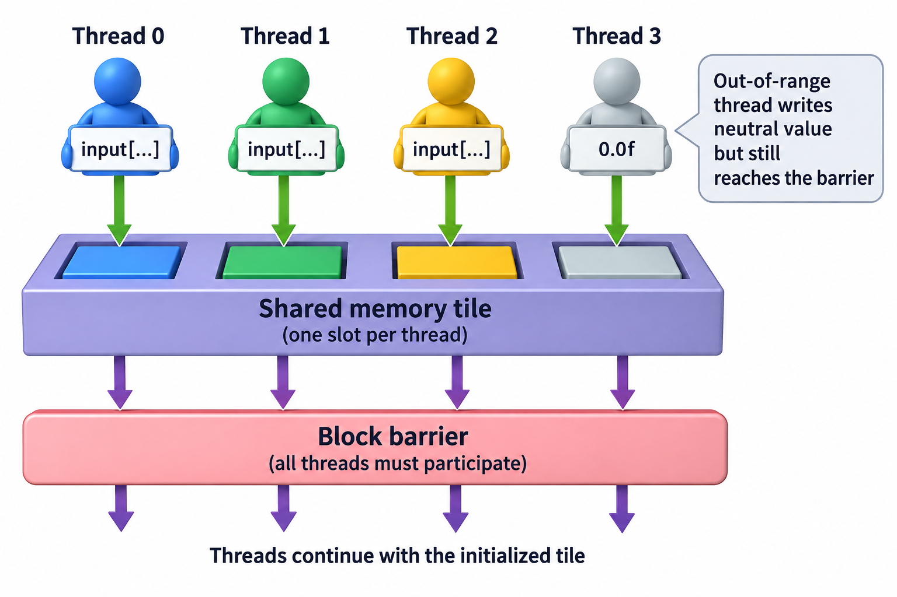

A GPU kernel can produce plausible output while reading invalid memory, racing on a shared buffer, or violating a synchronization rule that happens not to fail on the tested input. Numerical comparison is necessary evidence, but it is not a complete memory and concurrency analysis.

Correctness should be decomposed into address validity, ownership, synchronization, initialization, and numerical behavior. Each component has explicit invariants and appropriate tests. Compute Sanitizer provides complementary tools with documented scopes; using them well requires understanding what they check and what they do not establish.

We will build that method around common kernel failures and a small shared-buffer example. This article describes diagnostic procedures rather than reporting executed GPU tests. Hardware-dependent examples must be exercised on a supported CUDA system, and current tool documentation defines available capabilities.

## 1. Define the claimed interface and supported inputs



*Overview of the article’s core mechanism. The following sections explain the objects, relationships, equations, assumptions, and worked examples shown here.*


Record shapes, strides, dtypes, pointer relationships, alignment assumptions, launch geometry, and allowed stream dependencies. A contiguous-input kernel does not automatically support every view with the same logical shape. An aligned-load implementation needs its alignment contract preserved.

Specify edge cases such as empty dimensions, partial tiles, and unusually large indices. The host wrapper can reject unsupported inputs or choose another path. Silent execution outside the claimed contract makes failures difficult to interpret.

Keep aliasing explicit. If output overlaps input, one thread can overwrite a value another still needs. Some operations support selected in-place forms, but that property must follow from the dependency analysis rather than the mathematical expression alone.

Use a reference that computes the same operation and ownership semantics. A reference with different masking, reduction, or layout can make a correct kernel look wrong or an incorrect kernel look acceptable.

## 2. Prove physical address validity

For an allocation containing A elements and an access offset o, a basic requirement is

$$
0\le o<A.
$$

The offset comes from actual storage strides and base location, not merely logical dimensions. A matrix subview can require row stride larger than its column count. Padding can make some physical positions allocated but outside the logical operation.

Index arithmetic must fit its type before the bounds check. Narrow multiplication can overflow into an apparently small valid offset. Cast or otherwise use supported wide arithmetic at the correct stage, and keep allocation and launch limits in the interface.

A mask should guard every potentially invalid access. Masking stores while leaving out-of-range loads unguarded is insufficient. For shared staging, invalid logical lanes can write a neutral value into an allocated shared slot so all consumers see initialized data.

Alignment is another invariant for operations that require it. The relevant pointer and offset must satisfy the supported alignment rule. A tensor shape being divisible by a vector width does not establish that its base pointer or view offset is suitably aligned.




## 3. Separate coverage from absence of invalid accesses

A kernel can stay in bounds and still omit outputs or write them more than once. Prove that the ownership mapping covers the required population and gives each ordinary output the intended writer or supported reduction mechanism.

For one-dimensional tiles of width D, index i equals block index times D plus local thread index. Adjacent tiles have disjoint intervals. A tail predicate restricts writes to i below N. This establishes simple ownership under the stated launch.

Test with recognizable output patterns that reveal missing writes. Uniform zeros can hide an unwritten output if the allocation happens to contain zero already. Initialize outputs with a suitable sentinel where the test method permits it, then compare every required result.

For scatter or reduction, duplicate destinations can be intentional. The implementation then needs a supported combining and ordering mechanism. A many-to-one mathematical reduction does not authorize unsynchronized ordinary writes to the same location.

## 4. Analyze conflicting operations through ordering

Two accesses to the same location can conflict when at least one writes and their execution lacks the required ordering. A conceptual race condition is

$$
\operatorname{sameLocation}(a,b)\land\operatorname{hasWrite}(a,b)\land\neg(a\prec b\lor b\prec a).
$$

The relation denotes the supported ordering relevant to the memory operations. Different memory spaces and synchronization mechanisms have specific scopes. A block barrier cannot automatically order arbitrary work in another block.

Draw producer and consumer events for shared tiles, queues, and reused buffers. Identify which supported operation transfers ownership. A flag becoming visible is not automatically proof that every associated payload has the required visibility unless the protocol's memory-ordering contract establishes it.

Atomics make particular operations indivisible under their supported semantics. They do not turn every surrounding non-atomic access into a safe protocol. Publication and reclamation still need the appropriate order and scope.

## 5. Match block-barrier participation

A block-wide synchronization operation requires supported participation and control flow. Returning some threads before a barrier used by the remaining threads can invalidate the program. Tail handling is a common source of this mistake.

Instead of letting invalid global lanes return before shared staging, keep the required participants active through the barrier. They can write neutral values into their allocated shared slots and skip final global stores. The exact structure depends on the algorithm.

A simplified staging sequence is

```cpp
float value = global_index < n ? input[global_index] : 0.0f;
shared[threadIdx.x] = value;
__syncthreads();
// Supported consumers now use the initialized shared tile.
```

This fragment assumes allocated shared slots for all local threads and omits the consuming algorithm. Its purpose is the participation and initialization pattern, not a complete reduction kernel.

A conditional barrier is valid only under the operation's documented control-flow requirements. Do not infer safety from one tested schedule. Warp-level synchronization has its own participant-mask rules and is not a substitute for a block dependency crossing multiple warps.

A loop reusing the same shared tile can require another dependency after consumption. The first barrier establishes that filling is complete before readers begin. It does not necessarily establish that every reader has finished before a fast thread starts filling the next tile. The algorithm therefore needs a supported consume-to-reuse boundary as well as a fill-to-consume boundary. A single successful iteration never exercises this transition, which is why repeated-tile tests are important. Place synchronization according to the actual readers and writers instead of inserting one barrier mechanically.




## 6. Track asynchronous buffer ownership

Asynchronous copies and device instructions can separate issuing work from completing it. A consumer must wait through the supported completion mechanism before reading a produced tile. A producer must not overwrite the buffer while a consumer still uses it.

Double buffering introduces at least two logical states: a buffer being filled and a buffer being consumed. The next iteration swaps roles only after the required events. Barrier counts, phases, and ownership transitions must match the actual transfer and consumer population.

The invariant can be stated as

$$
\operatorname{fillComplete}(b)\prec\operatorname{consume}(b)\prec\operatorname{reuse}(b).
$$

This expresses a required dependency, not a particular API. CUDA's supported asynchronous mechanisms define how the events are implemented for the target architecture.

A diagnostic global synchronization can make a race disappear by serializing work. That observation helps locate an ordering problem, but it is not the final asynchronous repair. Restore the intended concurrency after implementing the correct ownership boundary and test again.

## 7. Use each sanitizer for its documented scope

Memcheck detects supported memory-access and related errors. Racecheck targets supported data-access hazards, particularly shared-memory hazards described in the documentation. Initcheck and synccheck address their documented initialization and synchronization checks.

Run the relevant tool rather than assuming one mode covers all properties. For example, a clean shared-memory racecheck result should not be presented as a universal proof that every global-memory protocol is race-free.

Typical invocations select a tool around the test executable:

```text
compute-sanitizer --tool memcheck ./kernel_test
compute-sanitizer --tool racecheck ./kernel_test
compute-sanitizer --tool initcheck ./kernel_test
compute-sanitizer --tool synccheck ./kernel_test
```

Use current options for error reporting, exit behavior, filtering, and source attribution. Preserve the first useful report, input, launch, and software version. Instrumented execution can alter timing, so absence of a reported race on one run does not establish correctness for every uninstrumented schedule.

An initialization failure also needs a population-aware interpretation. A buffer can be allocated legally while containing no valid produced value for a location the consumer reads. Check whether every required field and tile slot has a producer on every supported branch. Tail lanes, zero-count destinations, and conditionally populated metadata are common places to examine. A convenient initial allocation pattern can hide the problem during ordinary output comparison.

Keep tool limitations visible in the test record. Detection support can vary with memory space, operation, architecture, and version. The appropriate conclusion is evidence within the exercised scope, complemented by ownership analysis and other tests.

## 8. Distinguish numerical error from memory corruption

Floating-point reduction order and accumulator precision can change rounding. A tiled sum can differ from a sequential reference while computing the same mathematical operation within a valid numerical contract.

A common comparison condition is

$$
|y-y_{\mathrm{ref}}|\le\mathrm{atol}+\mathrm{rtol}|y_{\mathrm{ref}}|.
$$

Choose tolerances from the operation, dtype, scale, and required application behavior. Relative error alone is problematic near a zero reference. NaNs, infinities, and special-case semantics need explicit handling rather than being hidden by an arbitrary large tolerance.

For reductions, compare against a suitable higher-precision reference and test cancellation or large dynamic ranges. An error growing with sequence length can be numerical, indexing-related, or both. Sanitizer evidence and deterministic small cases help separate these explanations.

Do not increase tolerance until a failing test passes without explaining the difference. A wrong stride or missing contribution can produce plausible small errors on one input and severe errors on another.

## 9. Build cases around invariants and transitions

Include aligned and partial tiles, small and large dimensions, supported strides, dtype variants, repeated buffer reuse, and the intended concurrency. Each case should exercise a claimed contract or a known risky transition.

For a shared reduction with 235 valid values equal to 1 in a 256-slot tile, invalid slots must be initialized to the correct neutral value and the expected sum is 235. Dividing by 256 would be a separate statistical-denominator error if the operation claims a mean over valid elements. This example separates initialization, participation, and mathematical semantics in one controlled case.

Vary outstanding depth and buffer roles for asynchronous pipelines. A bug can appear only when a buffer is reused while another stage remains active. Preserve phase or sequence identifiers around the first failure.

Keep reference comparisons and sanitizer runs focused but complementary. Exhaustive random testing cannot replace a proof of address bounds and ownership, while a proof based on an incorrect interface cannot replace testing the real wrapper.

## 10. Verify the production path after the repair

A debugging configuration can change code generation, launch geometry, or timing. After fixing the cause, exercise the supported production path with the same relevant boundary and concurrency cases. Preserve numerical and useful-work outcomes.

Measure performance only after correctness is established. A required barrier or visibility event belongs in the valid execution budget. Removing it to recover a previous timing number changes the program's correctness, not merely its efficiency.

Record the invariant that failed, causal evidence, repair, and verification scope. The resulting test should detect recurrence of the mechanism rather than mirror incidental source structure.

CUDA correctness joins mathematical semantics to valid memory and concurrency behavior. Address proofs, unique ownership, supported barriers, initialization, and lifetime define the program. Reference outputs and sanitizer tools then provide targeted evidence that the implemented path respects those contracts on the exercised inputs.

## Sources

- [NVIDIA Compute Sanitizer guide](https://docs.nvidia.com/compute-sanitizer/ComputeSanitizer/).
- [Current CUDA Programming Guide](https://docs.nvidia.com/cuda/cuda-programming-guide/).
- [CUDA runtime API](https://docs.nvidia.com/cuda/cuda-runtime-api/).
