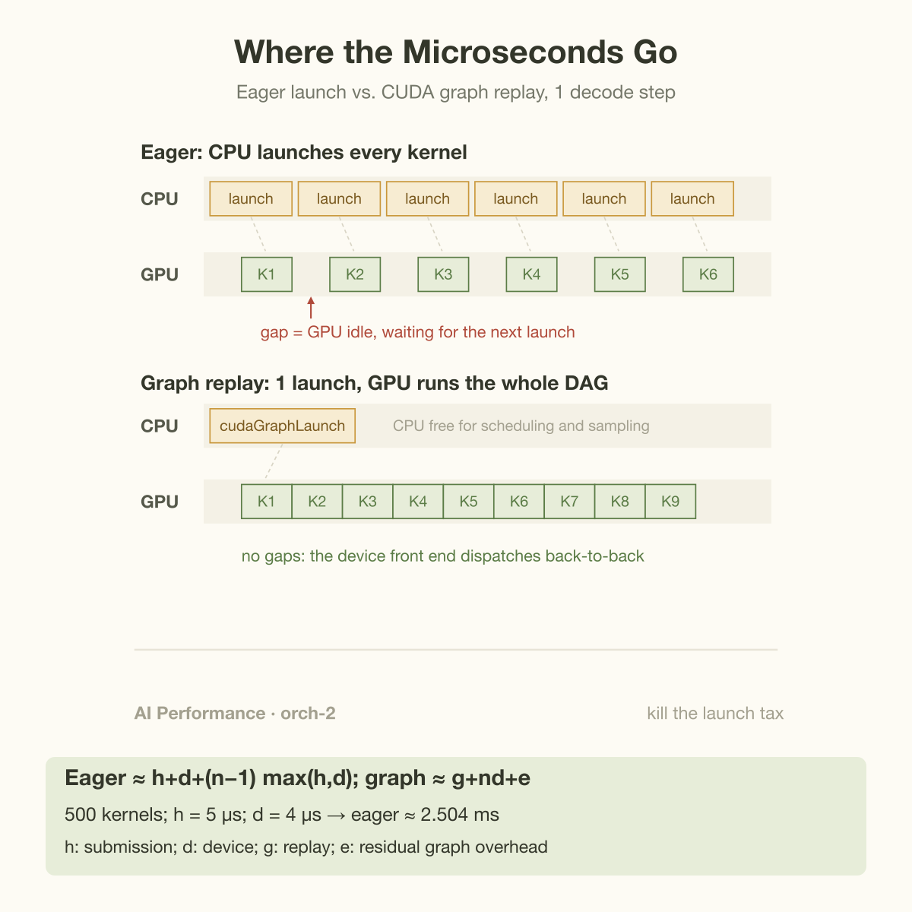
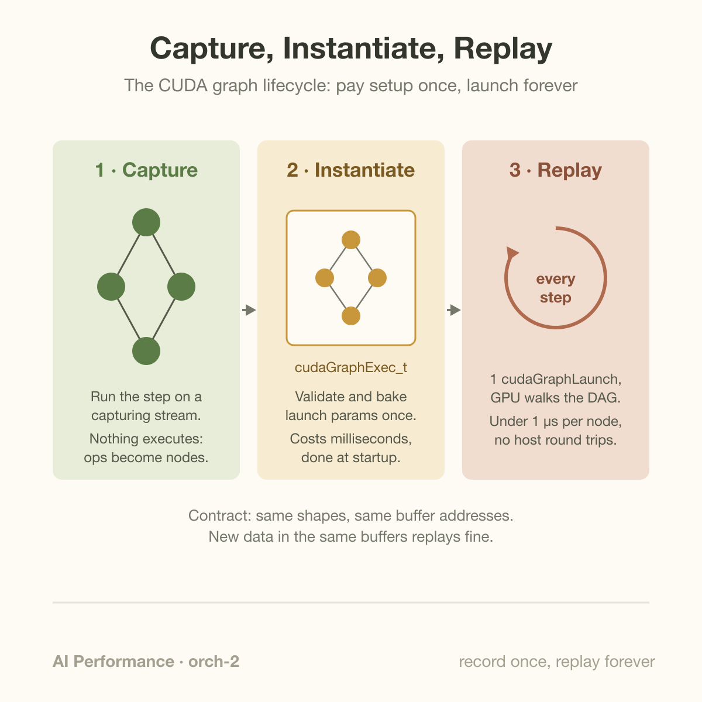

Launching a CUDA kernel costs roughly 5 microseconds of CPU time before the GPU runs a single instruction. That sounds like nothing until you multiply it: a 40-layer transformer decoding 1 token launches on the order of 500 kernels, so the host spends about 2.5 milliseconds per token doing nothing but *asking* the GPU to work. If the GPU-side math for that token only takes 2 milliseconds, your inference server is now bottlenecked by a Python process filling out paperwork.

CUDA graphs exist to delete that paperwork. You record the entire sequence of kernels once, bake it into an executable object, and from then on replay the whole decode step with a single API call. vLLM ships with this on by default for decode, and the win is not subtle: on small-batch decode, capturing the step into a graph is worth 20-30% of end-to-end latency. This article walks through where those microseconds go, does the arithmetic by hand, and then goes 1 level down into how capture, instantiation, and replay actually work.

## The launch tax

When your framework calls a kernel, a surprising amount of machinery runs on the CPU. The user-mode driver validates arguments, resolves the function handle, serializes launch parameters into a command buffer, and eventually rings a doorbell register so the GPU's front end picks the work up. Even in tight C++ calling `cudaLaunchKernel` directly, that path costs a few microseconds. Go through a framework and it gets worse: PyTorch's dispatcher, shape checks, stream bookkeeping, and Python itself can push per-operator overhead well past 10 microseconds in eager mode.

None of this matters during prefill. Prefill kernels chew through thousands of tokens at once, each kernel runs for hundreds of microseconds or more, and a 5 microsecond launch disappears into the noise. The CPU launches asynchronously, runs ahead, and the GPU never starves. I covered the 2-phase split in [how an LLM generates text](/blog/how-an-llm-generates-text/); the phase that breaks is decode.

Decode processes 1 token per sequence per step. At small batch sizes the tensors are tiny, every kernel is memory-bound, and individual kernels finish in 2-10 microseconds. Now the asynchrony stops saving you. The GPU drains its queue faster than the CPU can refill it, and the timeline inverts: instead of the CPU running ahead of the GPU, the GPU idles between kernels, waiting for the next launch to arrive. Your profiler shows a GPU timeline that looks like a barcode, thin slivers of work separated by white gaps.

The brutal part is that the gaps are invisible to naive utilization metrics. `nvidia-smi` happily reports high utilization because the sampling window sees *some* kernel active. The gaps only show up in a trace, or in the number that actually matters, tokens per second.

## A worked example: 1 decode step, 40 layers

Let's put real numbers on a 40-layer decoder running batch-1 decode, the worst case and also the latency-critical 1.

Count the kernels first. A typical transformer layer in eager mode launches separate kernels for the input LayerNorm, the QKV projection, rotary embedding, attention, the output projection, a residual add, the second LayerNorm, 2 or 3 feed-forward GEMMs, an activation, and another residual add. Call it 12 kernels per layer, which is if anything conservative once you count reshapes and dtype casts:

- 40 layers × 12 kernels = 480 kernels
- plus embedding lookup, final norm, LM head, sampling ≈ 20 more
- **≈ 500 kernel launches per generated token**

Now the 2 clocks:

- **CPU clock:** 500 launches × 5 µs = **2,500 µs** of host time per token.
- **GPU clock:** say the kernels average 4 µs of device time (small memory-bound kernels at batch 1) → 500 × 4 µs = **2,000 µs** of actual work.

The CPU needs 2.5 ms to submit work the GPU can finish in 2.0 ms. The step time is therefore pinned at ~2.5 ms by the *submitting* processor, and the GPU sits idle for roughly 500 µs of every step. That is 20% of your decode latency spent on launch overhead alone, and if your per-launch cost is closer to 10 µs because you are going through Python, the overhead exceeds the compute and the GPU is idle more than half the time.

Now capture the step into a CUDA graph. Replay costs 1 launch (~5 µs) plus a small per-node scheduling cost that the GPU's hardware front end handles in well under a microsecond per kernel. The step time collapses to roughly the GPU-work floor: ~2.0 ms plus change. From 2.5 ms to ~2.05 ms is an 18% latency cut, and the messier the eager path (Python, more layers, smaller kernels), the bigger the win. That is exactly the 20-30% range reported for graph-captured decode in production engines like vLLM.

At 2.5 ms per token you were generating 400 tokens/s per sequence; at 2.05 ms you generate 488. Same GPU, same kernels, same model. The only thing that changed is who does the orchestration.

## What a graph actually is

A CUDA graph is a DAG: nodes are kernels (or memcpys, memsets, even child graphs), edges are dependencies. The lifecycle has 3 phases, and keeping them straight explains almost every practical constraint.

**Capture.** You call `cudaStreamBeginCapture` on a stream, run your normal decode step, and call `cudaStreamEndCapture`. Nothing executes; instead, every operation issued to that stream (and streams that become dependent on it through events) is recorded as a node with its exact launch parameters: grid dimensions, kernel arguments, and, critically, the *pointer values* of every buffer. In PyTorch this is wrapped by `torch.cuda.CUDAGraph` and `torch.cuda.graph`.

**Instantiate.** `cudaGraphInstantiate` turns the recorded DAG into an executable graph (`cudaGraphExec_t`). This is where the driver does, once, all the validation and setup work it would otherwise repeat on every single launch. It can also pre-upload the work descriptors to the device. Instantiation is expensive, milliseconds to tens of milliseconds for large graphs, which is fine because you do it once at startup.

**Replay.** `cudaGraphLaunch` submits the entire DAG in 1 call. The GPU's front end walks the dependency structure itself and dispatches kernels back-to-back with no host round trips. This is the whole trick: per-kernel launch work moves from a general-purpose CPU running driver code to dedicated scheduling hardware that already has everything it needs resident.

The price of baking in the parameters is rigidity. The replayed step must use the same buffer addresses and shapes as the captured 1. Feed new data into the *same* buffers and replay is fine; allocate a new tensor at a new address and the graph silently computes on stale memory. This is why every serious deployment pairs graphs with static buffers, and why PyTorch gives captured graphs a private memory pool so allocations inside the capture get stable addresses across replays.

Dynamic shapes need a different escape hatch. vLLM's answer is padding: it captures 1 graph per bucket of batch sizes at startup, then pads each incoming decode batch up to the nearest captured size. A batch of 5 replays the batch-8 graph with 3 padded slots. You waste a little compute on padding to save a lot of latency on launches, a trade to measure because padding can increase compute, cache traffic, and memory use.

A launch pipeline needs 2 clocks and a startup/drain term. For n sequential kernels, average host submission cost h, and average device duration d:

$$
t_{\mathrm{eager}}\approx h+d+(n-1)\max(h,d),\qquad
t_{\mathrm{graph}}\approx g+nd+e.
$$

Here g is graph-launch cost and e measured residual graph scheduling and dependency overhead. The model assumes host submission overlaps device execution and kernels follow a sequential dependency chain. For n equal to 500, h equal to 5 microseconds, and d equal to 4, eager time is 2504 microseconds. With g equal to 5 microseconds and e equal to 45, graph time is 2050 microseconds, an 18.1% illustrative reduction.

Capture cost must amortize too. If setup costs C seconds and each replay saves delta seconds, more than C/delta replays are needed to recover setup time. A 20-millisecond setup saving 0.454 milliseconds per step breaks even after about 45 steps. Padding changes device duration, so compare graph buckets using the actual batch distribution. Stable addresses also require keeping static buffers alive and synchronizing writes before replay; silently rebinding a Python variable does not update captured pointer arguments. Validate outputs against eager execution while tracing gaps and memory reservations.

## Going deeper: shrinking the CPU's job to 0

Graphs move orchestration from host software to device hardware, and once you see it that way, they are 1 point on a spectrum of "get the CPU out of the loop" techniques.

**Updating instead of re-capturing.** If only kernel parameters change between steps (new pointer, new scalar), `cudaGraphExecUpdate` patches an instantiated graph in place, orders of magnitude cheaper than re-capture plus re-instantiation. NVIDIA's engineering posts on dynamic graph usage show this is the intended pattern for workloads whose structure is stable but whose arguments drift.

**Control flow on the device.** Classic graphs are static DAGs, so any data-dependent branch ("did sampling hit EOS?") forced a round trip to the CPU. CUDA 12.3 added conditional nodes: IF and WHILE nodes whose condition is evaluated on the GPU, so a graph can loop or branch without host involvement. A decode loop can, in principle, live entirely on the device.

**Overlapping dependent kernels.** Even inside a graph, kernel B normally waits for kernel A to fully drain. Programmatic Dependent Launch (Hopper onward) lets B start its preamble (loading weights into shared memory, computing addresses) while A finishes its tail, hiding a chunk of each kernel's fixed startup cost. Graphs and PDL compose; TensorRT-LLM uses both.

**Persistent kernels and work queues.** The endpoint of this spectrum is to stop launching kernels at all: launch 1 long-lived "persistent" kernel per SM and have thread blocks pull work items from a queue managed with atomics. Because the queue head is hammered by every SM, it stays resident in the L2 cache, and an L2 atomic costs a few 100 nanoseconds instead of microseconds. For irregular workloads where uniform grids leave some SMs idle (ragged batches, mixture-of-experts routing, graph algorithms), this dynamic load balancing is worth another 10-30% on top of eliminating launches. The megakernel designs in modern inference engines are this idea taken to its conclusion: the whole model becomes 1 kernel that never exits, and "orchestration" is just atomic counters in cache.

Each step down this list trades flexibility for latency. Eager launches can do anything; graphs need static structure; persistent kernels need you to hand-roll scheduling. Decode's structure is blessedly repetitive, the same 500 kernels in the same order forever, which is why it is the perfect customer for the rigid end of the spectrum.

## Common misconceptions

**"CUDA graphs make my kernels faster."** They do not touch kernel execution at all. The same SASS runs at the same speed; graphs only remove the dead time *between* kernels. If your kernels average 500 µs (prefill, large-batch training), graphs are worth roughly nothing, and this is why vLLM historically ran prefill eagerly while capturing only decode. Profile the gaps, not the kernels, before reaching for graphs.

**"Any change means re-capturing the graph."** Only structural or shape changes do. New *data* in the same buffers is the normal case and replays with 0 extra cost, that is the entire design. Parameter changes (a pointer, a scalar argument) can be patched with `cudaGraphExecUpdate` without re-instantiation. What genuinely requires a different graph is a different shape, and the production fix is capturing a small set of bucketed graphs and padding into them, not re-capturing per request.

**"This is Python overhead; a C++ rewrite fixes it."** A C++ rewrite helps, but the floor is the driver, not the language. Raw `cudaLaunchKernel` from C++ still costs microseconds per call because validation and command-buffer submission happen regardless of who calls it. In our worked example, even a 0-overhead framework submitting at 5 µs per launch leaves the GPU idle 20% of the step. Graph replay can beat a host-side launch loop when per-kernel submission sets the critical path because it changes where scheduling happens, moving it onto the device, rather than making the host loop tighter.

## The bigger picture

CUDA graphs are the cleanest illustration of a theme that runs through this whole series: at small batch sizes, LLM inference is not limited by FLOPs, and often not even by [memory bandwidth](/blog/the-memory-wall-latency-numbers/), but by orchestration. The CPU-GPU relationship is a producer-consumer system, and [a latency machine feeding a throughput machine](/blog/cpu-vs-gpu-latency-vs-throughput-machines/) stalls whenever the work items get too small.

It is also why decode and prefill keep drifting apart architecturally. Prefill wants big fused kernels and raw compute; decode wants 0-overhead repetition of tiny kernels. Graphs fix decode's launch problem in software; [disaggregating prefill and decode](/blog/the-prefill-decode-disaggregation-story/) fixes the mismatch at the cluster level; and the megakernel work behind [DeepSeek-class inference pricing](/blog/when-a-kernel-cuts-api-prices/) fixes it by abolishing kernel boundaries entirely. Different layers of the stack, same enemy: fixed per-item overhead on ever-smaller items.

If you run inference in production, the checklist is short. Trace 1 decode step with Nsight Systems. Measure the gap fraction. If the GPU is idle between kernels, you are paying the launch tax, and capture-plus-replay is the highest-leverage fix per line of code you will find this quarter.

## Takeaway

- **Decode is launch-bound before it is compute-bound.** A 40-layer model at 5 µs per launch spends ~2.5 ms of CPU time per token submitting ~500 kernels that need only ~2 ms of GPU time; the CPU is the bottleneck and the GPU idles 20% of the step.
- **Graphs move scheduling from host software to device hardware.** Capture once, instantiate once, then replay the whole step for the cost of a single launch, worth 20-30% of decode latency in engines like vLLM, at the price of static shapes and addresses (hence bucketed graphs plus padding).
- **It is 1 point on a spectrum.** Graph update, conditional nodes, Programmatic Dependent Launch, and persistent kernels with L2-resident work queues progressively remove the CPU from the loop; the more repetitive the workload, the further down that spectrum you can profitably go.

## Sources

- Alan Gray, "Getting Started with CUDA Graphs," NVIDIA Developer Blog: https://developer.nvidia.com/blog/cuda-graphs/
- NVIDIA, *CUDA C++ Programming Guide*, CUDA Graphs section: https://docs.nvidia.com/cuda/cuda-c-programming-guide/
- NVIDIA Developer Blog, "Employing CUDA Graphs in a Dynamic Environment": https://developer.nvidia.com/blog/employing-cuda-graphs-in-a-dynamic-environment/
- PyTorch documentation, CUDA Graphs (`torch.cuda.CUDAGraph`): https://pytorch.org/docs/stable/notes/cuda.html
- vLLM project (CUDA graph capture for decode): https://github.com/vllm-project/vllm

*Part of the **AI Performance Engineering** series. Previous: [When a Kernel Cuts API Prices 50%](/blog/when-a-kernel-cuts-api-prices/). Related: [The Prefill/Decode Disaggregation Story](/blog/the-prefill-decode-disaggregation-story/).*
