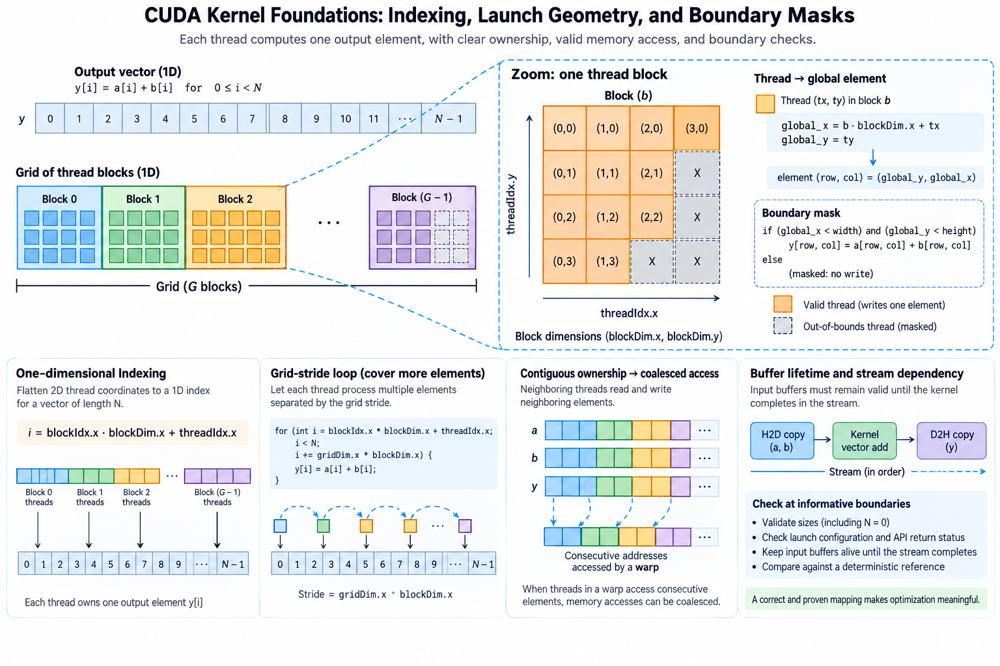
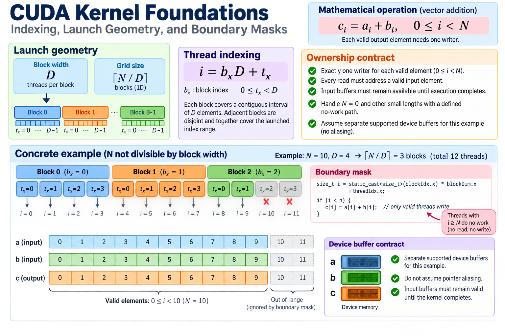
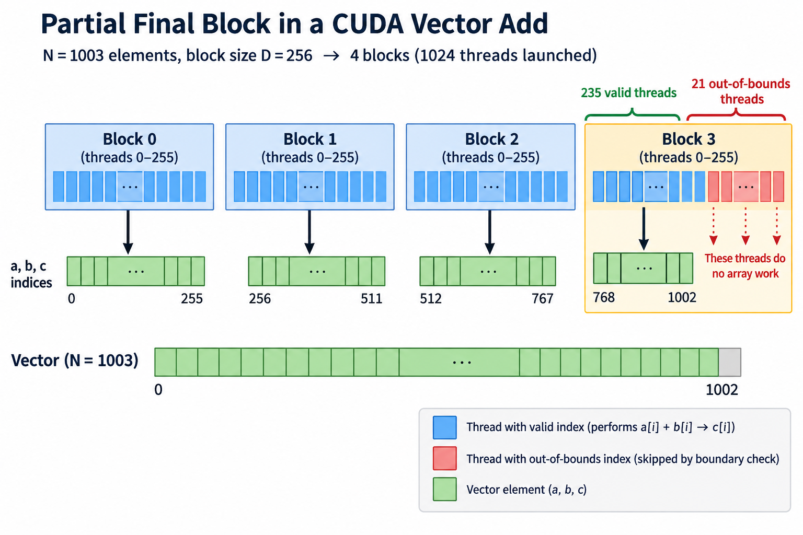
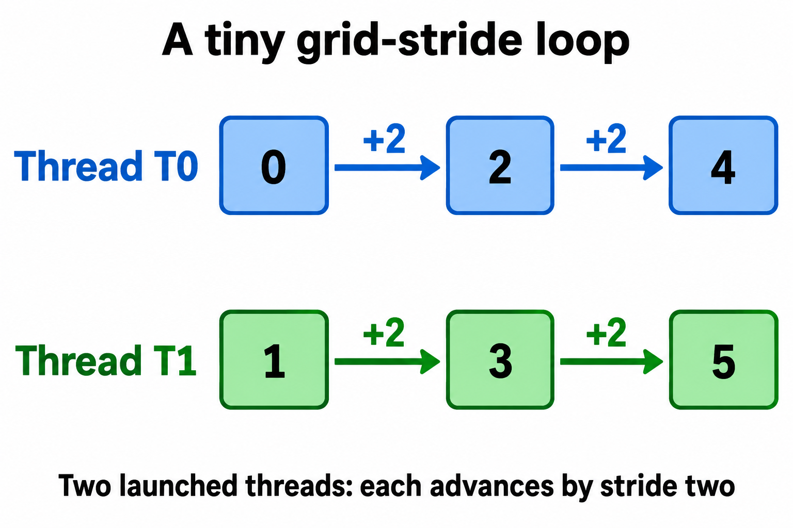
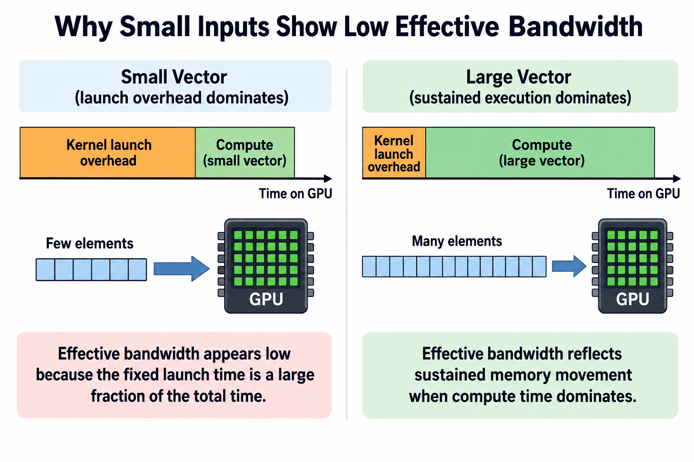

## Overview



Writing a CUDA kernel starts with an ownership question: which thread is responsible for which output element? Launching many threads is easy. Proving that every required element is written exactly once, with valid reads and supported synchronization, is the foundation that makes later optimization meaningful.

A vector addition is a useful first example because the mathematical result is simple and the memory traffic is visible. It lets us separate indexing, launch geometry, boundary handling, buffer lifetime, and timing without hiding them inside a large model operation.

We will derive the mapping and a grid-stride extension, then connect the kernel to a memory model. Numerical performance examples are illustrative. Device launch limits and supported execution details should be checked in the current CUDA guide and queried for the target hardware.

## Deep dive

### 1. State the mathematical operation and ownership contract



For vectors a and b of length N, the required output is

$$
c_i=a_i+b_i,\qquad0\le i<N.
$$

Each valid output element needs one writer in this simple implementation. Every read must address a valid input element, and the input buffers must remain available until execution completes. These requirements are independent of whether the launch is fast.

Start with a deterministic reference and several lengths, including a size not divisible by the block width. Include N=0 and small lengths in the host-side contract. An empty vector needs a defined no-work path rather than an invalid launch configuration.

Assume separate supported device buffers for the example unless aliasing is explicitly part of the interface. Pointer overlap changes the correctness analysis for more general operations, especially when one output can overwrite data another thread still needs. The simple result does not authorize arbitrary buffer aliasing.

### 2. Derive one-dimensional thread indexing

Let block width be D, block index b_x, and local thread index t_x. The global element index is

$$
i=b_xD+t_x,\qquad0\le t_x<D.
$$

For a fixed block, the mapping covers a contiguous interval. Adjacent blocks cover disjoint intervals because their starting indices differ by D. Together they cover the launched index range without duplicate writers.

The number of blocks needed for N elements is the ceiling of N divided by D. In host code, use an integer calculation whose type and overflow behavior fit the intended input range. Very large sizes require more care than copying a small demonstration expression into production.

CUDA's built-in indices and dimensions have specific types and limits. Casting before multiplication can prevent unintended narrow arithmetic in a large-index expression. A wide element index alone does not remove grid-dimension limits or allocation limits, so query supported properties for the target device.

### 3. Make the partial final block explicit



When N is not divisible by D, the launch includes threads whose indices are beyond the vector. They must not read or write the arrays. A boundary condition protects those accesses:

```cpp
__global__ void add_vectors(const float* a, const float* b,
                            float* c, size_t n) {
    size_t i = static_cast<size_t>(blockIdx.x) * blockDim.x
             + threadIdx.x;
    if (i < n) c[i] = a[i] + b[i];
}
```

This snippet illustrates kernel ownership and omits host allocation and transfer setup. The caller must provide valid device pointers, sufficient lengths, and the supported completion dependencies.

For N=1003 and D=256, 4 blocks launch 1024 threads. The last block starts at index 768 and has 235 valid elements; 21 threads do no array work. The whole launch has about 97.95% valid thread positions under this simple counting measure.

That fraction is not a hardware-utilization measurement. Inactive lanes, memory transactions, occupancy, and scheduling determine actual execution efficiency. The mask is first a correctness requirement; its performance effect should be measured rather than inferred solely from the number of padded positions.

### 3-1. Separate matrix shape from storage stride

For a matrix, a two-dimensional launch can assign a row and column to each thread. The logical bounds are the row count and column count, while the address uses the storage stride. In row-major storage with leading dimension L, element row r and column c is addressed at r times L plus c. L need not equal the logical column count when rows have padding.

A matrix with 3 rows and 5 columns stored with stride 8 has 15 logical elements but reserves 24 element positions. A kernel using 5 as the physical stride would address later rows incorrectly. Mask row and column bounds independently, and preserve the actual layout in the interface. This distinction becomes essential for tiled matrix operations and views into larger allocations.

### 4. Extend ownership with a grid-stride loop



A fixed grid can process a larger vector by advancing each thread through indices separated by the total launched thread count S:

$$
i_k=i_0+kS,\qquad S=D\,G,
$$

where G is grid width and i_0 the thread's initial global index. Each valid element has a unique remainder modulo S, assigning it to one thread's sequence. The loop stops when the index reaches N.

```cpp
__global__ void add_grid_stride(const float* a, const float* b,
                               float* c, size_t n) {
    size_t start = static_cast<size_t>(blockIdx.x) * blockDim.x
                 + threadIdx.x;
    size_t stride = static_cast<size_t>(blockDim.x) * gridDim.x;
    for (size_t i = start; i < n; i += stride)
        c[i] = a[i] + b[i];
}
```

The arithmetic and loop contract must still fit the supported size range. A grid-stride loop provides flexibility in launch size; it is not automatically faster than a direct one-element mapping for every vector.

For a small ownership example, launch 8 thread positions for 20 elements. The thread starting at index 3 handles indices 3, 11, and 19. The thread starting at index 4 handles 4 and 12, then stops before 20. Every element belongs to the thread identified by its remainder modulo 8. This makes coverage and uniqueness easy to verify independently of the GPU scheduler. The final increment also needs a supported arithmetic range; wide indexing should not be confused with permission to overflow the index type.

Choose enough work to occupy the device while avoiding unsupported launch dimensions. Measure candidate grids on representative sizes. A small input and a huge input expose different overhead and scheduling behavior.

### 5. Connect contiguous ownership to memory access

Adjacent threads reading adjacent elements can support efficient memory transactions under the hardware's access rules. The vector mapping therefore makes a useful baseline for examining memory throughput. Alignment and representation still matter.

Changing the index to a large stride can spread lane accesses across more memory regions. The mathematical operation may remain correct while transaction efficiency worsens. That is a separate performance hypothesis from launch geometry.

Count useful bytes and inspect actual traffic where profiling is available. Caches, write behavior, and repeated runs can change physical memory movement. A kernel repeatedly reading a small cached array should not be presented as sustained HBM bandwidth for a much larger working set.

Keep the working-set size and cache policy in the report. Both cache-resident and memory-resident cases can be useful, but they describe different resources. The same code can produce different apparent bandwidth without a change in indexing correctness.

### 6. Derive the vector-add arithmetic intensity

For FP32 inputs and output, the logical operation reads 2 values and writes 1 value per element. Ignoring overhead, it performs one addition and moves 12 bytes:

$$
D_{\mathrm{logical}}=12N,\qquad I_{\mathrm{logical}}=1/12\text{ FLOP per byte}.
$$

This low arithmetic intensity makes large vector addition primarily a memory-traffic exercise on many GPUs. It is not a useful proxy for matrix-multiplication compute throughput or every model kernel.

For N equal to 2 raised to 24, logical traffic is 201326592 bytes, or 192 MiB. At an illustrative achieved bandwidth of 500 GB/s, the payload-time component is about 0.403 milliseconds. Startup and actual memory behavior can increase elapsed time.

Effective logical bandwidth is logical bytes divided by measured kernel duration. Label it as such. Profiling physical traffic can reveal rereads or cache effects, so the derived figure should not be equated blindly with a sensor's memory-bandwidth counter.

### 7. Buffer lifetime and stream dependencies remain necessary

Correct array bounds do not establish that inputs are ready. Host-to-device copies and kernel launches can be asynchronous, and the consumer must follow the supported dependency ordering. The output also cannot be used or freed before its execution completes.

A single-stream example can provide ordering among operations submitted to that stream under CUDA's contract. Multiple streams need explicit supported coordination when one produces data another consumes. Do not assume unrelated launches share the required order merely because the host posted them sequentially.

Preserve host-buffer lifetime for outstanding asynchronous transfers. Likewise, preserve device allocation lifetime for kernels and transfers. A race caused by early reuse can appear as intermittent numerical corruption even though the kernel's index formula is correct.

Use a clear ownership timeline during debugging: allocation, producer completion, transfer, kernel consumption, output completion, and reuse. The relevant synchronization boundary is part of the interface, not a performance detail that can be removed without changing correctness.

### 8. Check errors at informative boundaries

Launch configuration and asynchronous execution failures can surface at different points. Use supported error checking around launch and completion so the first relevant failure is preserved. A later copy failure may be a consequence of an earlier invalid kernel access.

Test boundary lengths and deterministic values against the reference. Include several block widths and the grid-stride path if both are supported. The test should establish coverage and uniqueness, not merely that one convenient aligned size returns plausible numbers.

Memory-checking tools can reveal invalid accesses that output comparisons miss. A masked tail is especially important to exercise because aligned lengths never test it. The separate correctness article develops races, barriers, and sanitizer methods in more depth.

For an illustrative small check, set a_i=i and b_i=2i. Every valid output should be 3i, including the final element. Surrounding allocations or output patterns can help reveal missing writes, while a sanitizer is the appropriate mechanism for detecting unsupported out-of-bounds accesses.

### 9. Benchmark steady execution and useful work



Separate allocation, transfers, warmup, and kernel execution unless the intended question measures the whole operation. Use timing that includes actual device completion, not only host posting. Preserve the boundary in comparisons.

Sweep vector lengths and launch geometry. Tiny inputs expose startup; large inputs expose sustained movement; nonaligned inputs exercise partial work. For a small vector, dividing logical bytes by a duration dominated by launch overhead produces a low effective bandwidth even when the access pattern is efficient. That result does not establish poor large-array memory behavior. Report sample count and variation, and preserve cache state and working-set size.

A faster kernel-local duration does not automatically improve a larger pipeline. If transfers or input preparation dominate, vector-add execution may be a small fraction of total time. Measure the enclosing useful workload when choosing an operational change.

Do not add complexity before the baseline is understood. Shared memory is not inherently beneficial for an operation with no reuse among threads, and additional synchronization can add overhead. The memory model should identify a benefit before an optimization is introduced.

### 10. Build from a proved mapping

The essential proof is simple: valid elements are covered, writers are unique, reads are in range, and ownership follows supported execution dependencies. Launch geometry and grid-stride iteration then become choices within that contract.

Preserve the reference, representative sizes, supported launch limits, timing method, and logical traffic model. Include both aligned and deliberately partial final blocks in the record. This record makes later tiling, fusion, or scheduling experiments easier to interpret because the original result and denominator remain clear.

## Conclusion

CUDA kernel foundations are not about memorizing one block width. They are about translating an operation into a valid parallel ownership scheme and measuring the resources that scheme uses. Once indexing, boundaries, and lifetime are explicit, optimization can target a real bottleneck without changing the required computation.

### Sources

- [Current NVIDIA CUDA Programming Guide](https://docs.nvidia.com/cuda/cuda-programming-guide/).
- [NVIDIA CUDA runtime API documentation](https://docs.nvidia.com/cuda/cuda-runtime-api/).
- [NVIDIA Compute Sanitizer documentation](https://docs.nvidia.com/compute-sanitizer/ComputeSanitizer/).
