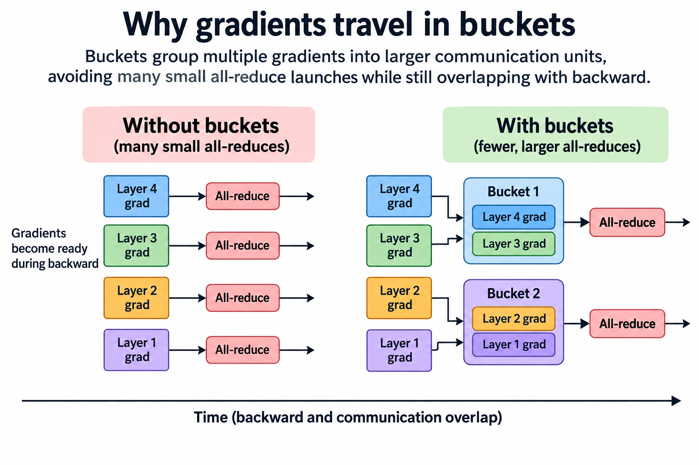

## Overview

Adding a second GPU to a training script does not automatically halve its step time, because DistributedDataParallel, usually abbreviated DDP, replicates the model, assigns different inputs to participating ranks, and synchronizes gradients before each optimizer update. The useful extra work is parallel computation over those inputs. The cost is coordination and communication needed to keep the replicas consistent.

DDP is especially instructive because its optimization rests on the structure of backpropagation. Gradients for later layers become ready before gradients for earlier layers, so the framework can begin reducing completed portions while the remaining backward computation continues, and understanding that timeline explains why bucket size, rank imbalance, loss normalization, and accumulation settings matter more than an isolated network bandwidth number.

We will derive the average-gradient objective, model bucket completion times, and work a small overlap example. The timings are hypothetical and use a simplified serialized communication model. They are a tool for reasoning about a trace, not a prediction that every NCCL implementation follows the same exact execution schedule.

## Deep dive

### 1. Replication defines what must remain consistent

A DDP rank normally keeps a full model replica and its optimizer state, each rank runs forward and backward on a local batch, and if every rank starts with the same parameter values, receives the same synchronized gradient, and applies the same optimizer update, those 3 conditions keep the replicas consistent without broadcasting every updated parameter on every step in this basic model.

The ranks must also agree on the distributed program, and collectives need 3 things to match: participants, tensor shapes, and ordering, so one rank skipping a synchronization that others enter can stall the whole job. A training function that is valid on each GPU alone can still be invalid as distributed execution when control flow differs across ranks.

DDP does not itself divide an arbitrary input batch among devices, so the data pipeline must arrange which samples each rank processes. 3 things are part of the correctness story: distributed sampling, deterministic epoch handling, and a consistent stopping policy. Feeding identical examples to all ranks can make reported device throughput rise without increasing the distinct training data processed.

### 2. Derive the synchronized gradient

Let D be the number of ranks, and suppose rank d has B local examples. Let the local loss be the average of per-example losses. With equal local batch sizes and consistent reduction conventions, the global objective is

$$
\mathcal{L}(\theta)=\frac{1}{D}\sum_{d=1}^{D}\mathcal{L}_d(\theta),
\qquad
\nabla\mathcal{L}(\theta)=\frac{1}{D}\sum_{d=1}^{D}\nabla\mathcal{L}_d(\theta).
$$

The all-reduce combines local gradients, and the framework’s reduction convention supplies the appropriate averaging, so the optimizer then sees a gradient corresponding to the global mean objective, though this statement depends on the local loss definition: changing a mean loss to a sum loss changes the gradient scale.

Unequal numbers of valid tokens require more care. Suppose rank d has n_d valid loss tokens and computes a local mean gradient g_d: the desired token-weighted global mean is the sum of n_d g_d divided by the sum of n_d, rather than an unweighted average of rank means, and padding masks and variable-length batches can make those 2 expressions different even when each rank has the same number of examples.

Loss weighting can correct the difference if counts and reduction factors stay consistent. State whether the objective averages examples, valid tokens, sequences, or ranks. A faster distributed configuration is not an equivalent baseline when it silently changes these weights. Assess numerical equality with sensible floating-point tolerances rather than requiring identical accumulation order.

### 3. Why gradients travel in buckets

An all-reduce for every small parameter tensor would pay many launch and message startup costs, while waiting until the entire backward pass finishes would instead lose most overlap opportunities, so buckets balance these 2 extremes by grouping gradients into larger communication units.

Autograd hooks tell the reducer when gradients become available. A bucket becomes eligible when all required gradients assigned to that bucket are ready. The reducer must also preserve a collective order compatible across ranks. Runtime readiness alone cannot set a different communication order on every rank.

Parameter registration order and bucket organization influence how closely communication follows the backward computation. Models with branches, shared parameters, or uneven layer costs can violate the expectation that reverse registration order perfectly matches gradient readiness. Use the profiler timeline and reducer behavior to inspect the relationship.

A bucket is also a memory object: some configurations let gradients refer directly to bucket storage, which reduces copies and memory use, though such options can affect assumptions about gradient views and supported operations. Check the installed framework version before applying code that expects independently allocated gradient tensors.

### 4. Derive the exposed tail

Let r_j be the readiness time of bucket j measured from the beginning of backward, and let t_j be its communication duration. In a simplified model with one serialized communication stream, the completion recurrence is

$$
C_j=\max(r_j,C_{j-1})+t_j,
\qquad
E=\max(0,C_{\mathrm{last}}-T_{\mathrm{backward}}).
$$

The maximum captures 2 constraints: a bucket cannot transmit before its gradients exist, and it cannot occupy the serialized channel while the previous bucket is still using it. The exposed tail E is what remains after the compute-only backward interval ends.

Consider 3 buckets ready at 2, 5, and 8 milliseconds. Suppose each takes 3 milliseconds and backward compute ends at 10 milliseconds. Their completion times are 5, 8, and 11 milliseconds. Total communication is 9 milliseconds, but only 1 millisecond remains exposed under this model.

The example also shows why total communication time shorter than backward time is not enough. A final bucket ready at the very end creates a tail regardless of how successfully earlier buckets overlapped. 3 factors matter alongside the sum of bytes: readiness distributions, message startup, and serialization.

For unequal ranks, the effective start of a collective depends on participation by the other ranks, so a local readiness timestamp is incomplete evidence: 1 slow input pipeline or expensive layer on a single rank can delay the useful reduction even when another rank has already enqueued it.

### 5. Bucket size changes both startup and readiness

Larger buckets reduce the number of collectives and amortize launch and message startup overhead, but they also take longer to become ready if they include gradients produced at different points in backward, while smaller buckets can begin earlier and yet increase the number of operations and may use the network less efficiently.

A simple ring approximation for a bucket of S bytes on D ranks with startup alpha and effective per-link bandwidth beta is

$$
T_{\mathrm{ring}}\approx2(D-1)\left(\alpha+\frac{S}{D\beta}\right).
$$

This is an analytical approximation for a logical ring, not a complete NCCL performance model. Algorithms can change with message size and topology, and effective bandwidth includes contention and transport overhead. It still shows why tiny buckets pay disproportionately for startup.

A useful tuning experiment sweeps several bucket capacities while keeping 5 things fixed: the model, rank placement, sequence lengths, accumulation factor, and numerical policy. Record step time, bucket readiness, communication tail, and compute slowdown. The capacity with the shortest isolated all-reduce time can be worse than the capacity with the best complete-step timeline.

### 6. Gradient accumulation changes synchronization frequency

If an optimizer step contains A local microsteps, accumulating gradients can defer synchronization until the final microstep, and PyTorch exposes a no_sync context for this purpose. The forward pass must also occur inside the context for the intended behavior; wrapping only backward is an easy mistake.

For equally weighted microbatches, dividing each microbatch loss by A gives the intended mean over the accumulation interval. Unequal valid-token counts again require explicit weighting. Apply gradient clipping to the gradient whose meaning matches the intended optimizer update, not to unrelated partial gradients on each rank.

The accumulation schedule exchanges communication frequency for memory and compute behavior: a smaller microbatch may reduce activation memory but lower matrix efficiency, and deferring synchronization can remove repeated collective startups, yet the final reduction still needs to complete before the optimizer consumes its result.

Use a minimal correctness comparison against a reference update with an equivalent global batch, comparing parameter deltas or gradients for a small deterministic model, then repeat with the actual mixed-precision policy. 3 sources can create expected differences, random-number streams, dropout, and floating-point reduction ordering, so distinguish those from incorrect loss scaling or missing synchronization.

### 7. Compilation can reshape the overlap opportunity

A compiler that fuses a large backward graph can change when reducer hooks become observable and when collectives launch. So assess compilation benefits and communication overlap together, because PyTorch’s DDP design documentation describes bucket-aware compiler behavior intended to retain useful overlap opportunities.

Do not assume a faster single-rank compiled model produces the same proportional gain across ranks. A changed kernel schedule can make communication dominant, expose a different final bucket, or compete differently for streaming multiprocessors and memory bandwidth. The distributed critical path is the relevant measurement.

The correct experiment includes 2 variants, eager and compiled, under the same rank topology and workload, so warm up compilation before timing steady-state iterations, but report compilation cost separately if the job is short enough for it to matter. Record graph breaks and guard behavior when variable shapes can trigger additional work.

### 8. Diagnose a slow DDP step in layers

Start with a reproducible workload and a synchronized understanding of the timing boundary. Observe several ranks, not just rank 0. Separate data loading, forward compute, backward compute, gradient communication, and update work. Look for the earliest point where ranks diverge rather than treating the final waiting collective as the cause.

Next inspect whether communication uses the intended device and network path, because an unsupported or poorly placed GPU-to-NIC route can reduce effective bandwidth and a rank-layout change can move traffic across more expensive links. Benchmark the collective size and placement before applying transport settings suggested for a different cluster.

Then inspect bucket readiness and exposed tails. A long final bucket suggests a scheduling or partitioning issue, many tiny operations suggest startup overhead, and a communication stream that remains active while compute becomes slower suggests resource contention. These 3 signatures lead to different changes, and one blunt bucket-capacity adjustment cannot resolve them all.

Finally, validate useful work and numerical behavior. Count distinct valid training tokens, confirm sample distribution, and compare the resulting update convention. A job that runs without hanging can still train on the wrong effective objective or repeated data. Distributed correctness and performance require evidence about 2 programs: the communication program and the learning program.

### 9. Know when replication is the wrong baseline

DDP is attractive when 4 things fit on each rank, the complete model, gradients, optimizer state, and activation peak, and it provides a comparatively simple ownership model and can achieve strong scaling when local computation is large enough to amortize synchronization.

When persistent training state does not fit, tuning gradient buckets cannot solve the capacity problem. Parameter, gradient, or optimizer sharding changes ownership and introduces different collective sequences. Pipeline and tensor parallelism partition the computation itself. Compare these designs against a feasible baseline, not against an imaginary replicated instance that exceeds device memory.

The transition is also a measurement transition. A DDP all-reduce timeline does not directly predict FSDP all-gather peaks or expert-parallel dispatch. Carry forward the 4 principles of readiness, consistent ordering, critical paths, and useful work, but rebuild the byte and dependency model for the new algorithm.

## Conclusion

DDP turns different local gradients into a consistent global update, and buckets make that synchronization efficient by balancing communication startup against gradient readiness, so the exposed tail depends on the schedule, not just total network time.

Tune complete steps with representative ranks and inputs. Preserve the intended loss weighting, verify accumulation behavior, and use traces to distinguish 4 causes: bandwidth limitations, late gradients, stragglers, and resource contention. Replication is a useful foundation because its assumptions can be written down and checked.

### Sources

- [PyTorch DDP design note](https://docs.pytorch.org/docs/stable/notes/ddp.html): reducer hooks, bucket ordering, and communication overlap; the note identifies its historical implementation baseline.
- [DistributedDataParallel API](https://docs.pytorch.org/docs/stable/generated/torch.nn.parallel.DistributedDataParallel.html): current configuration and no_sync behavior.
- [Li et al., PyTorch Distributed](https://arxiv.org/abs/2006.15704): design and evaluation of distributed data-parallel training.
- [NCCL collective operations](https://docs.nvidia.com/deeplearning/nccl/user-guide/docs/usage/collectives.html): all-reduce and collective semantics.
