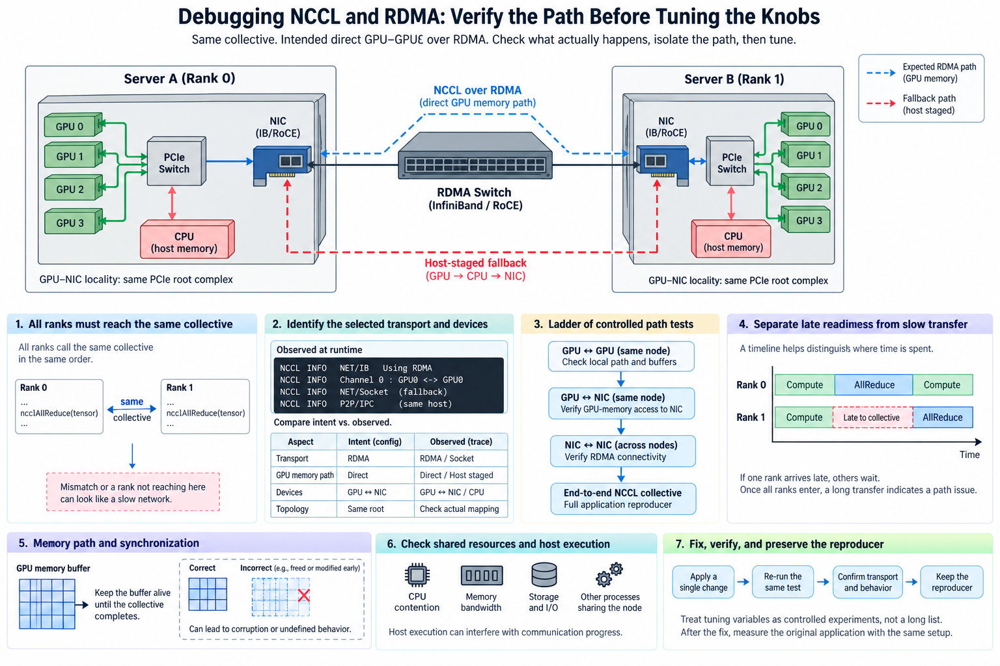
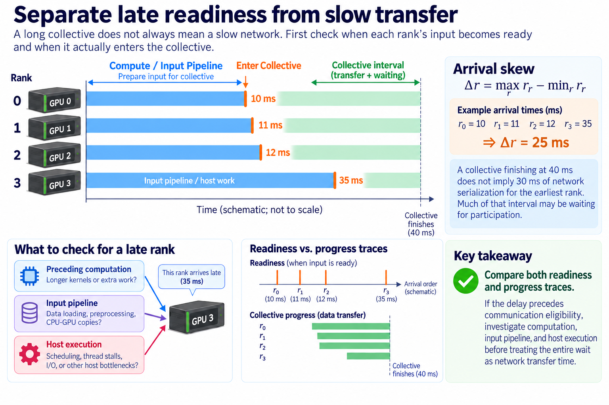
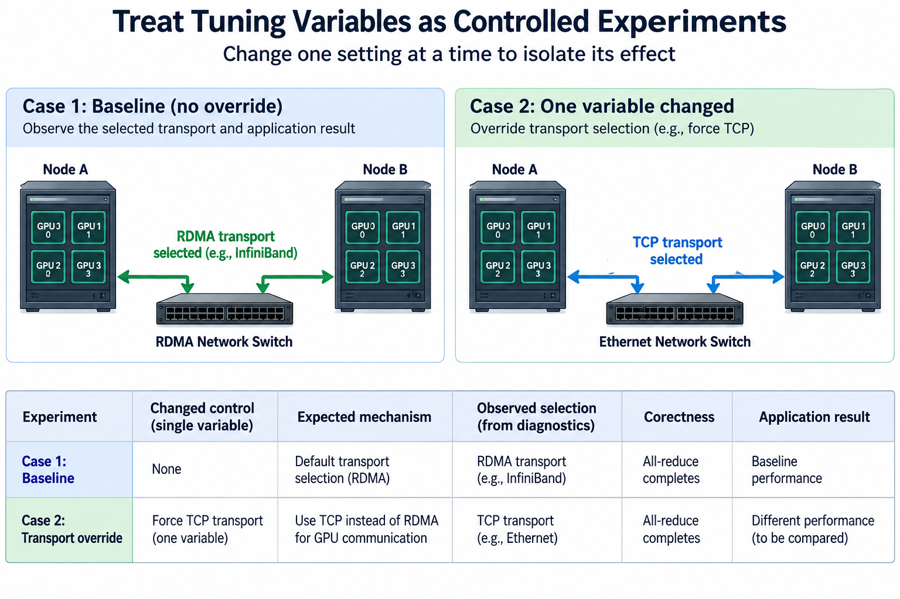
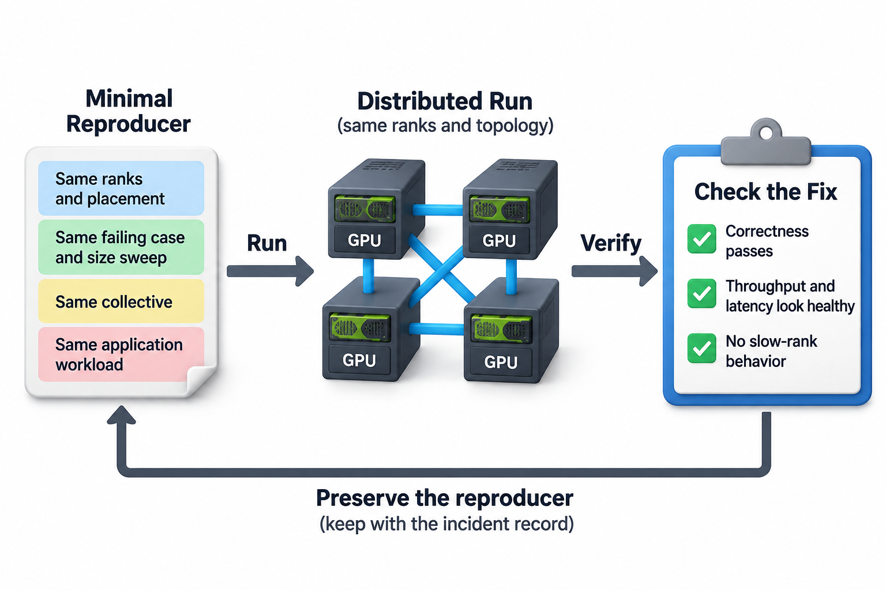

## Overview

The network can cause a slow NCCL operation, but so can a rank that never reaches the expected collective. A failed RDMA test can reveal an adapter configuration problem, an unsupported GPU-memory path, or an application lifetime error. Starting with a long list of tuning variables mixes these explanations and can make the original failure harder to reproduce.

The useful method is a layered diagnosis. First establish that the participants agree on the distributed operation and reach it correctly. Then identify the selected transport and physical placement. Finally isolate the path with controlled tests and measure the original application after the fix.

This article presents that sequence without prescribing platform-specific privileged changes. Follow current NCCL and platform documentation for exact diagnostics and supported configurations. Numerical examples are illustrative timelines, not measured failure reports.

## Deep dive

### 1. Preserve a minimal description of the failure

Record the application, model or tensor shapes, world size, rank mapping, software versions, and termination behavior. Distinguish initialization failure, repeatable stall, intermittent timeout, corruption, and poor throughput. These symptoms call for different evidence even when they all appear near communication.

Keep the first relevant error and per-rank context rather than only the final launcher failure. A launcher may report that workers exited after one rank encountered an earlier device error. The last message is then an effect, not the original cause.

Reduce the reproducer carefully. Preserve the buffer type, operation ordering, process model, and placement that trigger the symptom. Removing GPU buffers or changing from many processes to one can make the reproducer easier while also removing the failing path.

Record what changed between a healthy and degraded run. Driver, library, container, launcher, allocation, scheduler, and topology changes can each alter communication behavior. Start the investigation from this evidence rather than assume the only relevant change was the network.

### 2. Check that every rank expects the same collective

Collective participation requires compatible group membership, operation order, tensor counts, dtypes, and supported layout. A conditional branch that only some ranks execute can send the group into different operations. The resulting wait can look like a fabric problem even though no transport setting can repair it.

Instrument logical collective sequence numbers and phase names in a controlled reproducer. Compare which operation each rank enters and whether it completes. Keep instrumentation lightweight enough to preserve the timing conditions when investigating a race.

For an illustrative 4-rank job, ranks 0–2 might enter an all-reduce while rank 3 waits for input before entering an all-gather. The first group can remain blocked indefinitely. Healthy pair bandwidth says nothing about whether this application ordering is valid.

Check earlier device errors and asynchronous failures too. A rank can stop making progress because a previous kernel failed, while peers continue into communication. Synchronizing selectively around suspect boundaries can help locate the first failure, but global synchronization may hide timing problems and should remain a diagnostic experiment.

### 3. Separate late readiness from slow transfer

Capture when each rank's input to the collective becomes ready and when it enters the operation. If one rank arrives late, investigate its preceding computation, input pipeline, and host execution before treating the entire wait as network transfer time.

A simple arrival-skew measure is

$$
\Delta r=\max_r r_r-\min_r r_r.
$$

If ranks arrive at illustrative times 10, 11, 12, and 35 milliseconds, skew is 25 milliseconds. A collective finishing at 40 milliseconds does not imply 30 milliseconds of network serialization for the earliest rank. Much of that interval may be waiting for participation.

Compare both readiness and progress traces. Some implementations can make partial progress before all ranks arrive, so one synchronized-start model does not describe every detail. The key question is whether the delay happens before the collective can start or remains after the required participants are ready.

For overlapped training, inspect bucket readiness and the exposed final tail. A tuning change that reduces an early hidden collective can leave step time unchanged. A host bottleneck that delays the final rank can dominate even when isolated transport bandwidth is excellent.

### 4. Identify the selected transport and devices

Use appropriate NCCL diagnostics for a bounded controlled run to inspect initialization, network selection, topology, and operation behavior. Exact logging options depend on the version. Keep the configuration and outputs that identify the path instead of guessing the selection from an environment variable alone.

Record the actual GPU and network-adapter assignments for every rank. A launcher can choose different devices or CPU affinity between runs. A healthy rank mapping and a degraded one may have identical world size but different GPU-NIC locality and shared resource demand.

Look for fallback behavior and incompatible combinations. A direct GPU-memory path may not be used for a particular allocation or platform. A transport request can be ignored or replaced when unsupported. The selected runtime behavior, not the requested label, is the evidence needed for diagnosis.

Correlate logs with adapter traffic and representative measurements. Diagnostics describe the library's decision, while counters and timing show its consequence. Neither alone shows the complete route and its performance under application concurrency.

### 5. Use a ladder of controlled path tests

Start with a simple host-buffer network test between the relevant servers. Then test GPU buffers on representative GPU-adapter pairs. Next test the intended collective across the actual rank group. Finally return to the application schedule.

If host-buffer networking is healthy but GPU-buffer transfers fail or slow, investigate registration, allocation compatibility, internal topology, and device synchronization. If both degrade, investigate the adapter, fabric, process placement, and traffic conditions. These are hypotheses, not definitive conclusions from one observation.

Pair tests should cover direction and message size. A large transfer can hide startup issues that matter to small collectives, while a tiny transfer cannot establish sustained bandwidth. Preserve the timing boundary and reuse policy so comparisons do not accidentally include registration in only one case.

A representative size-time model is

$$
T(n)\approx\alpha+n/\beta.
$$

A changed intercept suggests fixed overhead or a different startup path; a changed large-message slope suggests sustained transfer capacity or contention. Protocol transitions can invalidate a single fit, so keep the sweep and the selected-path evidence.

### 6. Investigate shared resources and host execution

GPU-to-NIC communication can share PCIe links, root domains, host-memory paths, and adapter capacity. Across servers, traffic can share leaf uplinks or other fabric cuts. A fast isolated pair does not prove that many concurrent ranks can sustain the same per-pair rate.

A shared-cut lower bound is

$$
T\ge D_{\mathrm{cut}}/B_{\mathrm{cut}}.
$$

Count traffic actually crossing the cut and use available directional capacity. If an illustrative 8 GB burst must cross a 50 GB/s shared resource, at least 160 milliseconds of serialization demand exists under that accounting. Adding unrelated ports elsewhere does not remove the cut.

CPU affinity and NUMA placement can also affect posting, progress, and staging. An oversubscribed host worker or distant memory placement can delay ranks without saturating the external network. Inspect host execution when diagnostics show gaps before transfers or inconsistent progress among otherwise similar ranks.

Compare concurrency levels deliberately. If isolated paths are healthy but aggregate demand plateaus at a shared capacity, the result points to contention rather than a broken link. Keep total payload and rank mapping the same so changing the test does not hide the relationship.

### 7. Check buffer lifetime and synchronization for corruption

Transport reliability does not make early reuse safe. The producer must finish writing data before the supported transfer path reads it, and the consumer must wait through the required completion and visibility boundary before using received data.

Test deterministic payloads with sequence numbers and repeated buffer reuse. Alternating buffers and varying outstanding depth can expose lifetime mistakes. Record the first failing transfer and ownership transitions, because a final checksum alone gives little timing evidence.

For GPU memory, follow the supported GPUDirect RDMA ordering contract and communication-library integration. Do not assume a remote notification establishes visibility to an arbitrary running kernel. Device work submission and synchronization have defined roles that custom protocols must preserve.

A diagnostic forced synchronization can distinguish early consumption from persistent wrong data, but it can hide the original race. Use it to narrow the hypothesis, then fix the actual ownership boundary and check the asynchronous production path again.

### 8. Treat tuning variables as controlled experiments

Change one relevant setting at a time after identifying a hypothesis. A transport-selection experiment, algorithm experiment, and concurrency experiment answer different questions. Apply all of them together and an improvement becomes hard to attribute, a regression hard to reverse.

Keep a table of the baseline, changed control, expected mechanism, observed selection, correctness, and application result. If a requested control changes nothing in diagnostics or timing, it may not affect the tested path. If it improves a microbenchmark but not the application, inspect overlap and workload frequency.

A fixed-workload speedup estimate is

$$
S=1/\left((1-f)+f/s\right),
$$

where f is the baseline fraction affected and s its local improvement. The estimate excludes resource interactions and queueing. It keeps a transport-local speedup from being presented as the expected end-to-end result.

For every experiment, preserve a known healthy case as well as the failing case. If an override appears to fix the failure while degrading the healthy path, make the tradeoff explicit. Repeat after restoring the baseline configuration to check that the original symptom returns under comparable conditions. This reversal strengthens attribution when the environment is stable enough.

Remove exploratory overrides that are no longer needed once you understand the cause. A persistent stack of old tuning flags can force suboptimal behavior on a later library or topology. Keep only controls whose intended effect is documented and verified for the deployment.

### 9. Verify the repair and preserve the reproducer

Repeat the failing correctness case, representative size sweep, intended collective, and original application workload. Check the same rank population and placement. A repair that succeeds only after moving to an unrelated topology does not show that the original path is healthy.

Inspect useful throughput, phase latency, and slow-rank behavior rather than only a peak bandwidth point. Include sustained repetitions when the failure was intermittent. Report remaining uncertainty if the symptom cannot be reproduced reliably enough to distinguish candidates.

A useful incident record states the symptom, first causal evidence, failing layer, confirmed mechanism, applied fix, and verification cases. Keep the minimal reproducer beside the record so later upgrades can detect recurrence without repeating the entire investigation.

Consider an illustrative case where a GPU-buffer benchmark regresses after an allocator change, while host-buffer traffic and pair locality remain stable. Registration diagnostics and cold-versus-reused-buffer timings can test whether setup behavior changed. That evidence is more targeted than modifying switch controls because the symptom happens during an RDMA operation. A different case with simultaneous degradation of host and GPU buffers across one network boundary calls for fabric and adapter evidence instead. The diagnostic ladder distinguishes these cases before tuning begins.

## Conclusion

NCCL and RDMA debugging works best when you treat communication as a layered protocol with distributed participation and memory ownership. Establish agreement and readiness, verify the selected path, isolate the failing boundary, and then test the application. Tuning becomes a focused experiment once the mechanism is visible.

### Sources

- [NCCL official troubleshooting guide](https://docs.nvidia.com/deeplearning/nccl/user-guide/docs/troubleshooting.html).
- [NCCL environment-variable reference](https://docs.nvidia.com/deeplearning/nccl/user-guide/docs/env.html).
- [NVIDIA GPUDirect RDMA ordering and platform guide](https://docs.nvidia.com/cuda/gpudirect-rdma/index.html).
